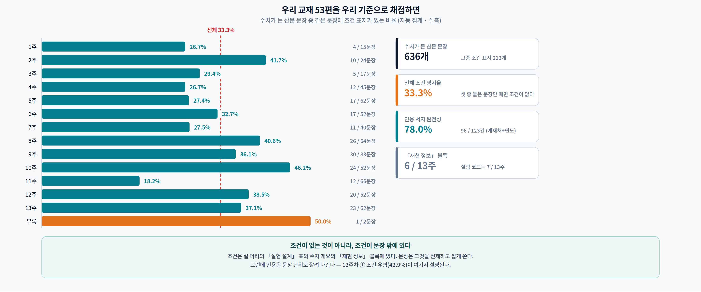
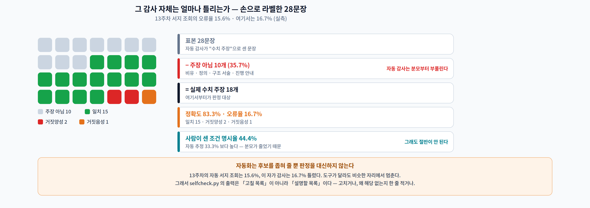
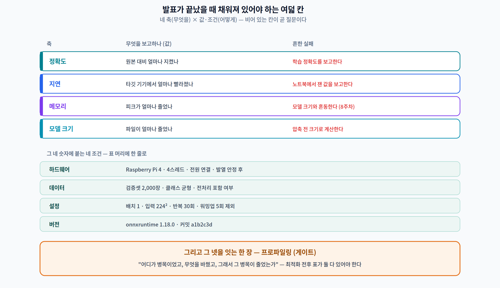
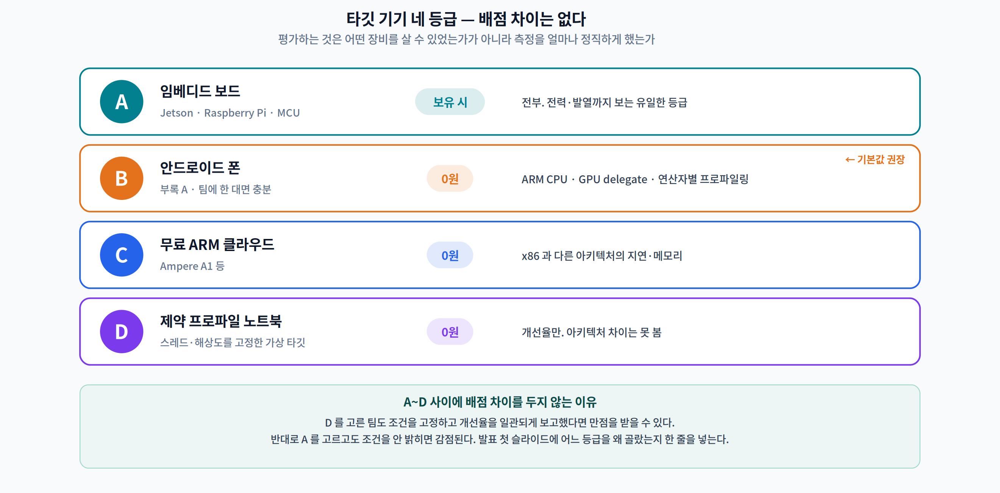

# 14주차 1교시. 무엇을 증명해야 발표가 끝나는가

> **오늘의 질문** — 오늘 우리는 서로를 채점한다. 그런데 채점 기준을 남에게 들이대기 전에 먼저 할 일이 있다. **이 과목의 교재 자체를 그 기준으로 채점하면 몇 점이 나오는가?** 열두 주 동안 "조건 없는 숫자를 쓰지 마라"고 말해 온 문서가 그 말을 지켰는지, 세어 보고 시작한다.

> **이 문서는 발표일 전에 읽고 오는 자료다.** 발표일 오리엔테이션 10분에서 요약만 다시 짚는다.

---

## 1.1 우리 교재를 우리 기준으로 채점해 봤다 (16분)

### 실험 설계

| | 내용 |
|---|---|
| **가설** | 열두 주 동안 조건을 강조한 교재라면, 수치가 든 문장 대부분에 조건이 함께 적혀 있을 것이다 |
| **대상** | 이 과목 교재 **53편** 전체 |
| **방법** | 수치+단위 패턴을 찾고, **같은 문장 안에** 조건 표지(하드웨어·데이터셋·배치·버전·기준선 등)가 있는지 센다 |
| **대조** | 표본 28문장을 사람이 직접 세 가지로 분류 — 조건 있는 주장 / 조건 없는 주장 / **애초에 주장이 아님** |
| **타당성 위협** | 정규식 근사다. 코드 블록·표·콘솔 출력을 걸러 내야 했고, 그러고도 틀린다 |

### 결과

| 항목 | 값 |
|---|---:|
| 페이지 | 53편 |
| 수치가 든 산문 문장 | **636개** |
| 그중 같은 문장에 조건 표지가 있는 것 | **212개 = 33.3%** |
| 「더 읽어보기」 인용 중 게재처·연도 명시 | 96 / 123 = **78.0%** |
| 그림 캡션에 "실측" 이 적힌 것 | 8 / 150 = **5.3%** |
| 「재현 정보」 블록이 있는 주차 | 13주 중 **6주** |
| 실험 코드가 있는 주차 | 13주 중 **7주** |

**33.3%다.** 열두 주 동안 조건을 강조한 교재의 문장 셋 중 둘은, **그 문장만 떼어 놓으면 조건이 없다.**

> **여기서 멈추고 생각해 보십시오.** 이 교재가 특별히 부실한 것일까요? 아니면 **원래 문장은 그렇게 쓰이는 것**일까요?

### 그런데 이 감사 자체가 틀린다

13주차에서 자동 서지 조회의 오류율을 재려고 32편을 손으로 확인했다. 같은 일을 여기서도 했다. 표본 **28문장**을 사람이 직접 분류했다.

| | 값 |
|---|---:|
| 표본 | 28문장 |
| **애초에 수치 주장이 아니었던 것** | **10개 = 35.7%** |
| 실제 수치 주장 | 18개 |
| 자동 판정과 사람 판정 일치 | 15개 |
| 거짓양성 (조건 없는데 있다고 판정) | 2개 |
| 거짓음성 (조건 있는데 없다고 판정) | 1개 |
| **자동 감사 정확도 / 오류율** | **83.3% / 16.7%** |

**두 가지가 드러났다.**

첫째, **자동 감사는 분모부터 부풀린다.** 표본의 35.7%는 비유("눈금이 300개 있으면 1mm까지 잴 수 있다")·정의("30 fps 카메라가 33.3 ms 마다 프레임을 밀어 넣는다")·구조 서술("값은 256가지지만 칸은 255개다")이었다. **조건이 필요 없는 문장을 분모에 넣으면 점수는 자동으로 낮아진다.**

둘째, 진짜 주장만 세면 조건 명시율은 **44.4%** 다. 자동 추정 33.3%보다 높다. 그래도 **절반이 안 된다.**

> **오류율 16.7%.** 13주차의 자동 서지 조회가 15.6%였다. 도구가 달라도 비슷한 자리에서 멈춘다. **자동화는 후보를 좁혀 줄 뿐 판정을 대신하지 않는다.**

### 왜 조건은 문장 밖에 있는가

우리 교재를 열어 보면 조건이 없는 것이 아니다. **조건은 절 머리의 「실험 설계」 표와 주차 개요의 「재현 정보」 블록에 있다.** 문장은 그것을 전제하고 짧게 쓴다.

**그런데 인용은 문장 단위로 잘려 나간다.** 13주차 1.2 의 ① 조건 유형(42.9%)이 여기서 설명된다 — 누가 악의로 조건을 지운 것이 아니라, **애초에 그 문장 안에 조건이 없었기 때문**이다.

| 원문 (우리 교재) | 잘려 나간 뒤 |
|---|---|
| "…그리고 모델을 완전히 없애도 **3.71배**를 못 넘는다" | "온디바이스 파이프라인의 상한은 3.71배다" |
| "- **가장 빠른 모델**(0.157 ms)은 연산량 순위가 48개 중 34위였다" | "연산량과 지연은 상관이 없다" |
| "**배치 방식만 바꿔 8.74배가 줄었다**" | "배치를 바꾸면 8.74배 절약된다" |

세 문장 모두 **원문에서는 맞다.** 앞 문단과 표에 조건이 있다. 그런데 문장만 떼면 전부 무조건적 주장이 된다.

> **한 줄 정리:** 우리 교재의 수치 문장 중 조건이 문장 안에 있는 것은 **사람이 세어 44.4%**다. 조건이 잘리는 이유는 지워져서가 아니라 **처음부터 그 문장에 없었기** 때문이다. 그리고 그것을 재는 자동 감사조차 **16.7% 틀린다.**

---

## 1.2 그래서 발표가 증명해야 하는 것 (18분)

### 두 세트, 여덟 칸

캡스톤 발표가 끝났을 때 청중의 머릿속에 **여덟 칸이 채워져** 있어야 한다.

**① 결과의 네 축** — "원본 대비 얼마나?" 에 네 가지로 답할 수 있어야 한다.

| 축 | 무엇을 | 흔한 실패 |
|---|---|---|
| **정확도** | 원본 대비 얼마나 지켰나 | 학습 정확도를 보고한다 (검증셋이어야 한다) |
| **지연** | 타깃 기기에서 얼마나 빨라졌나 | 노트북에서 잰 값을 보고한다 |
| **메모리** | 피크가 얼마나 줄었나 | 모델 크기와 혼동한다 (8주차) |
| **모델 크기** | 파일이 얼마나 줄었나 | 압축 전 크기로 계산한다 |

**② 그 네 숫자에 붙는 네 조건** — 표 머리에 함께 적어야 한다.

| 조건 | 예 |
|---|---|
| **하드웨어** | Raspberry Pi 4 · 4스레드 · 전원 연결 · 발열 안정 후 |
| **데이터** | 검증셋 2,000장 · 클래스 균형 · 전처리 포함 여부 |
| **설정** | 배치 1 · 입력 224² · 반복 30회 · 워밍업 5회 제외 |
| **버전** | onnxruntime 1.18.0 · 커밋 `a1b2c3d` |

> **네 조건을 한 줄로 적는 연습을 하십시오.** 발표에서 이 한 줄을 읽고 시작하면 질의응답의 절반이 사라집니다.

### 그리고 그 넷을 잇는 한 장 — 프로파일링

네 축과 네 조건은 **결과**다. 심사가 진짜로 보는 것은 **원인**이다.

> **"어디가 병목이었고, 무엇을 바꿨고, 그래서 그 병목이 줄었는가."**

11주차에서 연산자별 시간을 재고 경계 왕복을 세는 법을 배웠다. 9주차에서 파이프라인 단계를 나눠 암달 천장을 계산했다. 캡스톤은 **그 절차를 자기 문제에 한 번 적용한 기록**이다.

**프로파일링 없이 "빨라졌다"고 하면**, 심사자는 그 개선이 최적화 때문인지 측정 환경 때문인지 구분할 수 없다. 13주차 2.1 에서 봤듯 **같은 코드도 시드만 바꾸면 2.85배 흔들린다.**

### 어느 기기에서 재는가 — A~D 등급

이 캡스톤은 "**노트북이 아닌 무언가에서 재 봤는가**"를 묻는다. 그 '무언가'가 값비싼 보드일 필요는 없다.

| 등급 | 타깃 기기 | 비용 | 무엇을 볼 수 있나 |
|:--:|---|---|---|
| **A** | 임베디드 보드 — Jetson · Raspberry Pi · MCU | 보유 시 | 전부. 전력·발열까지 보는 유일한 등급 |
| **B** | **안드로이드 폰** ([부록 A](appendix-a-phone-profiling.md)) | **0원** | ARM CPU · GPU delegate · 연산자별 프로파일링 |
| **C** | 무료 ARM 클라우드 (Ampere A1 등) | 0원 | x86 과 다른 아키텍처의 지연·메모리 |
| **D** | 제약 프로파일 노트북 — 스레드·해상도 고정 "가상 타깃" | 0원 | 개선율만. 아키텍처 차이는 못 봄 |

**대부분의 팀에게 권장하는 기본값은 B(안드로이드 폰)** 다. 팀에 폰이 한 대만 있으면 된다.

**A~D 사이에 배점 차이를 두지 않는다.** 이 과목이 평가하는 것은 *어떤 장비를 살 수 있었는가*가 아니라 **측정을 얼마나 정직하고 엄밀하게 했는가**이기 때문이다. D를 고른 팀도 조건을 고정하고 개선율을 일관되게 보고했다면 만점을 받을 수 있고, **A를 고르고도 조건을 안 밝히면 감점된다.**

> **D를 고르는 팀에게** — "제약 프로파일"은 대충 정하는 것이 아니라 **문서에 못 박는 것**입니다. 예: `스레드 2개 고정 · 입력 96×96 · 배치 1 · 백그라운드 앱 종료 · 전원 연결`. 이 조건을 원본과 최적화본에 **똑같이** 적용해야 개선율이 의미를 갖습니다.

발표 첫 슬라이드에 **어느 등급을 왜 골랐는지 한 줄**을 반드시 넣는다.

> **한 줄 정리:** 발표가 증명할 것은 **네 축 × 네 조건 = 여덟 칸**, 그리고 그 넷을 잇는 **프로파일링 한 장**이다. 장비의 급은 배점에 없다.

---

## 1.3 이 과목이 요구한 것을 한 장으로 (10분)

열네 주 동안 매주 다른 제약을 봤다. 캡스톤은 그것을 하나의 문제에 겹친다.

| 주차 | 제약 | 캡스톤에서 |
|:---:|---|---|
| 1–3 | 측정과 그래프 | 워밍업·반복·조건 고정. **모든 숫자의 전제** |
| 4–6 | 모델 크기 | 프루닝·양자화·증류 중 무엇을 왜 골랐나 |
| 7 | 목적 함수 | **지연을 목적 함수에 넣었는가** — 안 넣으면 최적화되지 않는다 |
| 8 | 메모리 | 피크가 타깃의 SRAM/RAM 안에 들어가는가 |
| 9 | 시간 | 파이프라인 어느 단계가 병목인가 · 암달 천장은 얼마인가 |
| 10 | 대역폭 | 연산 강도가 낮으면 배치·캐시가 답이다 |
| 11 | 경계 | 가속기로 보낼 수 있는 연산자 비율 · 왕복 횟수 |
| 12 | 신뢰 | 개인정보를 다루면 프라이버시 실사 한 장 |
| 13 | 증거 | 인용의 조건 · 구조 주장과 규모 주장 |

**관통 통찰은 하나다.**

> **성능을 좌우하는 것은 연산이 아니라 데이터 이동이며, 하드웨어가 활용할 수 있어야 실제로 빨라진다.**

2주차에서 산술 강도로 처음 나왔고, 7주차에서 FLOPs 가 왜 대리 지표가 못 되는지로, 9주차에서 전처리가 왜 병목인지로, 10주차에서 왜 양자화가 이번엔 빨라졌는지로, 11주차에서 왜 커버리지가 100%가 아니면 이득이 사라지는지로 반복됐다.

**캡스톤은 이 문장을 학생 스스로의 프로젝트로 입증하는 자리다.**

> **한 줄 정리:** 열네 주는 서로 다른 제약을 하나씩 벗겨 낸 과정이었고, 캡스톤은 그것을 **한 문제 위에 겹쳐 놓는** 자리다.

---

### 1교시 정리
- 우리 교재 53편의 수치 문장 636개 중 조건 표지가 같은 문장에 있는 것은 **33.3%**(자동), 사람이 세면 **44.4%**.
- 표본의 **35.7%는 애초에 수치 주장이 아니었다** — 자동 감사는 분모부터 부풀린다.
- 그 감사 자체의 **오류율 16.7%**. 13주차 서지 조회의 15.6%와 같은 자리에서 멈춘다.
- 조건이 잘리는 이유는 지워져서가 아니라 **처음부터 그 문장에 없었기** 때문이다.
- 발표가 증명할 것은 **네 축(정확도·지연·메모리·크기) × 네 조건(하드웨어·데이터·설정·버전)**, 그리고 **프로파일링 한 장**.
- 타깃 등급 **A~D 사이에 배점 차이는 없다.** 보는 것은 장비가 아니라 측정의 태도다.

### 오늘의 용어
- **자가 감사 (self-audit)** — 자기 산출물에 자기 기준을 적용해 보는 것. 남을 채점하기 전에 한다.
- **분모 부풀리기** — 판정 대상이 아닌 것을 표본에 넣어 비율을 낮추는(또는 높이는) 오류. 자동 집계의 가장 흔한 실패.
- **네 축** — 정확도 · 지연 · 메모리 · 모델 크기. "원본 대비 얼마나?"의 답.
- **네 조건** — 하드웨어 · 데이터 · 설정 · 버전. 네 축의 숫자에 반드시 붙는 것.
- **제약 프로파일** — 실기기가 없을 때 노트북을 가상 타깃으로 삼아 못 박는 측정 조건 집합(등급 D).

### 교수님을 위한 Tip
**1.1 은 "이 교재는 몇 점일까요?" 로 시작하십시오.** 학생들은 대개 높게 답합니다. 33.3%를 보여 준 다음 **"그런데 이 감사도 16.7% 틀립니다"** 까지 가면, 오늘 하루 서로를 채점하는 태도가 완전히 달라집니다.

**1.2 의 여덟 칸은 칠판에 격자로 그려 두고 발표 내내 두십시오.** 발표가 끝날 때마다 채워진 칸을 세게 하면 상호 평가가 저절로 굴러갑니다.

**타깃 등급은 5주차 팀·주제 확정 때 함께 받아 두십시오.** 14주차에 "보드가 없어서 못 쟀습니다"가 나오면 손쓸 방법이 없습니다. 5주차에 등급을 적어 내게 하면 폰(등급 B)을 고른 팀이 11주차 프로파일링 실습 때 부록 A를 미리 돌려 볼 수 있습니다.
