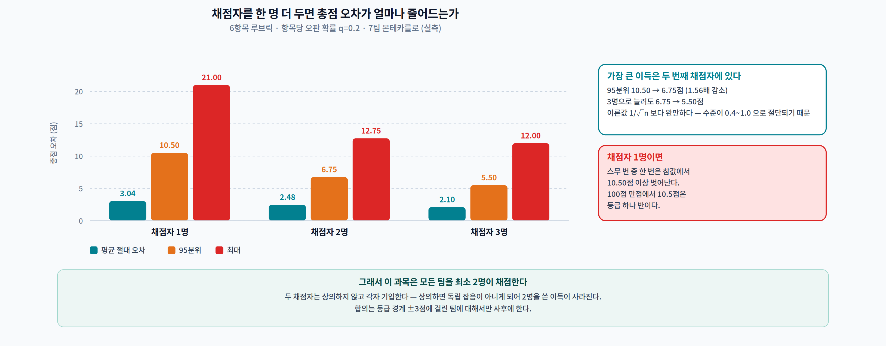
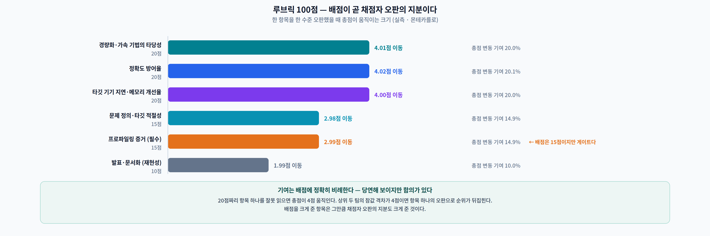
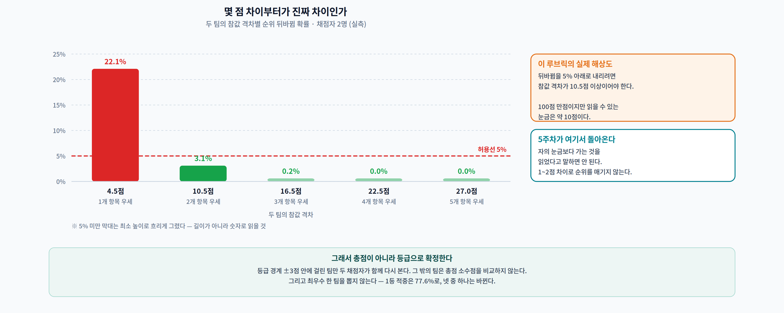
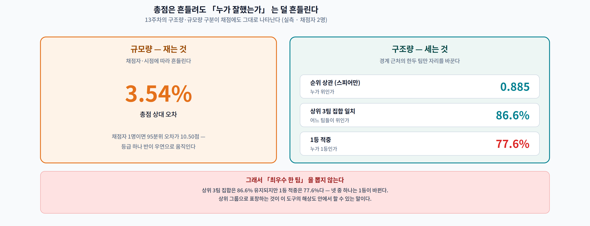
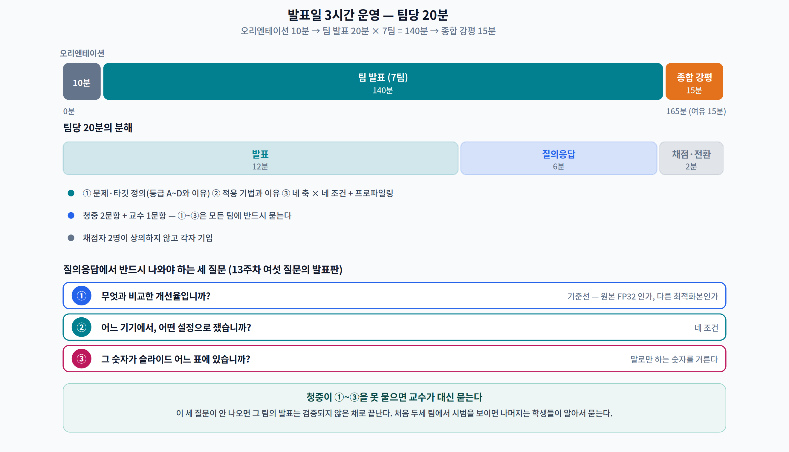

# 14주차 2교시. 채점은 얼마나 흔들리는가

> **오늘의 질문** — 루브릭 100점은 100단계로 읽어도 되는가? 87점과 84점은 다른 팀인가, 아니면 채점자가 흔들린 것인가? 13주차에서 "구조는 안 흔들리고 규모는 흔들린다"를 실측했다. **채점에도 같은 구분이 있다.**

> **이 문서는 채점 설계 근거이자 상호 평가 지침이다.** 발표일에는 2.2 의 운영 규칙만 적용하면 된다.

---

## 실험 설계

| | 내용 |
|---|---|
| **가설** | 항목별 배점을 잘게 나눈 루브릭은 총점을 안정적으로 만든다 |
| **모형** | 6항목 루브릭(15·20·20·20·15·10점) · 각 항목 3수준(미흡 0.4 / 보통 0.7 / 우수 1.0) |
| **잡음** | 채점자는 항목당 확률 **q = 0.20** 으로 한 수준 오판한다 |
| **시행** | 7팀 × 수만 회 몬테카를로 (`numpy` 시드 고정) |
| **측정** | ① 총점 오차 ② 채점자 수 효과 ③ 순위·상위 집합 안정성 ④ 항목별 변동 기여 ⑤ 순위 뒤바뀜 확률 |
| **타당성 위협** | q=0.20 은 **가정**이다. 실제 채점자의 오판율은 재 본 적이 없다. 아래 결론은 **구조**(무엇이 무엇보다 안정적인가)이지 절대값이 아니다 |

> **이 타당성 위협을 숨기지 않는 것이 오늘 배울 것의 일부다.** 우리도 방금 조건 하나를 가정으로 박았고, 그것을 표에 적었다.

---

## 2.1 루브릭 100점의 실제 해상도 (18분)

### 채점자 한 명이면 총점이 얼마나 흔들리는가

| 채점자 | 평균 절대 오차 | 95분위 | 최대 |
|:---:|---:|---:|---:|
| **1명** | 3.04점 | **10.50점** | 21.00점 |
| **2명** | 2.48점 | **6.75점** | 12.75점 |
| 3명 | 2.10점 | 5.50점 | 12.00점 |

**채점자 한 명이 매기면, 스무 번 중 한 번은 참값에서 10.5점 이상 벗어난다.** 100점 만점에서 10.5점은 등급 하나 반이다.

채점자를 **두 명으로 늘리면 95분위가 10.50 → 6.75점**으로 줄어든다(**1.56배**). 세 명으로 늘려도 6.75 → 5.50점이다. **가장 큰 이득은 1명 → 2명 구간에 있다.**

> **왜 3명이 2명보다 크게 낫지 않은가.** 독립 잡음의 평균은 $1/\sqrt{n}$ 로 줄어든다. 1→2 는 29% 감소, 2→3 은 18% 감소다. **채점자를 늘리는 것은 수확 체감이고, 시간은 선형으로 든다.**

### 어느 항목이 총점을 흔드는가

| 항목 | 배점 | 한 수준 오판 시 총점 이동 | 변동 기여 |
|---|:---:|---:|---:|
| 정확도 방어율 | 20 | 4.02점 | 20.1% |
| 경량화·가속 기법의 타당성 | 20 | 4.01점 | 20.0% |
| 타깃 기기 지연·메모리 개선율 | 20 | 4.00점 | 20.0% |
| 프로파일링 증거 (필수) | 15 | 2.99점 | 14.9% |
| 문제 정의·타깃 적절성 | 15 | 2.98점 | 14.9% |
| 발표·문서화 (재현성) | 10 | 1.99점 | 10.0% |

**기여는 배점에 정확히 비례한다.** 당연해 보이지만 함의가 있다 — **배점을 크게 준 항목은 그만큼 채점자 오판의 지분도 크게 준 것**이다.

> 20점짜리 항목 하나를 잘못 읽으면 총점이 **4점** 움직인다. 상위 두 팀의 참값 격차가 4점이라면, **항목 하나의 오판으로 순위가 뒤집힌다.**

### 그래서 몇 점 차이부터가 진짜인가

두 팀의 참값이 다를 때, 채점자 2명이 매긴 결과에서 순위가 뒤집힐 확률을 쟀다.

| 상위 팀이 우세한 항목 수 | 참값 격차(평균) | **순위 뒤바뀜** |
|:---:|---:|---:|
| 1개 | 4.50점 | **22.1%** |
| 2개 | 10.50점 | **3.1%** |
| 3개 | 16.50점 | 0.2% |
| 4개 이상 | 22.50점~ | 0.0% |

**4.5점 차이는 다섯 번 중 한 번 뒤집힌다.** 뒤바뀜을 5% 아래로 내리려면 참값 격차가 **약 10.5점** 이상이어야 한다.

> **이것이 이 루브릭의 실제 해상도다.** 100점 만점이지만 **읽을 수 있는 눈금은 약 10점**이다. 5주차의 양자화가 떠오른다면 정확히 그 이야기다 — **자의 눈금보다 가는 것을 읽었다고 말하면 안 된다.**

---

## 2.2 그런데 순위는 총점보다 안정적이다 (14분)

13주차에서 구조량(노드 수·왕복 횟수)은 CV 0.00%였고 규모량(ms·PSNR)은 최대 35.21%였다. **채점에도 같은 구분이 있다.**

| 무엇 | 성격 | 흔들림 |
|---|---|---:|
| **총점** | 규모량 | 상대 오차 **3.54%** |
| **순위 상관(스피어만)** | 구조량 | **0.886** |
| **상위 3팀 집합 일치** | 구조량 | **86.6%** |
| **1등 적중** | 구조량 | **77.6%** |

**총점은 흔들리는데 "누가 잘했는가"는 상당 부분 살아남는다.** 상위 3팀 집합이 86.6% 일치한다는 것은, 채점자 잡음이 있어도 **경계선 근처의 한두 팀만 자리를 바꾼다**는 뜻이다.

**다만 1등 적중은 77.6%다.** 넷 중 하나는 1등이 바뀐다. **"최우수 한 팀"을 뽑는 것은 상위 세 팀을 고르는 것보다 훨씬 불안정하다.**

### 그래서 이 과목의 운영 규칙

| 규칙 | 근거 |
|---|---|
| **① 모든 팀을 최소 2명이 채점한다** | 95분위 오차 10.50 → 6.75점 (1.56배) |
| **② 총점이 아니라 등급으로 확정한다** | 읽을 수 있는 눈금이 약 10점이므로 (90+/80+/70+/…) |
| **③ 등급 경계 ±3점 안의 팀은 두 채점자가 함께 다시 본다** | 4.5점 격차에서 뒤바뀜 22.1% |
| **④ "최우수 한 팀"을 뽑지 않는다** | 1등 적중 77.6% — 상위 그룹으로 표창한다 |
| **⑤ 상호 평가는 성적에 반영하지 않는다** | 학생 채점자의 오판율은 잰 적이 없다. **훈련 목적**으로만 쓴다 |

> **⑤가 중요합니다.** 상호 평가를 점수에 넣으면 학생은 "친한 팀에 후하게" 라는 다른 게임을 하기 시작합니다. 반영하지 않는다고 미리 밝히면, 상호 평가지는 **관찰 훈련지**가 됩니다.

> **한 줄 정리:** 총점은 규모량이라 흔들리고(3.54%), 순위·상위 집합은 구조량이라 덜 흔들린다(86.6%). **그래서 총점이 아니라 등급으로, 한 명이 아니라 두 명이 채점한다.**

---

## 2.3 발표일 운영 (12분)

3시간을 **오리엔테이션 10분 → 팀 발표 → 종합 강평 15분**으로 운영한다. 팀당 **20분**이다.

| 구간 | 시간 | 하는 일 |
|---|:---:|---|
| 발표 | **12분** | ① 문제·타깃 정의 ② 적용 기법과 이유 ③ 결과(네 축 × 네 조건) + 프로파일링 |
| 질의응답 | **6분** | 청중 2문항 + 교수 1문항 |
| 채점·전환 | **2분** | 채점자 2명이 각자 기입 (합의하지 않는다) |

오리엔테이션·강평 25분을 빼면 발표에 약 155분 → **20분 × 7팀 = 140분**이 여유 있게 들어간다. 8팀 이상이면 강평을 줄이거나 팀당 18분으로 조정한다.

> **채점자 두 명은 서로 상의하지 않고 각자 적습니다.** 상의하면 독립 잡음이 아니게 되어 2명을 쓴 이득(1.56배)이 사라집니다. 합의는 **등급 경계에 걸린 팀에 대해서만** 사후에 합니다(규칙 ③).

### 질의응답에서 반드시 나와야 하는 질문

13주차의 여섯 질문을 발표에 맞게 옮긴 것이다.

| # | 질문 | 무엇을 확인하나 |
|:---:|---|---|
| ① | **무엇과 비교한 개선율입니까?** | 기준선 — 원본 FP32 인가, 다른 최적화본인가 |
| ② | **어느 기기에서, 어떤 설정으로 쟀습니까?** | 네 조건 |
| ③ | **그 숫자가 슬라이드 어느 표에 있습니까?** | 근거의 위치 — 말로만 하는 숫자를 거른다 |
| ④ | **워밍업을 뺐고 몇 회 반복했습니까? 분포는요?** | 1주차 측정 3원칙 |
| ⑤ | **그 개선이 어느 연산자·어느 단계에서 나왔습니까?** | 프로파일링이 결과와 이어지는가 |
| ⑥ | **인용한 그 논문, 게재처와 연도를 확인했습니까?** | 13주차 ⑥ |

> **①~③은 모든 팀에 묻습니다.** ④~⑥은 시간이 되는 대로 고릅니다. **청중이 ①~③을 못 물으면 교수가 대신 묻습니다** — 이 세 질문이 안 나오면 발표가 검증되지 않은 채로 끝납니다.

### 등급과 무관한 감점 사유

장비의 급이 아니라 **측정의 태도**를 본다.

- 원본과 최적화본을 **다른 조건**에서 재고 비교했다.
- **워밍업을 빼지 않았거나 측정 횟수가 1회**다 (1주차 측정 3원칙 위반).
- 평균만 보고하고 **분포·꼬리 지연을 숨겼다** (9주차).
- 측정 시각·기기 상태(발열·충전·백그라운드)를 적지 않았다.
- 프로파일링 없이 **"체감상 빨라졌다"** 수준의 주장에 그쳤다.

> **한 줄 정리:** 팀당 20분, 채점자 2명이 **상의 없이** 각자 기입. 질의응답의 ①~③은 모든 팀에 반드시 묻는다.

---

## 2.4 [더 깊이 · 선택] 배점을 바꾸면 무엇이 바뀌는가 (6분)

**항목별 변동 기여가 배점에 정확히 비례한다**는 2.1 의 결과에는 설계 함의가 있다.

- **배점을 균등하게 펴면** 어느 항목도 총점을 지배하지 않는다. 대신 **강조하고 싶은 것을 강조할 수 없다.**
- **한 항목에 배점을 몰면** 그 항목이 곧 성적이 된다. 채점자가 그 항목만 정확히 읽으면 되므로 **오히려 신뢰도가 올라갈 수 있다.** 대신 나머지를 학생이 버린다.
- **수준을 3단계보다 잘게 나누면**(5단계) 한 단계의 폭이 좁아져 오판 한 번의 충격은 줄지만, **채점자가 단계를 구분하기 더 어려워져 오판 확률 q 자체가 올라간다.** 두 효과가 상쇄되는 지점이 어디인지는 **재 보지 않았다 — 미결 문제다.**

> **이 과목이 프로파일링(15점)을 "필수"로 표시한 이유**는 배점 크기 때문이 아니다. **없으면 다른 항목의 숫자를 믿을 근거가 사라지기** 때문이다. 배점은 15점이지만 **게이트 역할**을 한다.

> **한 줄 정리:** 배점은 강조이자 곧 **변동의 지분**이다. 무엇을 크게 줄지는 "중요한가"만이 아니라 **"채점자가 그것을 안정적으로 읽을 수 있는가"** 로도 정해야 한다.

---

### 2교시 정리
- 채점자 1명의 총점 오차는 95분위 **10.50점**. 2명이면 **6.75점**(1.56배 개선). 3명은 5.50점 — **가장 큰 이득은 1→2명**.
- 항목별 변동 기여는 **배점에 정확히 비례**한다. 20점 항목 한 수준 오판 = 총점 **4점** 이동.
- 순위 뒤바뀜이 5% 아래로 내려가려면 참값 격차가 **약 10.5점** 이상이어야 한다. **이 루브릭의 눈금은 100단계가 아니라 약 10단계다.**
- 총점(규모량)은 3.54% 흔들리지만 상위 3팀 집합(구조량)은 **86.6%** 유지된다. 다만 **1등 적중은 77.6%** — 최우수 한 팀은 뽑지 않는다.
- 운영: 2명 채점 · 상의 없이 기입 · 등급으로 확정 · 경계 ±3점만 재검토 · 상호 평가는 성적 미반영.

### 오늘의 용어
- **채점자 간 신뢰도** — 같은 산출물에 대해 채점자들이 얼마나 일치하는가. 여기서는 총점 오차로 대신 쟀다.
- **루브릭의 해상도** — 통계적으로 구분 가능한 최소 점수 격차. 우리 모형에서 **약 10점**.
- **게이트 항목** — 배점은 작지만 없으면 다른 항목의 근거가 무너지는 항목. 여기서는 프로파일링.
- **독립 잡음** — 채점자들이 상의하지 않을 때만 성립. 상의하면 평균의 이득이 사라진다.

### 함께 생각해 볼 문제
1. q = 0.20 은 가정이다. **실제 채점자의 오판율을 재려면** 어떤 실험을 설계해야 하는가? (힌트 — 같은 발표 녹화본, 여러 채점자, 시간 간격을 둔 재채점)
2. 수준을 3단계에서 5단계로 늘리면 한 단계의 폭은 줄지만 q 는 오른다. **어느 쪽이 이기는지** 어떻게 재겠는가?
3. 상호 평가를 성적에 반영하지 않으면 학생이 성의 없이 쓸 수 있다. **반영하지 않으면서 성의를 끌어내는** 설계는 무엇인가?

### 더 읽어보기
이번 주는 새 논문을 읽는 시간이 아니다. 다만 채점 신뢰도를 다루는 표준 개념은 다음 이름으로 찾으면 된다.

- **Cohen's κ · Krippendorff's α** — 채점자 간 일치도 지표. 우리 실험은 이것을 계산하지 않고 총점 오차로 대신했다. **왜 그렇게 했는지**(참값을 우리가 알고 있는 시뮬레이션이기 때문)를 설명할 수 있으면 충분하다.
- **일반화가능도 이론(Generalizability Theory)** — 채점자·문항·시점 등 여러 오차원을 동시에 다루는 틀. 2.4 의 미결 문제가 이 틀 안에서 정식화된다.

### 교수님을 위한 Tip
**2.1 의 "10.5점" 을 발표 전에 학생에게 말해 주십시오.** "1~2점 차이로 순위를 매기지 않겠다"는 선언이 발표장의 긴장을 크게 낮춥니다. 그리고 그 선언 자체가 이 과목이 가르친 태도의 시연입니다 — **자기 도구의 해상도를 알고 그 안에서만 말한다.**

**채점자 두 명을 확보하기 어렵다면** 조교·타 팀 교수·산업체 멘토 중 한 명이면 됩니다. 2.1 의 결과가 말하는 것은 **"두 명째의 효과가 가장 크다"** 입니다. 완벽한 세 명보다 현실적인 두 명이 낫습니다.

**질의응답 ①~③을 청중이 못 물으면** 교수가 대신 물으십시오. 다만 처음 두세 팀에서 시범을 보이면 나머지는 학생들이 알아서 묻기 시작합니다.
