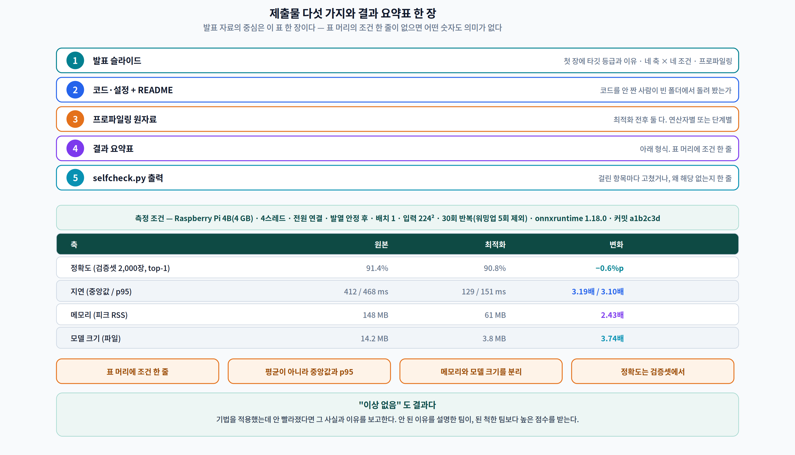

# 14주차 3교시. 제출 전에 스스로 채점한다

> **오늘의 질문** — 심사자가 볼 것을 여러분이 먼저 볼 수 있는가? 이번 실습에는 새 모델도 새 데이터셋도 없다. **여러분이 이미 쓴 보고서 한 편**이 입력이고, 출력은 **제출 전에 고칠 목록**이다.

> **이 실습은 발표일 전에 끝내 오는 것이다.** 발표 당일 3교시는 남은 팀 발표와 종합 강평으로 쓴다.

---

## 실험 설계

| | 내용 |
|---|---|
| **가설** | 제출 직전에 자동 점검을 한 번 돌리면, 사람이 지적할 것의 일부를 미리 잡을 수 있다 |
| **입력** | 여러분 팀의 보고서 `.md` 한 편 |
| **필요한 것** | Python 3. **GPU·보드·인터넷 불필요** |
| **한계** | 이 도구의 오류율은 **16.7%**이고, 표본의 **35.7%** 는 애초에 점검 대상이 아니었다(1.1). **점수를 믿지 말고 걸린 문장을 보라** |

---

## 3.1 도구 — `selfcheck.py` (10분)

```bash
python3 selfcheck.py 보고서.md
```

네 가지를 훑고, 마지막에 **사람이 채워야 할 다섯 줄**을 내민다.

| 단계 | 무엇을 보나 | 자동화 정도 |
|:---:|---|---|
| ① | 수치가 든 문장 중 **같은 문장에 조건이 없는 것** | 근사 (오류율 16.7%) |
| ② | 결과 요약표에 **네 축**(정확도·지연·메모리·크기)이 다 있는가 | 키워드 탐지 |
| ③ | **네 조건**(하드웨어·데이터·설정·버전)이 적혔는가 | 키워드 탐지 |
| ④ | 감점 신호 — 워밍업·반복 횟수·분포·"체감"·프로파일링 | 키워드 탐지 |
| ⑤ | **나머지 다섯 줄** | **사람이 한다** |

### 실연 — 우리 교재를 우리 도구로

```
$ python3 selfcheck.py w09-3-lab.md

① 수치가 든 문장 16개 중 같은 문장에 조건이 없는 것 11개
   조건 명시율 31.2%  (참고: 이 과목 교재 자체는 사람이 세어 44.4%였다)
   · **후보 8,400개 중 46개가 문턱을 넘었고, NMS 가 그중 5개를 남겼다
   · 그런데 나이가 **71 ms 로 일정**하다
   · 드롭 0 인 시스템이 **6.2초**, 115장을 버린 시스템이 **71 ms** 였다
   ...

② 결과 요약표의 네 축
   [ ] 정확도   [O] 지연   [ ] 메모리   [O] 크기
```

**우리 교재도 걸린다.** 9주차 3교시는 정확도와 메모리를 보고하지 않았다 — 그 주차의 주제가 시간이었기 때문이다. **도구는 그 사정을 모른다.**

> **그래서 이 도구의 출력은 "고칠 목록"이 아니라 "설명할 목록"입니다.** 걸린 항목마다 둘 중 하나를 하십시오 — **고치거나, 왜 해당 없는지 한 줄 적거나.** 발표에서 "메모리는 왜 없습니까?" 라는 질문이 나왔을 때 그 한 줄이 답이 됩니다.

---

## 3.2 ①번 결과를 다루는 법 (12분)

**조건 없는 문장을 전부 고칠 필요는 없다.** 표에 조건이 있으면 문장은 짧아도 된다.

고쳐야 하는 것은 **여러분이 발표에서 소리 내어 읽을 문장**과 **초록·결론에 들어갈 문장**이다. 인용은 그 두 곳에서 잘려 나간다(13주차 1.2 ①).

| 걸린 문장 | 어떻게 할 것인가 |
|---|---|
| 본문 중간, 바로 위 표에 조건이 있다 | **그대로 둔다** |
| 결론·초록에 있다 | **조건을 붙여 다시 쓴다** |
| 발표에서 읽을 문장이다 | **조건을 붙여 다시 쓴다** |
| 비유·정의·구조 서술이다 | **그대로 둔다** (도구가 잘못 잡은 것) |

**다시 쓰기 예시**

| 전 | 후 |
|---|---|
| "양자화로 3.2배 빨라졌습니다" | "**Raspberry Pi 4 · 4스레드 · 배치 1 · 입력 224² · 30회 반복(워밍업 5회 제외)** 에서 FP32 대비 INT8 이 **3.2배**" |
| "정확도는 거의 유지했습니다" | "검증셋 2,000장에서 **top-1 91.4% → 90.8%, 0.6%p 하락**" |
| "메모리도 많이 줄었습니다" | "피크 RSS **148 MB → 61 MB (2.43배)**. 모델 파일은 별도로 **14.2 MB → 3.8 MB**" |

> **세 번째 예시가 특히 중요합니다.** 메모리와 모델 크기는 다른 축입니다(8주차). 하나로 뭉뚱그리면 질의응답에서 반드시 걸립니다.

---

## 3.3 ⑤번 — 사람이 하는 다섯 줄 (14분)

도구가 끝나면 이 표가 나온다. **여기서부터가 진짜 점검이다.**

| # | 확인할 것 | 어떻게 확인하나 |
|:---:|---|---|
| ① | 원본과 최적화본을 **같은 조건**에서 쟀는가 | 두 실행의 명령줄·설정 파일을 나란히 놓고 비교 |
| ② | **타깃 등급(A~D)과 이유**를 첫 슬라이드에 적었는가 | 슬라이드 1장을 열어 확인 |
| ③ | 프로파일링으로 **병목 → 개선**을 이었는가 | 최적화 전후 연산자별(또는 단계별) 표가 둘 다 있는가 |
| ④ | 인용 논문의 **게재처·연도**를 확인했는가 | 13주차 `student.py` 를 인용마다 한 번씩 |
| ⑤ | **다른 사람이 README 대로 돌려서 같은 표가 나오는가** | 팀 안에서 **코드를 안 짠 사람**이 처음부터 돌려 본다 |

### ⑤가 가장 자주 실패한다

**⑤를 실제로 해 보십시오.** 코드를 짠 사람은 자기 기계에 이미 깔린 것을 README 에 안 적습니다. 팀에서 코드를 가장 안 만진 사람이 빈 폴더에서 시작해 README 만 보고 돌려 보면, 거의 항상 **세 줄에서 다섯 줄이 빠져 있습니다.**

이것이 루브릭의 「발표·문서화(재현성) 10점」이 보는 것이다. 배점은 작지만 **13주차가 통째로 이 이야기였다.**

### ③이 게이트다

프로파일링 항목은 15점이지만 **없으면 다른 항목의 숫자를 믿을 근거가 사라진다**(2.4). 다음 두 표가 **둘 다** 있어야 한다.

| | 최적화 전 | 최적화 후 |
|---|---|---|
| 연산자별(또는 단계별) 시간 | 표 또는 그래프 | 표 또는 그래프 |
| 그중 **여러분이 건드린 것** | 표시 | 표시 |

**"어디가 병목이었고, 무엇을 바꿨고, 그래서 그 병목이 줄었다"** 가 한 화면에서 읽혀야 한다.

---

## 3.4 산출물 — 결과 요약표 한 장 (8분)



발표 자료의 중심은 **이 표 한 장**이다.

> **측정 조건** — Raspberry Pi 4B (4 GB) · 4스레드 · 전원 연결 · 발열 안정 후 · 배치 1 · 입력 224² · 30회 반복(워밍업 5회 제외) · onnxruntime 1.18.0 · 커밋 `a1b2c3d`

| 축 | 원본 | 최적화 | 변화 |
|---|---:|---:|---:|
| 정확도 (검증셋 2,000장, top-1) | 91.4% | 90.8% | **−0.6%p** |
| 지연 (중앙값 / p95) | 412 / 468 ms | 129 / 151 ms | **3.19배 / 3.10배** |
| 메모리 (피크 RSS) | 148 MB | 61 MB | **2.43배** |
| 모델 크기 (파일) | 14.2 MB | 3.8 MB | **3.74배** |

**이 표가 지켜야 하는 것 네 가지**

1. **표 머리에 조건 한 줄.** 표 안의 어떤 숫자도 이 줄 없이는 의미가 없다.
2. **평균이 아니라 중앙값과 p95.** 평균만 적으면 꼬리를 숨긴 것이다(9주차).
3. **메모리와 모델 크기를 분리.** 다른 축이다(8주차).
4. **정확도는 검증셋에서.** 학습 정확도를 적으면 그 자체로 감점이다.

> **"이상 없음"도 결과입니다.** 기법을 적용했는데 안 빨라졌다면 **그 사실과 이유**를 보고하십시오. 11주차에서 우리는 커버리지 65%짜리 모델에서 2배 가속기가 **1.03배**밖에 못 낸 것을 실측했습니다. **안 된 이유를 설명한 팀이, 된 척한 팀보다 높은 점수를 받습니다.**

---

## 3.5 상호 평가 — 청중이 하는 일 (6분)

**상호 평가는 성적에 반영하지 않는다**(2.2 규칙 ⑤). 훈련 목적이다. 발표를 들으며 **여덟 칸 격자**를 채운다.

| | 값이 나왔나 | 조건이 붙었나 |
|---|:---:|:---:|
| 정확도 | ☐ | ☐ |
| 지연 | ☐ | ☐ |
| 메모리 | ☐ | ☐ |
| 모델 크기 | ☐ | ☐ |

그리고 **한 줄씩** 적는다.

- **가장 잘한 측정 한 가지** —
- **다음에 개선할 조건 한 가지** —
- **내가 묻고 싶은 질문 하나** (13주차 여섯 질문 중 하나로) —

> **질문 하나는 반드시 적으십시오.** 질의응답 6분에서 청중 2문항을 여기서 뽑습니다. 적어 온 질문이 없으면 질의응답이 침묵으로 끝나고, 그러면 그 팀의 발표는 **검증되지 않은 채로** 끝납니다.

---

## 3.6 제출물

발표 당일까지 저장소(또는 지정 경로)에 제출한다.

| # | 제출물 | 확인 |
|:---:|---|---|
| 1 | **발표 슬라이드** | 첫 장에 타깃 등급과 이유 · 네 축 × 네 조건 · 프로파일링 |
| 2 | **코드·설정 + README** | 팀에서 코드를 안 짠 사람이 빈 폴더에서 돌려 봤는가(3.3 ⑤) |
| 3 | **프로파일링 원자료** | 최적화 **전후 둘 다**. 연산자별 또는 단계별 |
| 4 | **결과 요약표** | 3.4 의 형식. 표 머리에 조건 한 줄 |
| 5 | **`selfcheck.py` 출력** | 걸린 항목마다 고쳤거나, 왜 해당 없는지 한 줄 |

> **5번을 제출물에 넣은 이유** — 자동 점검을 돌렸다는 사실보다 **걸린 것을 어떻게 처리했는지**가 평가 대상이기 때문이다. "16건 걸렸고 9건은 고쳤으며 7건은 비유·정의라 그대로 뒀다" 가 좋은 답이다.

---

## 3.7 과제 — 발표 이후

### 필수 — 최종 저장소 정리

발표에서 나온 지적을 반영해 저장소를 최종본으로 만든다. **커밋 하나에 "무엇을 왜 고쳤는지"** 를 적는다.

### 선택 A — 우리 팀 결과의 재현성을 잰다
13주차 2.1 을 여러분 코드에 적용하십시오. 시드만 바꿔 8회 돌리고 **구조량(연산자 수·왕복 횟수·출력 형상)과 규모량(ms·정확도)의 CV** 를 각각 내십시오. 여러분 배수가 얼마나 흔들리는지 알고 나면 보고서 문장이 달라집니다.

### 선택 B — 등급을 하나 올려 다시 잰다
등급 D 로 했다면 폰(B)에서, B 로 했다면 클라우드(C)나 보드(A)에서 다시 재 보십시오. **개선율의 순서가 유지되는지**가 핵심입니다. 유지되면 구조 주장이고, 뒤집히면 규모 주장이었던 것입니다.

### 선택 C — 우리 보고서를 우리 감사로
`run_audit.py` 를 여러분 저장소에 돌려 조건 명시율을 내고, 표본 20문장을 손으로 라벨해 **도구의 오류율**을 재십시오. 우리 값은 16.7% 였습니다.

### 선택 D — 상호 평가지를 데이터로
발표일에 모은 상호 평가지의 여덟 칸 체크를 집계해 **어느 칸이 가장 자주 비었는지** 보십시오. 대개 **메모리와 조건** 열이 비어 있습니다.

---

### 3교시 정리
- `selfcheck.py` 는 네 가지를 훑지만 **오류율 16.7%** 다. 점수가 아니라 **걸린 문장**을 보라.
- 조건 없는 문장을 전부 고칠 필요는 없다. **발표에서 읽을 문장과 결론·초록**만 고친다.
- 사람이 하는 다섯 줄 중 **⑤ README 재현**이 가장 자주 실패한다. 코드를 안 짠 사람이 빈 폴더에서 돌려 볼 것.
- **③ 프로파일링이 게이트다.** 최적화 전후 표가 둘 다 있어야 한다.
- 결과 요약표는 **표 머리에 조건 한 줄 · 중앙값과 p95 · 메모리와 크기 분리 · 검증셋 정확도**.
- **안 된 이유를 설명한 팀이 된 척한 팀보다 높은 점수를 받는다.**

### 교수님을 위한 Tip
**`selfcheck.py` 를 발표 2주 전에 배포하십시오.** 발표 전날 돌리면 고칠 시간이 없습니다. 2주 전이면 ⑤(README 재현)를 실제로 해 볼 수 있습니다.

**3.1 의 실연을 우리 교재로 하십시오.** 우리 문서가 걸리는 것을 보여 주면, 학생이 자기 보고서가 걸렸을 때 방어적으로 굴지 않습니다. **"도구가 완벽하지 않다"는 것을 먼저 시연하는 것이 도구를 쓰게 만드는 가장 빠른 길입니다.**

**상호 평가지의 여덟 칸 격자는 인쇄해서 나눠 주십시오.** 화면에 띄워 두는 것보다 손에 쥐고 있을 때 채워집니다.
