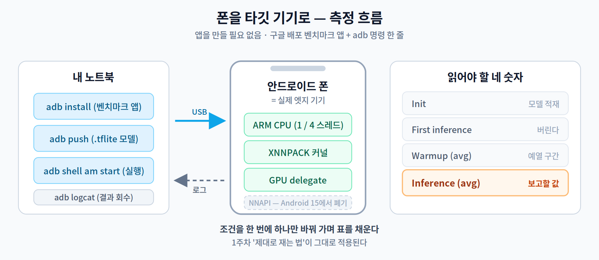

# 부록 A. 내 폰을 타깃 기기로 — 안드로이드 프로파일링

**이 부록의 목적** — 실습 보드가 없어도 **실제 엣지 기기에서** 지연을 측정할 수 있게 한다. 11주차의 프로파일링과 14주차 캡스톤의 "타깃 기기 실측"을 이 방법으로 충족할 수 있다.

> 준비물: 안드로이드 폰 하나와 USB 케이블. 폰에 앱을 만들어 넣을 필요도, 코딩을 할 필요도 없다. **구글이 배포하는 벤치마크 앱**을 설치하고 명령 한 줄로 돌린다.



---

## A.1 왜 폰인가

노트북 CPU에서만 재면 이 강의의 절반이 빠진다. 학기 내내 "**하드웨어가 활용할 수 있어야 실제로 빨라진다**"고 배웠는데, x86 노트북 하나로는 그것을 확인할 방법이 없기 때문이다.

그런데 여러분은 이미 **실제 엣지 기기를 주머니에 넣고 다닌다.** 요즘 스마트폰에는 ARM CPU, 모바일 GPU, 그리고 대개 NPU까지 한 칩에 들어 있다. 젯슨이나 라즈베리파이를 사지 않아도, 다음 세 가지를 **오늘 당장** 확인할 수 있다.

- 같은 모델이 **x86과 ARM에서 다르게** 동작한다.
- **가속기를 켜면 정말 빨라지는가** — 그리고 언제 오히려 느려지는가.
- 모델을 바꿨을 때의 개선이 **노트북에서만 나는 착시인지, 진짜인지**.

> 이 부록의 절차는 구글의 LiteRT(구 TensorFlow Lite) 공식 문서를 따른다. 기기·안드로이드 버전에 따라 세부는 달라질 수 있으니, 잘 안 되면 A.7의 대안으로 넘어가면 된다. **폰이 없어도 과목을 이수하는 데 지장이 없다.**

---

## A.2 준비 — adb 연결 (10분)

`adb`(Android Debug Bridge)는 PC에서 폰에 명령을 보내는 도구다. 안드로이드 **플랫폼 도구(Platform Tools)** 를 내려받아 압축을 풀면 그 안에 들어 있다. 설치 과정도 관리자 권한도 필요 없다.

폰 쪽 설정은 두 단계다.

1. **개발자 옵션 켜기** — `설정 → 휴대전화 정보 → 소프트웨어 정보` 에서 **빌드 번호를 7번 연속** 누른다. (제조사마다 경로가 조금씩 다르다.)
2. **USB 디버깅 켜기** — 새로 생긴 `설정 → 개발자 옵션` 에서 **USB 디버깅**을 켠다.

케이블로 연결하고 확인한다.

```bash
adb devices
```

```
List of devices attached
R3CN90XXXXX     device
```

폰 화면에 "USB 디버깅을 허용하시겠습니까?"가 뜨면 **허용**을 누른다. 상태가 `unauthorized`면 허용을 안 누른 것이고, 목록이 비어 있으면 케이블 문제이거나 USB 디버깅이 꺼져 있는 것이다.

> **충전 전용 케이블 주의** — 데이터 선이 없는 케이블이 의외로 흔하다. 목록이 계속 비어 있으면 케이블부터 바꿔 보라.

---

## A.3 벤치마크 앱 설치와 모델 올리기 (10분)

구글이 **미리 빌드된 벤치마크 앱**을 배포한다. 우리는 이것을 쓴다. 소스를 빌드할 필요가 없다.

```bash
# 요즘 폰은 거의 다 arm64다 (32비트 기기는 android_arm_benchmark_model.apk)
curl -O https://storage.googleapis.com/tensorflow-nightly-public/prod/tensorflow/release/lite/tools/nightly/latest/android_aarch64_benchmark_model.apk

adb install -r -d -g android_aarch64_benchmark_model.apk
```

`-g`는 저장소 권한까지 함께 주는 옵션이다. 이게 없으면 앱이 모델 파일을 못 읽는다.

이제 측정할 모델을 폰에 올린다. **5주차에서 만든 `tinycnn_int8.tflite`** 나 **FP32 비교군 `tinycnn_fp32.tflite`** 를 쓰면, 양자화 효과를 실제 기기에서 확인하는 셈이 된다.

```bash
adb push tinycnn_int8.tflite  /data/local/tmp/
adb push tinycnn_fp32.tflite  /data/local/tmp/
```

---

## A.4 측정 — 가속 경로를 하나씩 켜 본다 (20분)

명령의 뼈대는 이렇다. 앱을 실행하면서 인자를 넘기고, 결과는 로그로 받는다.

```bash
adb shell am start -S \
  -n org.tensorflow.lite.benchmark/.BenchmarkModelActivity \
  --es args '"--graph=/data/local/tmp/tinycnn_int8.tflite --num_threads=1 --warmup_runs=5 --num_runs=50"'
```

잠시 뒤 결과를 읽는다.

```bash
adb logcat | grep "Inference timings"
```

```
Inference timings in us: Init: 5685, First inference: 18535, Warmup (avg): 14462.3, Inference (avg): 14575.2
```

**네 숫자가 각각 무엇인지가 이 부록의 핵심이다.**

| 항목 | 뜻 | 어디서 배웠나 |
|---|---|---|
| `Init` | 모델을 메모리에 올리고 준비하는 시간 | 1주차의 "첫 회는 버린다"가 바로 이것 |
| `First inference` | 첫 번째 추론 — 유독 느리다 | 1주차 측정 3원칙 ① |
| `Warmup (avg)` | 워밍업 구간 평균 | — |
| **`Inference (avg)`** | **본 측정 평균. 보고할 값은 이것이다** | 1주차 측정 3원칙 ② |

이제 **조건을 하나씩 바꿔 가며** 표를 채운다. 한 번에 하나만 바꾸는 것이 원칙이다.

| 조건 | 인자 |
|---|---|
| CPU 1스레드 (기준선) | `--num_threads=1` |
| CPU 4스레드 | `--num_threads=4` |
| XNNPACK (CPU 최적화 커널) | `--num_threads=4 --use_xnnpack=true` |
| GPU delegate | `--use_gpu=true` |

예를 들어 GPU를 켜려면 이렇게 한다.

```bash
adb shell am start -S \
  -n org.tensorflow.lite.benchmark/.BenchmarkModelActivity \
  --es args '"--graph=/data/local/tmp/tinycnn_int8.tflite --use_gpu=true --warmup_runs=5 --num_runs=50"'
```

> **NNAPI는 이제 쓰지 않는다** — `--use_nnapi=true` 옵션이 아직 남아 있고 구형 기기에서는 동작하지만, **NNAPI는 안드로이드 15에서 폐기(deprecated)** 되었다. 구글은 GPU delegate와 Play 서비스 기반 런타임으로 옮겨 갈 것을 권한다. 호기심에 한 번 켜 보는 것은 좋지만, 캡스톤의 주력 경로로 삼지는 말 것.
>
> 이것 자체가 이 강의의 교훈 하나다. **가속 경로는 몇 년 만에 바뀐다.** 그래서 2주차에서 "내 기기가 무엇을 쓸 수 있는가"를 매번 확인하는 습관을 강조한 것이다.

---

## A.5 연산자별로 들여다보기 — 11주차의 그 프로파일링 (10분)

`--enable_op_profiling=true`를 붙이면 **어느 연산자가 시간을 먹는지**가 나온다. 11주차에서 노트북으로 했던 일을, 이번엔 실제 폰에서 하는 것이다.

```bash
adb shell am start -S \
  -n org.tensorflow.lite.benchmark/.BenchmarkModelActivity \
  --es args '"--graph=/data/local/tmp/tinycnn_int8.tflite --num_threads=4 --enable_op_profiling=true --num_runs=50"'
```

```bash
adb logcat -d > profile.txt      # 로그 전체를 파일로 저장해 두고 읽는다
```

연산자별 누적 시간 표가 나온다. **상위 3개가 전체의 몇 %를 차지하는지**를 세어 보라. 11주차 노트북 결과와 순위가 같은지, 다르다면 왜 다른지 — 이것이 캡스톤 발표에서 가장 좋은 재료가 된다.

---

## A.6 캡스톤 제출용 기록 양식

측정값만 적으면 안 된다. **어떤 조건에서 쟀는지**를 반드시 함께 적는다(1주차 3.3).

```
기기        : Galaxy S23 (Snapdragon 8 Gen 2), Android 14
측정일시    : 2026-11-14 15:30
모델        : tinycnn_int8.tflite (30,360 B)
설정        : warmup_runs=5, num_runs=50
```

| 조건 | Inference (avg) | 기준선 대비 |
|---|--:|--:|
| CPU 1스레드 | ___ ms | 1.00× |
| CPU 4스레드 | ___ ms | ___× |
| CPU 4스레드 + XNNPACK | ___ ms | ___× |
| GPU delegate | ___ ms | ___× |

**해석에서 반드시 짚을 것 두 가지.**

1. **스레드를 4배로 늘려도 4배 빨라지지 않는다.** 2주차의 그 이야기다 — 메모리 대역폭이 먼저 막힌다.
2. **작은 모델은 GPU가 오히려 느릴 수 있다.** CPU↔GPU로 데이터를 넘기는 비용이 계산 이득보다 클 때가 있다. 1주차의 "계산보다 데이터 이동이 비싸다"가 여기서 또 나온다. 이 결과가 나왔다면 실패가 아니라 **좋은 발견**이다. 그대로 발표하라.

---

## A.7 안 될 때 — 폰이 없거나, 아이폰이거나

**아이폰**은 Xcode가 깔린 맥이 있어야 같은 일을 할 수 있다. 팀에 맥 쓰는 학생이 있으면 시도해 볼 만하지만, 없다면 아래 대안으로 간다.

**대안 ① 무료 ARM 클라우드** — Oracle Cloud의 Always Free 등급에 Ampere A1(ARM) 인스턴스가 있다. x86 노트북과 **다른 아키텍처**라는 조건을 만족하므로 타깃 기기로 인정된다. (2026년 7월에 무료 한도가 2 OCPU / 12GB로 축소됐지만 이 과목에는 충분하다. 가입 시점의 용량 상황에 따라 생성이 거절될 수 있다.)

**대안 ② 제약 프로파일 노트북** — 스레드 수와 메모리를 묶은 "가상 타깃"을 정의하고 그것을 기준선으로 삼는다. 예: `--num_threads=2`로 고정하고 입력 해상도를 낮춘 조건. 아키텍처 차이는 못 보지만, **개선율을 일관된 조건에서 비교**한다는 요건은 만족한다. 14주차 루브릭도 이 경우를 인정한다.

어느 쪽을 택하든 **무엇을 타깃으로 삼았고 왜 그렇게 정했는지**를 발표에서 한 줄로 밝히면 된다.

---

## A.8 자주 걸리는 문제

| 증상 | 원인과 해결 |
|---|---|
| `adb devices`가 비어 있음 | 충전 전용 케이블 / USB 디버깅 꺼짐 / 드라이버(윈도우) |
| `unauthorized` | 폰 화면의 허용 팝업을 안 누름. 케이블을 뺐다 다시 꽂으면 재차 뜬다 |
| 앱은 뜨는데 결과가 안 나옴 | 모델 경로 오타. `adb shell ls /data/local/tmp/` 로 파일부터 확인 |
| 권한 오류 | 설치 때 `-g`를 빠뜨림. `adb install -r -d -g` 로 다시 설치 |
| `--use_gpu=true`인데 CPU로 돎 | 로그에 delegate 적용 실패 메시지가 있다. 그 문장을 그대로 보고서에 인용할 것 — 감점 요인이 아니라 관찰 결과다 |
| 측정값이 실행할 때마다 크게 튐 | 발열·백그라운드 앱. 충전 케이블을 뽑고, 화면을 켠 채로, 앱을 정리하고 다시 측정 |

> 교수님을 위한 Tip: 이 부록은 **팀당 한 명만 성공하면 됩니다.** 전원에게 요구하지 마시고, 팀에서 안드로이드 폰을 가진 학생 한 명이 대표로 측정하게 하세요. 첫 시도에서 가장 많이 막히는 지점은 기술이 아니라 **케이블과 USB 디버깅**이므로, 실습 시간 초반 10분을 `adb devices`가 뜨는지 확인하는 데만 쓰셔도 아깝지 않습니다.
