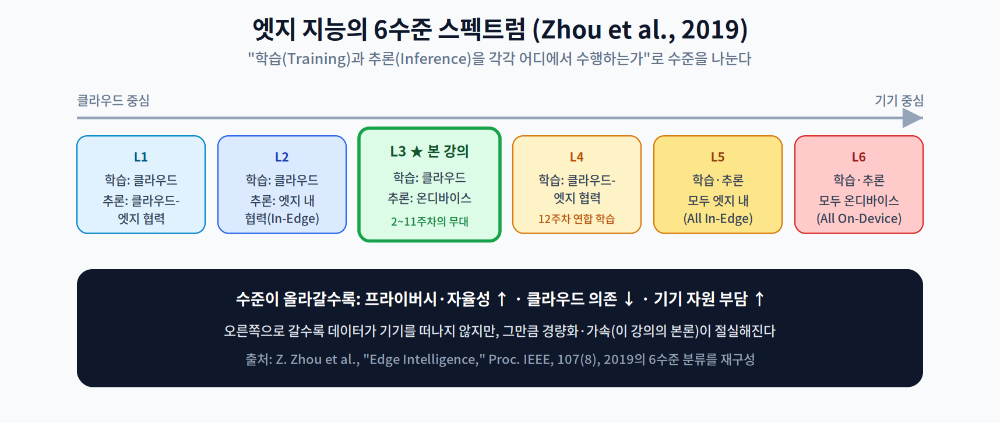
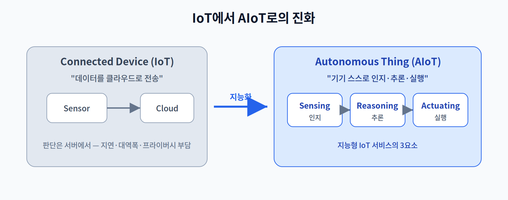
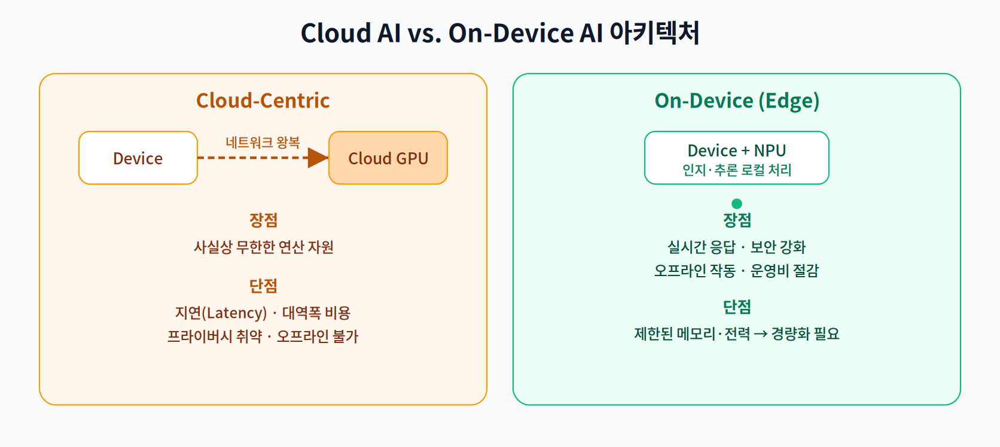
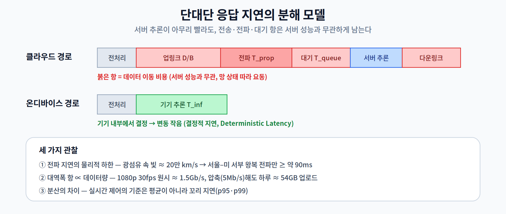
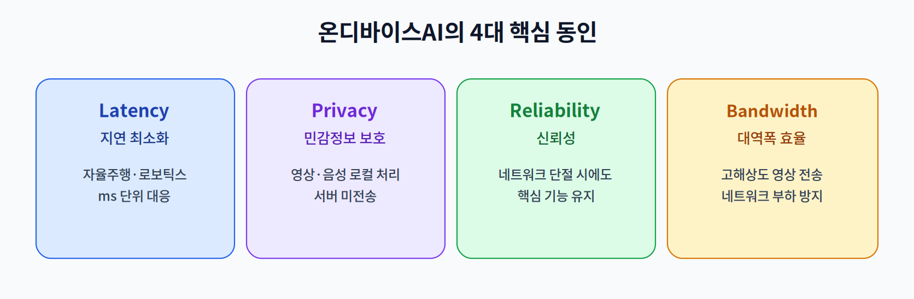

# 01주차 1교시. AIoT의 패러다임 시프트

**강의 목표** — 지능의 위치가 클라우드에서 기기로 이동해 온 학술적 계보를 원전 문헌으로 추적하고, "왜 지금 온디바이스인가"를 지연·대역폭·에너지의 **정량 모델**로 논증할 수 있다.

대학원 과정의 첫 교시인 만큼, 유행어로서의 '엣지 AI'가 아니라 **문헌과 수식으로 뒷받침되는 연구 주제**로서 온디바이스 AI를 정의한다. 개별 기법(양자화·프루닝 등)은 이후 주차의 몫이고, 이번 교시는 그 기법들이 놓일 학술적 좌표계를 세우는 시간이다.

---

## 1.1 지능의 위치 이동: 학술적 계보 (15분)

온디바이스 AI는 갑자기 등장한 유행이 아니라, 30년에 걸친 분산 컴퓨팅 연구의 연장선에 있다.

- **유비쿼터스 컴퓨팅(1991)** — Weiser는 "가장 심오한 기술은 일상 속으로 사라지는 기술"이라며, 컴퓨팅이 환경에 스며드는 미래를 예견했다[1]. 오늘의 AIoT는 이 비전의 실현 형태다.
- **클라우드렛(2009)** — Satyanarayanan 등은 모바일 기기와 원거리 클라우드 사이의 지연을 줄이기 위해, 사용자 근처에 소형 클라우드(cloudlet)를 두는 구조를 제안했다[2]. "연산을 데이터 가까이 옮긴다"는 엣지 컴퓨팅의 원형이다.
- **엣지 컴퓨팅의 정식화(2016~2017)** — Shi 등은 엣지 컴퓨팅을 "데이터 발생지 근처(네트워크의 가장자리)에서 수행되는 컴퓨팅"으로 정의하고 지연·대역폭·프라이버시 관점의 근거를 정리했으며[3], Satyanarayanan은 그 부상 배경을 체계화했다[4].
- **엣지 지능(2019)** — Zhou 등은 학습과 추론이 각각 어디에서 수행되는가에 따라 **엣지 지능(Edge Intelligence)을 6개 수준(Level 1~6)의 스펙트럼**으로 정의했다[5]. 클라우드-엣지 협력 추론(L1)에서 출발해, 추론을 완전히 기기에서 수행하는 **온디바이스 추론(L3)**, 나아가 학습까지 기기에서 수행하는 **완전 온디바이스(L6)** 까지 내려간다.

이 스펙트럼이 본 강의의 지도다. **2~11주차는 L3(추론의 온디바이스화)** 를 깊게 다루고, **12주차 연합 학습은 학습의 일부까지 기기로 내리는 L4 이상**을 다룬다.

전통적 IoT의 **연결된 기기(Connected Device)** 가 관측값을 올려보내고 판단을 기다리는 존재였다면, AIoT의 **자율적 사물(Autonomous Thing)** 은 Sensing(인지)–Reasoning(추론)–Actuating(실행)의 루프를 기기 안에서 닫는다.

> **정의 1.1 (온디바이스 AI).** 학습된 모델의 추론(inference)을 원격 서버가 아닌 데이터 발생 기기(단말·게이트웨이)의 프로세서에서 수행하는 컴퓨팅 방식. Zhou 등의 분류로는 Level 3 이상의 엣지 지능에 해당한다[5]. (본 강의에서 '온디바이스'와 '엣지'는 "기기 단에서 추론한다"는 뜻으로 혼용한다.)

> 한 줄 정리: 온디바이스 AI는 유비쿼터스 컴퓨팅(1991)→클라우드렛(2009)→엣지 컴퓨팅(2016)→엣지 지능(2019)으로 이어진 "연산을 데이터 가까이" 계보의 현재형이다.

---

## 1.2 지연의 정량 모델: 클라우드는 왜 원리적으로 늦는가 (20분)

두 아키텍처의 차이는 감각이 아니라 **수식**으로 논증해야 한다.

동일한 입력 한 건에 대한 단대단(end-to-end) 응답 지연을 분해하면 다음과 같다.

$$T_{cloud} = T_{pre} + \frac{D_{up}}{B_{up}} + T_{prop} + T_{queue} + T_{inf}^{server} + \frac{D_{down}}{B_{down}}$$

$$T_{device} = T_{pre} + T_{inf}^{device}$$

여기서 $D$는 전송 데이터량, $B$는 대역폭, $T_{prop}$은 전파 지연, $T_{queue}$는 서버 대기 시간이다.

이 분해에서 세 가지 학술적 관찰이 나온다.

1. **전파 지연에는 물리적 하한이 있다.** 광섬유 속 빛의 속도는 약 20만 km/s(진공의 약 2/3)이므로, 편도 1ms당 약 200km가 한계다. 서울–미국 서부(대권거리 약 9,000km)라면 라우팅·큐잉을 전부 무시해도 **왕복 전파 지연만 약 90ms 이상**이다. 서버의 연산이 0초여도 이 항은 사라지지 않는다 — 클라우드렛[2]과 엣지 컴퓨팅[3]이 제안된 근본 이유다.
2. **대역폭 항은 데이터량에 비례한다.** 1080p 30fps 원시 영상은 1920×1080×3B×30 ≈ **초당 약 1.5Gb**에 달한다. H.264로 압축해 5Mb/s로 낮춰도 **하루 약 54GB**를 상시 업로드해야 한다. 카메라가 수백 대인 공장이라면 업링크 자체가 성립하지 않는다.
3. **분산(variance)이 다르다.** $T_{inf}^{device}$는 기기 내부에서 결정되므로 변동이 작지만(결정적 지연, deterministic latency), $T_{prop}+T_{queue}$는 망 혼잡에 따라 요동친다. 실시간 제어에서 중요한 것은 평균이 아니라 **꼬리 지연(p95·p99)** 이며, 3교시에서 직접 측정한다.

에너지 관점도 같은 결론을 가리킨다. Horowitz의 고전적 측정(45nm 공정 기준)에 따르면 32비트 부동소수점 곱셈은 약 3.7pJ인 반면 32비트 DRAM 접근은 약 640pJ로, **데이터 이동이 연산보다 두 자릿수 비싸다**[6]. 칩 밖(무선 전송)으로 나가면 격차는 더 벌어진다. 즉 "보내서 계산"은 지연에서도 에너지에서도 "그 자리에서 계산"보다 원리적으로 불리해질 수 있다.

> 한 줄 정리: $T_{cloud}$의 전송·전파·대기 항은 서버 성능과 무관한 구조적 비용이며, 이 비용의 제거가 온디바이스 AI의 수학적 존재 이유다.

---

## 1.3 4대 핵심 동인의 학술적 근거 (10분)

산업계가 온디바이스로 이동하는 동인은 넷으로 압축되며, 각각 위 모델의 항과 대응한다.

- **Latency(지연)** — $T_{prop}+T_{queue}$ 항의 제거. 자율주행·로보틱스 같은 경성 실시간(hard real-time) 시스템은 마감시간(deadline) 보장이 필수이므로, 요동치는 망 지연 위에는 세울 수 없다.
- **Privacy(프라이버시)** — $D_{up}$을 0으로 만드는 것. 원데이터가 기기를 떠나지 않으면 전송·저장 단계의 공격면(attack surface)이 사라진다[3]. GDPR 등 데이터 보호 규제의 '데이터 최소화' 원칙과도 정합한다.
- **Reliability(신뢰성)** — 망이 끊겨도 $T_{device}$ 경로는 살아 있다. 가용성(availability)이 네트워크와 독립이 된다.
- **Bandwidth Efficiency(대역폭 효율)** — 관찰 2의 비용 항 제거. 원시 데이터 대신 추론 **결과**(수 바이트)만 올리면 업링크 부담이 수십만 배 줄어든다.

> 한 줄 정리: 4대 동인은 별개의 장점이 아니라, 지연 분해식의 각 항을 제거했을 때 얻어지는 따름정리들이다.

---

## 1.4 사례 연구와 토론 (10분)

- **스마트 홈** — Matter 표준 가전. 음성 명령 인식을 허브에서 로컬 수행해 반응성과 프라이버시를 확보한다(동인: Latency+Privacy).
- **모바일 헬스케어** — 웨어러블의 심박·활동 이상 감지. 민감한 생체 신호가 기기를 떠나지 않는다(Privacy+Reliability).
- **산업용 AI 카메라** — 생산 라인 불량 검출을 카메라 단에서 판정. 초당 수십 장의 이미지를 서버로 보내지 않는다(Bandwidth+Latency).

**토론 질문(세미나용)**

1. 지연 분해식에서, 5G/6G로 $B_{up}$이 아무리 커져도 제거되지 않는 항은 무엇이며 그 물리적 이유는 무엇인가?
2. Zhou 등의 6수준 스펙트럼[5]에서 스마트워치의 수면 분석, 자율주행차의 보행자 감지, 연합 학습 기반 키보드 추천은 각각 어느 수준에 놓이는가?
3. "클라우드가 항상 열등하다"는 주장은 왜 틀렸는가? $T_{inf}^{server} \ll T_{inf}^{device}$가 전송 비용을 상쇄하는 조건을 부등식으로 제시해 보라.

> 교수님을 위한 Tip: 토론 질문 3이 이번 교시의 화룡점정이다. "온디바이스가 항상 정답"이라는 단순 도식을 학생 스스로 깨게 만들면, 이후 14주를 '조건과 트레이드오프'의 눈으로 보게 된다.

---

### 1교시 복습 질문
1. '연결된 기기'와 '자율적 사물'의 결정적 차이를 추론(Reasoning)의 위치로 설명하라.
2. 서울–미국 서부 클라우드 왕복의 물리적 지연 하한(약 90ms)은 어떤 물리 상수로부터 유도되는가?
3. Horowitz의 측정[6]에서 DRAM 접근과 부동소수점 곱셈의 에너지 비는 대략 얼마이며, 이것이 온디바이스 설계에 시사하는 바는?

### 읽기 자료
- **필수** — Zhou et al., "Edge Intelligence" (Proc. IEEE, 2019)[5] §I–II: 6수준 분류 부분.
- **권장** — Shi et al., "Edge Computing: Vision and Challenges" (2016)[3]; Satyanarayanan, "The Emergence of Edge Computing" (2017)[4].

### 참고문헌
[1] M. Weiser, "The Computer for the 21st Century," *Scientific American*, vol. 265, no. 3, pp. 94–104, 1991.
[2] M. Satyanarayanan, P. Bahl, R. Cáceres, and N. Davies, "The Case for VM-Based Cloudlets in Mobile Computing," *IEEE Pervasive Computing*, vol. 8, no. 4, pp. 14–23, 2009.
[3] W. Shi, J. Cao, Q. Zhang, Y. Li, and L. Xu, "Edge Computing: Vision and Challenges," *IEEE Internet of Things Journal*, vol. 3, no. 5, pp. 637–646, 2016.
[4] M. Satyanarayanan, "The Emergence of Edge Computing," *Computer*, vol. 50, no. 1, pp. 30–39, 2017.
[5] Z. Zhou, X. Chen, E. Li, L. Zeng, K. Luo, and J. Zhang, "Edge Intelligence: Paving the Last Mile of Artificial Intelligence With Edge Computing," *Proceedings of the IEEE*, vol. 107, no. 8, pp. 1738–1762, 2019.
[6] M. Horowitz, "Computing's Energy Problem (and What We Can Do About It)," in *IEEE ISSCC Dig. Tech. Papers*, 2014, pp. 10–14.
