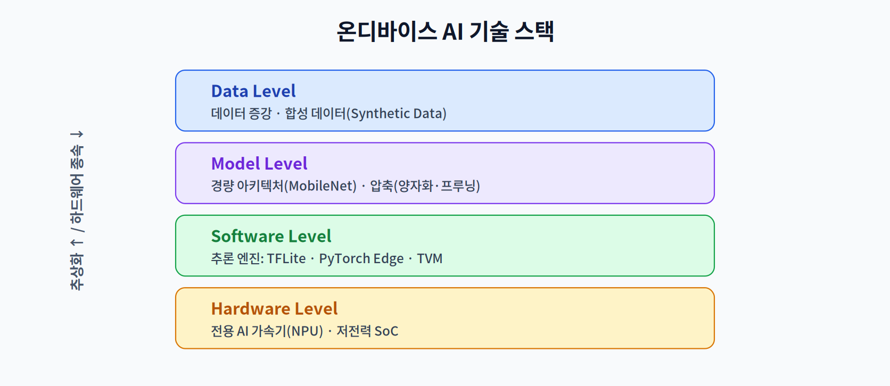
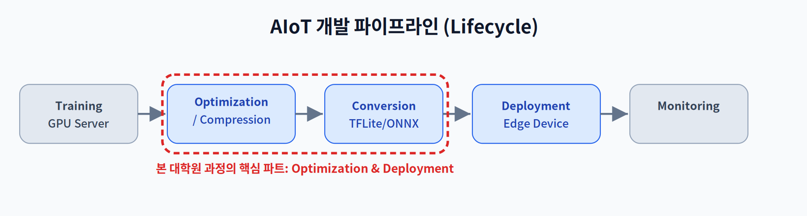

# 01주차 2교시. 기술적 도전과 생태계

**강의 목표** — 온디바이스 AI 설계를 **제약 조건 하의 최적화 문제**로 정식화하고, 그 문제를 다루는 기술 스택의 계층 구조를 대표 문헌과 함께 조망한다.

1교시가 "왜(존재 이유)"였다면, 2교시는 "무엇을(문제의 정의)"이다. 막연한 '작게 만들기'가 아니라, 목적 함수와 제약 조건이 명시된 공학 문제로 이 분야를 바라보는 눈을 만든다.

---

## 2.1 제약 조건 하의 최적화 문제로서의 온디바이스 AI (20분)

온디바이스 배포의 본질은 다음의 최적화 문제로 정식화된다. 모델(과 그 실행 구성)을 $m$이라 할 때:

$$\max_{m} \ \text{Accuracy}(m) \quad \text{s.t.} \quad T_{inf}(m) \le \tau, \quad M_{peak}(m) \le M_{budget}, \quad E(m) \le E_{budget}$$

즉 **지연 예산 $\tau$, 메모리 예산 $M_{budget}$, 에너지 예산 $E_{budget}$** 을 동시에 만족하면서 정확도를 최대화하는 문제다. 이 정식화에서 세 가지 통찰이 나온다.

1. **해는 하나가 아니라 경계선이다.** 정확도와 자원은 상충하므로, 예산을 바꿔가며 얻는 최적해들의 궤적이 **파레토 프론티어(Pareto frontier)** 를 이룬다. 프론티어 위의 어느 점에서 운용할지는 응용의 예산이 정한다 — 7주차 NAS가 이 프론티어를 자동 탐색하는 기법이다.
2. **제약은 서로 독립이 아니다.** 정확도를 지키려 모델을 키우면 메모리와 에너지가 함께 오르고, 지연을 줄이려 병렬화하면 전력이 오른다. Sze 등은 이를 "정확도·처리량·지연·에너지·비용의 다차원 트레이드오프"로 정리했다[1].
3. **병목은 연산이 아니라 메모리일 때가 많다.** 1교시의 Horowitz 측정이 보여주듯 데이터 이동이 연산보다 두 자릿수 비싸므로[2], FLOPs만 세는 분석은 실제 지연·에너지를 예측하지 못한다. 이 간극은 2주차(Memory Wall)에서 본격적으로 다룬다.

- **Resource Constraints** — RAM/Flash 한계, 배터리(전력), 발열. 서버에서 무시되던 것들이 엣지에서는 1차 제약이 된다.
- **Heterogeneous Computing(이기종 컴퓨팅)** — CPU·GPU·DSP·NPU가 역할을 분담하고, 특히 **AI 가속기(NPU)** 가 행렬 연산을 맡아 전력 대비 성능(TOPS/W)을 끌어올린다.

이 균형을 다루는 사고방식이 **SW/HW Co-design**이며, 이번 학기 전체를 관통하는 관점이다.

> 한 줄 정리: 온디바이스 설계는 "정확도–지연–메모리–전력"의 4차원 예산을 동시에 맞추는 제약 최적화 문제이고, 그 해집합이 파레토 프론티어다.

---

## 2.2 온디바이스 AI 기술 스택 (15분)

이 최적화 문제를 공략하는 기술은 네 계층으로 정리된다. 위로 갈수록 추상적이고, 아래로 갈수록 하드웨어에 종속된다.

- **Data Level** — 데이터 증강·합성 데이터(Synthetic Data)로 적은 데이터의 한계를 보완한다.
- **Model Level** — 경량 아키텍처(MobileNet의 Depthwise Separable Convolution[3])와 압축 기법. Han 등의 Deep Compression은 프루닝+양자화+허프만 부호화로 모델을 35~49배 압축하며 이 분야를 연 고전이다[4]. *4~7주차의 주제.*
- **Software Level** — TFLite, PyTorch/ExecuTorch, TVM 등 **추론 엔진(Inference Engine)** 과 그래프 최적화. *3주차의 주제.*
- **Hardware Level** — 전용 AI 가속기(NPU)와 저전력 SoC[1]. MCU급 초저전력 영역은 TinyML로 불린다[5]. *2주차·8주차의 주제.*

이 계층 지도는 이후 13주의 좌표계다. 새 기법을 만날 때마다 "어느 계층의 기술인가, 어느 제약을 완화하는가"를 물으면 전체 그림 안에서 위치가 잡힌다.

> 한 줄 정리: 온디바이스 최적화는 한 계층의 마법이 아니라, 네 계층을 함께 조율하는 시스템 엔지니어링이다[1].

---

## 2.3 개발 파이프라인 (The AIoT Lifecycle) (10분)

온디바이스 AI 모델은 서버에서 학습되지만 엣지에서 실행된다. 그 사이를 잇는 것이 개발 파이프라인이다.

`모델 학습(GPU Server)` → `최적화/압축` → `변환(Conversion)` → `배포(Deployment)` → `모니터링(Monitoring)`의 순환이다. 두 가지를 학술적으로 짚어둔다.

- **학습 1회, 배포 다수(train once, deploy many)** — 하나의 학습 모델이 서로 다른 예산의 여러 기기로 배포된다. 기기마다 다시 학습하지 않고 배포 변형을 얻으려는 문제의식이 7주차 Once-for-All류 연구로 이어진다.
- **모니터링은 폐루프다** — 배포 후 입력 분포가 학습 분포에서 멀어지는 **데이터 드리프트(data drift)** 가 발생하면 정확도가 조용히 무너진다. 온디바이스에서는 원데이터를 서버로 못 올리므로(프라이버시), 드리프트 감지·재학습이 더 어렵다 — 12주차 연합 학습의 문제의식과 닿는다.

이 강의의 무게중심은 가운데의 **Optimization & Deployment**다. "학습된 모델을 어떻게 작고 빠르게 만들어 실제 보드에서 돌릴 것인가"가 본론이기 때문이다.

> 한 줄 정리: 이 강의의 무게중심은 '모델을 만드는 법'이 아니라 '만든 모델을 엣지에 얹는 법'에 있다.

---

## 2.4 학기 운영 안내 및 질의응답 (10분)

- **사용 하드웨어** — 실습 타깃 보드(예: NVIDIA Jetson, Raspberry Pi, Coral TPU 등)를 소개한다.
- **평가 구성** — **7주차 중간고사(범위 1~6주차)**, **14주차 기말 캡스톤 발표·평가**(별도 기말 필기시험 없음). 이론 70% / 실습 30%.
- **캡스톤 일정** — 5주차까지 팀·주제 확정, **11주차(가속기 프로그래밍) 직후 중간 점검**, 14주차 최종 발표. 학기가 14주로 압축되어 있으므로 착수를 미루지 말 것.
- **기말 프로젝트 방향** — "실제 IoT 환경의 문제를 해결하는 온디바이스 솔루션". 도메인(비전/언어)을 선택하고, 경량화·가속을 거쳐 타깃 보드에서 구동하며, 결과를 **수치(정확도 방어율·지연 개선율·프로파일링)** 로 증명한다.

### 1주차 핵심 용어
- **Edge Computing** — 데이터 발생지 근처에서 처리하는 컴퓨팅 방식(정의는 1교시의 Shi et al. 참조).
- **SW/HW Co-design** — 소프트웨어 알고리즘과 하드웨어 구조를 동시에 최적화하는 전략.
- **Determinism** — 시스템이 정해진 시간 내 응답을 보장하는 특성.
- **Pareto Frontier** — 상충하는 목적들 사이에서 어느 한쪽을 희생하지 않고는 개선할 수 없는 해들의 집합.

**토론 질문(세미나용)**

1. 위 최적화 문제에서 지연 예산 $\tau$를 절반으로 줄이면, 실행 가능 영역과 최적 운용점은 파레토 프론티어 위에서 어떻게 이동하는가? 그때 정확도가 반드시 떨어져야 하는가? (제약이 원래 여유로웠다면?)
2. "FLOPs를 절반으로 줄였다"는 논문 주장이 실제 기기에서 지연 개선으로 이어지지 않을 수 있는 이유를 2.1의 통찰 3으로 설명해 보라.
3. Deep Compression[4]의 3단계(프루닝·양자화·부호화)는 각각 기술 스택의 어느 계층에 속하는가?

> 교수님을 위한 Tip: 기술 스택 그림(4계층)을 강의실 한쪽에 계속 띄워두고, 매주 새 기법을 배울 때마다 해당 계층에 표시하면 학생들이 학기 전체의 구조를 잃지 않는다.

---

### 2교시 복습 질문
1. 온디바이스 배포를 제약 최적화 문제로 쓸 때 목적 함수와 세 제약 조건은 무엇인가?
2. 기술 스택 4계층 중 3주차·4주차가 각각 다루는 계층은?
3. '학습 1회, 배포 다수'가 7주차의 어떤 연구 흐름으로 이어지는가?

### 읽기 자료
- **필수** — Sze et al., "Efficient Processing of Deep Neural Networks" (Proc. IEEE, 2017)[1] §I–II.
- **권장** — Han et al., "Deep Compression" (ICLR 2016)[4]; Howard et al., "MobileNets" (2017)[3].

### 참고문헌
[1] V. Sze, Y.-H. Chen, T.-J. Yang, and J. S. Emer, "Efficient Processing of Deep Neural Networks: A Tutorial and Survey," *Proceedings of the IEEE*, vol. 105, no. 12, pp. 2295–2329, 2017.
[2] M. Horowitz, "Computing's Energy Problem (and What We Can Do About It)," in *IEEE ISSCC Dig. Tech. Papers*, 2014, pp. 10–14.
[3] A. G. Howard et al., "MobileNets: Efficient Convolutional Neural Networks for Mobile Vision Applications," arXiv:1704.04861, 2017.
[4] S. Han, H. Mao, and W. J. Dally, "Deep Compression: Compressing Deep Neural Networks with Pruning, Trained Quantization and Huffman Coding," in *Proc. ICLR*, 2016.
[5] P. Warden and D. Situnayake, *TinyML: Machine Learning with TensorFlow Lite on Arduino and Ultra-Low-Power Microcontrollers*. O'Reilly Media, 2019.
