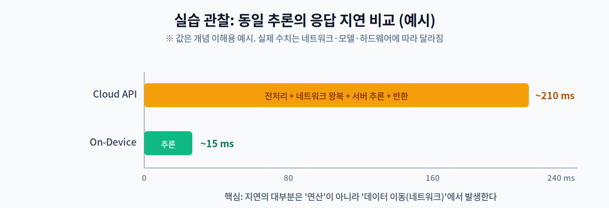

# 01주차 3교시. 내 노트북에서 AI 직접 돌려보기

**오늘 할 일** — 이미지 인식 AI를 **내 노트북에서** 돌려 보고, 걸린 시간을 재 본다. 그리고 같은 일을 클라우드로 보냈을 때와 비교한다. 1교시에서 말로만 들은 "데이터 이동이 진짜 병목"을 **내 눈으로** 확인하는 시간이다.

> 준비물: 노트북(Windows/macOS/Linux) 하나면 된다. **GPU 없어도 되고, 실습 보드도 필요 없다.**

첫 실습이니 코딩 실력을 보려는 게 아니다. 목표는 딱 두 가지다.

1. 온디바이스 추론 환경을 **내 손으로 한 번 만들어 보기**
2. "얼마나 걸리나?"를 **직접 재 보고 놀라기**

---

## 3.1 환경 준비 (15분)

파이썬 가상환경을 만들고 추론 엔진을 설치한다. **ONNX Runtime**을 쓴다. 설치가 간단하고 어느 OS에서나 잘 돌아간다.

```bash
# 1) 가상환경 만들기 (프로젝트별로 라이브러리를 분리해 두는 습관)
python -m venv odai
source odai/bin/activate        # Windows: odai\Scripts\activate

# 2) 추론 엔진과 변환 도구
pip install onnxruntime numpy onnx onnxscript

# 3) 모델을 가져올 PyTorch — CPU 전용 버전으로 받는다
pip install torch torchvision --index-url https://download.pytorch.org/whl/cpu
```

> **왜 CPU 전용으로 받나** — 그냥 `pip install torch`를 하면 GPU(CUDA)용 라이브러리까지 딸려 와 **4GB 가까이** 내려받는다. 이 실습은 GPU가 필요 없으니 위처럼 CPU 버전을 지정하면 몇 분이 절약된다. `onnx`와 `onnxscript`는 모델을 `.onnx`로 변환할 때 필요하다.

잘 깔렸는지 확인해 보자.

```python
import onnxruntime as ort
print("ONNX Runtime:", ort.__version__)
print("사용 가능한 실행 공급자:", ort.get_available_providers())
```

`CPUExecutionProvider`가 보이면 성공이다. 온디바이스 추론 준비 완료.

> **이게 무슨 뜻이냐면** — `get_available_providers()`는 "이 컴퓨터가 AI 연산을 **어떤 장치로** 돌릴 수 있는지" 목록을 알려준다. 노트북에서는 보통 `CPUExecutionProvider`가 보인다(버전에 따라 `AzureExecutionProvider`가 같이 나올 수 있는데 무시해도 된다). 젯슨처럼 GPU를 쓰려면 `onnxruntime-gpu`를 따로 깔아야 `CUDAExecutionProvider`가 나타난다. 2주차에서 이 목록이 곧 "내가 어떤 가속기를 쓸 수 있는가"라는 걸 배운다.

이제 실습에 쓸 모델을 준비한다. **MobileNetV2** — 이름 그대로 모바일용으로 설계된 가벼운 이미지 분류 모델이다.

```python
import torch, torchvision

model = torchvision.models.mobilenet_v2(weights="DEFAULT").eval()
dummy = torch.randn(1, 3, 224, 224)             # 224x224 컬러 이미지 1장 모양
torch.onnx.export(model, dummy, "mobilenetv2.onnx",
                  input_names=["input"], output_names=["logits"],
                  external_data=False)      # 가중치까지 한 파일에 담기
print("저장 완료: mobilenetv2.onnx")
```

`[torch.onnx] ... ✅` 표시가 몇 줄 지나가고 **14MB 정도의 `mobilenetv2.onnx` 한 개**가 생기면 준비 끝이다. (`external_data=False`를 빼면 가중치가 `.onnx.data`라는 별도 파일로 빠져나가 두 파일을 항상 같이 옮겨야 한다.) 이게 바로 "기기에 얹을 수 있는 형태로 변환된 모델"이다(2교시 파이프라인의 `변환` 단계를 방금 직접 해 본 셈이다).

> 조교가 `mobilenetv2.onnx`를 미리 나눠 줬다면 이 단계는 건너뛰어도 좋다.

---

## 3.2 얼마나 빠른지 직접 재 보기 (25분)

이제 추론을 돌리고 시간을 잰다.

```python
import time, numpy as np, onnxruntime as ort

sess = ort.InferenceSession("mobilenetv2.onnx",
                            providers=["CPUExecutionProvider"])
name = sess.get_inputs()[0].name
x = np.random.rand(1, 3, 224, 224).astype(np.float32)   # 아무 이미지나 한 장이라고 치고

# 첫 1회는 버린다 (이유는 아래 설명) — 겸사겸사 결과도 확인
out = sess.run(None, {name: x})
print("모델이 고른 클래스 번호:", int(np.argmax(out[0])), "/ 1000개 중\n")

# 30번 돌려서 기록
samples = []
for _ in range(30):
    t0 = time.perf_counter()
    sess.run(None, {name: x})
    samples.append((time.perf_counter() - t0) * 1000)   # 밀리초로 변환
s = np.array(samples)

print("내 노트북 추론 시간 (30회)")
print(f"  평균     {s.mean():.1f} ms")
print(f"  가장 느림 {s.max():.1f} ms")
print(f"  가장 빠름 {s.min():.1f} ms")
```

**측정할 때 지켜야 할 세 가지** — 안 지키면 숫자가 거짓말을 한다.

1. **첫 번째 측정은 버린다.** 처음 한 번은 모델을 메모리에 올리는 시간이 섞여 유독 느리다. 자동차 예열 같은 것이라 보면 된다.
2. **한 번만 재지 않는다.** 어쩌다 한 번 느릴 수 있으니 여러 번(여기선 30번) 재서 흐름을 본다.
3. **평균만 보지 않는다.** 가끔 튀는 값이 실제 서비스에서는 더 중요하다. 영상이 "가끔" 끊기는 게 사용자에겐 더 거슬리기 때문이다.

이제 같은 사진 한 장을 **클라우드 API로** 보냈다고 생각해 보자. 시간이 이렇게 쌓인다.

```
클라우드 총 시간 = 사진 준비 + 올리기 + 오가는 시간 + 서버 계산 + 결과 받기
내 노트북 시간  = 사진 준비 + 계산
```



> **꼭 확인할 것** — 위 그림의 숫자는 이해를 돕는 예시다. 중요한 건 **각자 측정한 값**이다. 노트북에서 잰 시간이 15ms 근처였다면, 클라우드 API가 200ms 걸릴 때 **차이 185ms 중 대부분은 서버가 느려서가 아니라 오가느라 쓴 시간**이다. 서버는 우리 노트북보다 훨씬 빠르니까.

시간이 남으면 클라우드 쪽도 같은 방식으로 여러 번 재 보자.

```bash
API_URL="https://example.com/..."     # 각자 비교할 주소로 바꿀 것
for i in $(seq 30); do curl -s -o /dev/null -w "%{time_total}\n" "$API_URL"; done
```

> 이 명령은 **오가는 시간만** 재는 것이라, 이미지 인식 API를 실제로 호출한 값과는 다르다. 그래도 목적에는 충분하다. 우리가 보려는 건 "네트워크를 한 번 왕복하는 데 얼마나 걸리고, 그 값이 얼마나 들쭉날쭉한가"이기 때문이다. 쓸 API가 마땅치 않으면 자주 쓰는 웹사이트 주소를 넣어도 된다.

노트북 측정값은 비교적 고르게 나오는데 클라우드는 들쭉날쭉할 것이다. **이게 핵심이다.** 기기 안에서 하는 계산은 시간이 일정하지만, 네트워크는 그날 사정에 따라 달라진다. 자율주행처럼 "반드시 언제까지"가 중요한 시스템이 네트워크를 못 믿는 이유다.

---

## 3.3 숫자가 흔들리는 이유들 (5분)

측정값이 예상과 다르게 나와도 당황하지 말자. 흔한 원인이 있다.

- **컴퓨터가 뜨거워져서** — 계속 돌리면 발열 때문에 성능이 떨어진다. 앞 15회와 뒤 15회 평균을 비교해 보면 보인다.
- **다른 프로그램이 CPU를 쓰고 있어서** — 브라우저에 탭이 30개 열려 있으면 측정값이 튄다.
- **네트워크 상태** — 클라우드 측정은 시간대와 와이파이 상태에 민감하다. 몇 시에, 어떤 연결(와이파이/유선/LTE)로 쟀는지 적어 두자.

> **한 줄 정리:** 숫자 하나만 적으면 안 되고 **"어떤 조건에서 쟀는지"** 를 같이 적어야 한다. 이 습관이 11주차 프로파일링과 기말 캡스톤 평가의 기본기가 된다.

---

## 3.4 과제 (5분 안내)

**1쪽 분량**이면 충분하다.

1. **측정 결과** — 내 노트북의 추론 시간(평균·최대·최소)과, 비교 대상으로 삼은 원격 주소의 왕복 시간. 어떤 노트북인지, 몇 시에 쟀는지도 함께.
2. **관찰 한 문단** — 두 숫자의 차이 중 "오가는 데 쓴 시간"이 얼마나 될지 추정해 보고, 왜 그렇게 생각했는지 적는다.
3. **내 서비스 고르기** — 1교시의 네 가지 이유(빠름·안전·끊겨도 됨·저렴) 중, 내가 관심 있는 서비스가 온디바이스로 갔을 때 얻는 이득을 한두 문장으로.
4. **다음 주 준비물** — `get_available_providers()` 결과를 캡처해 온다. 2주차에서 "내 컴퓨터는 어떤 가속기를 쓸 수 있는가"를 분석한다.

> 교수님을 위한 Tip: 첫 주 실습의 성패는 **환경 설치**에서 갈립니다. `torch`/`torchvision` 설치가 네트워크 사정으로 오래 걸릴 수 있으니, `mobilenetv2.onnx`를 미리 내보내 강의 자료로 배포하시면 훨씬 매끄럽습니다(위 코드처럼 `external_data=False`로 만들면 파일 하나만 배포하면 됩니다). 첫 주는 트러블슈팅 시간을 넉넉히 잡고, **설치 성공 자체를 출석 체크로** 삼는 것을 권합니다. 학생들이 첫 주에 "되네!"를 경험하는 것이 남은 학기의 동력이 됩니다.

---

### 3교시 정리
- 추론 환경을 직접 만들고, 모델을 기기용 형식(`.onnx`)으로 변환해 봤다.
- 추론 시간을 제대로 재는 법(첫 회 버리기·여러 번 재기·튀는 값 보기)을 익혔다.
- 클라우드와의 차이가 **계산이 아니라 오가는 시간**에서 온다는 걸 숫자로 확인했다.
- 이 관찰이 남은 13주의 출발점이다. 다음 주에는 "그럼 기기 안에서는 뭐가 병목인가"를 파고든다.

> **[더 깊이 — 선택]** 이 실습은 사실 정식 실험의 축소판이다. 연구 질문(클라우드와 온디바이스 지연 차이의 지배 항은?), 가설(네트워크 항이 지배할 것이다 / 온디바이스 분산이 더 작을 것이다), 측정 프로토콜(워밍업 제외·n=30·꼬리 지연 보고), 타당성 위협(열 스로틀링·백그라운드 부하·표본 크기) 순서를 그대로 따랐다. 논문을 쓸 때도 같은 뼈대를 쓴다. 관심 있는 학생은 결과를 IMRaD(방법–결과–논의) 형식으로 정리해 보면 좋은 연습이 된다.

### 참고
사용한 모델: M. Sandler, A. Howard, M. Zhu, A. Zhmoginov, and L.-C. Chen, "MobileNetV2: Inverted Residuals and Linear Bottlenecks," in *Proc. IEEE CVPR*, 2018, pp. 4510–4520.
