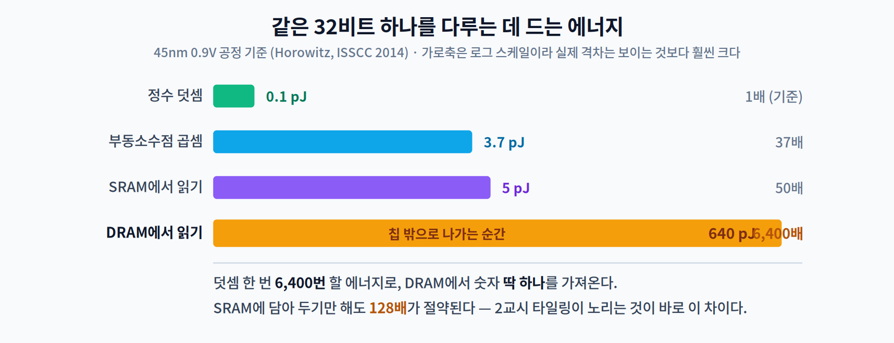
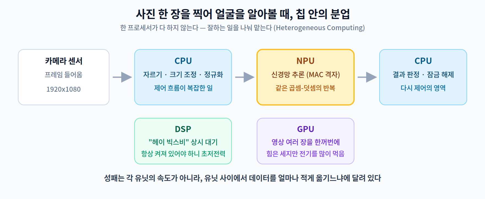
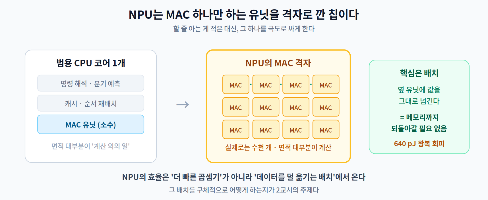

# 02주차 1교시. 칩은 빨라졌는데 왜 체감은 그대로일까

**오늘의 질문** — 새로 나온 폰이 "AI 성능 2배"라고 광고한다. 그런데 막상 써 보면 사진 보정이 2배 빨라지지는 않는다. 광고가 거짓말인 걸까, 아니면 우리가 뭘 잘못 알고 있는 걸까?

1주차에서 우리는 "계산보다 데이터를 나르는 일이 비싸다"는 말을 **비유로** 들었다. 오늘은 그 말이 칩 안에서 **정확히 얼마나** 사실인지를 숫자로 확인한다. 그리고 그 숫자 하나가 왜 지난 20년 반도체 설계를 통째로 끌고 왔는지를 본다.

> 이 교시를 마치면 "왜 NPU라는 게 따로 있는 거야?"라는 질문에 친구에게 2분 안에 답할 수 있게 된다.

---

## 1.1 계산은 이미 충분히 빠르다 (12분)

먼저 한 가지 오해를 걷어내자. **요즘 칩은 계산을 못 해서 느린 게 아니다.**

숫자 두 개를 더하는 데 드는 에너지와, 그 숫자를 메모리에서 가져오는 데 드는 에너지를 나란히 놓아 보면 답이 바로 보인다.



**덧셈 한 번을 6,400번 할 에너지로, DRAM에서 숫자를 딱 하나 가져온다.** (pJ는 피코줄, 1조분의 1줄이다.)

이 숫자를 처음 보면 대부분 다시 한번 읽는다. 그만큼 직관에 반한다. 우리는 "계산이 어려운 일"이라고 배우며 자랐는데, 칩 입장에서 계산은 거의 공짜에 가깝고 **값을 가져오는 일이 진짜 비용**이다.

여기서 하나 더 읽어야 할 것이 있다. **정수 덧셈 0.1 pJ 대 부동소수점 곱셈 3.7 pJ — 같은 계산인데도 37배 차이다.** 부동소수점을 정수로 바꾸기만 해도 이만큼 아낀다. 모바일 NPU 상당수가 정수 연산에 최적화된 이유이고, **5주차 양자화**가 노리는 것이 바로 이 차이다. (CPU의 SIMD 유닛도 같은 폭이면 정수를 더 많이 담아 한 번에 처리한다.)

그리고 왜 그럴까? 메모리 쪽이 비싼 것은 **거리** 때문이다.

- **칩 안(SRAM)** — 몇 밀리미터 거리. 냉장고 문 여는 것과 비슷하다. **5 pJ**
- **칩 밖(DRAM)** — 기판 위 배선을 타고 나갔다 와야 한다. 창고까지 다녀오는 셈이다. **640 pJ**

에너지는 **128배**가 든다. 전기 신호를 칩 밖으로 밀어내려면 배선을 통째로 충전·방전해야 하는데, 그 배선이 칩 내부보다 훨씬 굵고 길기 때문이다.

**이게 남의 이야기가 아니라는 걸 우리 모델로 확인해 보자.** 1주차 실습에서 쓴 MobileNetV2는 파라미터가 약 350만 개다. 추론 한 번에 이 가중치를 **DRAM에서 딱 한 번씩만** 읽는다고 가정해도,

```
가중치 읽기 : 3,504,872개 × 640 pJ ≈ 2.24 mJ
곱셈 전체   : 300,000,000 MAC × 3.7 pJ ≈ 1.11 mJ
```

**데이터를 가져오기만 해도 곱셈 전체의 2배**가 든다. 그것도 "한 번씩만 읽는다"는 가장 낙관적인 가정에서 그렇다. 실제로는 같은 가중치를 여러 번 다시 읽게 되므로 격차는 훨씬 벌어진다.

(MAC 300M은 MobileNetV2 논문의 300M Multiply-Adds 기준이다. MAC은 곱셈과 덧셈이 한 쌍이므로 덧셈 0.9 pJ까지 넣으면 연산 쪽이 1.38 mJ가 되어 비율은 **1.6배**로 낮아지지만, 결론은 달라지지 않는다.)

> **지난주 숫자와 헷갈리지 않기** — 1주차에서 "170배"라고 했던 것은 **부동소수점 곱셈** 기준(640 ÷ 3.7 ≈ 173배)이고, 오늘의 6,400배는 **정수 덧셈** 기준(640 ÷ 0.1)이다. 무엇과 비교하느냐만 다를 뿐 같은 표에서 나온 값이다.

> **한 줄 정리:** 칩에게 계산은 싸고 **기억을 꺼내 오는 일이 비싸다.** 온디바이스AI 하드웨어의 모든 설계는 이 한 문장에서 출발한다.

---

## 1.2 격차는 해마다 벌어진다 — Memory Wall (13분)

더 나쁜 소식이 있다. 이 격차가 **줄어드는 게 아니라 매년 벌어지고 있다.**

지난 수십 년 동안 연산 성능은 가파르게 올랐다. 그런데 메모리에서 데이터를 실어 나르는 속도(대역폭)는 그만큼 따라오지 못했다. 세대가 갈수록 두 곡선의 간격이 벌어진다.


이 벌어지는 간격을 **Memory Wall(메모리 장벽)** [1]이라고 부른다. 결과가 뭘까? **연산 유닛이 논다.** 계산할 준비는 다 됐는데 데이터가 아직 도착하지 않아서 기다린다.

고속도로를 8차선으로 넓혀 놨는데 진입로가 1차선이면, 차선을 아무리 더 늘려도 소용이 없는 것과 같다.

이제 오늘의 첫 질문에 답할 수 있다.

> **"AI 성능 2배"인데 왜 2배로 안 빨라지나?** — 광고가 말하는 2배는 대개 **연산 유닛**의 능력이다. 그런데 실제 추론 시간을 지배하는 건 데이터가 도착하는 속도다. 진입로를 안 넓혔으니 체감이 2배가 될 리 없다.

여기서 1주차에 배운 함정이 다시 나온다. **"연산량(FLOPs)을 절반으로 줄였다"가 "속도가 두 배"를 뜻하지 않는 이유**가 바로 이것이다. 줄인 게 이미 싼 쪽이었다면 총 시간은 거의 그대로다.

> **[더 깊이 — 선택]** 이 관계는 **루프라인 모델(Roofline Model)** [2]로 정식화된다. 연산 강도(Arithmetic Intensity, 데이터 1바이트당 수행하는 연산 수)를 가로축에, 달성 가능한 성능을 세로축에 놓으면 성능은 $\min(P_{peak},\; BW \times I)$ 라는 지붕 아래에 갇힌다. 연산 강도 $I$ 가 낮은 연산은 아무리 좋은 칩을 써도 **대역폭 경사면**에 붙어 있어, 연산 유닛을 늘려도 성능이 오르지 않는다. 딥러닝에서는 **Depthwise 합성곱**(가중치는 거의 안 쓰지만 활성값 재사용도 없다)과 **배치가 1인 완전연결 층**(가중치를 통째로 읽고 한 번씩만 쓴다)이 대표적이다. 원인은 서로 다르지만 결과는 같다 — **옮긴 데이터당 하는 계산이 적다.** Williams 등[2]이 제안했고, 온디바이스 성능 분석의 기본 도구다.

> **한 줄 정리:** 칩의 계산 능력과 메모리가 데이터를 대는 능력의 **격차가 곧 병목**이며, 그 격차는 해마다 커진다.

---

## 1.3 그래서 칩 하나로 안 한다 (15분)

문제가 "데이터 이동"이라면 해법도 거기서 나와야 한다. 반도체 회사들이 택한 답은 의외로 단순하다. **일의 성격에 맞는 유닛을 따로 두고 나눠 맡긴다.**

주방을 떠올리면 쉽다. 칼질하는 사람, 불 쓰는 사람이 따로 있다. 한 명이 다 하는 것보다 빠르고, 각자 자기 일에만 맞는 도구를 쓰니 힘도 덜 든다.


칩 안의 네 일꾼은 이렇게 나뉜다.

| 일꾼 | 잘하는 일 | 주방에 비유하면 | 온디바이스에서 맡는 역할 |
|---|---|---|---|
| **CPU** | 상황에 따라 판단이 갈리는 복잡한 일 | 총괄 셰프 | 전처리·후처리·제어 |
| **GPU** | 똑같은 일을 아주 많이 한꺼번에 | 대형 화구 여러 개 | 무거운 추론(젯슨급) |
| **DSP**<br>(Digital Signal Processor) | 신호를 다루는 단순 반복, 저전력 | 늘 켜 둔 보온 기능 | 상시 대기 음성·센서 |
| **NPU** | 신경망의 곱셈-덧셈만 | 그 요리 전용 기계 | 딥러닝 추론 전담 |

이렇게 서로 다른 프로세서를 한 칩에 모아 일을 배분하는 방식을 **이기종 컴퓨팅(Heterogeneous Computing)** 이라고 한다. 여러분 폰 안에서 지금 이 순간 일어나고 있는 일이다.



그런데 여기에 함정이 하나 있다. **일을 나눠 맡기면 그 사이에서 데이터를 옮겨야 한다.** CPU가 다듬은 이미지를 NPU에 넘기고, NPU의 결과를 다시 CPU가 받는다. 1.1에서 본 대로 이 옮기는 일이 비싸다.

그래서 이기종 컴퓨팅의 성패는 각 유닛이 얼마나 빠른가가 아니라, **유닛 사이를 얼마나 적게 오가게 짜느냐**에 달려 있다. 3주차에서 배울 추론 엔진이 정확히 이 결정을 대신해 주는 소프트웨어다.

> **한 줄 정리:** 칩 안은 **분업 체제**다. 그리고 분업의 발목을 잡는 것도 결국 데이터 이동이다.

---

## 1.4 NPU는 대체 뭐가 다른가 (10분)

네 일꾼 중 하나만 더 들여다보자. **NPU가 GPU보다 전력 대비 성능이 좋은 이유**는 뭘까? 클럭이 더 빨라서가 아니다.

신경망 연산은 압도적으로 이 한 가지 형태다.

$$y \mathrel{+}= w \times x$$

곱하고 더해서 쌓는다. 이것을 **MAC(Multiply-Accumulate)** 이라 부른다. 신경망 계산의 거의 전부가 이 모양이다.



NPU는 이 MAC 하나만 하는 아주 작은 유닛을 **격자처럼 수천 개 깔아 둔 칩**이다. 범용 프로세서에 있는 것들 — 분기 예측, 복잡한 명령 해석, 큰 캐시 관리 회로 — 을 대부분 걷어냈다. 할 줄 아는 게 적은 대신, 그 하나를 극도로 싸게 한다.

핵심은 그다음이다. MAC 유닛을 **격자로 붙여 놓으면 옆 유닛에 값을 그대로 넘길 수 있다.** 메모리까지 되돌아갈 필요가 없다. 1.1의 에너지 표로 말하면, 640 pJ짜리 왕복을 거의 0에 가깝게 만드는 것이다.

결국 NPU의 효율은 **더 빠른 곱셈기**에서 오는 게 아니라 **데이터를 덜 옮기는 배치**에서 온다. 이 배치를 구체적으로 어떻게 하는지가 2교시의 주제다.

> **[더 깊이 — 선택]** MAC 격자에 데이터를 어떤 순서로 흘리느냐를 **데이터플로(dataflow)** 라 하고, 무엇을 고정해 두고 재사용하느냐에 따라 이름이 갈린다. 가중치를 PE(Processing Element, 연산 유닛 하나)에 고정하는 **weight-stationary**(Google TPU의 시스톨릭 어레이가 대표적), 부분합을 고정하는 **output-stationary**, **필터의 한 행을 PE에 고정해 두고 입력 행을 흘려보내는 row-stationary**(Eyeriss[3]) 등이다. row-stationary는 가중치·입력·부분합 셋을 동시에 재사용한다는 점이 특징이다. 어느 것이 유리한지는 층의 모양(채널 수·커널 크기·Feature Map 크기)에 따라 달라지며, 그래서 최신 NPU는 층마다 데이터플로를 바꾸는 재구성 기능을 갖는다. Sze 등[4]의 서베이가 이 분류를 체계적으로 정리했다.

**오늘의 토론 질문**

1. 여러분 폰으로 사진을 찍어 인물 모드로 보정할 때, CPU·GPU·NPU·DSP가 각각 어떤 일을 맡을지 배분표를 그려 보자. 왜 그렇게 나눴나?
2. "연산 성능이 2배인 칩"을 샀는데 추론 속도는 1.2배밖에 안 올랐다. 판매자에게 물어볼 질문 한 가지를 만든다면?
3. NPU가 그렇게 효율적이면, 왜 폰에서 CPU를 아예 없애지 않을까?

> 교수님을 위한 Tip: 1번 질문을 **강의 중에 조별로 5분** 주고 화이트보드에 그리게 하세요. 학생들이 거의 예외 없이 "전부 NPU"라고 적었다가, 자르기·크기 조정 같은 전처리를 어디에 둘지에서 막힙니다. 그 막히는 순간이 이기종 컴퓨팅을 이해하는 지점입니다. 3번은 그 연장선이라 이어서 던지기 좋습니다.

---

### 1교시 정리
- 칩에게 **계산은 싸고 데이터를 가져오는 일이 비싸다** — DRAM 접근 한 번이 정수 덧셈 6,400번어치다.
- 그 격차가 해마다 벌어지는 현상이 **Memory Wall**이고, "성능 2배"가 체감 2배로 이어지지 않는 이유다.
- 그래서 칩 안은 **CPU·GPU·DSP·NPU의 분업 체제**(이기종 컴퓨팅)로 간다.
- **NPU의 효율은 빠른 곱셈기가 아니라 데이터를 덜 옮기는 배치**에서 온다. 그 배치가 2교시의 주제다.

### 오늘의 용어 (4개만 기억하면 충분)
- **Memory Wall** — 연산 성능과 메모리 대역폭의 격차가 벌어져 생기는 병목.
- **이기종 컴퓨팅(Heterogeneous Computing)** — 성격이 다른 프로세서에 일을 나눠 맡기는 방식.
- **MAC(Multiply-Accumulate)** — 곱해서 더해 쌓는 신경망의 기본 연산 단위.
- **NPU(Neural Processing Unit)** — MAC 유닛을 격자로 깔아 신경망 추론만 전담하는 칩.

### 더 읽어보기 (관심 있는 학생만)
오늘의 에너지 수치는 Horowitz의 45nm 공정 측정[5]에서 나왔고, Han 등[6]이 표로 정리해 널리 알려졌다. 정수 덧셈 0.1 pJ, 부동소수점 곱셈 3.7 pJ, SRAM 읽기 5 pJ, DRAM 읽기 640 pJ이다.

[1] W. A. Wulf and S. A. McKee, "Hitting the Memory Wall: Implications of the Obvious," *ACM SIGARCH Computer Architecture News*, vol. 23, no. 1, pp. 20–24, 1995.
[2] S. Williams, A. Waterman, and D. Patterson, "Roofline: An Insightful Visual Performance Model for Multicore Architectures," *Communications of the ACM*, vol. 52, no. 4, pp. 65–76, 2009.
[3] Y.-H. Chen, T. Krishna, J. S. Emer, and V. Sze, "Eyeriss: An Energy-Efficient Reconfigurable Accelerator for Deep Convolutional Neural Networks," *IEEE Journal of Solid-State Circuits*, vol. 52, no. 1, pp. 127–138, 2017.
[4] V. Sze, Y.-H. Chen, T.-J. Yang, and J. S. Emer, "Efficient Processing of Deep Neural Networks: A Tutorial and Survey," *Proceedings of the IEEE*, vol. 105, no. 12, pp. 2295–2329, 2017.
[5] M. Horowitz, "Computing's Energy Problem (and What We Can Do About It)," in *IEEE ISSCC Dig. Tech. Papers*, 2014, pp. 10–14.
[6] S. Han, X. Liu, H. Mao, J. Pu, A. Pedram, M. A. Horowitz, and W. J. Dally, "EIE: Efficient Inference Engine on Compressed Deep Neural Network," in *Proc. ISCA*, 2016, pp. 243–254.
