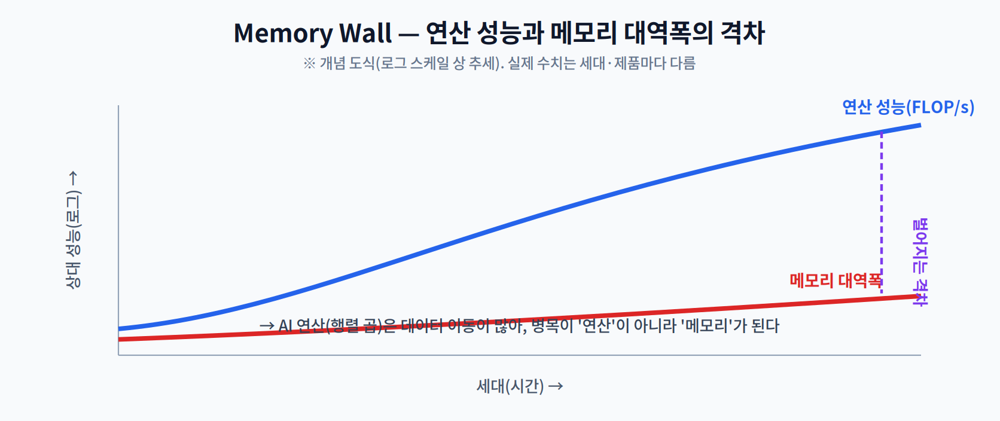
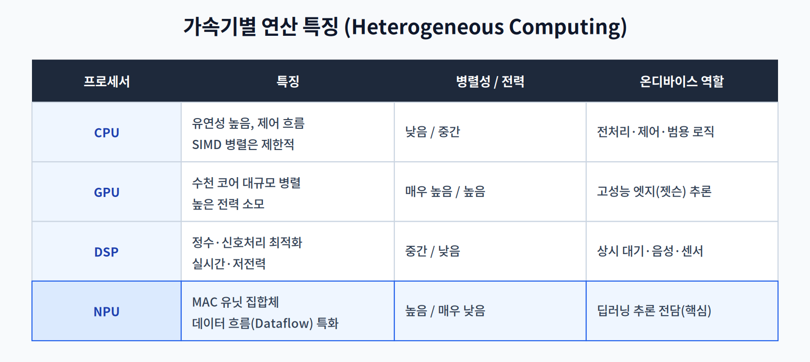

# 02주차 1교시. 하드웨어 가속기 아키텍처

**강의 목표** — CPU 중심 컴퓨팅의 한계를 이해하고, AI 연산에 최적화된 이기종 컴퓨팅(Heterogeneous Computing)의 구조를 파악한다.

1주차에서 온디바이스 AI가 "왜" 필요한지 살펴봤다면, 2주차는 그것을 떠받치는 **물리적 기반(하드웨어)**을 다룬다. 대학원 수준에 맞춰 단순 스펙 비교가 아니라, **컴퓨터 구조 관점에서의 데이터 흐름과 가속 원리**에 집중한다.

---

## 1.1 폰 노이만 구조의 병목과 Memory Wall (15분)

오늘날 대부분의 컴퓨터는 연산 장치(CPU)와 메모리가 분리된 **폰 노이만 구조(Von Neumann Architecture)**를 따른다. 데이터를 메모리에서 꺼내 연산하고 다시 저장하는 이 구조는 범용 계산에 훌륭하지만, AI 연산에서는 심각한 병목을 만든다.

문제의 핵심은 **Memory Wall**이다. 지난 수십 년간 연산 성능(FLOP/s)은 가파르게 성장했지만, 메모리 대역폭의 성장은 그에 훨씬 못 미쳤다. 그 결과 연산 유닛은 "계산할 준비"가 되어 있어도, **데이터가 도착하기를 기다리며 노는** 시간이 늘어난다.

딥러닝의 핵심 연산인 **행렬 곱셈(GEMM)**은 곱셈-덧셈 자체는 단순하지만, 다뤄야 할 가중치와 활성값의 양이 방대하다. 즉 연산량보다 **데이터 이동량**이 문제이며, 데이터 이동은 곧 **에너지 비용**이다. 온칩에서 값 하나를 옮기는 것보다 오프칩 DRAM에서 값을 읽어오는 데 수십~수백 배의 에너지가 든다.

> 한 줄 정리: AI 하드웨어 설계의 제1 과제는 "연산을 빠르게"가 아니라 "데이터 이동을 줄이기"다.

---

## 1.2 가속기별 연산 특징 (25분)

그래서 온디바이스 AI는 한 종류의 프로세서에 의존하지 않고, 특성이 다른 여러 프로세서를 **역할에 맞게** 조합한다.

- **CPU (Central Processing Unit)** — 제어 흐름과 범용 로직에 강하고 유연하지만, SIMD(단일 명령 다중 데이터) 병렬성이 제한적이라 대규모 행렬 연산에는 비효율적이다. 전처리·후처리·제어를 담당한다.
- **GPU (Graphics Processing Unit)** — 수천 개의 코어로 대규모 병렬 처리를 수행한다. 성능은 높지만 전력 소모가 크다. 젯슨 같은 고성능 엣지의 추론 주력이다.
- **DSP (Digital Signal Processor)** — 정수 연산과 실시간 신호 처리에 최적화되어 저전력이다. 상시 대기 음성 인식이나 센서 처리 같은 always-on 작업에 적합하다.
- **NPU (Neural Processing Unit)** — **MAC(Multiply-Accumulate) 유닛의 집합체**로, 데이터 재사용을 극대화하는 **데이터 흐름(Dataflow) 아키텍처**를 갖는다. 전력 대비 성능이 가장 뛰어나 딥러닝 추론을 전담한다.

여기서 **MAC**은 딥러닝 연산의 기본 단위 $y \mathrel{+}= w \times x$ 를 한 번에 처리하는 유닛으로, 신경망 연산의 대부분이 이 형태다. NPU는 이 MAC을 격자처럼 배열해 한꺼번에 돌린다.

> 한 줄 정리: 온디바이스는 "무엇을 CPU/GPU/DSP/NPU 중 어디에 맡길 것인가"를 나누는 이기종 컴퓨팅으로 성능·전력을 얻는다.

---

## 1.3 이기종 컴퓨팅의 등장 (개념 정리, 15분)

**Heterogeneous Computing(이기종 컴퓨팅)**은 서로 다른 프로세서를 한 시스템에 통합해, 각 작업을 가장 잘 맞는 유닛에 배분하는 방식이다. 예컨대 카메라 프레임의 전처리는 CPU, 딥러닝 추론은 NPU, 상시 웨이크워드 감지는 DSP가 맡는 식이다.

이 배분의 성패는 단순히 각 유닛의 속도가 아니라, **유닛 사이에서 데이터를 얼마나 적게 옮기느냐**에 달려 있다(1.1의 Memory Wall과 직결). 이 관점은 3주차의 추론 엔진(연산을 어느 유닛에 위임할지 결정하는 Delegate)과 12주차의 하드웨어 가속기 프로그래밍으로 이어진다.

> 교수님을 위한 Tip: 1교시 마지막에 "스마트폰에서 사진 한 장을 찍어 얼굴을 인식할 때, CPU·GPU·NPU·DSP가 각각 어떤 일을 맡을지" 학생들에게 배분표를 그려보게 하면 이기종 컴퓨팅 개념이 빠르게 체화된다.

---

### 1교시 복습 질문
1. Memory Wall이 '연산 성능'보다 '메모리 대역폭'의 문제인 이유는?
2. NPU가 전력 대비 성능에서 GPU보다 유리할 수 있는 구조적 근거는?
3. always-on 웨이크워드 감지에 NPU 대신 DSP가 자주 쓰이는 이유는?
