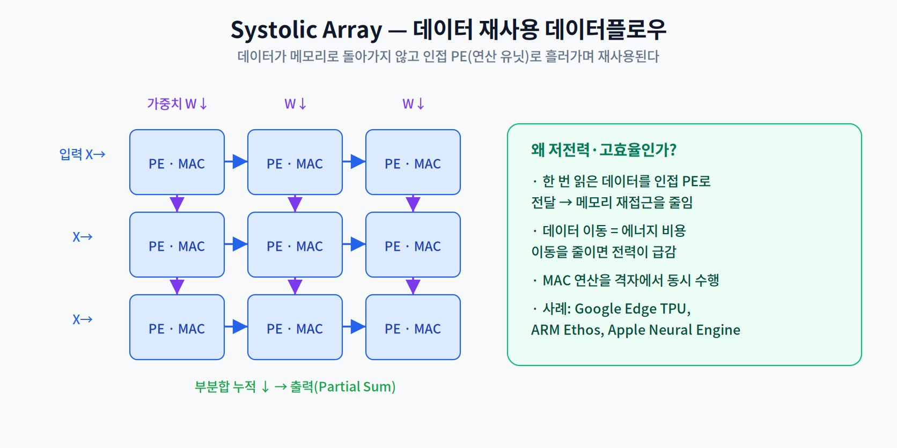
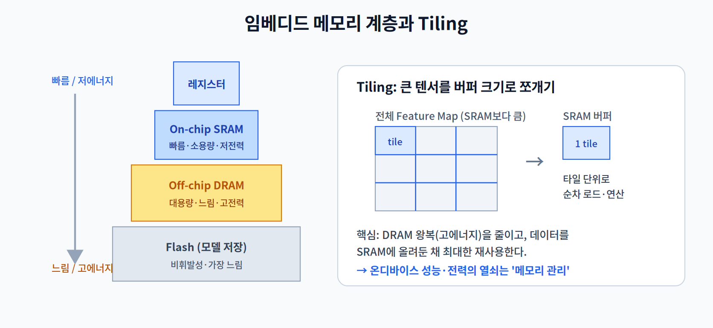
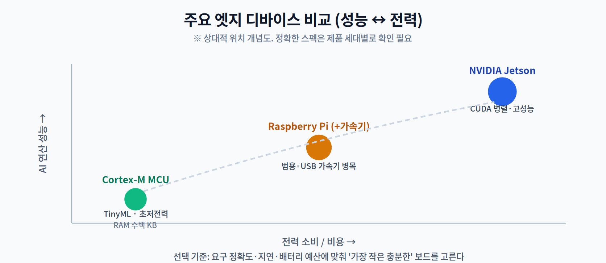

# 2주차 2교시. 임베디드 리소스 제약과 설계 전략

**강의 목표** — 제한된 자원 내에서 성능을 극대화하기 위한 하드웨어-소프트웨어 공동 설계(Co-design) 개념을 학습한다.

1교시가 "어떤 가속기가 있는가"였다면, 2교시는 "그 가속기가 왜 그렇게 설계되었는가"와 "제약 속에서 어떻게 선택할 것인가"를 다룬다.

---

## 2.1 도메인 특화 아키텍처와 Systolic Array (15분)

범용 프로세서의 한계를 넘기 위해, AI 연산만을 위한 **도메인 특화 아키텍처(DSA, Domain-Specific Architecture)**가 등장했다. 대표 사례가 **Google Coral(Edge TPU), ARM Ethos, Apple Neural Engine**이다. 이들 대부분은 MAC 유닛을 격자처럼 배열한 **공간형(spatial) 데이터플로** 구조를 쓰는데, 그중 가장 널리 알려진 형태가 **Systolic Array(시스톨릭 어레이)**로, 대표적으로 Google Edge TPU가 이 방식을 채택한 것으로 알려져 있다.

핵심 아이디어는 **"데이터를 메모리로 되돌리지 않는다"**는 것이다. 입력과 가중치가 연산 유닛(PE) 격자를 따라 인접 유닛으로 흘러가며, 한 번 읽은 값을 여러 연산에 재사용한다. 각 PE는 흘러 들어온 값으로 MAC을 수행하고 부분합(Partial Sum)을 누적한다.

1.1에서 본 것처럼 데이터 이동이 곧 에너지 비용이므로, 이동을 최소화하는 이 구조는 **전력 대비 성능**에서 압도적이다. 대학원 심화로는 CNN 가속기 논문 **"Eyeriss"(Chen et al., 2016)**가 자주 인용된다. 다만 Eyeriss는 시스톨릭 어레이가 아니라 **row-stationary**라는 또 다른 데이터플로를 제안한 연구로, "데이터 재사용을 극대화한다"는 목표는 같지만 배치 전략이 다르다는 점을 함께 짚으면 좋다.

> 한 줄 정리: NPU/TPU의 효율은 '더 빠른 곱셈기'가 아니라 '데이터를 덜 옮기는 배치'에서 나온다.

---

## 2.2 임베디드 메모리 계층과 Tiling (15분)

가속기가 아무리 빨라도, 데이터를 어디에 두고 어떻게 나르느냐가 실제 성능을 좌우한다.

- **On-chip SRAM vs. Off-chip DRAM** — SRAM은 빠르고 저전력이지만 용량이 작고, DRAM은 크지만 느리고 전력을 많이 쓴다. 값 하나를 DRAM에서 읽는 비용은 SRAM에서 읽는 것보다 훨씬 크다.
- **Tiling(타일링)** — 대형 모델의 Feature Map은 대개 SRAM보다 크다. 그래서 텐서를 하드웨어 버퍼 크기에 맞는 **타일(tile)** 로 쪼개, 한 타일을 SRAM에 올린 채 최대한 재사용하고 다음 타일로 넘어간다. 이렇게 DRAM 왕복을 줄이는 것이 온디바이스 성능·전력의 열쇠다.

이 지점이 **SW/HW Co-design**이 필요한 이유다. 같은 모델도 타일 크기·연산 순서를 하드웨어 버퍼에 맞게 짜느냐에 따라 속도가 크게 달라진다.

> 한 줄 정리: 온디바이스 최적화의 상당 부분은 "연산 순서와 데이터 배치로 메모리 왕복을 줄이는 일"이다.

---

## 2.3 전성비(Performance per Watt)와 DVFS (15분)

배터리로 동작하는 IoT 단말에서 절대 성능보다 중요한 지표는 **전성비(Performance per Watt)**, 즉 1와트당 얼마나 많은 연산을 하느냐다.

- **에너지 예산(Energy Budget)** — 배터리 용량과 목표 사용 시간이 정해지면, 추론 1회에 쓸 수 있는 에너지가 상한으로 주어진다. 모델·하드웨어 선택은 이 예산 안에서 이뤄진다.
- **DVFS(Dynamic Voltage and Frequency Scaling)** — 부하에 따라 전압·주파수를 동적으로 조절해 전력을 아끼는 기법이다. 추론이 몰릴 때는 주파수를 올리고, 유휴 시엔 낮춰 전력을 절약한다. 다만 주파수를 낮추면 지연이 늘어, 여기서도 **성능–전력 트레이드오프**가 발생한다.

> 한 줄 정리: 엣지에서 좋은 하드웨어란 '가장 빠른' 것이 아니라 '주어진 전력 예산에서 가장 효율적인' 것이다.

---

## 2.4 주요 엣지 디바이스 비교 분석 (15분)

- **High-end: NVIDIA Jetson** — CUDA 기반 병렬 처리로 높은 성능. 비전·LLM 등 무거운 추론에 적합하나 전력·비용이 크다.
- **Mid-range: Raspberry Pi + 가속기** — 범용성이 좋지만, USB로 연결한 외장 가속기는 인터페이스 대역폭이 병목이 될 수 있다.
- **Low-end (TinyML): Cortex-M 기반 MCU** — RAM이 수백 KB 수준으로 극도로 제한된다. 초저전력이 필요한 센서 노드에 쓰이며, 9주차 TinyML의 주제다.

선택의 원칙은 **"가장 작은 충분한 보드"**다. 요구 정확도·지연·배터리 예산을 먼저 정하고, 그것을 만족하는 가장 저전력·저비용 보드를 고른다.

### 실습 준비 및 하드웨어 셋업 가이드
- 학기 중 사용할 타겟 보드(예: Jetson Orin Nano 또는 Coral TPU) 환경 설정 개요를 안내한다.
- Linux 커널 수준에서 가속기 인식 여부를 확인하는 방법(예: 드라이버·런타임 설치 확인)을 다룬다. 다음 3교시에서는 보드가 없어도 노트북 CPU로 같은 원리를 관찰한다.

### 2주차 핵심 키워드
- **MAC (Multiply-Accumulate)** — 딥러닝 연산의 기본 단위.
- **Heterogeneous Computing** — 용도에 맞는 여러 프로세서를 조합해 사용하는 방식.
- **Memory Footprint** — 프로그램 실행 시 점유하는 메모리 공간의 크기.
- **Systolic Array** — 가속기 내부에서 데이터 재사용성을 높이는 구조.

> 교수님을 위한 Tip: NPU 가속 보드와 CPU만 있는 보드의 추론 속도(FPS) 차이를 간단한 데모로 보여주면 몰입도가 크게 오른다. 대학원생에게는 "Eyeriss: An Energy-Efficient Reconfigurable Accelerator for Deep CNNs" 논문을 가볍게 소개하며 데이터 흐름 최적화의 중요성을 강조하는 것을 추천한다.

---

### 2교시 복습 질문
1. Systolic Array가 저전력인 근본 이유를 '데이터 이동' 관점에서 설명하라.
2. Tiling이 필요한 상황(SRAM과 텐서 크기의 관계)을 구체적으로 기술하라.
3. DVFS로 주파수를 낮추면 무엇을 얻고 무엇을 잃는가?
