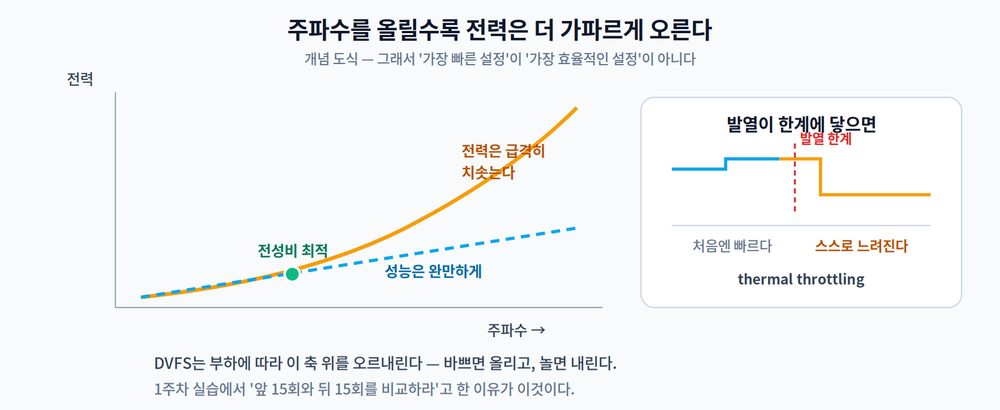

# 02주차 2교시. 칩 설계자는 어떻게 데이터를 안 옮길까

**오늘의 질문** — 1교시에서 "데이터를 덜 옮기는 게 전부"라고 했다. 그런데 계산을 하려면 값을 어딘가에서 가져와야 하지 않나? 안 옮기고 어떻게 계산한다는 걸까?

1교시가 "**무엇이 문제인가**"였다면, 2교시는 "**그래서 어떻게 푸는가**"다. 설계자들이 쓰는 방법은 크게 두 가지다. 하나는 **한 번 가져온 값을 최대한 우려먹기**, 다른 하나는 **가져올 것을 애초에 작게 쪼개기**. 그리고 마지막으로, 이 모든 것을 어떤 기준으로 고를지를 본다.

---

## 2.1 데이터를 메모리로 돌려보내지 않는 법 (15분)

계산에 값이 필요한 건 맞다. 요령은 **한 번 가져온 값을 메모리로 돌려보내지 않고 옆으로 넘기는 것**이다.

김밥 공장을 떠올려 보자. 김밥 한 줄을 만들 때마다 재료를 창고에서 꺼내 오고, 다 만들면 남은 재료를 창고에 돌려놓는다면? 하루 종일 창고만 오간다. 그래서 실제 공장은 **컨베이어 벨트**를 쓴다. 재료가 벨트를 따라 흐르고, 각 자리의 사람은 자기 앞에 온 재료로 자기 동작 하나만 한다.

**Systolic Array(시스톨릭 어레이)** 가 정확히 이 구조다.

- 가중치와 입력이 **격자를 따라 흘러간다.**
- 각 자리의 PE(Processing Element)는 자기 앞에 온 값으로 MAC 한 번을 하고, **값을 그대로 옆 PE에 넘긴다.**
- 메모리에는 맨 처음 들어올 때와 맨 마지막 나갈 때만 접근한다.

효과를 1교시의 에너지 표로 환산하면 명확하다. 값 하나를 100번 쓰는데 매번 DRAM에서 읽으면 `100 × 640 pJ = 64,000 pJ`이다. 한 번만 읽어 격자 안에서 돌려쓰면 `640 pJ + (PE 사이 이동 약간)`이다. 같은 계산을 하고도 에너지가 두 자릿수로 줄어든다.

**MAC 격자를 데이터 재사용 중심으로 배치한다**는 이 아이디어는 Google의 TPU[2]·Edge TPU, ARM Ethos, Apple Neural Engine 같은 **도메인 특화 아키텍처(DSA, Domain-Specific Architecture)** 에 공통적이다(세부 구조는 제품마다 다르고 비공개인 경우도 많다). 범용성을 버리는 대신, 딱 한 종류의 연산 패턴에 모든 것을 맞춘 칩들이다.

> **[더 깊이 — 선택]** "데이터를 흘린다"는 아이디어는 같아도 **무엇을 고정하느냐**는 다르다. 시스톨릭 어레이는 대개 가중치를 PE에 고정하는 **weight-stationary**다. 반면 Eyeriss[1]는 **필터의 한 행을 PE에 고정해 두고 입력 행을 흘려보내는 row-stationary**를 제안했다. 1차원 행 합성곱 하나를 PE 하나에 통째로 대응시켜, 가중치·입력·부분합 **셋을 동시에** 재사용하는 것이 요점이다. 시스톨릭 어레이가 아니지만 "데이터 재사용을 극대화한다"는 목표는 같다. 어느 쪽이 유리한지는 층의 모양에 달렸고, 그래서 이 분야의 논문 제목에 `Reconfigurable`이라는 단어가 자주 등장한다.

> **한 줄 정리:** NPU·TPU의 효율은 '더 빠른 곱셈기'가 아니라 **'데이터를 덜 옮기는 배치'** 에서 나온다.

---

## 2.2 큰 걸 작은 그릇에 나눠 담기 (14분)

두 번째 방법. 격자 안에서 돌려쓰려면 일단 **값이 칩 안에 들어와 있어야** 한다. 그런데 칩 안 메모리는 아주 작다.

1교시의 냉장고·창고 비유를 이어 보자. 칩 안팎의 메모리는 이런 계층을 이룬다.

| 층 | 비유 | 크기 | 값 하나 읽기 |
|---|---|---|---|
| 레지스터 | 도마 위 | 수십~수백 바이트 | 거의 공짜 |
| **On-chip SRAM** | **냉장고** | 수십 KB ~ 수 MB | **5 pJ** |
| **Off-chip DRAM** | **창고** | 수백 MB ~ 수 GB | **640 pJ** |
| Flash | 시장 | GB급 | 훨씬 느림 |

문제가 보인다. **모델의 Feature Map은 대개 SRAM보다 크다.** 냉장고에 안 들어가는 크기의 재료를 다뤄야 하는 것이다.

해법이 **타일링(Tiling)** 이다. 빨래가 세탁기 용량보다 많으면 나눠 돌리듯, 큰 텐서를 **버퍼 크기에 맞는 조각(타일)** 으로 쪼갠다. 한 타일을 SRAM에 올려 둔 채 그 안에서 할 수 있는 계산을 최대한 끝내고, 다음 타일로 넘어간다.

여기서 중요한 건 **타일 크기를 어떻게 잡느냐**다.

- **너무 크면** — SRAM에 안 들어가서 결국 DRAM을 다시 들락거린다(640 pJ의 세계로 되돌아감).
- **너무 작으면** — 타일 경계에서 겹치는 부분을 반복해서 읽게 되고, 조각을 갈아 끼우는 오버헤드가 커진다.

정답은 **그 칩의 버퍼 크기에 달려 있다.** 같은 모델, 같은 코드인데 칩이 바뀌면 최적 타일 크기가 바뀌고 속도가 몇 배씩 달라진다.

그래서 이 지점이 1주차에 이름만 들었던 **SW/HW Co-design**이 실제로 필요해지는 자리다. 소프트웨어만 잘 짜서도, 하드웨어만 좋아도 안 된다. **연산 순서와 데이터 배치를 그 하드웨어에 맞춰야** 한다.

> **한 줄 정리:** 온디바이스 최적화의 상당 부분은 **"연산 순서와 데이터 배치로 창고 왕복을 줄이는 일"** 이다.

---

## 2.3 빠른 것보다 오래가는 것 — 전성비와 DVFS (11분)

여기까지가 "어떻게 빠르게"였다면, 이제 엣지 특유의 기준 하나를 더한다.

배터리로 도는 기기에서는 **최고 속도가 좋은 지표가 아니다.** 자동차를 고를 때 최고속도만 보고 사지 않는 것과 같다. 매일 출퇴근에 쓸 차라면 **연비**가 중요하다.

칩에서 이 연비에 해당하는 것이 **전성비(Performance per Watt)** — 1와트로 얼마나 많은 연산을 하는가다.

**에너지 예산이라는 개념이 여기서 나온다.** 배터리 용량과 목표 사용 시간이 정해지면, 추론 한 번에 쓸 수 있는 에너지가 자동으로 상한선으로 주어진다.

> 예를 들어 웨어러블이 하루를 버텨야 하고 초당 한 번 추론한다면, 추론 1회에 쓸 수 있는 에너지가 정해진다. 1교시에서 계산한 MobileNetV2의 2.24 mJ가 그 예산 안에 들어가는지부터 따져야 한다. 안 들어가면 모델을 바꾸는 수밖에 없다 — 4~6주차의 경량화가 필요해지는 순간이다.

**DVFS(Dynamic Voltage and Frequency Scaling)** 는 이 예산을 아껴 쓰는 대표적인 기법이다. 부하에 따라 전압과 주파수를 실시간으로 조절한다. 추론이 몰릴 때는 올리고, 놀 때는 내린다.

다만 공짜는 아니다. **주파수를 낮추면 그만큼 느려진다.** 여기서도 1주차의 그 단어가 나온다 — **트레이드오프**.

> 그리고 이것이 1주차 3교시에서 겪은 "컴퓨터가 뜨거워지면 느려진다"의 정체다. 발열이 한계에 닿으면 칩이 스스로 주파수를 낮춘다(**thermal throttling**). 측정할 때 앞 15회와 뒤 15회를 비교하라고 한 이유가 여기 있다.

> **한 줄 정리:** 엣지에서 좋은 하드웨어란 '가장 빠른' 것이 아니라 **'주어진 전력 예산 안에서 가장 효율적인'** 것이다.

---

## 2.4 그래서 어느 보드를 고를까 (10분)

지금까지의 이야기를 실제 선택으로 옮겨 보자.

| 급 | 대표 | 강점 | 걸리는 지점 | 다루는 주차 |
|---|---|---|---|---|
| 고성능 | **NVIDIA Jetson** | CUDA 병렬, 비전·LLM도 감당 | 전력·비용·발열 | 11주차 |
| 중간 | **Raspberry Pi (+외장 가속기)** | 범용성, 개발 편의 | USB로 붙인 가속기는 **인터페이스가 병목** | — |
| 초저전력 | **Cortex-M MCU** | 배터리로 몇 달, 아주 쌈 | RAM이 수백 KB뿐 | 8주차 |

가운데 칸의 "인터페이스가 병목"이 오늘 배운 것의 직접적인 결과다. 가속기 자체가 아무리 빨라도 **USB로 데이터를 왕복시키는 순간** 1교시의 640 pJ 세계로 되돌아간다. 칩 안에 NPU를 넣는 것과 밖에 붙이는 것은 전혀 다른 이야기다.

선택의 원칙은 하나다.

> **"가장 작은, 충분한 보드."**
>
> 요구 정확도·지연·배터리 예산을 **먼저** 정하고, 그것을 만족하는 가장 저전력·저비용 보드를 고른다. 순서를 거꾸로 해서 "좋은 보드부터 사고 모델을 얹자"고 하면 대개 과잉 사양에 돈을 쓰고도 전력 예산에서 막힌다.

이 원칙이 **14주차 캡스톤의 첫 슬라이드**에서 그대로 요구된다. "어떤 문제를 어느 기기에 올리는가, 왜 그 기기인가."

**오늘의 토론 질문**

1. 같은 모델을 같은 코드로 돌리는데 칩이 바뀌면 속도가 몇 배씩 달라지는 이유를, 타일 크기로 설명해 보자.
2. USB 외장 가속기가 "칩 안 NPU"보다 불리한 이유를 1교시 에너지 표로 설명한다면?
3. 여러분이 만들고 싶은 서비스를 하나 정하고, 위 세 급 중 어느 것을 고를지와 그 근거를 한 문장으로 적어 보자. (5주차 캡스톤 주제 확정 때 그대로 쓸 수 있다.)

> 교수님을 위한 Tip: 2.2의 타일 크기 이야기에서 **"너무 크면 안 되고 너무 작아도 안 된다"** 를 말로만 하면 잘 안 남습니다. 칠판에 8×8 격자를 그려 두고 2×2 / 4×4 / 8×8 타일로 각각 몇 번 읽어야 하는지를 손으로 세어 보게 하면 5분 만에 체감합니다. 3번 질문은 **5주차 캡스톤 주제 확정과 직결**되므로, 답을 적어 제출받아 두시면 그대로 활용됩니다.

---

### 2교시 정리
- **시스톨릭 어레이** — 값을 메모리로 돌려보내지 않고 옆 PE로 흘려 재사용한다(컨베이어 벨트).
- **타일링** — 큰 텐서를 SRAM 크기에 맞게 쪼개 창고(DRAM) 왕복을 줄인다. 최적 타일 크기는 **칩마다 다르다**.
- 두 방법의 목표는 하나다 — **데이터를 덜 옮기기.**
- 엣지의 선택 기준은 속도가 아니라 **전성비**이고, 원칙은 "가장 작은, 충분한 보드"다.

### 오늘의 용어
- **Systolic Array** — MAC 유닛 격자에 데이터를 흘려 재사용을 극대화하는 구조.
- **Tiling(타일링)** — 큰 텐서를 온칩 버퍼 크기의 조각으로 쪼개 처리하는 기법.
- **전성비(Performance per Watt)** — 1와트당 연산량. 엣지의 진짜 성능 지표.
- **DVFS** — 부하에 따라 전압·주파수를 조절해 전력을 아끼는 기법. 발열 시 스로틀링의 원리이기도 하다.

### 더 읽어보기 (관심 있는 학생만)
[1] Y.-H. Chen, T. Krishna, J. S. Emer, and V. Sze, "Eyeriss: An Energy-Efficient Reconfigurable Accelerator for Deep Convolutional Neural Networks," *IEEE Journal of Solid-State Circuits*, vol. 52, no. 1, pp. 127–138, 2017.
[2] N. P. Jouppi et al., "In-Datacenter Performance Analysis of a Tensor Processing Unit," in *Proc. ISCA*, 2017, pp. 1–12.
