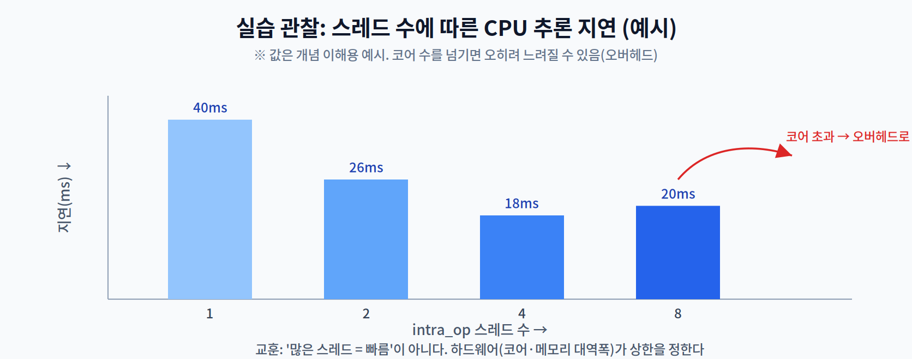

# 02주차 3교시. 내 하드웨어가 추론에 미치는 영향 관찰

**실습 목표** — 1주차에 만든 환경을 그대로 이어, **실행 공급자(하드웨어)와 스레드 설정이 추론 지연을 어떻게 바꾸는지** 직접 측정한다. 오늘의 목적은 "많은 코어 = 빠름"이라는 직관이 왜 틀릴 수 있는지 몸으로 확인하는 것이다.

> 준비물: 1주차 실습 환경(`odai` 가상환경, `onnxruntime`, `mobilenetv2.onnx`). 없으면 1주차 3교시 3.1을 먼저 수행한다.

---

## 3.1 내 기기의 하드웨어·공급자 확인 (15분)

1주차 과제였던 `get_available_providers()`를 하드웨어 매핑 관점에서 다시 본다.

```python
import onnxruntime as ort, os
print("실행 공급자:", ort.get_available_providers())
print("논리 코어 수:", os.cpu_count())
```

| 실행 공급자(Execution Provider) | 매핑되는 하드웨어 |
|------------------------------|------------------|
| `CPUExecutionProvider` | CPU (기본, 어디서나) |
| `CUDAExecutionProvider` | NVIDIA GPU (예: Jetson, 데스크톱 GPU) |
| `CoreMLExecutionProvider` | Apple Neural Engine / GPU (macOS·iOS) |
| `NnapiExecutionProvider` | 안드로이드 NPU/DSP (모바일 빌드) |
| `QNNExecutionProvider` | Qualcomm NPU(Hexagon) |

> 관찰 포인트: 목록은 "설치된 빌드가 지원하는" 공급자다(1주차에서 배운 대로). 노트북 CPU 빌드에서는 보통 `CPUExecutionProvider`만 보인다. 이 한 줄이 곧 1·2교시에서 배운 **이기종 컴퓨팅의 소프트웨어 창구**다 — 같은 모델을 어떤 유닛으로 돌릴지가 여기서 갈린다.

---

## 3.2 스레드·공급자에 따른 지연 측정 (25분)

CPU 추론에서 **intra_op 스레드 수**를 바꿔가며 지연을 측정한다. `SessionOptions`로 스레드 수를 지정할 수 있다. (아래 코드는 `mobilenetv2.onnx`가 현재 작업 디렉터리에 있어야 한다 — 없으면 1주차 3.1의 모델 내보내기를 먼저 실행한다.)

```python
import time, numpy as np, onnxruntime as ort

def bench(num_threads, runs=30):
    so = ort.SessionOptions()
    so.intra_op_num_threads = num_threads          # 연산 내부 병렬 스레드 수
    sess = ort.InferenceSession("mobilenetv2.onnx", sess_options=so,
                                providers=["CPUExecutionProvider"])
    name = sess.get_inputs()[0].name
    x = np.random.rand(1, 3, 224, 224).astype(np.float32)
    sess.run(None, {name: x})                       # 워밍업
    s = []
    for _ in range(runs):
        t0 = time.perf_counter()
        sess.run(None, {name: x})
        s.append((time.perf_counter() - t0) * 1000)
    s = np.array(s)
    return s.mean(), s.std()

for n in [1, 2, 4, 8]:
    m, sd = bench(n)
    print(f"threads={n:>2} : {m:6.1f} ms  ±{sd:.1f}")
```

전형적인 결과는 아래와 같은 곡선을 그린다.



관찰의 핵심은 세 가지다.

1. 스레드를 늘리면 처음엔 빨라진다(병렬화 이득).
2. 그러나 **물리 코어 수를 넘기면** 스레드 전환·경합 오버헤드로 오히려 느려질 수 있다.
3. 어느 순간부터는 **메모리 대역폭**이 상한이 된다 — 1교시의 Memory Wall이 실습에서 그대로 재현되는 순간이다.

> 관찰 포인트: 최적 스레드 수는 기기마다 다르다. 본인 기기의 `os.cpu_count()`와 위 결과를 비교해, "성능이 꺾이는 지점"이 코어 수 근처인지 확인한다.

---

## 3.3 과제 (10분 안내)

1. **스레드-지연 곡선** — 본인 기기에서 `threads = 1,2,4,8(가능하면 코어 수까지)` 의 평균·표준편차를 측정해 표와 그래프로 제출한다. "성능이 꺾이는 지점"을 표시하고, 그 지점을 `os.cpu_count()`와 연결해 해석한다.
2. **공급자 해석** — 본인 기기의 `get_available_providers()` 결과를 캡처하고, 각 공급자가 어떤 하드웨어에 매핑되는지 3.1 표를 참고해 설명한다. (GPU/NPU 공급자가 없다면 왜 없는지도 서술)
3. **개념 연결** — 스레드를 충분히 늘려도 더 이상 빨라지지 않는 현상을 1교시의 **Memory Wall**로 설명한다(3~4문장).
4. **다음 주 예습** — 3주차(추론 엔진)에서는 이 공급자에게 연산을 위임하는 **Delegate** 구조를 다룬다. `onnxruntime`이 그래프를 어떻게 최적화하는지 미리 검색해 온다.

> 교수님을 위한 Tip: 젯슨 등 CUDA 보드가 있으면 `providers=["CUDAExecutionProvider"]`로 같은 벤치를 돌려 CPU와 비교 데모를 보여주면 효과가 크다. 보드가 없어도 노트북만으로 "스레드가 꺾이는 지점"을 각자 발견하게 하면, 하드웨어 상한이라는 개념이 강하게 각인된다.

---

### 3교시 정리
- 실행 공급자 목록을 하드웨어 매핑으로 해석했다(이기종 컴퓨팅의 소프트웨어 창구).
- 스레드 수에 따른 지연 곡선을 측정하고, 코어 수·메모리 대역폭이 상한을 정함을 확인했다.
- 1교시의 Memory Wall이 실제 측정에서 재현됨을 관찰했다 — 다음은 이 하드웨어를 다루는 소프트웨어(추론 엔진)로 이어진다.
