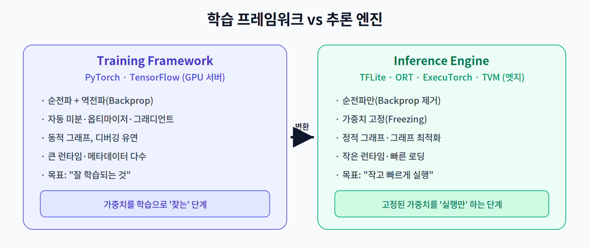
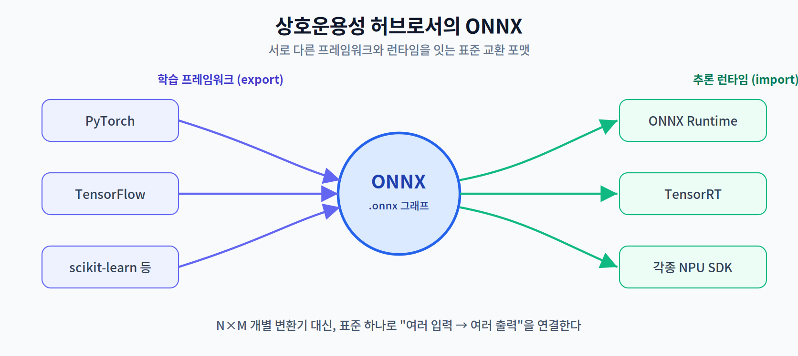

# 03주차 1교시. 추론 엔진과 모델 표현

**강의 목표** — 학습용 프레임워크(PyTorch/TF)와 추론 전용 엔진의 차이를 이해하고, 실행 전 모델이 어떤 형태로 표현·교환되는지 파악한다.

2주차가 "하드웨어"였다면, 3주차는 그 하드웨어와 모델 사이를 잇는 **소프트웨어 계층**을 다룬다. 학습이 끝난 모델은 곧바로 엣지에서 돌지 않는다. 그 사이에는 "실행에 최적화된 형태로 다시 표현하는" 과정이 있으며, 이번 교시는 그 출발점을 살핀다.

---

## 1.1 학습 프레임워크 vs 추론 엔진 (15분)

같은 신경망이라도 **학습할 때**와 **배포해 실행할 때** 요구되는 소프트웨어가 다르다.

**학습 프레임워크(PyTorch, TensorFlow)** 는 순전파와 **역전파(Backpropagation)**, 자동 미분, 옵티마이저를 모두 갖춘다. 동적 그래프로 디버깅이 유연하지만, 런타임이 무겁고 학습에만 필요한 메타데이터가 많다.

**추론 엔진(TFLite, ONNX Runtime, ExecuTorch, TVM)** 은 학습이 끝난 모델을 실행만 한다. 따라서 역전파를 제거하고 **가중치를 고정(Freezing)** 하며, 학습용 메타데이터를 걷어낸다. 그 결과 런타임이 작아지고 로딩·실행이 빨라진다.

- 역전파 제거로 그래디언트 저장 공간이 필요 없다.
- 가중치가 상수가 되므로 **정적 그래프 최적화**(2교시 주제)를 적용할 수 있다.

> 한 줄 정리: 학습 프레임워크는 "가중치를 찾는 도구", 추론 엔진은 "고정된 가중치를 작고 빠르게 실행하는 도구"다.

---

## 1.2 모델 표현식과 ONNX (20분)

프레임워크마다 모델을 저장하는 방식이 다르면, 학습(PyTorch)과 배포(어느 NPU SDK)를 연결할 때마다 전용 변환기가 필요하다. 이를 하나의 표준으로 푼 것이 **ONNX(Open Neural Network Exchange)** 다.

ONNX는 신경망을 **연산 노드의 그래프**로 표현하는 공통 포맷이다. 여러 프레임워크에서 `.onnx`로 내보내고(export), 여러 런타임에서 불러올(import) 수 있어, N개의 프레임워크와 M개의 런타임을 잇는 $N \times M$개의 개별 변환기 대신 표준 하나로 연결한다.

이 **상호운용성(Interoperability)** 덕분에 "PyTorch로 학습 → ONNX로 표준화 → 타깃에 맞는 런타임으로 배포"라는 파이프라인이 성립한다. 1주차 실습에서 이미 PyTorch 모델을 ONNX로 내보내 본 것이 바로 이 흐름의 첫 단계였다.

> 한 줄 정리: ONNX는 프레임워크와 런타임 사이의 '공용어'로, 배포 경로를 표준화한다.

---

## 1.3 왜 '그래프'로 다루는가 (개념 정리, 15분)

추론 엔진은 모델을 코드가 아니라 **연산 그래프(computational graph)**로 본다. 노드는 연산(Conv, MatMul, ReLU…), 엣지는 텐서의 흐름이다. 모델을 그래프로 표현하면 다음이 가능해진다.

- **분석** — 어떤 연산이 이어지는지 전체를 훑어 최적화 기회를 찾는다.
- **변형** — 여러 노드를 합치거나(2교시의 Fusion) 불필요한 노드를 지운다.
- **위임** — 각 노드를 어느 하드웨어(CPU/GPU/NPU)에 맡길지 결정한다(2교시의 Delegate).

즉 "그래프로 본다"는 것은 곧 "모델을 최적화·배치의 대상으로 다룬다"는 뜻이며, 이것이 추론 엔진의 본질이다.

> 교수님을 위한 Tip: 1교시 끝에 학생들에게 "왜 학습에 쓰던 PyTorch를 그대로 스마트폰에 넣으면 안 되는가?"를 물어보라. 런타임 크기, 불필요한 학습 기능, 최적화 여지를 스스로 떠올리게 하면 추론 엔진의 존재 이유가 명확해진다.

---

### 1교시 복습 질문
1. 추론 엔진이 역전파와 학습 메타데이터를 제거하면 무엇이 좋아지는가?
2. ONNX가 없다면 프레임워크 N개·런타임 M개 연결에 변환기가 몇 개 필요한가?
3. 모델을 '그래프'로 표현하면 가능해지는 세 가지 조작은?
