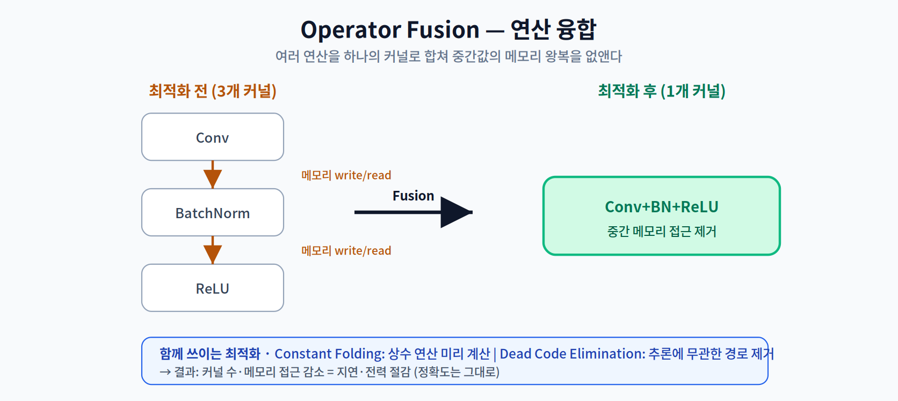
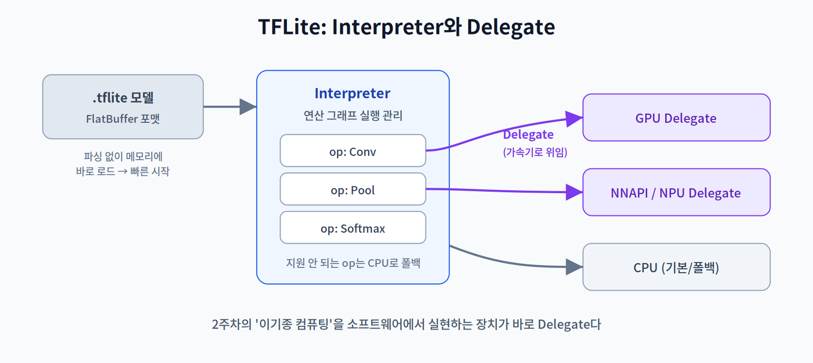
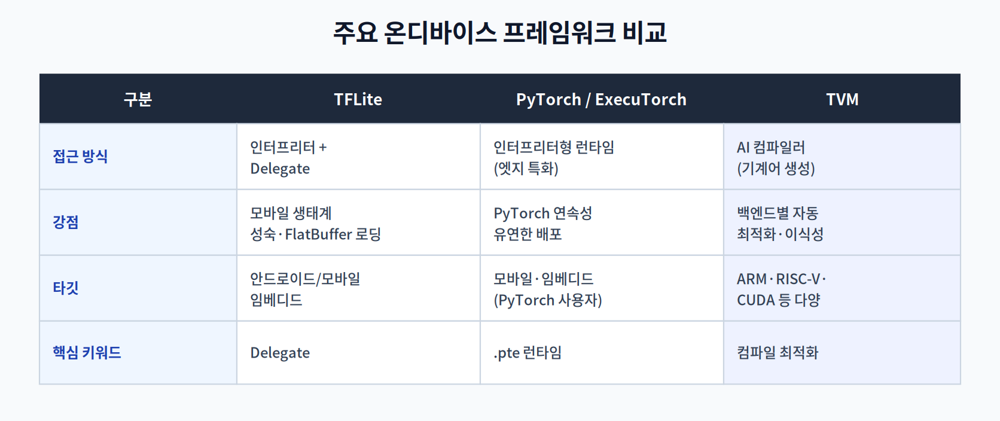

# 03주차 2교시. 주요 온디바이스 프레임워크 심층 분석

**강의 목표** — 정적 그래프 최적화의 원리를 이해하고, 업계 표준 프레임워크들의 내부 동작과 타깃별 선택 기준을 학습한다.

1교시에서 "모델을 그래프로 본다"는 관점을 세웠다. 2교시는 그 그래프에 실제로 어떤 최적화가 가해지는지, 그리고 대표 프레임워크들이 이를 어떻게 구현하는지 파고든다.

---

## 2.1 정적 그래프 최적화 3종 (20분)

가중치가 고정된 정적 그래프에서는, 실행 전에 그래프를 변형해 더 빠르게 만들 수 있다. 정확도는 그대로 두고 지연·전력만 줄이는 것이 핵심이다.

- **Operator Fusion(연산 융합)** — 연속된 여러 연산(예: `Conv → BatchNorm → ReLU`)을 하나의 커널로 합친다. 중간 결과를 메모리에 썼다가 다시 읽는 왕복이 사라진다. 2주차의 Memory Wall을 떠올리면, 이 최적화가 왜 효과적인지 분명해진다 — **연산이 아니라 메모리 접근을 줄이기** 때문이다.
- **Constant Folding(상수 접기)** — 입력과 무관하게 컴파일 타임에 계산 가능한 부분(상수끼리의 연산)을 미리 계산해 결과값으로 대체한다.
- **Dead Code Elimination(불필요 코드 제거)** — 추론 출력에 기여하지 않는 노드·경로(예: 학습 시에만 쓰이던 분기)를 제거한다.

이 세 가지는 대부분의 추론 엔진이 로딩 시 자동으로 적용하며, 3교시 실습에서 그 효과를 직접 측정한다.

> 한 줄 정리: 정적 그래프 최적화는 "같은 결과를 더 적은 커널·메모리 접근으로" 만드는 무손실 가속이다.

---

## 2.2 TensorFlow Lite 아키텍처 (15분)

**TFLite**는 모바일·임베디드에서 가장 널리 쓰이는 추론 프레임워크다. 두 가지 설계가 핵심이다.

- **FlatBuffer 포맷** — 모델을 별도 파싱 과정 없이 메모리에 그대로 매핑해 로드한다. 덕분에 시작 지연(startup latency)이 짧고 메모리 사용이 적다.
- **Interpreter와 Delegate** — Interpreter가 연산 그래프의 실행을 관리하고, **Delegate**는 특정 연산들을 하드웨어 가속기(GPU/NPU)로 **위임(offload)** 한다. 가속기가 지원하지 않는 연산은 CPU로 폴백된다.

이 **Delegate**가 바로 2주차 3교시에서 예고한 개념이다. 2주차의 이기종 컴퓨팅(CPU/GPU/DSP/NPU 분담)을 소프트웨어에서 실현하는 장치가 Delegate다. 예로 GPU Delegate, NNAPI Delegate(안드로이드; 다만 NNAPI는 최신 안드로이드에서 단계적으로 축소되는 추세다), 각 벤더의 NPU Delegate가 있다.

> 한 줄 정리: TFLite의 두 축은 '빠른 로딩(FlatBuffer)'과 '가속기 위임(Delegate)'이다.

---

## 2.3 ExecuTorch와 TVM — 두 가지 접근 (15분)

- **PyTorch Edge / ExecuTorch** — PyTorch로 학습한 모델을 모바일·임베디드에서 실행하기 위한 PyTorch 진영의 최신 런타임이다. PyTorch 개발 경험의 연속성을 유지하면서 엣지 배포 효율을 확보하려는 전략으로, 내보낸 모델(`.pte`)을 경량 런타임으로 실행한다.
- **TVM (Apache TVM)** — 앞의 둘이 **인터프리터** 계열이라면, TVM은 **AI 컴파일러** 접근이다. 모델 그래프를 타깃 백엔드(ARM, RISC-V, CUDA 등)에 맞는 기계어로 **미리 컴파일**해 최적화한다. 이식성과 백엔드별 자동 튜닝이 강점이며, 이 컴파일러 관점은 12주차 하드웨어 가속기 프로그래밍에서 다시 심화된다.

**인터프리터 vs 컴파일러**는 이번 교시의 큰 대비축이다. 인터프리터는 실행 시점에 연산을 해석해 유연하고, 컴파일러는 미리 기계어를 생성해 최고(peak) 성능을 노린다. (엄밀히 ExecuTorch는 순수 인터프리터가 아니라, 사전 export(AOT)와 백엔드 위임을 결합한 형태다. 여기서는 'TVM식 완전 컴파일'과 대비하기 위한 단순화임을 밝혀둔다.)

> 한 줄 정리: TFLite/ExecuTorch는 '실행 시 해석(인터프리터)', TVM은 '사전 컴파일(컴파일러)' 접근으로 갈린다.

---

## 2.4 IoT 프로토콜과의 연동 (10분)

온디바이스 추론의 결과는 그 자체로 끝이 아니라, IoT 시스템의 입력이 된다. 추론값과 신뢰도(confidence)를 **MQTT**나 **Matter** 같은 프로토콜의 페이로드로 구성해 다른 기기·허브로 전달하는 설계가 필요하다.

- **MQTT** — 경량 발행/구독(pub/sub) 메시징 프로토콜로, 저대역폭·불안정 네트워크의 IoT에 적합하다.
- **Matter** — 스마트홈 기기 상호운용 표준으로, 서로 다른 제조사 기기의 연동을 표준화한다.

예컨대 엣지 카메라가 "불량 검출: 0.93"을 추론하면, 이 결과를 MQTT 토픽으로 발행해 상위 제어 시스템이 구독·대응하는 식이다. 추론과 통신을 하나의 파이프라인으로 보는 시각이 AIoT(AI+IoT) 시스템 설계의 출발점이다.

### 3주차 핵심 키워드
- **Inference Engine** — 최적화된 모델을 타깃 장치에서 실행하는 런타임 소프트웨어.
- **Operator Fusion** — 메모리 대역폭 절약을 위해 연산 레이어를 통합하는 기술.
- **Delegate** — CPU 연산을 전용 가속기(NPU/GPU)로 넘겨주는 중계 역할.
- **Serialization** — 모델 구조와 가중치를 저장 가능한 형태(TFLite, ONNX 등)로 변환하는 과정.

> 교수님을 위한 Tip: 학생들이 직접 PyTorch 모델을 ONNX로, 다시 TFLite/TensorRT로 변환하는 과제를 시작하기 좋은 시점이다. 변환 전후 그래프를 **Netron**(모델 시각화 도구)으로 열어 보게 하면, Fusion 등 그래프 최적화가 구조를 어떻게 바꾸는지 눈으로 확인할 수 있다.

---

### 2교시 복습 질문
1. Operator Fusion이 지연을 줄이는 근본 원리를 2주차 Memory Wall과 연결해 설명하라.
2. TFLite에서 FlatBuffer와 Delegate가 각각 해결하는 문제는?
3. 인터프리터(TFLite/ExecuTorch)와 컴파일러(TVM) 접근의 장단점을 비교하라.
