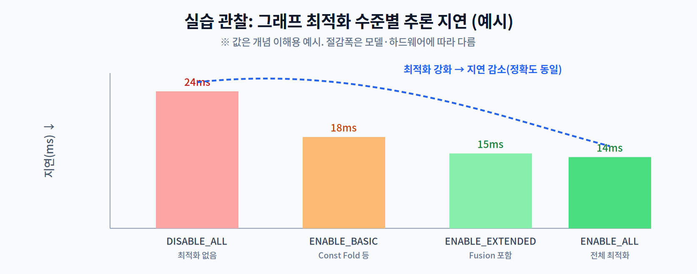

# 3주차 3교시. 그래프 최적화를 눈과 숫자로 확인하기

**실습 목표** — 모델을 ONNX로 변환해 **그래프 구조를 시각화**하고, 추론 엔진의 **그래프 최적화 수준**을 바꿔가며 지연이 어떻게 줄어드는지 직접 측정한다. 2교시에서 배운 Fusion·Folding이 실제로 성능으로 이어짐을 확인한다.

> 준비물: 1~2주차 실습 환경(`odai`, `onnxruntime`, `mobilenetv2.onnx`). 없으면 1주차 3.1의 모델 내보내기를 먼저 수행한다.

---

## 3.1 PyTorch→ONNX 변환·시각화 (15분)

1주차에서 내보낸 `mobilenetv2.onnx`를 **Netron**으로 열어 그래프를 눈으로 본다. Netron은 설치 없이 브라우저(https://netron.app)에서 `.onnx` 파일을 열 수 있는 모델 시각화 도구다.

```python
# (1주차에서 이미 내보냈다면 생략 가능)
import torch, torchvision
m = torchvision.models.mobilenet_v2(weights="DEFAULT").eval()
torch.onnx.export(m, torch.randn(1,3,224,224), "mobilenetv2.onnx",
                  input_names=["input"], output_names=["logits"], opset_version=13)
```

그래프를 열면 `Conv → BatchNorm → ReLU`처럼 연산 노드가 사슬로 이어진 것을 볼 수 있다. 2교시에서 배운 **Fusion 대상**이 바로 이런 연속 구간이다. 최적화 후 그래프와 비교하기 위해, 아래에서 ONNX Runtime이 최적화한 그래프를 파일로 저장한다.

```python
import onnxruntime as ort
so = ort.SessionOptions()
so.graph_optimization_level = ort.GraphOptimizationLevel.ORT_ENABLE_ALL
so.optimized_model_filepath = "mobilenetv2_opt.onnx"   # 최적화된 그래프 저장
ort.InferenceSession("mobilenetv2.onnx", sess_options=so,
                     providers=["CPUExecutionProvider"])
print("저장: mobilenetv2_opt.onnx  → Netron으로 원본과 비교해 보라")
```

> 관찰 포인트: `mobilenetv2_opt.onnx`를 Netron으로 열면 노드 수가 줄고 일부 연산이 합쳐진 것을 확인할 수 있다. "그래프가 변형된다"는 2교시 개념이 파일로 실체화되는 순간이다.

---

## 3.2 그래프 최적화 수준별 지연 비교 (25분)

ONNX Runtime은 최적화 강도를 4단계로 제공한다. 단계를 바꿔가며 지연을 측정한다.

```python
import time, numpy as np, onnxruntime as ort

LEVELS = {
    "DISABLE_ALL":      ort.GraphOptimizationLevel.ORT_DISABLE_ALL,
    "ENABLE_BASIC":     ort.GraphOptimizationLevel.ORT_ENABLE_BASIC,
    "ENABLE_EXTENDED":  ort.GraphOptimizationLevel.ORT_ENABLE_EXTENDED,
    "ENABLE_ALL":       ort.GraphOptimizationLevel.ORT_ENABLE_ALL,
}

def bench(level, runs=30):
    so = ort.SessionOptions()
    so.graph_optimization_level = level
    so.intra_op_num_threads = 1          # 스레드 변수를 고정해 최적화 효과만 관찰
    sess = ort.InferenceSession("mobilenetv2.onnx", sess_options=so,
                                providers=["CPUExecutionProvider"])
    name = sess.get_inputs()[0].name
    x = np.random.rand(1,3,224,224).astype(np.float32)
    sess.run(None, {name: x})            # 워밍업
    s = []
    for _ in range(runs):
        t0 = time.perf_counter(); sess.run(None, {name: x})
        s.append((time.perf_counter()-t0)*1000)
    return np.mean(s), np.std(s)

for label, lv in LEVELS.items():
    m, sd = bench(lv)
    print(f"{label:16s}: {m:6.1f} ms  ±{sd:.1f}")
```

전형적으로 최적화를 강화할수록 지연이 줄어드는 경향을 보인다.



관찰의 핵심:

1. `DISABLE_ALL` → `ENABLE_ALL`로 갈수록 지연이 줄어든다(무손실 가속).
2. 절감폭은 모델·하드웨어에 따라 다르다. 이미 단순한 모델은 차이가 작을 수 있다.
3. **정확도는 변하지 않는다** — 같은 출력을 더 적은 연산으로 낼 뿐이다(4~6주차의 '손실 있는' 경량화와 대비되는 지점).

> 관찰 포인트: 스레드 수를 1로 고정한 이유는, 2주차에서 본 스레드 효과와 이번 최적화 효과가 섞이지 않게 하기 위해서다. 변수를 하나만 바꿔야 인과가 분명해진다.

---

## 3.3 과제 (10분 안내)

1. **최적화-지연 표** — 4개 최적화 수준의 평균·표준편차를 측정해 표로 제출하고, `DISABLE_ALL` 대비 `ENABLE_ALL`의 절감률(%)을 계산한다.
2. **그래프 비교** — `mobilenetv2.onnx`와 `mobilenetv2_opt.onnx`를 Netron으로 열어, 노드 수 변화와 합쳐진 연산 한 사례를 캡처해 설명한다.
3. **개념 연결** — 이번 실습의 '무손실 최적화'와, 4주차부터 배울 '손실을 감수하는 경량화(프루닝·양자화)'의 차이를 3~4문장으로 정리한다.
4. **다음 주 예습** — 4주차(프루닝)에서는 파라미터를 실제로 제거한다. "0을 많이 만들면 왜 무조건 빨라지지는 않는가?"를 미리 생각해 온다.

> 교수님을 위한 Tip: 최적화 전후 Netron 그래프를 나란히 스크린샷으로 띄워 보여주면 효과가 크다. 특히 `Conv+BN`이 하나로 접힌(fold) 사례를 짚어주면, 2교시의 Fusion이 추상 개념이 아니라 실제 파일의 변화임을 학생들이 체감한다.

---

### 3교시 정리
- 모델을 ONNX로 변환하고 Netron으로 그래프를 시각화했다.
- 그래프 최적화 수준을 바꿔 지연 변화를 측정하고, 정확도 불변의 무손실 가속을 확인했다.
- 다음 주부터는 정확도를 일부 내주고 더 큰 압축을 얻는 '손실 경량화'로 넘어간다.
