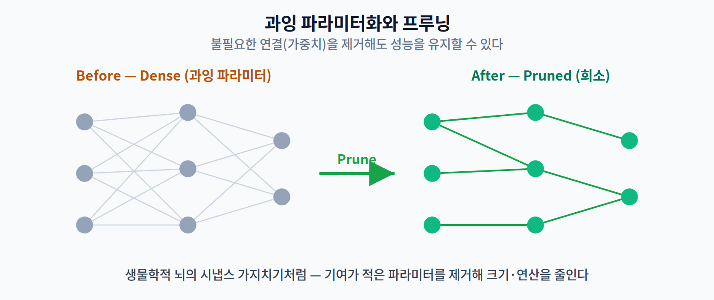
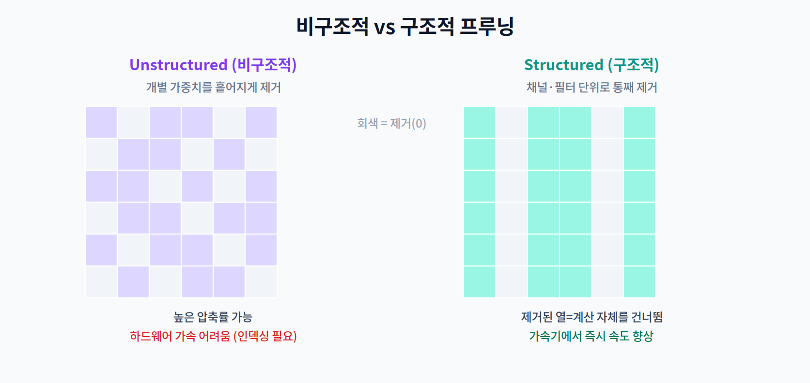

# 04주차 1교시. 프루닝의 원리

**강의 목표** — 모델의 성능을 최대한 유지하면서 불필요한 파라미터를 식별·제거하는 이유와 큰 그림을 이해한다.

3주차까지의 최적화(그래프 최적화)는 **정확도를 전혀 바꾸지 않는 무손실** 기법이었다. 4주차부터는 성격이 달라진다. 정확도를 **약간 내주는 대신** 훨씬 큰 압축을 얻는 **손실 경량화(lossy compression)**의 세계로 들어간다. 그 첫 번째가 **프루닝(Pruning, 가지치기)**이다.

---

## 1.1 왜 프루닝인가 (10분)

심층 신경망은 대개 **과잉 파라미터화(Over-parameterization)** 되어 있다. 학습을 잘 시키기 위해 필요 이상으로 많은 파라미터를 두는데, 학습이 끝나고 나면 그중 상당수는 출력에 거의 기여하지 않는다.

이는 생물학적 뇌의 **시냅스 가지치기(synaptic pruning)** 와 닮았다. 뇌는 성장하면서 잘 쓰지 않는 시냅스를 제거해 효율을 높인다. 인공 신경망도 마찬가지로, 기여가 적은 가중치를 제거하면 모델 크기와 연산량을 줄이면서 성능은 대부분 유지할 수 있다.

프루닝의 이득은 세 가지다: 모델 저장 크기 감소, 연산량(부동소수점 연산 수, FLOPs) 감소, 그리고 (조건이 맞으면) 추론 속도 향상. 다만 마지막 "속도 향상"은 공짜가 아니며, 그 조건이 이번 주의 핵심 주제다.

> 한 줄 정리: 프루닝은 "학습엔 필요했지만 추론엔 불필요한" 파라미터를 덜어내는 손실 경량화의 출발점이다.

---

## 1.2 프루닝의 분류 (25분)

무엇을 단위로 제거하느냐에 따라 프루닝은 크게 둘로 나뉜다. 이 구분이 **하드웨어 가속 여부**를 결정하므로 매우 중요하다.

- **비구조적 프루닝(Unstructured Pruning)** — 가중치 행렬 내의 **개별 요소**를 제거한다. 위치에 제약이 없어 매우 높은 압축률을 얻을 수 있다. 그러나 0이 불규칙하게 흩어져 있어, 실제로 연산을 건너뛰려면 "어디가 0인지"를 가리키는 **인덱싱(indexing)** 이 필요하다. 이 오버헤드 때문에 일반 하드웨어에서는 압축률만큼 빨라지지 않는다.
- **구조적 프루닝(Structured Pruning)** — 필터(Filter), 채널(Channel), 레이어(Layer) 같은 **덩어리 단위**로 제거한다. 열 하나가 통째로 사라지면 그 계산 자체를 건너뛰면 되므로, 가속기에서 **즉각적인 속도 향상**으로 이어진다. 대신 덩어리 단위라 같은 압축률에서 정확도 손실이 더 클 수 있다.

여기서 2주차의 교훈이 다시 등장한다. 하드웨어는 규칙적인 데이터 흐름을 좋아한다. 그래서 "얼마나 많이 지웠나(압축률)"보다 "하드웨어가 활용할 수 있는 형태로 지웠나(구조)"가 실제 속도를 좌우한다.

> 한 줄 정리: 비구조적은 압축률, 구조적은 속도. 무엇을 지우느냐가 아니라 어떻게 지우느냐가 성능을 가른다.

---

## 1.3 중요도 기준 개관 (Saliency) (15분)

"어떤 파라미터를 지울 것인가"를 정하려면 각 파라미터의 **중요도(Saliency)** 를 매겨야 한다. 대표적 기준은 세 가지이며, 2교시에서 수식으로 깊이 다룬다.

- **Magnitude(크기 기반)** — 절댓값이 작은 가중치부터 제거. 가장 단순하고 빠른 기본선.
- **Taylor 전개 기반** — 그 파라미터를 지웠을 때 **손실 함수가 얼마나 변하는지**를 미분으로 근사해 중요도를 매김.
- **Sensitivity(민감도) 분석** — 특정 레이어를 제거했을 때 전체 성능 하락폭을 측정해, 레이어별로 얼마나 자를지 배분.

> 교수님을 위한 Tip: 1교시 끝에 "왜 그냥 크기가 작은 가중치를 지우면 안 될 때가 있을까?"를 던져보라. 크기가 작아도 특정 입력에서 결정적 역할을 하는 가중치가 있음을 상기시키면, 2교시의 Taylor·Sensitivity 기준의 필요성으로 자연스럽게 이어진다.

---

### 1교시 복습 질문
1. 3주차의 무손실 최적화와 이번 프루닝의 근본적 차이는?
2. 같은 50% 제거인데 비구조적이 구조적보다 보드에서 느릴 수 있는 이유는?
3. Magnitude 기준의 가정과 그 한계는 무엇인가?
