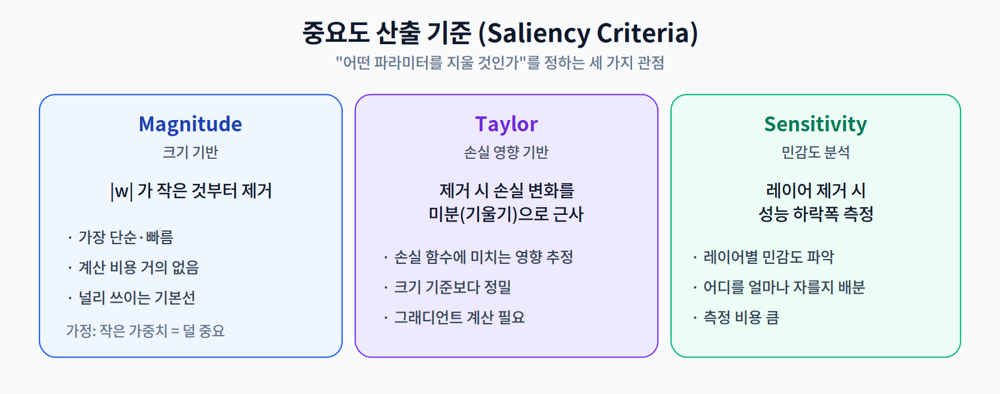
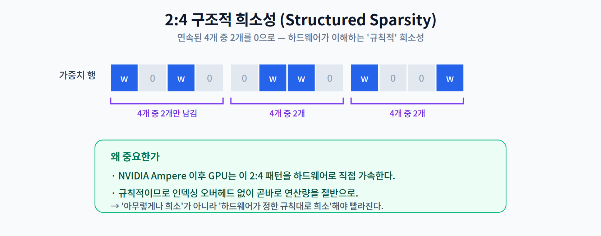
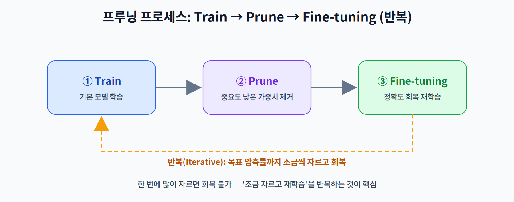

# 4주차 2교시. 하드웨어 가속과 최신 연구

**강의 목표** — 중요도 산출을 수식으로 이해하고, 알고리즘적으로 제거된 파라미터가 실제 하드웨어에서 어떻게 성능(Latency)으로 치환되는지 학습한다.

1교시가 "무엇을·왜 지우나"였다면, 2교시는 "어떻게 정밀하게 지우고, 그것이 하드웨어에서 실제로 빨라지는가"이다.

---

## 2.1 중요도 산출 수식 (20분)

- **Magnitude 기반** — 가중치의 절댓값 $|w|$ 이 작은 것부터 제거한다. 가정은 "작은 가중치는 출력 기여가 작다"이다. 계산 비용이 거의 없어 가장 널리 쓰이지만, 크기가 작아도 중요한 가중치를 놓칠 수 있다.
- **Taylor 전개 기반** — 어떤 가중치 $w_i$ 를 0으로 만들 때 손실 $L$ 이 얼마나 변하는지를 근사한다. 손실을 $w_i$ 에 대해 전개하면 1차 항으로 그 영향력을 추정할 수 있다:

  $$\Delta L \approx \left| \frac{\partial L}{\partial w_i} \cdot w_i \right|$$

  즉 **그래디언트와 가중치의 곱**으로 중요도를 매긴다. 크기만 보는 것보다 "손실에 미치는 실제 영향"을 반영하므로 더 정밀하지만, 그래디언트 계산이 필요하다.
- **Sensitivity 분석** — 레이어를 하나씩 제거(또는 크게 압축)해 보며 전체 성능 하락폭을 측정한다. 어떤 레이어는 많이 잘라도 견디고, 어떤 레이어는 조금만 잘라도 무너진다. 이 정보로 **레이어별 프루닝 비율**을 배분한다.

> 한 줄 정리: 크기(Magnitude)는 싸고 거칠고, Taylor는 손실 영향을 반영해 정밀하며, Sensitivity는 '어디를 얼마나' 자를지 배분한다.

---

## 2.2 Sparsity와 하드웨어 아키텍처 (20분)

프루닝의 결과는 **희소 행렬(Sparse Matrix)**, 즉 0이 많은 행렬이다. 그런데 0을 많이 만드는 것과 실제로 빨라지는 것은 별개다.

문제는 **인덱싱 오버헤드**다. 비구조적 희소 행렬에서 연산을 실제로 건너뛰려면 "0이 아닌 값이 어디에 있는지"를 별도로 저장·조회해야 한다. 이 부가 비용이 절약분을 상쇄해, 일반 하드웨어에서는 압축률만큼 빨라지지 않는다.

해결책은 **규칙적인 희소성**이다. 대표 사례가 NVIDIA Ampere 아키텍처의 **2:4 구조적 희소성(2:4 Structured Sparsity)** 이다.

연속된 4개 원소 중 정확히 2개를 0으로 만드는 이 규칙적 패턴은, 하드웨어가 "어디가 0인지"를 이미 알고 있으므로 인덱싱 없이 곧바로 연산량을 절반으로 줄인다. 즉 **'아무렇게나 희소'가 아니라 '하드웨어가 정한 규칙대로 희소'** 해야 실제 가속을 얻는다 — 2주차의 SW/HW Co-design이 다시 확인되는 지점이다.

> 한 줄 정리: Sparsity가 속도가 되려면 하드웨어가 이해하는 '구조'를 가져야 한다(예: 2:4 패턴).

---

## 2.3 Lottery Ticket 가설 (15분)

프루닝은 단순한 공학 기법을 넘어 흥미로운 학문적 질문으로 이어진다. **로또 복권 가설(Lottery Ticket Hypothesis, Frankle & Carbin, 2019)** 이 대표적이다.

핵심 주장은 이렇다. "무작위로 초기화된 거대한 네트워크 안에는, **학습 초기의 초기값을 그대로 가진 채로도** 원본과 비슷한 성능까지 학습될 수 있는 작은 부분망(subnetwork)이 존재한다." 이 운 좋은 부분망을 '당첨된 복권(winning ticket)'에 비유한다.

이 가설은 "왜 큰 모델을 학습한 뒤 프루닝하는 것이, 처음부터 작은 모델을 학습하는 것보다 잘 되는가?"에 대한 통찰을 준다. 대학원 세미나에서 재현성·일반화를 둘러싼 후속 연구를 함께 논하기 좋은 주제다.

> 한 줄 정리: 거대 네트워크 안에 '이미 잘 될 준비가 된' 작은 부분망이 숨어 있다는 것이 로또 복권 가설이다.

---

## 2.4 프루닝 프로세스 (5분)

실무에서 프루닝은 한 번에 끝나지 않는다. `학습(Train) → 제거(Prune) → 미세조정(Fine-tuning)` 을 **반복**한다. 한 번에 많이 자르면 회복 불가능한 손상이 생기므로, 조금 자르고 재학습으로 정확도를 회복하기를 목표 압축률에 도달할 때까지 되풀이한다.

### 4주차 핵심 키워드
- **Sparsity(희소성)** — 0인 값의 비율.
- **Fine-tuning** — 가지치기 후 손실된 정확도를 회복하기 위한 재학습.
- **Structured vs Unstructured** — 하드웨어 친화성이 갈리는 제거 방식의 차이.
- **Saliency** — 파라미터가 결과에 기여하는 '중요도'.

> 교수님을 위한 Tip: "압축률 50% 비구조적 모델이 왜 내 젯슨에서 압축률 30% 구조적 모델보다 느린가?"를 핵심 질문으로 던져라. 이론적 파라미터 감소가 곧 속도가 아니라는 점을 짚으면, SW/HW 통합 설계의 필요성을 깊이 이해하게 된다.

---

### 2교시 복습 질문
1. Taylor 기반 중요도가 Magnitude보다 정밀할 수 있는 이유를 수식으로 설명하라.
2. 2:4 sparsity가 인덱싱 오버헤드 없이 가속되는 원리는?
3. Lottery Ticket 가설이 "선(先)학습 후(後)프루닝" 관행을 어떻게 정당화하는가?
