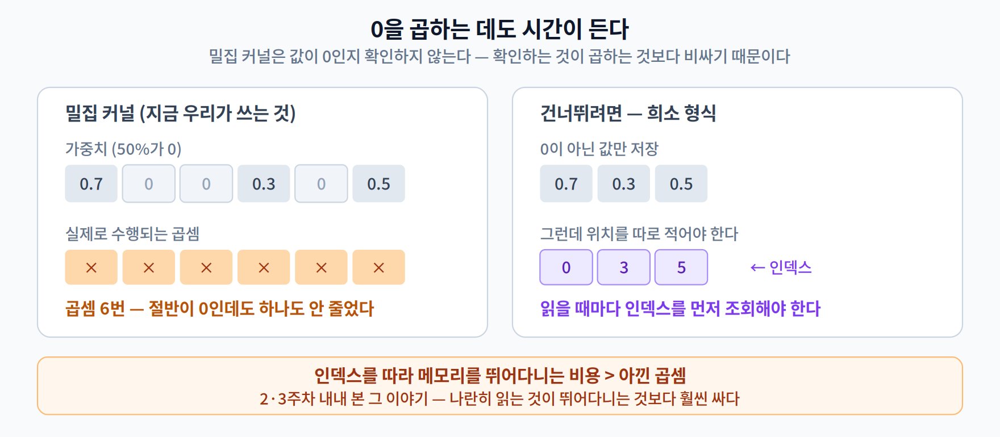

# 04주차 2교시. 0을 많이 만들었는데 왜 안 빨라질까

**오늘의 질문** — 가중치의 절반을 0으로 만들었다. 곱셈의 절반이 `0 × 무언가`가 되었으니 절반은 안 해도 되는 것 아닌가? 그런데 왜 시간은 그대로일까?

1교시가 **"무엇을 왜 지우나"** 였다면, 2교시는 **"지운 것이 왜 성능이 되지 않는가, 그리고 어떻게 해야 되는가"** 다. 3교시 실측을 이해할 준비를 하는 시간이다.

---

## 2.1 0을 곱하는 데도 시간이 든다 (15분)

버스를 떠올려 보자. 45인승 버스에 승객이 5명뿐이다. 40자리가 비었다. 그렇다고 **버스가 더 빨리 달리지는 않는다.** 버스는 여전히 45인승 버스고, 같은 엔진으로 같은 무게를 끌고 간다.

행렬 곱셈이 정확히 이렇다.



**① 밀집 커널은 값을 보지 않는다**

우리가 쓰는 행렬 곱셈 루틴(**밀집 커널**, dense kernel — 3주차 2.1에서 구분한 그 '커널'이다. 합성곱 필터가 아니다)은 정해진 크기의 행렬을 받아 **모든 원소를 순서대로** 곱한다. 값이 0인지 아닌지 **확인하지 않는다.** 왜 확인하지 않을까? 이유가 둘이다.

**(가) 확인해서 건너뛰어도 아낄 게 별로 없다.** 2주차의 숫자를 떠올려 보자. 부동소수점 곱셈 한 번은 **3.7 pJ**인데, 그 값을 메모리에서 가져오는 데는 **훨씬 더 든다**(온칩 SRAM 5 pJ — 2주차의 그 '냉장고' — DRAM까지 가면 640 pJ). 그런데 **곱셈을 건너뛰어도 값은 어차피 읽어야 한다** — 읽어 봐야 0인지 알 수 있으니까. 비싼 쪽(이동)은 그대로 두고 싼 쪽(곱셈)만 아끼는 셈이라, 이득이 거의 없다.

**(나) 확인하는 순간 벡터화가 깨진다.** 이게 더 결정적이다. 3주차에서 배운 **SIMD** — 한 삽에 8개씩 퍼 담아 한꺼번에 곱하는 방식 — 을 떠올려 보자. 그런데 "이 값이 0이면 건너뛴다"는 분기를 원소마다 넣으면, **8개를 한 삽에 담을 수가 없다.** 값마다 갈 길이 달라지기 때문이다. 게다가 **어느 쪽으로 갈지 예측이 빗나가면** CPU는 그때까지 미리 해 두던 일을 버리고 수십 번의 계산 기회를 날린다. 반면 **곱하고 더하기 한 번**(2주차의 그 MAC, 하드웨어에서는 FMA라 부른다)은 거의 공짜다.

**그래서 그냥 곱해 버린다.** 45인승 버스를 45인승 그대로 굴리는 게, **빈자리를 하나하나 확인해 가며 건너뛰는 것**보다 빠른 것이다.

(눈치 빠른 학생은 여기서 물을 것이다 — *"그럼 아예 더 작은 버스로 바꾸면 되지 않나?"* 맞다. 그게 **구조적 프루닝**이고, 3교시에서 그게 통한다는 걸 본다.)

**② 건너뛰려면 어디가 0인지 미리 알아야 한다**

그럼 미리 기록해 두면 되지 않을까? 그게 **희소 행렬 형식**(CSR, Compressed Sparse Row 등)이다. 0이 아닌 값만 저장하고, 그 값들이 원래 어느 위치에 있었는지를 **인덱스로 따로 적어 둔다.**

그런데 여기서 비용이 뒤집힌다. 값 하나를 쓰려면 **인덱스를 먼저 읽어야** 하고, 그 인덱스를 따라 **메모리를 건너뛰며** 접근해야 한다. 2주차·3주차 내내 배운 그 이야기다 — **메모리를 뛰어다니는 접근은 나란히 읽는 것보다 훨씬 비싸다.** 3주차의 NCHWc가 정확히 그 반대 방향의 최적화였다.

그래서 **얼마나 희소해야 희소 형식이 이기는가**라는 손익분기점이 생긴다. 그리고 이 지점은 **고정된 숫자가 아니라 커널을 얼마나 잘 만들었느냐에 달려 있다.**

- **범용 희소 라이브러리**를 그냥 쓰면 손익분기점이 아주 높다 — 흔히 **99% 근처**라고 이야기된다.
- 반면 **그 하드웨어에 맞춰 손으로 다듬은 희소 커널**을 쓰면 훨씬 내려온다. Elsen 등의 *Fast Sparse ConvNets*(CVPR 2020)는 모바일 ARM CPU에서 **70~90% 희소성 구간에서 밀집 대비 1.1~2.2배**를 보고했다.

**즉 "희소성은 소용없다"가 아니라, "그 희소성을 살릴 커널이 있느냐"가 문제다.** 우리가 3교시에서 쓸 PyTorch 기본 경로에는 그런 커널이 없고, 그래서 아무 이득도 못 본다.

**③ 게다가 `prune`은 가중치를 지우지도 않는다**

덧붙여, PyTorch의 `prune` 모듈이 실제로 하는 일은 **가중치를 지우는 것이 아니다.** 무엇을 하는지는 3교시에서 파일 크기를 재면서 직접 확인한다 — 거기서 꽤 놀라게 된다.

> **한 줄 정리:** 0을 만드는 것과 그 0을 **건너뛰는 것**은 완전히 다른 일이다. 프루닝은 앞의 것만 한다.

---

## 2.2 하드웨어가 정한 규칙대로 지우기 (13분)

그럼 방법이 없나? 있다. **하드웨어가 미리 알고 있는 규칙대로 지우면** 인덱스가 필요 없어진다.

대표 사례가 NVIDIA가 Ampere 세대부터 도입한 **2:4 구조적 희소성**이다.


규칙은 단순하다. **연속된 4개 중 적어도 2개를 0으로 만든다.** 바꿔 말하면 **0이 아닌 값이 4개 중 최대 2개**다(3개나 4개가 0인 것도 규칙 위반이 아니다). 하드웨어가 활용하는 희소성은 이 **50%가 상한**이 된다.

왜 이게 통하는가?

- 하드웨어가 **"4개 중 살아남는 건 많아야 둘"** 이라는 사실을 **이미 알고 있다.** 그러니 "어디가 0인지"를 일반적인 인덱스로 적을 필요가 없다 — 살아남은 값이 4자리 중 어디였는지만 알면 되고, 그건 **값 하나당 2비트**면 충분하다.
- 전용 회로(**Sparse Tensor Core**)가 그 짧은 정보를 보고 **곱할 것만 골라 넣는다.** 인덱스를 따라 메모리를 뛰어다닐 일이 없다.

대신 대가가 있다. **자유롭게 못 지운다.** "이 4개 중에는 셋 다 중요한데" 싶어도 규칙상 둘은 0으로 만들어야 한다. 1교시의 비구조적 프루닝이 가졌던 **"가장 덜 중요한 것만 골라 지운다"** 는 자유를 반납한 셈이다.

**이것이 이번 주가 3주차와 이어지는 지점이다.**

> 3주차 — 노드를 줄인 게 아니라 **데이터 배치**를 하드웨어에 맞췄더니 빨라졌다.
> 4주차 — 많이 지운 게 아니라 **지우는 패턴**을 하드웨어에 맞췄더니 빨라진다.

둘 다 같은 문장의 변주다. **하드웨어가 좋아하는 규칙성을 지켜야 성능이 나온다.** 1주차에 이름만 들었던 **SW/HW Co-design**이 구체적으로 무슨 뜻인지, 이제 세 번째 사례를 본 셈이다.

> **[더 깊이 — 선택]** 2:4는 아무 하드웨어에서나 되는 게 아니다. **Sparse Tensor Core를 가진 NVIDIA GPU**(Ampere 이후)에서, 그리고 **그 경로를 지원하는 라이브러리를 통해** 실행할 때만 이득이 난다. 엣지에서 쓰는 ARM CPU나 대부분의 모바일 NPU에는 이런 회로가 없다. 그래서 **"논문에서 2배 빨라졌다"는 결과가 내 보드에서 재현되지 않는** 상황이 흔하다. 그 논문이 어느 하드웨어에서 측정했는지를 먼저 확인하는 습관이 필요하고, 13주차의 비판적 리뷰에서 이 점을 정면으로 다룬다.

> **한 줄 정리:** 희소성이 속도가 되려면 **하드웨어가 이해하는 구조**를 가져야 한다. 자유를 반납하고 규칙을 얻는 거래다.

---

## 2.3 한 번에 자르지 않는다 (11분)

또 하나 실무적인 이야기. 프루닝은 **한 번에 끝내지 않는다.**

옷장 정리를 생각해 보자. 안 입는 옷을 한 번에 절반 버리면 나중에 꼭 필요한 게 없어 곤란해진다. 조금 버리고 지내 보고, 또 조금 버리고 지내 보는 편이 안전하다.


```
학습(Train) → 제거(Prune) → 미세조정(Fine-tune) → 다시 제거 → …
```

**미세조정(Fine-tuning)** 이 핵심이다. 가중치를 지우면 남은 가중치들의 균형이 깨진다. 그 상태로 조금 더 학습시키면, 남은 가중치들이 **사라진 것들의 역할을 나눠 맡도록** 재조정된다.

왜 이게 통할까? 자른 직후의 모델은 **균형이 깨진 상태**다. 사라진 가중치가 하던 일을 아무도 안 맡고 있다. 조금 더 학습시키면 남은 가중치들이 그 빈자리를 나눠 맡는다.

효과가 얼마나 큰지는 3교시에서 직접 보게 되는데, 미리 감만 말해 두면 이렇다. **정확도가 90% 아래로 떨어진 모델이 미세조정 몇 번으로 원본 수준까지 돌아온다.**

그래서 실무에서 가장 자주 나오는 실수가 이것이다.

> **자른 직후의 정확도로 판단해 버리는 것.** 88%를 보고 "이 압축률은 못 쓰겠다"고 결론 내리면, 쓸 수 있었을 모델을 버리는 셈이다.

> **한 줄 정리:** 자르고 → 회복시키기를 **반복**한다. **자른 직후의 숫자는 최종 성적표가 아니다.**

---

## 2.4 큰 걸 자르는 게 정말 나은가 (11분)

여기서 자연스러운 의문이 하나 생긴다.

> 어차피 작은 모델을 쓸 거면, **처음부터 작은 모델을 학습시키면** 되지 않나? 왜 굳이 큰 걸 학습시켜서 자르나?

오랫동안 **"큰 걸 학습시켜 자른 쪽이 낫다"** 가 현장의 통념이었다. 왜 그럴까?

**로또 복권 가설(Lottery Ticket Hypothesis, Frankle & Carbin, 2019)** 이 이에 대한 유명한 설명을 내놓았다.

> 무작위로 초기화된 큰 네트워크 안에는, **처음 뽑힌 초기값을 그대로 가진 채로도** 원본만큼 잘 학습될 수 있는 **작은 부분망**이 이미 들어 있다.

복권에 비유한 이름이다. 큰 네트워크를 학습시키는 것은 **복권을 많이 사는 것**과 같다. 그중 어딘가에 **당첨된 조합(winning ticket)** 이 들어 있고, 프루닝은 그 당첨 복권을 **찾아내는 과정**이라는 것이다. 처음부터 작은 모델을 만드는 건 복권을 몇 장만 사는 셈이라, 당첨 조합이 들어 있을 확률이 낮다.

이 가설이 특히 흥미로운 건 **초기값까지 되돌린다**는 조건이다. 찾아낸 부분망을 **학습 전의 그 초기값으로 리셋한 뒤** 다시 학습시켜야 잘 된다는 것이, 원래 논문의 핵심 주장이었다. 구조만 중요한 게 아니라 **"어느 자리에서 출발했는가"** 도 중요하다는 뜻이 된다.

**그런데 여기서 멈추면 안 된다.** 이 가설도, 그 앞의 통념도, **둘 다 아직 논쟁 중이다.**

가설 쪽은 요즘 쓰는 큰 이미지 분류 모델과 대규모 데이터에서는 원래 방식대로 잘 재현되지 않았다. 통념 쪽은 더 정면으로 반박당했다 — **"잘라서 미세조정한 모델이, 같은 구조를 처음부터 학습시킨 것보다 나을 게 없다"** 는 결과가 나온 것이다.

그 반박이 남긴 질문이 오히려 더 흥미롭다.

> **프루닝이 우리에게 찾아 주는 것은 좋은 가중치인가, 좋은 구조인가?**

만약 답이 **구조**라면 — 굳이 큰 걸 만들어 자를 게 아니라 **처음부터 좋은 구조를 찾으면** 된다. 그 발상이 **7주차 NAS**다.

> **[더 깊이 — 선택]** 두 논쟁의 출처. ① 로또 복권 가설은 깊은 모델에서 재현이 어려워, 초기값 대신 **학습 초반 몇 스텝 뒤의 값**으로 되돌리는 변형(*rewinding*)이 뒤이어 제안되었다. ② 통념에 대한 반박은 Liu 등의 *Rethinking the Value of Network Pruning*(ICLR 2019)이다. 구조를 미리 정해 둔 경우, 특히 **구조적 프루닝**에서 "물려받은 가중치"의 이점이 사라진다고 보고했다. 이 논문의 결론 문장이 위의 질문을 그대로 담고 있다 — 중요한 것은 물려받은 가중치가 아니라 **찾아낸 구조**라는 것.

> **[더 깊이 — 선택]** 이 질문은 실무적으로도 중요하다. 큰 모델을 학습시켜 자르는 방식은 **학습 비용이 크다**. 처음부터 작게 만드는 쪽이 싸다. 그래서 **7주차의 NAS**(신경망 구조 탐색)가 등장한다 — "잘라서 찾지 말고, 애초에 좋은 작은 구조를 자동으로 찾자"는 접근이다. 그리고 **6주차 지식 증류**는 또 다른 답이다 — "큰 모델이 배운 것을 작은 모델에게 가르치자". 세 가지가 같은 문제를 서로 다르게 푸는 것이니, 6·7주차에서 오늘을 꼭 되짚어 보자.

**오늘의 토론 질문**

1. 가중치의 50%를 0으로 만들었는데 왜 곱셈 횟수가 안 줄어드는지, 밀집 커널의 동작으로 설명해 보자.
2. 2:4 희소성은 자유롭게 지울 수 없다는 대가를 치른다. 그런데도 이득인 경우는 언제일까?
3. "채널을 75%나 잘랐는데 정확도가 원본보다 0.22%p 높아졌습니다"라는 보고를 받았다. 그대로 믿어도 될까? 무엇을 확인해야 할까?

> 교수님을 위한 Tip: 3번은 3교시에서 실제로 나오는 숫자입니다(97.33% → 97.56%). 학생들은 대개 "좋아졌네요"로 넘어갑니다. **테스트가 450장이면 한 장이 0.22%p**라는 산수를 칠판에서 같이 해 보세요 — 저 개선은 정확히 **한 장**입니다. 13주차 비판적 리뷰의 예고편으로 아주 좋습니다.

---

### 2교시 정리
- **밀집 커널은 값이 0인지 확인하지 않는다.** 값은 어차피 읽어야 하고(비싼 쪽은 그대로), 확인하는 분기가 **SIMD 벡터화를 깨뜨리기** 때문이다.
- 0을 건너뛰려면 위치를 인덱스로 적어야 하는데, 그 **인덱스를 조회하는 비용**이 아낀 곱셈을 잡아먹는다. 손익분기점은 **커널을 얼마나 잘 만들었느냐**에 달렸다.
- `prune`은 가중치를 지우지도 않는다. 무엇을 하는지는 3교시에서 파일을 재며 확인한다.
- **2:4 희소성**은 하드웨어가 규칙을 미리 알게 해서 인덱스를 없앤다. 자유를 반납하고 속도를 얻는 거래.
- 프루닝은 **자르고 → 회복시키기의 반복**이다. 자른 직후의 정확도는 최종 성적이 아니다.
- 프루닝이 찾아 주는 것이 **가중치인가 구조인가**는 아직 논쟁 중이고, 후자라면 7주차 NAS로 이어진다.
- **로또 복권 가설**은 "큰 걸 자르는 게 왜 나은가"에 대한 유력한 설명이지만, 가설도 그 전제도 **모두 논쟁 중**이다. 프루닝이 찾아 주는 것이 **가중치인가 구조인가**가 쟁점이고, 후자라면 7주차 NAS로 이어진다.

### 오늘의 용어 (4개만 기억하면 충분)
- **밀집 커널(Dense Kernel)** — 값이 0인지 보지 않고 모든 원소를 곱하는 표준 행렬 곱 루틴.
- **인덱싱 오버헤드** — 0이 아닌 값의 위치를 기록·조회하는 데 드는 부가 비용.
- **2:4 희소성** — 연속 4개 중 2개를 0으로 만드는 규칙적 패턴. 전용 하드웨어가 가속한다.
- **미세조정(Fine-tuning)** — 자른 뒤 남은 가중치를 재학습해 정확도를 회복시키는 것.

### 더 읽어보기 (관심 있는 학생만)
[1] J. Frankle and M. Carbin, "The Lottery Ticket Hypothesis," *ICLR*, 2019.
[2] NVIDIA, "Accelerating Inference with Sparsity Using the NVIDIA Ampere Architecture and NVIDIA TensorRT," *developer.nvidia.com*. (2:4 희소성의 실제 적용 조건)
[3] Z. Liu et al., "Rethinking the Value of Network Pruning," *ICLR*, 2019. (2.4의 통념을 정면으로 반박한 논문)
[4] E. Elsen et al., "Fast Sparse ConvNets," *CVPR*, 2020. (전용 커널이 있으면 손익분기점이 어디까지 내려오는가)
[5] D. Blalock et al., "What is the State of Neural Network Pruning?," *MLSys*, 2020. (프루닝 논문들의 비교가 왜 어려운지 — 13주차와 함께 읽으면 좋다)
