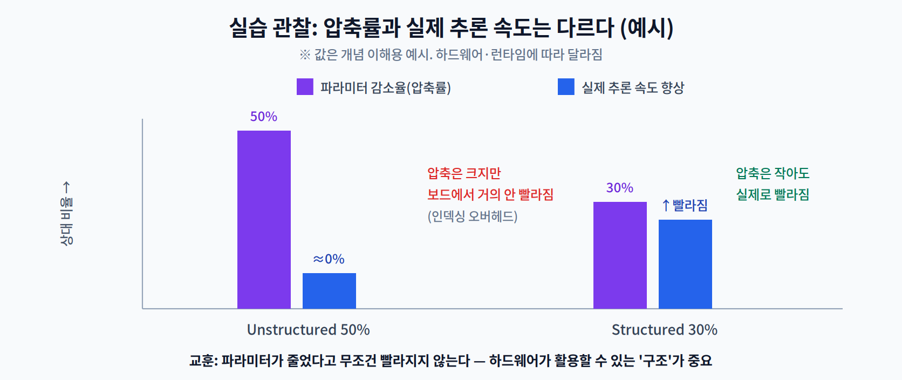

# 4주차 3교시. 프루닝 구현과 압축률·속도 확인

**실습 목표** — PyTorch로 비구조적·구조적 프루닝을 직접 적용해 **희소성(sparsity)** 을 만들어 보고, "파라미터를 줄이는 것"과 "실제로 빨라지는 것"이 왜 다른지 측정으로 확인한다.

> 준비물: 1주차 환경(`odai`) + `torch`, `torchvision`. 이번엔 ONNX 없이 PyTorch만 사용한다.

---

## 3.1 프루닝 구현 (20분)

PyTorch는 `torch.nn.utils.prune` 모듈로 프루닝을 지원한다. 작은 CNN의 한 합성곱 레이어에 두 방식을 적용해 본다.

```python
import torch, torch.nn as nn
import torch.nn.utils.prune as prune

conv = nn.Conv2d(3, 16, kernel_size=3)      # 예시 레이어

# (A) 비구조적: 크기(L1) 작은 개별 가중치 50% 제거
prune.l1_unstructured(conv, name="weight", amount=0.5)

# (B) 구조적: 필터(출력채널, dim=0) 단위로 L2 기준 30% 제거
#     ※ (A)와 비교하려면 새 레이어에 따로 적용할 것
conv2 = nn.Conv2d(3, 16, kernel_size=3)
prune.ln_structured(conv2, name="weight", amount=0.3, n=2, dim=0)
```

프루닝 후 실제로 0이 얼마나 생겼는지(희소성)를 확인한다.

```python
def sparsity(module):
    w = module.weight                       # 마스크가 적용된 가중치
    return float((w == 0).sum()) / w.nelement()

print(f"Unstructured 후 sparsity: {sparsity(conv):.1%}")
print(f"Structured  후 sparsity: {sparsity(conv2):.1%}")
```

> 관찰 포인트: `prune.*` 은 가중치를 **0으로 마스킹**할 뿐, 텐서의 크기(shape) 자체는 그대로다. 즉 "값이 0이 되었을 뿐, 저장 공간과 곱셈 횟수는 아직 그대로"다. 이 사실이 3.2의 핵심 관찰로 이어진다. (실제 배포 시엔 `prune.remove(conv, "weight")` 로 마스크를 확정하고, 구조적 프루닝은 채널을 실제로 삭제한 새 모델로 재구성해야 속도 이득이 난다.)

---

## 3.2 압축률 vs 속도 벤치마킹 (20분)

"파라미터를 50% 0으로 만들면 2배 빨라질까?"를 직접 재 본다.

```python
import time, copy

def bench(module, runs=50):
    x = torch.randn(8, 3, 64, 64)
    module.eval()
    with torch.no_grad():
        module(x)                            # 워밍업
        t0 = time.perf_counter()
        for _ in range(runs):
            module(x)
        return (time.perf_counter() - t0) / runs * 1000   # ms

dense = nn.Conv2d(3, 16, 3)
pruned = copy.deepcopy(dense)
prune.l1_unstructured(pruned, name="weight", amount=0.5)   # 50% 마스킹

print(f"Dense            : {bench(dense):.2f} ms")
print(f"Unstructured 50% : {bench(pruned):.2f} ms   (거의 동일할 것)")
```



관찰의 핵심:

1. 비구조적 50% 프루닝을 해도 **추론 시간은 거의 그대로**다. 텐서 크기가 같고, 밀집(dense) 커널이 0까지 그대로 곱하기 때문이다.
2. 실제 속도를 얻으려면 **① 희소 연산 전용 커널**(예: 2:4 sparsity 지원 하드웨어)이나 **② 구조적 제거로 텐서 자체를 줄이는 것**이 필요하다.
3. 즉 2교시의 결론이 측정으로 재현된다 — **압축률이 아니라 하드웨어가 활용할 수 있는 '구조'가 속도를 만든다.**

> 관찰 포인트: 이것이 4주차 전체의 교훈이다. "0을 많이 만들었다"에 만족하지 말고, "그 0을 하드웨어가 건너뛸 수 있는가"를 물어야 한다.

---

## 3.3 과제 (10분 안내)

1. **희소성-속도 표** — 비구조적 프루닝 비율을 `0.3, 0.5, 0.7, 0.9`로 바꿔가며 sparsity와 추론시간(평균·표준편차)을 측정해 표로 제출한다. 속도가 압축률을 따라가지 않음을 확인한다.
2. **구조적 실험** — `ln_structured`로 필터를 실제로 제거한 더 작은 `Conv2d`(출력채널 축소)를 새로 만들어 밀집 추론 시간을 비교한다. 마스킹과 무엇이 다른지 1~2문장으로 서술한다.
3. **개념 연결** — 본인의 실험 결과를 2교시의 '2:4 sparsity / 인덱싱 오버헤드'로 설명한다(3~4문장).
4. **다음 주 예습** — 5주차(양자화)에서는 값을 지우는 대신 **정밀도를 낮춘다**(FP32→INT8). "정밀도를 낮추면 왜 빨라지고, 무엇을 잃는가?"를 미리 생각해 온다.

> 교수님을 위한 Tip: 학생들이 "50% 지웠는데 왜 안 빨라지죠?"라고 당황하는 순간이 최고의 교육 지점이다. 마스킹과 실제 구조 제거의 차이를 여기서 짚어주면, 이후 모든 경량화 기법을 '하드웨어 실행' 관점으로 보게 된다.

---

### 3교시 정리
- PyTorch로 비구조적·구조적 프루닝을 적용하고 sparsity를 측정했다.
- 비구조적 마스킹은 압축률만큼 빨라지지 않음을 직접 확인했다.
- 실제 속도는 '하드웨어가 활용 가능한 구조'에서 나온다 — 다음 주 양자화로, 값을 지우는 대신 정밀도를 낮추는 또 다른 경량화로 이어진다.
