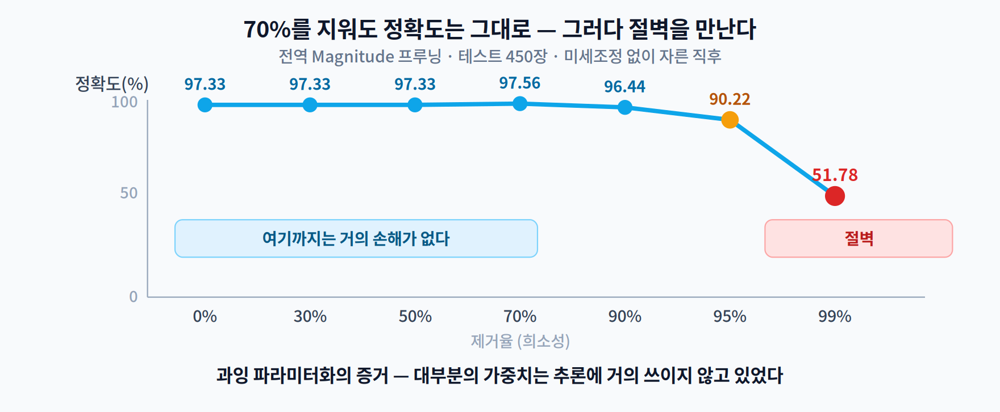
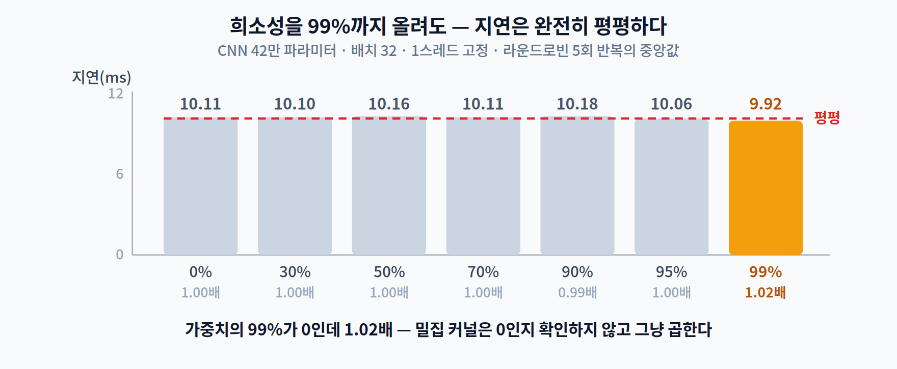
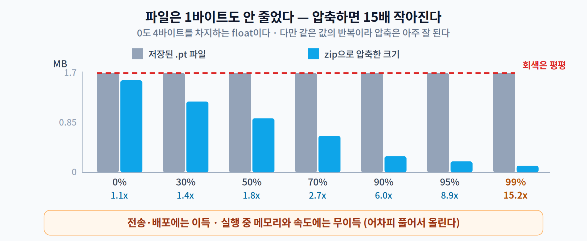
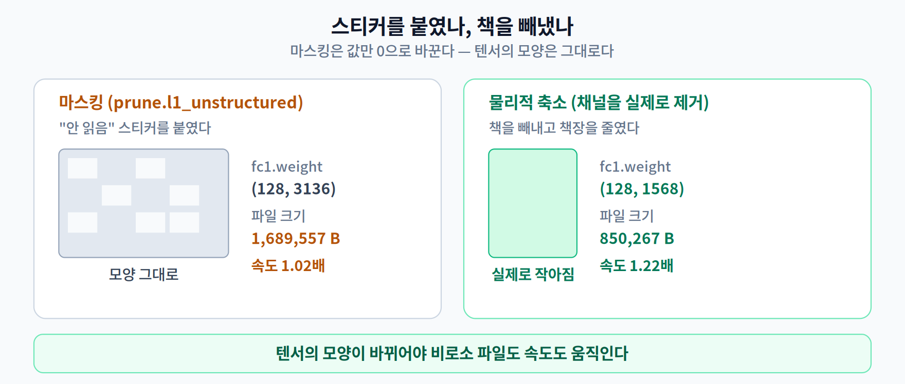

# 04주차 3교시. 네 개의 숫자를 따로따로 재 보기

**오늘 확인할 것** — 1교시에서 열어 둔 표가 있다. "프루닝하면 파일이 줄고, 연산량이 줄고, 빨라진다"는 세 가지 기대. 오늘은 그걸 **하나씩 따로** 잰다 — **희소성 · 정확도 · 연산량 · 지연 · 파일 크기.**

> 미리 말해 두면 재미가 없으니 한 마디만 하겠다. **다섯 개가 같이 움직이지 않는다.**

> 준비물: 1주차 환경(`odai`) + `torch`, `scikit-learn`, `numpy`.
> **인터넷이 필요 없다.** 데이터셋을 내려받지 않고 `scikit-learn`에 들어 있는 손글씨 숫자를 쓴다.
> 전체 실습이 **약 1분**에 끝난다(학습 포함).

---

## 3.1 얼마나 지울 수 있나 (13분)

### 준비 — 모델 학습

먼저 자를 대상을 만든다. 작은 CNN을 손글씨 숫자로 학습시킨다.

```python
import torch, torch.nn as nn, torch.nn.functional as F
import torch.nn.utils.prune as prune
import numpy as np, copy, time, os, zipfile
from sklearn.datasets import load_digits
from sklearn.model_selection import train_test_split

torch.manual_seed(0); np.random.seed(0); torch.set_num_threads(1)

d = load_digits()                                    # 8×8 손글씨 숫자 1,797장
X = torch.tensor(d.images.astype(np.float32) / 16.0).unsqueeze(1)
X = F.interpolate(X, size=(28, 28), mode="bilinear", align_corners=False)
y = torch.tensor(d.target).long()
Xtr, Xte, ytr, yte = train_test_split(X, y, test_size=0.25, random_state=0, stratify=y)

class Net(nn.Module):
    def __init__(s, c1=32, c2=64):
        super().__init__()
        s.c1, s.c2 = c1, c2
        s.conv1 = nn.Conv2d(1, c1, 3, padding=1)
        s.conv2 = nn.Conv2d(c1, c2, 3, padding=1)
        s.fc1   = nn.Linear(c2*7*7, 128)
        s.fc2   = nn.Linear(128, 10)
    def forward(s, x):
        x = F.max_pool2d(F.relu(s.conv1(x)), 2)
        x = F.max_pool2d(F.relu(s.conv2(x)), 2)
        return s.fc2(F.relu(s.fc1(x.flatten(1))))

def train(m, epochs=12, lr=1e-3):
    opt = torch.optim.Adam(m.parameters(), lr=lr)
    for _ in range(epochs):
        m.train(); perm = torch.randperm(len(Xtr))
        for i in range(0, len(Xtr), 64):
            j = perm[i:i+64]
            opt.zero_grad(); F.cross_entropy(m(Xtr[j]), ytr[j]).backward(); opt.step()
    return m

def acc(m):
    m.eval()
    with torch.no_grad(): return (m(Xte).argmax(1) == yte).float().mean().item()

base = train(Net())
print(f"원본 정확도 : {acc(base):.2%}")
print(f"파라미터    : {sum(p.numel() for p in base.parameters()):,}개")
for n, p in base.named_parameters():
    if p.dim() > 1: print(f"   {n:12s} {str(tuple(p.shape)):16s} {p.numel():>8,}")
```

```
원본 정확도 : 97.33%
파라미터    : 421,642개
   conv1.weight (32, 1, 3, 3)         288
   conv2.weight (64, 32, 3, 3)     18,432
   fc1.weight   (128, 3136)       401,408
   fc2.weight   (10, 128)           1,280
```

**여기서 이미 하나 읽을 것이 있다.** 전체 42만 개 중 **`fc1` 하나가 40만 개, 95.2%** 다. 1교시 1.3의 Sensitivity 이야기가 이것이다 — **지울 여지가 어디에 있는지**가 표에 그대로 보인다. 합성곱층 둘을 합쳐 봐야 18,720개, 전체의 **4.4%** 다. 거기서 아무리 열심히 잘라 봐야 전체는 거의 안 줄어든다.

### 지워 보기

전체 층을 통틀어 **절댓값이 작은 것부터** 지운다(`global_unstructured`). 층별로 비율을 따로 정하지 않고 **전체 가중치를 한 줄로 세워** 아래에서부터 자르는 방식이다.


```python
def prune_global(model, amount):
    m = copy.deepcopy(model)
    ps = [(mod, "weight") for mod in m.modules() if isinstance(mod, (nn.Conv2d, nn.Linear))]
    prune.global_unstructured(ps, pruning_method=prune.L1Unstructured, amount=amount)
    for mod, n in ps: prune.remove(mod, n)      # 마스크를 가중치에 확정
    return m

def sparsity(m):
    z = t = 0
    for mod in m.modules():
        if isinstance(mod, (nn.Conv2d, nn.Linear)):
            z += int((mod.weight == 0).sum()); t += mod.weight.nelement()
    return z / t

models = {}
print(f"{'제거율':>7} {'실제 희소성':>11} {'정확도':>9}")
for amt in [0.0, 0.3, 0.5, 0.7, 0.9, 0.95, 0.99]:
    m = base if amt == 0 else prune_global(base, amt)
    models[amt] = m
    print(f"{amt:>6.0%} {sparsity(m):>11.1%} {acc(m):>9.2%}")
```

```
    제거율      실제 희소성       정확도
    0%        0.0%    97.33%
   30%       30.0%    97.33%
   50%       50.0%    97.33%
   70%       70.0%    97.56%
   90%       90.0%    96.44%
   95%       95.0%    90.22%
   99%       99.0%    51.78%
```



**놀랍지 않은가?** 가중치의 **70%를 지웠는데 정확도가 오히려 올랐다**(97.33% → 97.56%). 90%를 지워도 96.44%다. 1교시의 **과잉 파라미터화**가 눈앞에 증명된 셈이다 — 정말로 대부분의 가중치는 추론에 거의 안 쓰이고 있었다.

그러다 **95%를 넘으면 절벽처럼 무너진다.** 90.22% → 51.78%. 이 절벽의 위치가 모델마다 다르고, **어디까지 자를 수 있는지는 재 봐야만 안다.**

> 70%에서 정확도가 오른 것을 "프루닝이 성능을 개선한다"고 읽으면 안 된다. 테스트 데이터가 **450장**뿐이라 **1장이 0.22%p**다. 97.33%와 97.56%는 **정확히 한 장 차이**이고, 이건 개선이 아니라 잡음이다.
> *(3.3에서 **구조적** 프루닝으로도 같은 97.56%가 나온다. 우연히 같은 숫자일 뿐 다른 실험이니 헷갈리지 말자.)*

### 층별로는 얼마나 잘렸을까

전체를 한 줄로 세워 잘랐으니, 층마다 잘린 비율은 저절로 달라진다. 90% 프루닝된 모델을 층별로 들여다보면 이렇다.

```python
for name, mod in models[0.9].named_modules():
    if isinstance(mod, (nn.Conv2d, nn.Linear)):
        w = mod.weight
        print(f"  {name:8s} {str(tuple(w.shape)):16s} {float((w==0).sum())/w.nelement():>7.2%}")
```

```
  conv1    (32, 1, 3, 3)      8.33%
  conv2    (64, 32, 3, 3)    43.61%
  fc1      (128, 3136)       92.38%
  fc2      (10, 128)         31.41%
```

**주의해서 읽어야 한다.** 이건 "중요한 층을 알아서 보호했다"는 뜻이 **아니다.** `global_unstructured`가 보는 것은 오직 `|w|`이므로, **가중치의 절댓값이 큰 층이 덜 잘렸을 뿐**이다. 그리고 절댓값의 크기는 초기화 방식·층의 폭·가중치 감쇠 같은 **스케일 요인**에 좌우된다 — 중요도와 방향이 우연히 맞을 수는 있어도 같은 것은 아니다. 1교시 1.3에서 "Magnitude의 가정이 늘 맞지는 않는다"고 한 이유가 이것이다.

여기서도 `fc1`이 92% 잘렸다는 점을 보자. **전체 희소성 90%의 거의 전부가 그 한 층에서 나왔다.**

### 장부상 연산량은 얼마나 줄었나

1교시 표의 **②번**을 채울 차례다. 0이 아닌 가중치만 세면 "장부상 곱셈 횟수"가 나온다.

```python
def nonzero(m):
    nz = tot = 0
    for mod in m.modules():
        if isinstance(mod, (nn.Conv2d, nn.Linear)):
            nz += int((mod.weight != 0).sum()); tot += mod.weight.nelement()
    return nz, tot

for amt in sorted(models):
    nz, tot = nonzero(models[amt])
    print(f"{amt:>6.0%}  0이 아닌 가중치 {nz:>8,} / {tot:,}   장부상 {tot/nz:>5.1f}배 감소")
```

```
    0%  0이 아닌 가중치  421,408 / 421,408   장부상   1.0배 감소
   30%  0이 아닌 가중치  294,986 / 421,408   장부상   1.4배 감소
   50%  0이 아닌 가중치  210,704 / 421,408   장부상   2.0배 감소
   70%  0이 아닌 가중치  126,422 / 421,408   장부상   3.3배 감소
   90%  0이 아닌 가중치   42,141 / 421,408   장부상  10.0배 감소
   95%  0이 아닌 가중치   21,070 / 421,408   장부상  20.0배 감소
   99%  0이 아닌 가중치    4,214 / 421,408   장부상 100.0배 감소
```

**장부상으로는 100배까지 줄었다.** 논문에 "연산량을 100배 줄였다"고 쓸 수 있는 숫자다. 1교시 표의 ②번 칸에 **"준다"** 를 채워 넣자.

이제 남은 건 ③번 — **정말 빨라지는가**다.

---

## 3.2 그런데 시간을 재 보면 (15분)

정확도를 거의 안 잃고 90%를 지웠다. **그럼 얼마나 빨라졌을까?**

**지난주 과제 4번의 그 질문이다.** *"가중치의 90%를 0으로 만들면 정말 10배 빨라질까?"* 적어 왔을 테니, 숫자를 보기 전에 옆 사람과 맞춰 보자.

```python
def bench_all(models, bs=32, runs=40, reps=5):
    x = torch.randn(bs, 1, 28, 28)
    with torch.no_grad():
        for _ in range(50):
            for m in models.values(): m(x)       # 전체 워밍업
        res = {k: [] for k in models}
        for _ in range(reps):                    # 라운드로빈 — 순서 효과 제거
            for k, m in models.items():
                s = []
                for _ in range(runs):
                    t0 = time.perf_counter(); m(x); s.append((time.perf_counter()-t0)*1000)
                res[k].append(np.median(s))
    return {k: (float(np.median(v)), float(np.std(v))) for k, v in res.items()}

r = bench_all(models); b = r[0.0][0]
print(f"{'제거율':>7} {'지연(ms)':>13} {'속도비':>8}")
for amt in sorted(models):
    md, sd = r[amt]
    print(f"{amt:>6.0%} {md:>9.2f}±{sd:>3.2f} {b/md:>8.2f}")
```

```
    제거율        지연(ms)      속도비
    0%     10.11±0.10     1.00
   30%     10.10±0.23     1.00
   50%     10.16±0.11     1.00
   70%     10.11±0.17     1.00
   90%     10.18±0.13     0.99
   95%     10.06±0.11     1.00
   99%      9.92±0.13     1.02
```



**완전히 평평하다.**

가중치의 **99%가 0**인데 **1.02배**다. 오차 범위(±0.1~0.2 ms) 안이니 사실상 **차이 없음**이다.

90%의 `0.99배`도 마찬가지다. **"살짝 느려졌다"고 읽으면 안 된다** — 같은 오차 범위 안이다. 2교시에서 "한 장 차이는 개선이 아니라 잡음"이라고 했던 그 잣대를, **우리 자신의 지연 표에도 똑같이** 적용해야 한다.

**바로 앞에서 장부상 100배 감소를 확인했다.** 그런데 시계는 안 움직였다.

> **장부는 100배 줄었다. 시계는 그대로다.**
> 1교시 표의 **②와 ③이 갈라지는 지점**이 정확히 여기다.

2교시에서 이야기한 이유가 그대로 재현된 것이다.

1. **밀집 커널은 값을 안 본다.** `0 × 3.7`도 곱셈 한 번이다. 45인승 버스에 5명이 타도 버스는 45인승 그대로다.
2. **텐서의 모양이 안 바뀌었다.** `prune`은 값을 0으로 덮어썼을 뿐, `fc1.weight`는 여전히 `(128, 3136)`이다.
3. 0을 건너뛰려면 **어디가 0인지 조회**해야 하는데, 그 비용이 아낀 곱셈보다 비싸다.

> **재 볼 때 주의할 점** (3주차와 같다, 그리고 이번 주는 더 중요하다)
> - 숫자는 기기마다 다르다. **절대값이 아니라 패턴**(평평한가 아닌가)을 보라.
> - 노트북은 전원을 연결하고 재라. 절전 모드와 발열 스로틀링이 결과를 흔든다.
> - **± 값이 평균의 5%를 넘으면 그 표로는 "평평하다"를 주장할 수 없다.** `reps`를 늘려라. 이번 주 결론이 통째로 이 한 장의 표에 걸려 있으니, 여기서만큼은 엄격해야 한다.

> **[더 깊이 — 선택] 그럼 희소성은 영영 소용없는 것인가?**
> 그렇지 않다. **우리가 잰 것은 PyTorch 기본 CPU 경로**라는 특정 조건이다. 2교시 2.1에서 본 손익분기점을 떠올려 보자 — 범용 경로에서는 **99% 근처**에서야 희소 형식이 이긴다고 했고, 우리는 정확히 그 99%에서 딱 **1.02배**를 봤다. 예측과 관측이 맞아떨어진 것이다.
> 반면 *Fast Sparse ConvNets*는 **손으로 다듬은 전용 커널**로 모바일 ARM CPU에서 70~90% 구간에서 1.1~2.2배를 얻었다. **희소성이 소용없는 게 아니라, 이 경로에 그걸 살릴 커널이 없는 것이다.** 결론을 적을 때는 조건을 함께 적어야 한다.

### 파일 크기는 줄었을까

한 가지 더 재 보자. **저장 공간은 줄었을까?**

그 전에 2교시에서 미뤄 둔 이야기를 하나 꺼내야 한다. **`prune`은 가중치를 지우지 않는다.** 실제로 하는 일은 원래 텐서를 `weight_orig`로 이름만 바꿔 두고, **0과 1로 된 마스크(`weight_mask`)를 따로 만들어**, 쓸 때마다 둘을 곱해 `weight`를 만들어 내는 것이다.

> 안 읽는 책에 **"안 읽음" 스티커를 붙인 것**과 같다. 1.2에서 본 그 스티커다. 책은 여전히 꽂혀 있고, **오히려 스티커만큼 짐이 늘었다.**

정말 그런지 한 층만 떼어 재 보면 놀랍다.

```
저장된 항목 (그냥 prune만)      : ['bias', 'weight_orig', 'weight_mask']  →  3,214,057 B
저장된 항목 (prune.remove 후)   : ['bias', 'weight']                      →  1,608,093 B
원본                            : ['bias', 'weight']                      →  1,607,893 B
```

*(모델 전체가 아니라 `fc1` 한 층만 저장했을 때다. 전체 모델 파일은 바로 아래에서 잰다.)*

**마스크를 남겨 두면 파일이 두 배가 된다.** 원본 가중치와 마스크를 **둘 다** 저장하기 때문이다. `prune.remove()`를 불러야 마스크가 가중치에 곱해져 확정되고, 그제야 **원본과 같은 크기**가 된다 — 줄어드는 게 아니라 **같아진다.**

3.1의 `prune_global()`에 `prune.remove()`가 왜 들어 있었는지, 이제 이유를 알았다. **그걸 빠뜨리면 파일이 두 배가 되고 추론도 오히려 느려진다**(매번 마스크를 곱해야 하니까).

그럼 `remove`까지 마친 모델 전체는 어떨까.

```python
def sizes(m, tag):
    torch.save(m.state_dict(), f"{tag}.pt")
    with zipfile.ZipFile(f"{tag}.zip", "w", zipfile.ZIP_DEFLATED, compresslevel=9) as z:
        z.write(f"{tag}.pt")
    return os.path.getsize(f"{tag}.pt"), os.path.getsize(f"{tag}.zip")

print(f"{'제거율':>7} {'.pt 파일':>14} {'압축(zip)':>14} {'압축비':>8}")
for amt in sorted(models):
    raw, comp = sizes(models[amt], f"m{int(amt*100):02d}")
    print(f"{amt:>6.0%} {raw:>11,} B {comp:>11,} B {raw/comp:>7.1f}x")
```

```
    제거율         .pt 파일        압축(zip)      압축비
    0%   1,689,557 B   1,562,355 B     1.1x
   30%   1,689,557 B   1,207,867 B     1.4x
   50%   1,689,557 B     925,339 B     1.8x
   70%   1,689,557 B     620,463 B     2.7x
   90%   1,689,557 B     280,499 B     6.0x
   95%   1,689,557 B     190,565 B     8.9x
   99%   1,689,557 B     110,795 B    15.2x
```

> 태그를 `m00`처럼 **자릿수를 맞춰** 쓰는 이유가 있다. `torch.save`는 zip 컨테이너 안에 파일명을 기록하므로, `m0.pt`와 `m30.pt`처럼 이름 길이가 다르면 **파일 크기가 몇십 바이트 달라진다.** 희소성과 아무 상관 없는 차이인데 표를 읽을 때 혼란을 준다.



**왼쪽 열은 1바이트도 안 줄었다.** `1,689,557 B`가 계속 반복된다. 0도 **4바이트를 차지하는 float**이기 때문이다.

**그런데 오른쪽 열은 15배 작아졌다.** 같은 값(0)이 반복되면 압축 알고리즘이 아주 잘 줄인다. 그러니 프루닝이 완전히 헛일은 아니다.

> **여기서 정확히 구분해야 한다.**
> — **전송·배포**에는 이득이 있다(앱 다운로드 크기, OTA 업데이트).
> — **실행 중 메모리와 속도**에는 이득이 **없다.** 어차피 풀어서 원래 크기로 올려야 돌아간다.

---

## 3.3 진짜로 줄이려면 (17분)

그럼 어떻게 해야 진짜로 빨라지는가? **답은 이미 1교시에 있었다 — 구조적으로 지운다.**



지금까지는 **책에 "안 읽음" 스티커를 붙인 것**이었다. 이번엔 **책을 실제로 빼내고 책장을 줄인다.** `conv2`의 출력 채널을 골라 **텐서에서 실제로 제거한 더 작은 모델**을 새로 만든다.

```python
def shrink(model, keep_ratio):
    """conv2의 출력 채널을 L1 기준으로 골라 실제로 제거한 '더 작은 모델'을 만든다."""
    c2_new = int(round(model.c2 * keep_ratio))
    imp  = model.conv2.weight.detach().abs().sum(dim=(1,2,3))       # 필터별 L1 중요도
    keep = torch.argsort(imp, descending=True)[:c2_new].sort().values
    new = Net(c1=model.c1, c2=c2_new)
    new.conv1.load_state_dict(model.conv1.state_dict())
    new.conv2.weight.data = model.conv2.weight.data[keep].clone()
    new.conv2.bias.data   = model.conv2.bias.data[keep].clone()
    W = model.fc1.weight.data.view(128, model.c2, 49)               # 채널당 7×7=49열
    new.fc1.weight.data = W[:, keep, :].reshape(128, c2_new*49).clone()
    new.fc1.bias.data   = model.fc1.bias.data.clone()
    new.fc2.load_state_dict(model.fc2.state_dict())
    return new
```

> **이 함수의 마지막 네 줄을 눈여겨보자.** `conv2`의 채널을 지우면 **그 뒤의 `fc1` 입력도 같이 줄어든다.** 채널 하나가 사라지면 `fc1`에서 49개 열이 따라 사라진다. **구조적 프루닝이 번거로운 이유가 이것이다** — 한 층을 건드리면 연결된 층을 전부 손봐야 한다. 잔차 연결(층 몇 개를 **건너뛰어 입력을 그대로 더해 주는 연결**)이 있으면 더 까다롭다. 더해지는 두 갈래의 채널 수가 항상 맞아야 해서, **한쪽만 자를 수가 없다.** 비구조적 프루닝이 `prune` 한 줄로 끝나는 것과 대조적이다.

```python
s50, s75 = shrink(base, 0.5), shrink(base, 0.25)
a0 = {"구조적50%(32ch)": acc(s50), "구조적75%(16ch)": acc(s75)}   # 미세조정 전에 미리 잰다
sm = {"원본(64ch)": base, "구조적50%(32ch)": s50, "구조적75%(16ch)": s75}
rs = bench_all(sm); bb = rs["원본(64ch)"][0]

print(f"{'모델':>18} {'파라미터':>11} {'지연(ms)':>13} {'속도비':>7} {'자른 직후':>9} {'미세조정후':>10}")
for k, m in sm.items():
    md, sd = rs[k]; n = sum(p.numel() for p in m.parameters())
    if k == "원본(64ch)":
        print(f"{k:>18} {n:>11,} {md:>9.2f}±{sd:>3.2f} {bb/md:>7.2f} {acc(m):>9.2%} {'—':>10}")
    else:
        ft = train(copy.deepcopy(m), epochs=10, lr=5e-4)
        print(f"{k:>18} {n:>11,} {md:>9.2f}±{sd:>3.2f} {bb/md:>7.2f} {a0[k]:>9.2%} {acc(ft):>10.2%}")

torch.save(s50.state_dict(), "shrunk50.pt")
print(f"\n구조적 50% 모델 파일 : {os.path.getsize('shrunk50.pt'):,} B "
      f"(원본 {os.path.getsize('m00.pt'):,} B)")
```

```
                모델        파라미터        지연(ms)      속도비     자른 직후      미세조정후
          원본(64ch)     421,642     10.23±0.05    1.00    97.33%          —
      구조적50%(32ch)     211,690      8.37±0.03    1.22    88.22%     97.33%
      구조적75%(16ch)     106,714      7.18±0.06    1.42    82.22%     97.56%

구조적 50% 모델 파일 : 850,267 B (원본 1,689,557 B)
```


**이번엔 전부 움직였다.**

- **파라미터** 421,642 → 211,690 (실제로 절반)
- **파일** 1,689,557 B → 850,267 B (실제로 절반)
- **속도** 1.00 → **1.22배**
- **정확도** 자른 직후 88.22% → 미세조정 후 **97.33%** (원본과 동일)

> **정직하게 밝혀 둘 것.** 우리는 시간 때문에 **한 번만 자르고 한 번만 회복**시켰다. 2교시 2.3에서 본 실무 절차는 이 사이클을 **여러 번 도는 것**이고, 같은 압축률이라도 나눠서 자르면 정확도가 더 잘 버틴다. 과제 5번에서 직접 확인해 볼 수 있다.

### 두 방식을 나란히 놓으면

| | **비구조적 99%** | **구조적 50%** |
|---|---:|---:|
| 지운 비율 | **99%** | 50% |
| 파일 크기 | 그대로 | **절반** |
| 속도 | 1.02배 | **1.22배** |
| 정확도 | 51.78% | **97.33%** (미세조정 후) |

**덜 지운 쪽이 모든 항목에서 이겼다.** 압축률이라는 숫자 하나만 보면 정반대의 결론을 내렸을 것이다.

### 그런데 왜 1.22배지? 2배가 아니고?

채널을 절반으로 줄였는데 왜 딱 절반의 시간이 안 나올까? **줄인 것이 전체의 일부이기 때문이다.** `conv1`은 그대로고, 풀링·활성함수·파이썬 호출 오버헤드도 그대로다. 줄인 부분만 줄어든다.

이건 이름이 붙어 있는 법칙이다 — **암달의 법칙(Amdahl's Law)**. 2주차 3.3의 `[더 깊이]` 박스에 나왔으니 건너뛰었어도 괜찮다. 요지는 한 줄이다.

> **전체 중 일부만 개선하면, 전체는 그 비율만큼만 좋아진다.**

2주차에서는 스레드를 아무리 늘려도 순차로 도는 부분은 안 줄어든다는 이야기였고, 지금은 채널을 줄여도 안 건드린 층은 안 줄어든다는 이야기다. 경량화 결과를 볼 때마다 따라붙는 제약이니 이름과 함께 기억해 두자.

> **한 줄 정리:** **희소성은 성능 지표가 아니다.** 성능은 하드웨어가 그 0을 **실제로 건너뛸 수 있는 구조**에서 나온다.

---

## 3.4 과제 (5분 안내)

1. **다섯 개의 표** — 비구조적 프루닝에서 **희소성·정확도·장부상 연산량·지연·파일 크기**를 모두 측정해 하나의 표로 제출한다. 다섯 중 **희소성을 따라 움직인 것과 안 움직인 것**을 각각 밝힌다.
2. **절벽 찾기** — 정확도가 무너지기 시작하는 지점을 `0.90 ~ 0.99` 사이에서 더 촘촘히(0.92, 0.94, 0.96, 0.98) 찾아 그래프로 그린다. 여러분 모델의 절벽은 어디인가?
3. **구조적과 비교** — `shrink()`로 만든 구조적 50% 모델과 비구조적 50% 모델의 **지연·파일 크기·정확도**를 비교한다. 왜 다른지 `fc1.weight.shape`를 근거로 설명한다.
4. **조건 밝히기** — 1번 표의 결론을 한 문장으로 쓰되, **어떤 조건에서 잰 것인지**(하드웨어·스레드 수·배치·실행 경로)를 반드시 함께 적는다. 조건 없는 성능 주장이 왜 위험한지 2교시 2.1을 근거로 두 문장 덧붙인다.
5. **나눠서 잘라 보기** — 90%를 한 번에 자르는 것과, 50% → 미세조정 → 90%로 **두 번에 나눠** 자르는 것의 최종 정확도를 비교한다. 2교시의 반복 절차가 왜 필요한지 숫자로 확인한다.
6. **다음 주 예습** — 5주차는 **양자화**다. 값을 지우는 대신 **정밀도를 낮춘다**(FP32 → INT8). 오늘 배운 것을 떠올리며 미리 생각해 오자. *"정밀도를 낮추면 파일 크기·속도·정확도 중 무엇이 실제로 움직일까?"*

> 교수님을 위한 Tip: 3.2의 지연 표를 보여주기 **전에** "90% 지웠으니 몇 배 빨라졌을까요?"를 반드시 물으세요. 대부분 5~10배를 답합니다. 그 예상을 칠판에 적어 두고 `1.00`을 공개하면, 그 순간이 이번 주에서 학생들이 가장 오래 기억하는 장면이 됩니다. 3주차에서 같은 방식이 잘 통했다면 이번엔 **더** 잘 통합니다 — 이미 한 번 당했기 때문에 오히려 더 몰입합니다.

---

### 3교시 정리
- **정확도**: 70%까지 그대로, 90%에서 96.4%, **95%를 넘으면 절벽**(90.2% → 51.8%). 과잉 파라미터화가 눈으로 확인된다.
- **장부상 연산량**: 99%에서 **100배 감소**. 논문에 쓸 수 있는 숫자다.
- **지연**: 0%부터 99%까지 **완전히 평평**(10 ms). 99%를 지워도 **1.02배**.
- **파일**: `.pt`는 **1바이트도 안 줄고**, 압축하면 **15.2배** 작아진다 — 전송에는 이득, 실행에는 무이득.
- **구조적으로 채널을 실제로 들어내면** 파일 절반 · 속도 **1.22배** · 정확도는 미세조정으로 원본 복귀.
- **장부는 100배, 시계는 1.02배.** 1교시 표의 ②와 ③은 서로 다른 것이었다.
- 그래서 이번 주의 결론: **희소성은 성능 지표가 아니다. 재 봐야 안다.**
- 다음 주는 **양자화** — 값을 지우는 대신 정밀도를 낮추는 또 다른 경량화다.
