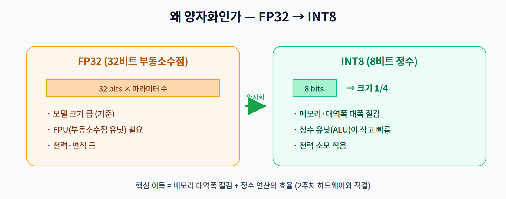
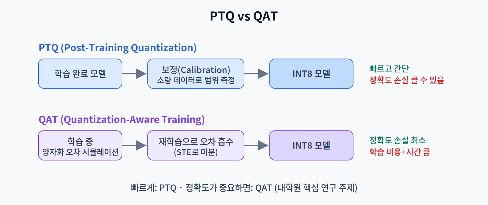
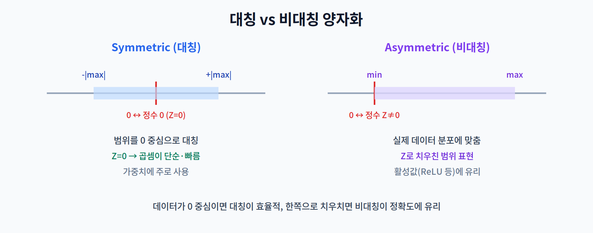

# 05주차 1교시. 양자화의 수학적 원리와 유형

**강의 목표** — 32비트 부동소수점(FP32) 모델이 8비트 정수(INT8)로 변환되는 원리와, 그 과정의 매핑 수식·유형을 이해한다.

4주차의 프루닝이 파라미터를 **지우는** 경량화였다면, 5주차의 양자화는 파라미터의 **정밀도를 낮추는** 경량화다. 실제 산업 현장에서 가장 필수적으로 쓰이며, 온디바이스 배포의 표준 절차에 가깝다.

---

## 1.1 왜 양자화인가 (10분)

양자화의 이득은 두 축에서 나온다.

- **메모리 대역폭 절감** — FP32를 INT8로 바꾸면 값 하나가 32비트에서 8비트로 줄어, 모델 크기가 **1/4**이 된다. 2주차에서 본 Memory Wall을 떠올리면, 데이터 이동량이 1/4로 주는 것 자체가 큰 속도·전력 이득이다.
- **연산 효율** — 정수 연산 유닛(ALU)은 부동소수점 유닛(FPU)보다 회로가 작고 빠르며 전력을 적게 쓴다. 특히 모바일 NPU 상당수가 정수 연산에 특화되어 있어, 양자화된 모델이 하드웨어의 성능을 온전히 끌어낸다.

> 한 줄 정리: 양자화는 "표현 비트 수를 줄여" 메모리와 연산을 동시에 아끼는 경량화다.

---

## 1.2 Affine 양자화 수식 (20분)

부동소수점 값을 정수로 바꾸는 표준 방법이 **Affine(아핀) 양자화**다. 핵심은 실수 범위를 정수 범위로 **선형 매핑**하는 것이다.

![Affine 양자화 매핑 — 실수 범위 [x_min, x_max]를 정수 범위로 선형 대응시키며, 스케일 S와 제로포인트 Z가 그 대응 규칙을 정한다](../assets/w05_p1_affine_mapping_02.png)

$$x_q = \text{round}\!\left(\frac{x}{S} + Z\right)$$

- **S (Scale, 스케일)** — 정수 한 칸(1단계)이 실수 얼마만큼에 대응하는지를 정하는 값. 대략 (실수 범위 폭) ÷ (정수 단계 수)로 정해진다. S가 크면 넓은 범위를 담지만 해상도가 거칠고, 작으면 정밀하지만 범위가 좁다.
- **Z (Zero-point, 제로포인트)** — 실수 0이 매핑되는 정수값. 데이터가 0을 중심으로 대칭이 아닐 때, 범위를 정수축 위에서 적절히 이동시키는 역할을 한다.

역으로 정수를 실수로 되돌릴 때는 $\hat{x} = S \cdot (x_q - Z)$ 를 쓴다. 이 왕복에서 발생하는 반올림 오차가 곧 **양자화 오차**이며, 정확도 하락의 근원이다.

> 한 줄 정리: 양자화의 두 파라미터는 '얼마나 촘촘히(S)'와 '0을 어디에 두나(Z)'이다.

---

## 1.3 양자화 기법의 분류 (25분)

양자화는 **언제·어떻게** 적용하느냐에 따라 나뉜다. 두 축을 함께 본다.

**① 학습 포함 여부 — PTQ vs QAT**

- **PTQ (Post-Training Quantization)** — 학습이 끝난 모델에, 재학습 없이 소량의 **보정(Calibration) 데이터**로 범위만 측정해 변환한다. 빠르고 간단하지만 정확도 손실이 클 수 있다.
- **QAT (Quantization-Aware Training)** — 학습 과정 중에 양자화 오차를 **시뮬레이션**하며 학습해, 정확도 손실을 최소화한다. 대학원 수준의 핵심 연구 주제이며, 비용은 크지만 정확도가 가장 잘 보존된다.

**② 활성값 처리 시점 — Dynamic vs Static**

- **Dynamic Quantization** — 가중치는 미리 양자화하고, 활성값(Activation)은 추론 시점에 즉석에서 양자화한다. 구현이 쉽다.
- **Static Quantization** — 활성값의 범위도 보정 데이터로 미리 정해둔다. 추론이 더 빠르다.

**③ 대칭 vs 비대칭**

- **대칭(Symmetric)** — 범위를 0 중심으로 잡아 $Z=0$. 곱셈이 단순해 가중치에 주로 쓰인다.
- **비대칭(Asymmetric)** — 실제 분포에 맞춰 범위를 이동($Z \ne 0$). ReLU 출력처럼 한쪽으로 치우친 활성값에 유리하다.

> 한 줄 정리: PTQ/QAT(학습 포함), Dynamic/Static(활성값 시점), Symmetric/Asymmetric(범위 대칭)의 세 축으로 양자화를 이해한다.

> 교수님을 위한 Tip: "왜 무작정 숫자를 줄이는 게 아니라 '스케일'이 중요한가?"를 강조하라. 같은 8비트라도 S·Z를 어떻게 잡느냐에 따라 정확도가 크게 갈린다는 점이 이번 주의 핵심 직관이다.

---

### 1교시 복습 질문
1. FP32→INT8에서 모델 크기가 정확히 1/4이 되는 이유는?
2. Scale과 Zero-point는 각각 무엇을 결정하는가?
3. PTQ와 QAT를 정확도·비용 관점에서 언제 각각 선택하나?
