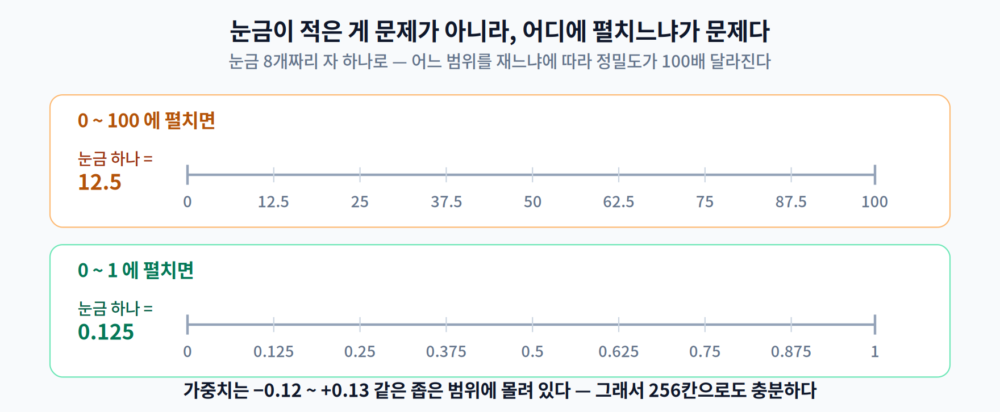

# 05주차 1교시. 숫자를 덜 정밀하게 적으면 어떻게 될까

**오늘의 질문** — 신경망의 가중치 하나는 `0.12773849...` 같은 값이고, 이걸 32비트로 적는다. 그런데 정말 그만큼 정밀해야 할까? **`127`이라는 정수 하나로 적으면 안 될까?**

4주차는 파라미터를 **지우는** 경량화였다. 이번 주는 **덜 정밀하게 적는** 경량화다. 그리고 결과가 4주차와 사뭇 다르다.

> 이 교시를 마치면 "INT8로 바꿨습니다"라는 말을 들었을 때 **"범위는 어떻게 잡으셨어요?"** 라고 되물을 수 있게 된다.

---

## 1.1 덜 정밀하게 적으면 무엇이 좋아지나 (16분)

### 먼저, 4주차와 무엇이 다른가

지난주를 떠올려 보자. 가중치의 99%를 0으로 만들었는데 **파일은 1바이트도 안 줄었다.** 0도 4바이트를 차지하는 숫자였기 때문이다.

양자화는 다르다. **숫자를 적는 방식 자체를 바꾼다.**

```
FP32 가중치 하나 : 0.1277  →  4바이트 (32비트)
INT8 가중치 하나 :    127  →  1바이트 ( 8비트)
```

값이 0이든 아니든 상관없다. **모든 값이 1/4 크기로 적힌다.** 그래서 파일이 진짜로 줄어든다.


### 이득이 나오는 세 축

**① 옮길 데이터가 1/4이 된다**

2주차 내내 배운 이야기가 여기서 보상을 받는다. **느린 것은 계산이 아니라 데이터를 나르는 일이었다.** 그런데 나를 데이터가 통째로 1/4이 되면, 그 병목이 그대로 1/4로 줄어든다.

**② 정수 연산이 더 싸다**

2주차 1.1의 에너지 표를 다시 꺼내 보자.

| 연산 | 에너지 |
|---|---:|
| **8비트 정수** 곱셈 | **0.2 pJ** |
| **32비트 부동소수점** 곱셈 | **3.7 pJ** |
| (참고) 32비트 정수 덧셈 | 0.1 pJ |
| (참고) 32비트 부동소수점 덧셈 | 0.9 pJ |

**같은 곱셈끼리 비교하면 18.5배**, 같은 덧셈끼리 비교하면 9배다. 정수 유닛은 부동소수점 유닛보다 **회로가 작고, 빠르고, 전력을 적게 쓴다.**

> 2주차에서 이미 짚었던 구분이다. 37배에는 **덧셈 vs 곱셈** 차이가 섞여 있고, 정수/부동소수점만 떼어 내면 **18.5배**다 — 양자화가 실제로 아끼는 몫은 이쪽이다.

**③ 한 삽에 네 배가 담긴다**

3주차에서 배운 **SIMD** — 한 삽에 여러 개씩 퍼 담는 방식 — 을 떠올려 보자. 삽의 크기(레지스터 폭)는 그대로인데 **4바이트짜리 대신 1바이트짜리를 담으면 네 배가 들어간다.** 3주차에서는 데스크톱의 256비트(AVX2)로 세어 float 8개라고 했다. 폰에 흔한 **128비트(ARM NEON)** 로 세면 FP32 4개, INT8 16개다. **폭이 얼마든 비율은 늘 4배**라는 것이 요점이다.

**그래서 모바일 NPU 상당수가 애초에 정수 연산에 맞춰 설계되어 있다.** 2주차에서 "NPU는 왜 다른가"를 배울 때 예고만 해 두었던 이야기가, 이번 주에 채워진다.

> **한 줄 정리:** 양자화는 **표현 비트 수를 줄여** 데이터 이동량과 연산 비용을 **동시에** 아낀다. 프루닝과 달리, 값이 0인지 아닌지와 무관하게 **모든 값이 줄어든다.**

---

## 1.2 실수를 정수에 대응시키는 법 (17분)

그럼 `0.1277`을 어떻게 정수로 바꿀까? **자를 하나 만들면 된다.**

### 자 비유

30cm 자를 떠올려 보자. 눈금이 300개 있으면 1mm까지 잴 수 있다. 눈금이 30개뿐이면 1cm까지만 잴 수 있다.

**비트 수가 곧 눈금의 개수다.**

| 비트 | 눈금 개수 |
|---:|---:|
| 32비트(FP32) | 약 43억 가지 |
| 8비트(INT8) | **256가지** |
| 4비트 | 16가지 |



여기서 **오늘 가장 중요한 직관**이 나온다.

> **눈금이 적은 게 문제가 아니라, 그 눈금을 어디에 펼치느냐가 문제다.**

눈금 8개짜리 자라도 **0에서 1까지**에 펼치면 0.125 단위로 잴 수 있다. 그런데 같은 자를 **0에서 100까지**에 펼치면 12.5 단위밖에 못 잰다. **자는 똑같은데 정밀도가 100배 차이 난다.**

가중치는 대개 `-0.12 ~ +0.13` 같은 좁은 범위에 몰려 있다. 그 좁은 범위에만 256개 눈금을 펼치면, 8비트로도 충분히 정밀하다.

### 그 자를 정하는 두 숫자 — S와 Z

![Affine 양자화 매핑 — 실수 범위 [x_min, x_max]를 정수 범위로 선형 대응시키며, 스케일 S가 눈금 간격을, 제로포인트 Z가 실수 0의 위치를 정한다](../assets/w05_p1_affine_mapping_02.png)

$$x_q = \text{round}\!\left(\frac{x}{S} + Z\right) \qquad\qquad \hat{x} = S \cdot (x_q - Z)$$

- **S (Scale, 스케일)** — **눈금 하나가 실수로 얼마인가.** `(실수 범위 폭) ÷ (눈금 사이 칸 수)`다. 8비트면 값이 256가지지만 **칸은 255개**라 255로 나눈다. 3교시에서 실제로 재 보면 `S = 9.63 × 10⁻⁴` 정도가 나온다 — 눈금 하나가 0.000963이라는 뜻이다.
- **Z (Zero-point, 제로포인트)** — **실수 0이 정수 몇 번 눈금에 오는가.** 데이터가 0을 중심으로 대칭이 아닐 때 자를 옆으로 밀어 주는 값이다.

왼쪽 식이 **적을 때**, 오른쪽 식이 **읽을 때**다.

`3.14159`를 `3.14`로 적는 것과 같다. **적을 때 버린 자릿수는 읽을 때 돌아오지 않는다.** 이 왕복에서 생기는 반올림 오차가 **양자화 오차**이고, 그 이상도 이하도 아니다.

**그런데 오차가 생각보다 작다.** 3교시 실측에서 확인할 텐데, 8비트로 바꿨을 때 평균 오차가 **가중치 표준편차의 1.34%** 정도다. 범위만 제대로 잡으면 256칸으로도 충분하다는 뜻이다.

> **[더 깊이 — 선택]** 왜 하필 **선형(affine)** 매핑일까? 가중치 분포는 대개 0 근처에 몰린 종 모양이라, 0 근처를 촘촘하게 하고 바깥을 성기게 하는 **비선형** 매핑이 이론적으로 유리하다. 실제로 그런 방법(로그 양자화, 학습된 양자화 등)이 연구되어 있다. 그런데도 선형이 표준인 이유는 **하드웨어** 때문이다. 선형이면 정수 곱셈 결과에 스케일만 곱해 주면 되지만, 비선형이면 조회 테이블을 거쳐야 한다. **2·3·4주차에서 계속 만난 그 이야기다** — 이론적으로 나은 것보다 하드웨어가 좋아하는 것이 이긴다.

> **한 줄 정리:** 양자화의 두 파라미터는 **"눈금 간격(S)"** 과 **"0의 위치(Z)"** 다. 그리고 눈금을 **어느 범위에 펼치느냐**가 정밀도를 결정한다.

---

## 1.3 언제·어떻게 바꾸나 (17분)

같은 INT8이라도 방식이 여럿이다. 옷을 맞춘다고 생각해 보자. **언제 치수를 잴 것인가**(만들기 전에? 다 만들고 나서?), **무엇의 치수를 잴 것인가**(고정된 몸? 매번 달라지는 몸?), **어디를 기준으로 잴 것인가**(가운데? 한쪽 끝?).

양자화의 세 축이 정확히 이 세 질문이다.

| 축 | 질문 | 갈래 |
|---|---|---|
| ① | 재학습을 하는가 | **PTQ** / **QAT** |
| ② | 활성값 범위를 언제 정하는가 | **동적** / **정적** |
| ③ | 0을 가운데 두는가 | **대칭** / **비대칭** |

### ① 학습을 다시 하는가 — PTQ vs QAT


- **PTQ (학습 후 양자화)** — 학습이 끝난 모델에 **재학습 없이** 바로 적용한다. 필요한 것은 범위를 재기 위한 **보정(Calibration) 데이터 몇 장**뿐이다. 빠르고 간단해서 **먼저 시도해 보는 기본값**이다.
- **QAT (양자화 인지 학습)** — 학습할 때부터 양자화 오차를 **겪게 하면서** 학습한다. 시합 조건으로 연습하는 셈이다. 비용은 크지만 정확도가 가장 잘 보존된다. 2교시 2.3에서 다룬다.

**순서가 중요하다.** 실무에서는 **PTQ를 먼저 해 보고**, 정확도가 안 나올 때만 QAT로 간다. 처음부터 QAT를 하는 건 대개 과하다.

### ② 활성값의 범위를 언제 정하는가 — 동적 vs 정적

**활성값**은 층과 층 사이를 흐르는 값이다. 가중치와 결정적으로 다른 점이 둘 있다 — **파일에 저장되지 않고**(추론할 때 그때그때 생긴다), **입력이 바뀌면 값도 범위도 바뀐다.**

가중치는 학습이 끝나면 고정이라 범위를 미리 알 수 있다. 그런데 활성값은 그럴 수가 없다. 그래서 **"범위를 언제 재느냐"** 가 가중치에는 없던 문제로 등장한다.

- **동적(Dynamic)** — 추론할 때마다 그 자리에서 범위를 잰다. 구현이 쉽고 정확하지만, **매번 재는 비용**이 든다.
- **정적(Static)** — 보정 데이터로 **미리** 범위를 정해 둔다. 추론이 더 빠르다. 3교시에서 만들 `.tflite` INT8 모델이 이 방식이다.

### ③ 0을 가운데 둘 것인가 — 대칭 vs 비대칭


- **대칭(Symmetric)** — 범위를 0 중심으로 잡아 **Z = 0**. Z가 0이면 계산이 눈에 띄게 단순해져서 **가중치에 주로 쓴다.**
- **비대칭(Asymmetric)** — 실제 분포에 맞춰 범위를 옮긴다(Z ≠ 0). **ReLU를 통과한 활성값은 전부 0 이상**이라 한쪽으로 완전히 치우쳐 있는데, 이런 값에 대칭을 쓰면 범위의 절반을 그냥 버리게 된다. 그래서 **활성값에는 비대칭**이 유리하다.

> **실무 조합** — 가중치는 **대칭**, 활성값은 **비대칭**. 3교시에서 만들 TFLite INT8 모델도 대략 이 조합을 쓴다.

**오늘의 토론 질문**

1. 프루닝은 파일 크기를 못 줄였는데 양자화는 줄인다. 그 차이가 어디서 오는지 한 문장으로 설명해 보자.
2. 눈금 256개짜리 자로 `-0.12 ~ +0.13`을 재는 것과 `-100 ~ +100`을 재는 것은 무엇이 다른가?
3. ReLU 출력에 대칭 양자화를 쓰면 무엇을 손해 보는가? 그림을 그려 설명해 보자.

> 교수님을 위한 Tip: 2번을 **자를 직접 그려 가며** 풀게 하세요. "눈금 수는 같은데 눈금 간격이 다르다"는 것을 손으로 그려 보면, 2교시의 스케일 이야기와 3교시의 실측이 전부 이 그림 하나로 연결됩니다. 이번 주에서 가장 값싸고 효과 큰 5분입니다.

---

### 1교시 정리
- 양자화는 **값을 적는 방식**을 바꾼다 — 4바이트가 1바이트가 되니, 값이 0이든 아니든 **모든 값이 줄어든다.**
- 이득은 세 축 — **옮길 데이터가 1/4**, **정수 연산이 더 싸다**, **한 삽에 네 배가 담긴다**.
- 비트 수는 **눈금의 개수**다. 중요한 건 개수가 아니라 **그 눈금을 어느 범위에 펼치느냐**다.
- **S**는 눈금 간격, **Z**는 0의 위치. 이 둘이 자를 정한다.
- 세 축으로 분류한다 — **PTQ/QAT**(재학습) · **동적/정적**(활성값 범위 시점) · **대칭/비대칭**(0의 위치).

### 오늘의 용어 (5개만 기억하면 충분)
- **양자화(Quantization)** — 실수를 정해진 개수의 정수 눈금에 대응시키는 것.
- **스케일(S)** — 정수 눈금 하나가 실수로 얼마인지.
- **제로포인트(Z)** — 실수 0이 정수 몇 번에 대응하는지.
- **PTQ / QAT** — 재학습 없이 변환 / 학습 중에 양자화를 겪게 하며 변환.
- **활성값(Activation)** — 층과 층 사이를 흐르는 값. 저장되지 않고 입력에 따라 범위가 바뀐다.

### 더 읽어보기 (관심 있는 학생만)
[1] B. Jacob et al., "Quantization and Training of Neural Networks for Efficient Integer-Arithmetic-Only Inference," *CVPR*, 2018. (지금 쓰이는 INT8 방식의 표준을 세운 논문)
[2] A. Gholami et al., "A Survey of Quantization Methods for Efficient Neural Network Inference," 2021. (전체 지형을 훑고 싶을 때)
