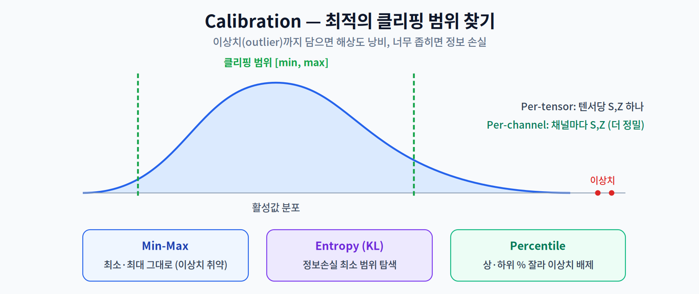

# 05주차 2교시. 하드웨어 가속과 정확도 복구

**강의 목표** — 양자화된 모델이 실제 하드웨어에서 어떻게 가속되는지, 그리고 정확도 하락을 막는 최신 전략을 학습한다.

1교시가 "어떻게 정수로 바꾸나"였다면, 2교시는 "그것이 왜 빨라지고, 어떻게 정확도를 지키나"이다.

---

## 2.1 하드웨어 가속 원리 (20분)

양자화가 실제 속도로 이어지는 근거는 하드웨어에 있다.

- **SIMD (Single Instruction, Multiple Data)** — 한 번의 명령으로 여러 데이터를 동시에 처리하는 병렬화다. 같은 레지스터 폭에 32비트 값은 몇 개 안 들어가지만 8비트 값은 네 배 더 들어간다. 즉 INT8이면 한 명령에 **더 많은 값을 한꺼번에** 곱할 수 있다.
- **NPU의 정수 특화** — 2주차에서 본 것처럼 모바일 NPU 상당수는 정수 MAC(곱셈-누산) 연산에 최적화되어 있다. 그래서 FP32 모델은 NPU의 성능을 다 못 쓰고, INT8로 양자화해야 비로소 하드웨어의 최대 처리량에 도달한다.

즉 양자화의 속도 이득은 "비트가 작아서"가 아니라 "작은 비트를 하드웨어가 병렬로·정수 유닛으로 처리할 수 있어서" 생긴다. 4주차의 교훈("하드웨어가 활용할 수 있어야 빨라진다")이 여기서도 반복된다.

> 한 줄 정리: 양자화의 속도는 SIMD 병렬성과 NPU 정수 유닛이라는 하드웨어 특성에서 나온다.

---

## 2.2 정확도 하락 분석과 Calibration 전략 (20분)

양자화 오차는 정확도를 떨어뜨린다. 이를 줄이는 열쇠가 **보정(Calibration)**, 즉 "어디까지를 범위로 잡을 것인가(클리핑 범위)"를 잘 정하는 일이다.

- **Min-Max** — 관측된 최솟값·최댓값을 그대로 범위로 쓴다. 단순하지만 **이상치(outlier)** 하나에 범위가 크게 벌어져 해상도를 낭비할 수 있다.
- **Entropy (KL-Divergence)** — 양자화 전후 분포의 정보 손실(KL 발산)이 최소가 되는 범위를 찾는다. 이상치에 강하다.
- **Percentile** — 상·하위 일정 %를 잘라내 이상치를 배제한다.

또한 **양자화 granularity**도 정확도를 좌우한다.

- **Per-tensor** — 텐서 전체에 하나의 S·Z를 적용. 단순·빠르지만 거칠다.
- **Per-channel** — 채널(필터)마다 서로 다른 S·Z를 적용. 채널별 분포 차이를 반영해 훨씬 정밀하며, 특히 가중치 양자화에서 정확도를 크게 지켜준다.

> 한 줄 정리: 정확도 방어의 핵심은 '좋은 클리핑 범위(Calibration)'와 '충분히 세밀한 단위(Per-channel)'다.

---

## 2.3 QAT의 핵심: STE (Straight-Through Estimator) (15분)

QAT에는 수학적 난점이 하나 있다. 양자화에 쓰이는 **round(반올림) 함수는 미분이 불가능**하다(계단 함수라 기울기가 0 또는 정의 안 됨). 그런데 학습(역전파)은 미분에 의존한다.

이를 우회하는 기법이 **STE(Straight-Through Estimator)** 다. 순전파에서는 round를 그대로 적용하되, **역전파에서는 round를 '항등 함수처럼' 취급**해 기울기를 그대로 통과시킨다. 즉 "앞으로 갈 땐 양자화, 뒤로 갈 땐 없던 것처럼" 다루어 학습이 가능해진다.

STE 덕분에 QAT는 양자화 오차를 학습 과정에 반영하면서도 경사 하강법을 쓸 수 있다. 대학원 세미나에서는 STE의 편향(bias)과 최신 대안들을 논문과 함께 논하기 좋다.

> 한 줄 정리: STE는 미분 불가능한 round를 역전파에서 '통과'시켜 QAT 학습을 가능하게 하는 트릭이다.

---

## 2.4 극단적 양자화 동향 (5분)

- **Extreme Quantization** — 4비트, 2비트, 심지어 이진(Binary Neural Networks)까지 낮추는 연구. 압축은 극대화되지만 정확도 유지가 큰 도전이다.
- **LLM에서의 저비트 양자화** — 거대 언어 모델을 엣지에 올리기 위한 **FP8 / INT4** 양자화가 활발하다(11주차 On-Device LLM에서 AWQ·GPTQ로 심화).

### 5주차 핵심 키워드
- **Scale & Zero-point** — 부동소수점을 정수로 매핑하는 핵심 파라미터.
- **PTQ vs QAT** — 양자화 적용 시점·학습 포함 여부의 구분.
- **Calibration** — 데이터 분포를 파악해 최적 양자화 범위를 정하는 과정.
- **STE** — QAT에서 미분 불가능한 round를 우회하는 추정기.

> 교수님을 위한 Tip: STE를 설명할 때 "왜 계단 함수를 그냥 직선처럼 취급해도 학습이 되는가?"를 직관적으로 짚어주면 좋다. 근사이지만 실용적으로 잘 작동한다는 점이 딥러닝 공학의 전형적 사례임을 함께 언급하면 대학원생의 통찰이 깊어진다.

---

### 2교시 복습 질문
1. INT8이 SIMD에서 FP32보다 유리한 이유를 레지스터 관점에서 설명하라.
2. Min-Max 대신 Entropy/Percentile 보정을 쓰는 상황은?
3. STE가 해결하는 수학적 문제는 무엇이며, 어떻게 우회하는가?
