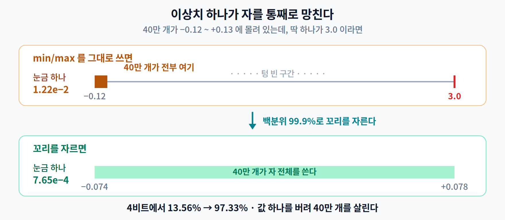
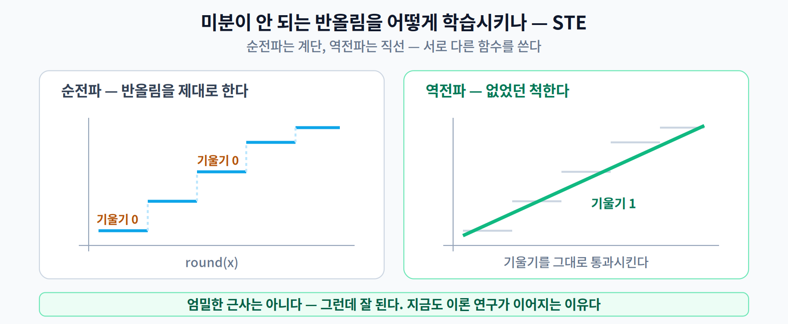

# 05주차 2교시. 같은 8비트인데 왜 결과가 다를까

**오늘의 질문** — 두 사람이 같은 모델을 INT8로 바꿨다. 압축률도 같고 비트 수도 같다. 그런데 한쪽은 정확도가 그대로고 한쪽은 무너졌다. **무엇이 달랐을까?**

1교시에서 **"눈금이 적은 게 문제가 아니라 어디에 펼치느냐가 문제"** 라고 했다. 2교시는 그 한 문장을 끝까지 밀고 간다. 답은 전부 **범위를 어떻게 잡느냐**에 있다.

---

## 2.1 스케일을 어디에 둘 것인가 (15분)

### 자를 몇 개 쓸 것인가

병원에서 키와 손톱 길이를 잰다고 하자. **자 하나로 둘 다 재면** 어떻게 될까? 눈금이 10cm 간격인 자를 쓰면 손톱은 "0"으로 기록된다. 손톱에 맞춰 눈금을 촘촘히 하면 이번엔 자가 너무 길어져 다루기 어렵다.

**답은 뻔하다 — 자를 두 개 쓰면 된다.**

모델도 똑같다. 층마다 가중치의 범위가 다르다. 3교시에서 쓸 모델을 실제로 재 보면 이렇다.

| 층 | 범위 폭 |
|---|---:|
| `conv1` | 0.7866 |
| `conv2` | 0.3929 |
| `fc1` | 0.2455 |
| `fc2` | 0.2679 |

**가장 넓은 층이 가장 좁은 층의 3.2배**다. 그런데 모델 전체에 자를 하나만 두면, 그 자는 **가장 넓은 층에 맞춰진다.** `fc1`은 자기 몫의 3분의 1도 못 쓰는 셈이다.

### 그래서 얼마나 차이가 날까

여기서 숫자를 말해 버리면 3교시가 시시해진다. 방향만 말해 두겠다.

> **8비트에서는 셋 다 똑같다.** 눈금이 256개나 되니 어디에 펼치든 여유가 있다. **그래서 8비트가 널리 쓰인다** — 세부 전략을 몰라도 대체로 잘 된다.
>
> **그런데 비트를 줄이면 갈린다.** 얼마나 갈리는지는 3교시에서 직접 만들어 볼 텐데, **"자를 몇 개 쓰느냐"만 바꿔도 정확도가 자릿수 단위로 움직인다**는 것만 미리 알아 두자.

**여유가 있을 때는 전략이 안 보이고, 여유가 사라지는 순간 드러난다.** 이번 주 3교시의 두 표가 전부 이 구조다.

### 세 가지 단위 — 이름을 붙여 두자

- **① 모델 전체에 하나** — 실무에서 쓰지 않는다. 3교시 표에서 **일부러 만든 극단**으로만 등장한다.
- **② 층(텐서)마다 하나 = per-tensor** — 가장 흔한 기본값.
- **③ 채널마다 하나 = per-channel** — 더 잘게 나눈다. 도구와 논문에서 만나는 것은 ②와 ③이다.

**①을 실재하는 선택지로 오해하지 말자.** "스케일을 하나만 두면 어떻게 되나"를 눈으로 보기 위한 대조군이다.

### 그럼 무조건 채널마다 두면 되나

아니다. **채널마다 나누면 범위는 잘 맞지만, 채널 하나하나의 범위가 좁아져 꼬리를 잘라 얻는 이득을 잃는다.** 그래서 어느 쪽이 이기는지가 비트 수에 따라 뒤집히기도 한다 — 3교시 표에서 직접 확인하게 된다.

게다가 **스케일 값을 채널 수만큼 저장**해야 하니 파일도 는다. 3교시에서 그 비용이 파일 크기에 그대로 찍혀 있는 것을 보게 된다.

**그래서 "무조건 채널별"이라는 답은 없다.** 어느 쪽이 맞는지는 — 늘 그렇듯 — **재 봐야 안다.**

> **한 줄 정리:** 스케일은 **잘게 나눌수록** 범위를 잘 맞출 수 있다. 다만 나누는 만큼 저장할 것도 늘고, 이득은 모델에 따라 다르다.

---

## 2.2 이상치 하나가 범위를 망친다 (13분)

### 반에서 제일 큰 사람에 맞춰 자를 만들면

반 전체의 키를 재려고 자를 하나 만든다. 그런데 한 명이 **3미터**다. 그 한 명이 들어가게 자를 만들면 눈금 간격이 10cm쯤 되고, **나머지 39명의 키가 전부 '160cm 언저리' 한두 칸에 뭉개진다.** 평균이 흔들리는 게 아니라 **자가 망가지는** 것이다.

스케일을 층마다 잘 나눠 뒀어도, 그 층 안에 **혼자 튀는 값이 하나** 있으면 똑같은 일이 벌어진다.

가중치가 전부 `-0.12 ~ +0.13` 사이인데 **딱 하나가 3.0**이라고 해 보자. 범위를 최솟값~최댓값으로 잡으면 자가 `-0.12 ~ 3.0`까지 늘어난다. **나머지 40만 개가 자의 맨 왼쪽 끄트머리에 몰린다.**



**해법은 꼬리를 잘라 내는 것**이다. **백분위 99.9%로 자른다**는 말은, 값들을 크기순으로 줄 세워 **위아래 0.1%씩을 버리고** 남은 구간만 자의 범위로 삼는다는 뜻이다.

실제로 재 보면 이렇다.

| | 쓰는 범위 | 눈금 간격 S | 평균 오차 |
|---|---|---:|---:|
| min/max 그대로 | −0.118 ~ **+3.000** | 1.22 × 10⁻² | 0.003068 |
| 백분위 99.9%로 자르기 | −0.074 ~ +0.078 | **5.95 × 10⁻⁴** | **0.000175** |

**눈금이 20배 굵어지고 오차가 18배 커졌다.** 값 하나 때문에.

### 그래서 정확도는?

여기가 중요하다. **8비트에서는 이래도 정확도가 거의 안 떨어진다.** 눈금이 256개나 되니 20배 굵어져도 아직 견딜 만하기 때문이다.

**그런데 비트를 줄이는 순간 무너진다.** 3교시에서 8비트부터 4비트까지 내려가며 재 볼 텐데, **어느 지점에서 무너지는지**를 직접 보게 된다.

> 여기서도 구조가 같다 — **여유가 있을 때는 이상치가 있어도 티가 안 나고, 여유가 사라지면 드러난다.**

### 그럼 왜 잘라도 되나

"범위 밖 값을 잘라 버리면(clipping) 그 값이 틀리지 않나?" 맞다. **그 하나는 틀린다.** 대신 **나머지 40만 개가 정확해진다.**

값 하나를 정확히 지키려고 나머지 전부를 뭉개는 것과, 값 하나를 포기하고 나머지를 살리는 것 — **어느 쪽이 이득인지는 세어 보면 답이 나온다.**

이것이 **보정(Calibration)** 이 하는 일이다. 보정 데이터를 흘려보내며 활성값의 범위를 재고, **어디서 자를지**를 정한다.


> **[더 깊이 — 선택]** 어디서 자를지를 정하는 방법이 여럿이다. **백분위**가 가장 단순하고, **KL 발산 최소화**(원래 분포와 양자화된 분포의 차이가 가장 작아지는 지점을 찾는다)는 TensorRT가 쓰던 고전적 방법이다. **MSE 최소화**도 흔하다. 어느 쪽이든 목표는 같다 — **꼬리를 얼마나 버려야 몸통이 살아나는가.**
>
> 정직하게 덧붙이면, 같은 구조의 모델로 따로 실험해 보면 **보정 데이터를 1장 쓰든 1000장 쓰든 정확도가 테스트 한 장 차이 안에서 움직였다.** 입력이 `0~1`로 이미 잘 정규화된 작은 모델이라 그렇다. (학습을 다시 돌린 별도 실행이라 3교시의 절대 수치와는 조금 다르다.) **큰 모델일수록, 활성값 분포가 사나울수록 보정이 중요해진다** — 특히 요즘 대형 언어모델에서는 활성값 이상치가 양자화의 핵심 난제다.

> **한 줄 정리:** 이상치 하나가 자를 통째로 망친다. **꼬리를 잘라 내는 것**이 정확도를 지키는 가장 값싼 방법이다.

---

## 2.3 학습 중에 미리 겪게 하기 — QAT와 STE (12분)

여기까지가 **PTQ** — 다 학습된 모델을 나중에 바꾸는 방법이다. 잘 되지만, 비트를 많이 줄이면 한계가 온다.

**그럼 학습할 때부터 양자화를 겪게 하면 어떨까?**

시합이 흙바닥에서 열리는데 연습만 잔디에서 하면 곤란하다. **연습도 흙바닥에서** 하면 몸이 미리 적응한다. 이것이 **QAT(Quantization-Aware Training)** 다.

방법은 이렇다. 학습 중 순전파에서 가중치를 **한 번 양자화했다가 되돌린다**(fake quantization). 그러면 모델은 양자화 오차가 섞인 값으로 학습하게 되고, **그 오차에 강한 가중치**를 찾아간다.

### 그런데 문제가 하나 있다

양자화에는 **반올림(round)** 이 들어 있다. 그런데 반올림 함수는 **역전파 신호를 통과시키지 못한다.**



반올림 함수를 그려 보면 **계단 모양**이다. 평평한 부분에서는 기울기가 **정확히 0**이고, 계단이 뛰어오르는 지점에서만 미분이 안 된다. 역전파는 기울기를 타고 거슬러 올라가는 방식인데, **기울기가 거의 모든 곳에서 0이면 신호가 사라진다.** 미분이 아예 불가능해서가 아니라, **미분값이 0이라 아무것도 전달되지 않는 것**이 문제다.

### 해법 — 못 본 척한다

**STE(Straight-Through Estimator)** 의 발상은 뻔뻔할 만큼 단순하다.

> **순전파에서는** 반올림을 제대로 한다.
> **역전파에서는** 반올림이 없었던 척하고 기울기를 그대로 통과시킨다.

코드로는 한 줄이다. PyTorch에서 이렇게 쓴다.

```python
w_q = w + (quantize(w) - w).detach()
```

`detach()`가 붙은 괄호는 **기울기 계산에서 제외된다.** 그래서 순전파에서는 `w_q`가 `quantize(w)`와 같은 값이 되고, 역전파에서는 `w`만 남아 **기울기가 1로 그대로 통과한다.** 트릭 전체가 이 한 줄에 들어 있다.

수학적으로 엄밀한 근사는 아니다. 순전파와 역전파가 서로 다른 함수를 쓰는 셈이니까. **그런데 잘 된다.** 그리고 이 "잘 되는데 왜 되는지는 아직 완전히 설명되지 않은" 성질 때문에, STE는 지금도 이론 연구가 이어지는 주제다.

> **한 줄 정리:** QAT는 **학습 때 미리 양자화를 겪게 하는 것**이고, 반올림의 **기울기가 0이라 신호가 사라지는 문제**를 STE로 우회한다.

---

## 2.4 정수가 실제로 빠른 이유 — 그리고 안 빠른 경우 (10분)

마지막으로, 4주차의 아픈 기억을 짚고 가자. **지난주엔 다 줄였는데 안 빨라졌다.** 이번엔 정말 빨라질까?

**대체로 빨라진다. 조건이 맞으면.**

**빨라지는 이유는 1교시에서 이미 봤다** — 옮길 게 1/4이고, 정수가 싸고, 한 삽에 네 배가 담긴다. 여기서 볼 것은 나머지 절반, **"그런데 왜 가끔 안 빨라지나"** 다. 4주차에서 배운 그 조건이 여기서도 그대로 적용된다.

> **모델의 일부만 양자화하면, 그 일부만 빨라진다.**

**왜 그런지는 4주차에서 이미 배웠다.** 전체 계산 시간 중 그 층이 차지하는 몫만큼만 좋아진다 — **암달의 법칙**이다. 4주차 3.3에서 "채널을 절반 줄였는데 왜 1.22배지?"를 물었던 그 자리와 정확히 같다.

그럼 우리 모델은 어느 쪽일까? **곱셈-누산(MAC — 2주차의 그 '곱하고 더하기'다)의 대부분을 합성곱이 쓴다.** 그러니 완전연결층만 바꿔서는 별 소용이 없을 것이다. 3교시에서 두 경우를 나란히 재 보면 이 예상이 맞는지 드러난다.

그리고 하나 더 — **정수 커널이 실제로 있어야 한다.** 4주차의 희소 커널 이야기와 판박이다. 다만 **INT8은 사정이 훨씬 낫다.** 희소 커널은 드물지만 INT8 커널은 거의 모든 런타임과 칩에 있다. **그게 양자화가 프루닝보다 널리 쓰이는 실질적인 이유다.**

**오늘의 토론 질문**

1. 8비트에서는 스케일을 어디에 두든 결과가 같았다. 그런데 3비트에서는 갈렸다. 왜일까?
2. 이상치를 잘라 내면 그 값은 틀리게 된다. 그런데도 잘라 내는 게 이득인 이유를 설명해 보자.
3. 4주차에서는 "다 지웠는데 안 빨라졌다"였고 이번 주는 "빨라진다"이다. 무엇이 달라서일까?

> 교수님을 위한 Tip: 1번을 **1교시의 자 그림으로 되돌아가** 풀게 하세요. "눈금 256개는 여유가 있고 8개는 없다"까지 나오면 충분합니다. 3번은 3교시 실측을 본 뒤에 다시 던지면 답이 훨씬 정확해집니다 — **지금 완벽한 답을 요구하지 마세요.**

---

### 2교시 정리
- **자를 몇 개 쓰느냐**가 정확도를 가른다 — ① 모델 전체 / ② 층마다(**per-tensor**) / ③ 채널마다(**per-channel**). ①은 대조군이고 실무는 ②·③이다.
- 다만 잘게 나눌수록 **스케일을 저장할 자리**도 늘고, 어느 쪽이 이기는지는 조건에 따라 뒤집힌다.
- **이상치 하나**가 자를 통째로 망친다. 8비트는 견디지만 비트를 줄이면 무너진다.
- **보정(Calibration)** 이 하는 일이 그 자르는 지점을 정하는 것이다.
- **QAT**는 학습 때 양자화를 미리 겪게 하고, 반올림의 **기울기가 0**이라는 문제를 **STE**로 우회한다.
- 양자화는 **대체로 빨라진다.** 단 **전부 바꿔야** 하고(암달), **정수 커널이 있어야** 한다 — INT8은 거의 어디에나 있다.
- 얼마나 갈리고 얼마나 빨라지는지는 **3교시에서 직접 만들어 본다.**

### 오늘의 용어 (4개만 기억하면 충분)
- **Per-tensor / Per-channel** — 스케일을 텐서 하나당 둘 것인가, 채널마다 둘 것인가.
- **보정(Calibration)** — 데이터를 흘려보내 범위를 재고 자를 지점을 정하는 과정.
- **클리핑(Clipping)** — 범위 밖 값을 잘라 내는 것. 하나를 버려 나머지를 살린다.
- **STE** — 순전파는 반올림하고 역전파는 없던 척 기울기를 통과시키는 우회법.

### 더 읽어보기 (관심 있는 학생만)
[1] R. Krishnamoorthi, "Quantizing deep convolutional networks for efficient inference: A whitepaper," 2018. (per-channel·대칭/비대칭의 실증 비교가 잘 정리되어 있다)
[2] Y. Bengio et al., "Estimating or Propagating Gradients Through Stochastic Neurons for Conditional Computation," 2013. (STE를 정식화한 논문. 아이디어 자체는 Hinton의 2012년 강의에서 비롯됐다고 이 논문이 밝히고 있다)
[3] T. Dettmers et al., "LLM.int8(): 8-bit Matrix Multiplication for Transformers at Scale," *NeurIPS*, 2022. (활성값 이상치가 왜 어려운 문제인지 — 2.2의 연장)
