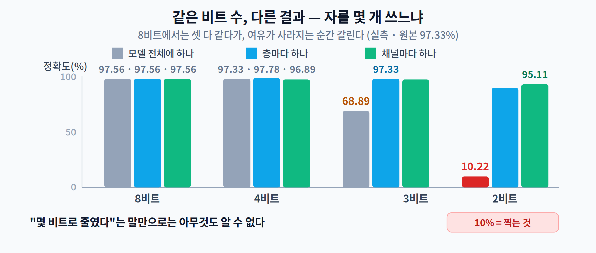

# 05주차 3교시. 세 개의 숫자를 다시 재 보기

**오늘 확인할 것** — 지난주에는 다섯 개를 재고 **희소성만 움직이고 시계는 안 움직이는 것**을 봤다. 오늘은 같은 모델을 INT8로 바꿔서 **파일·속도·정확도**를 다시 잰다. 그리고 2교시가 "3교시에서 직접 만들어 보라"며 미뤄 둔 두 표를 만든다.

> 준비물: 4주차 환경(`torch`, `scikit-learn`, `numpy`) + **3.3에서 `tensorflow-cpu`와 `ai-edge-litert`**.
> **3.1~3.2는 4주차 모델을 그대로 쓴다.** 지난주 코드를 재활용하면 비교가 정확해진다.
> **3.3의 TFLite 변환만** 같은 구조를 Keras로 다시 만들어 학습시킨다(변환기가 Keras 모델을 받으므로). 구조·데이터·에폭이 같아 비교는 유효하지만, FP32 파일 크기가 4주차와 몇백 바이트 다른 이유가 이것이다.
> 3.1~3.2는 약 1분, 3.3은 TensorFlow 설치를 빼고 약 2분 걸린다.

---

## 3.1 손으로 만들어 보는 양자화 (10분)

라이브러리에 맡기기 전에 **1교시의 두 식을 직접 코드로** 써 본다. 열 줄이면 된다.

```python
# (4주차의 준비 코드 — 데이터·Net·train·acc — 를 그대로 가져온다)
base = train(Net())
print(f"원본 정확도 : {acc(base):.2%}")

def quantize(x, bits=8):
    """실수 텐서를 정수로 — 1교시의 그 두 식 그대로."""
    qmin, qmax = -(2**(bits-1)), 2**(bits-1)-1
    mn, mx = float(x.min()), float(x.max())
    S = (mx - mn) / (qmax - qmin)          # 눈금 하나가 실수로 얼마인가
    Z = round(qmin - mn / S)               # 실수 0이 정수 몇 번인가
    xq = torch.clamp(torch.round(x/S + Z), qmin, qmax)
    return xq, S, Z

def dequantize(xq, S, Z):
    return S * (xq - Z)

W = base.fc1.weight.detach()
print(f"fc1.weight  min {float(W.min()):+.4f}  max {float(W.max()):+.4f}  std {float(W.std()):.4f}")
xq, S, Z = quantize(W, 8)
back = dequantize(xq, S, Z)
print(f"  S = {S:.6e}   Z = {Z}")
print(f"  정수 범위 {int(xq.min())} ~ {int(xq.max())}   서로 다른 값 {len(xq.unique())}개")
print(f"  복원 오차  평균절대 {float((back-W).abs().mean()):.6f}")
print(f"  → 가중치 표준편차의 {float((back-W).abs().mean())/float(W.std()):.2%}")
```

```
원본 정확도 : 97.33%
fc1.weight  min -0.1178  max +0.1277  std 0.0180
  S = 9.626268e-04   Z = -6
  정수 범위 -128 ~ 127   서로 다른 값 235개
  복원 오차  평균절대 0.000241
  → 가중치 표준편차의 1.34%
```

**숫자 세 개를 읽자.**

**① `S = 9.63 × 10⁻⁴`** — 눈금 하나가 0.000963이다. 가중치 범위가 `−0.118 ~ +0.128`(폭 0.2455)이니, `0.2455 ÷ 255 ≈ 0.000963`. 1교시의 "범위 폭 ÷ 칸 수"가 그대로 나온 것이다 — 값은 256가지지만 **칸은 255개**다.

**② `Z = -6`** — 실수 0이 정수 −6번 눈금에 있다. 가중치 분포가 0을 중심으로 **살짝 치우쳐** 있다는 뜻이다(음수 쪽이 조금 좁다). 완전히 대칭이면 Z는 0에 가까웠을 것이다.

**③ 오차가 표준편차의 1.34%** — 40만 개 값을 256칸에 욱여넣었는데 오차가 이 정도다. **범위만 제대로 잡으면 8비트로 충분하다**는 1교시의 주장이 숫자로 확인된다.

> `서로 다른 값 235개` — 256칸을 다 쓰지 못한 이유는, 가중치가 종 모양으로 분포해 양 끝 칸에 해당하는 값이 거의 없기 때문이다. 이미 여기에 **"꼬리를 잘라도 될 것 같다"** 는 힌트가 들어 있다 — 3.2 후반의 이상치 이야기로 이어진다.

---

## 3.2 스케일을 어디에 두느냐 (14분)

이제 2교시의 두 표를 직접 만든다. **비트 수는 그대로 두고, 자를 어디에 놓을지만 바꾼다.**

### 먼저 층별 범위 확인

```python
for n, mod in base.named_modules():
    if isinstance(mod, (nn.Conv2d, nn.Linear)):
        w = mod.weight.data
        print(f"  {n:6s} min {float(w.min()):+.4f}  max {float(w.max()):+.4f}  범위폭 {float(w.max()-w.min()):.4f}")
```

```
  conv1  min -0.3544  max +0.4322  범위폭 0.7866
  conv2  min -0.2014  max +0.1915  범위폭 0.3929
  fc1    min -0.1178  max +0.1277  범위폭 0.2455
  fc2    min -0.1397  max +0.1282  범위폭 0.2679
```

**가장 넓은 층이 가장 좁은 층의 3.2배**다. 자를 하나만 쓰면 `conv1`에 맞춰지고, `fc1`은 자기 몫의 3분의 1도 못 쓴다.

### 자를 하나 / 층마다 / 채널마다

```python
def q_with_range(x, bits, mn, mx):
    qmin, qmax = -(2**(bits-1)), 2**(bits-1)-1
    S = (mx-mn)/(qmax-qmin); Z = round(qmin - mn/S)
    return S*(torch.clamp(torch.round(x/S+Z), qmin, qmax)-Z)

def scale_whole(model, bits):                    # ① 모델 전체에 자 하나
    m = copy.deepcopy(model)
    ws = torch.cat([mod.weight.data.flatten() for mod in m.modules()
                    if isinstance(mod,(nn.Conv2d,nn.Linear))])
    mn, mx = float(ws.min()), float(ws.max())
    with torch.no_grad():
        for mod in m.modules():
            if isinstance(mod,(nn.Conv2d,nn.Linear)):
                mod.weight.copy_(q_with_range(mod.weight.data, bits, mn, mx))
    return m

def scale_layer(model, bits):                    # ② 층마다 자 하나
    m = copy.deepcopy(model)
    with torch.no_grad():
        for mod in m.modules():
            if isinstance(mod,(nn.Conv2d,nn.Linear)):
                w = mod.weight.data
                mod.weight.copy_(q_with_range(w, bits, float(w.min()), float(w.max())))
    return m

def scale_channel(model, bits):                  # ③ 채널마다 자 하나
    m = copy.deepcopy(model); qmin, qmax = -(2**(bits-1)), 2**(bits-1)-1
    with torch.no_grad():
        for mod in m.modules():
            if isinstance(mod,(nn.Conv2d,nn.Linear)):
                w = mod.weight.data; f = w.reshape(w.shape[0], -1)
                mn = f.min(1).values; mx = f.max(1).values
                S = torch.clamp((mx-mn)/(qmax-qmin), min=1e-12); Z = torch.round(qmin - mn/S)
                fq = torch.clamp(torch.round(f/S[:,None] + Z[:,None]), qmin, qmax)
                mod.weight.copy_((S[:,None]*(fq-Z[:,None])).reshape(w.shape))
    return m

print(f"{'비트':>5} {'모델 전체에 하나':>17} {'층마다 하나':>13} {'채널마다 하나':>14}")
for b in [8, 4, 3, 2]:
    print(f"{b:>4}b {acc(scale_whole(base,b)):>17.2%} "
          f"{acc(scale_layer(base,b)):>13.2%} {acc(scale_channel(base,b)):>14.2%}")
```

```
   비트         모델 전체에 하나        층마다 하나        채널마다 하나
   8b            97.56%        97.56%         97.56%
   4b            97.33%        97.78%         96.89%
   3b            68.89%        97.33%         96.89%
   2b            10.22%        89.33%         95.11%
```



**표를 읽기 전에 4주차의 잣대를 다시 꺼내자.** 테스트가 450장이므로 **1장이 0.22%p**다. 97.78%와 97.33%는 **두 장 차이**이니 "층별이 채널별보다 낫다"고 읽으면 안 된다. **이 표에서 읽어야 할 것은 소수점이 아니라 자릿수다.**

**8비트 줄은 셋 다 97.56%로 똑같다.** 여유가 있으니 전략이 안 보인다. 그런데 **3비트로 내려가면 68.89% vs 97.33%** 로 갈린다. 2비트에서는 **10.22%** — 열 개 중 하나를 고르는 문제에서 10%면 **찍는 것**이다.

2비트에서는 **채널별이 층별을 이긴다**(95.11% vs 89.33%). 여유가 완전히 사라지면 범위를 정확히 맞추는 이득이 앞선다는 뜻이다. **어느 쪽이 이기는지가 조건에 따라 뒤집힌다** — 2교시에서 "무조건 채널별이라는 답은 없다"고 한 이유가 이것이다.

> 대부분의 실무가 8비트에 머무는 이유가 이 표에 있다. 8비트에서는 웬만하면 잘 되고, 그 아래로 내려가는 순간 **전략이 정확도를 지배하기 시작한다.**

### 이상치 하나 심어 보기

```python
Wo = base.fc1.weight.data.clone()
Wo[0, 0] = 3.0                                   # 이상치 하나
print(f"fc1 범위가 {float(Wo.min()):+.3f} ~ {float(Wo.max()):+.3f} 으로 늘어난다")

print(f"{'비트':>5} {'min/max 그대로':>16} {'백분위 99.9%로 자르기':>22}")
for b in [8, 6, 5, 4]:
    r = []
    for mn, mx in [(float(Wo.min()), float(Wo.max())),
                   (float(np.percentile(Wo.numpy(), 0.1)),
                    float(np.percentile(Wo.numpy(), 99.9)))]:
        m = copy.deepcopy(base)
        with torch.no_grad(): m.fc1.weight.copy_(q_with_range(Wo, b, mn, mx))
        r.append(acc(m))
    print(f"{b:>4}b {r[0]:>16.2%} {r[1]:>22.2%}")
```

```
fc1 범위가 -0.118 ~ +3.000 으로 늘어난다
   비트      min/max 그대로         백분위 99.9%로 자르기
   8b           97.33%                 97.56%
   6b           97.56%                 97.56%
   5b           83.33%                 97.56%
   4b           13.56%                 97.33%
```


**4비트에서 13.56% vs 97.33%.** 값 **하나**를 잘라 냈느냐 아니냐의 차이다. 여기서도 8비트는 멀쩡한데(97.33%) 비트를 줄이자 무너진다 — **여유가 사라지는 순간 전략이 드러난다**는 같은 이야기다.

---

## 3.3 진짜 배포 형식으로 (21분)

지금까지는 **개념 확인**이었다. 값을 0으로 만들었다 되돌렸을 뿐, 실제로는 여전히 FP32로 계산하고 있다. **파일도 안 줄고 속도도 안 변한다.**

> 4주차에서 `prune`이 마스크만 씌웠던 것과 정확히 같은 상황이다. **진짜로 줄이려면 진짜 INT8로 저장하고 실행해야 한다.**

### 전부 정수로 바꾸기 — TFLite INT8

3주차에서 만든 `.tflite` 변환 경로를 INT8로 확장한다. 같은 구조의 모델을 Keras로 만들어 변환한다.

```bash
pip install tensorflow-cpu ai-edge-litert     # 변환기와 실행기 (약 500MB)
```

```python
import tensorflow as tf, numpy as np
# (같은 digits 데이터를 Keras 형식으로 준비하고, 같은 구조의 모델을 12에폭 학습)

# ① FP32 그대로 변환 (비교군)
fp32 = tf.lite.TFLiteConverter.from_keras_model(m).convert()

# ② INT8 완전 양자화 — 가중치도 활성값도 입출력도 전부 정수
def representative_data():                  # 2교시의 그 보정(Calibration)
    for i in range(200): yield [Xtr[i:i+1]]

c = tf.lite.TFLiteConverter.from_keras_model(m)
c.optimizations = [tf.lite.Optimize.DEFAULT]
c.representative_dataset = representative_data
c.target_spec.supported_ops = [tf.lite.OpsSet.TFLITE_BUILTINS_INT8]
c.inference_input_type = tf.int8            # 입출력까지 정수
c.inference_output_type = tf.int8
int8 = c.convert()
```

`ai-edge-litert`로 두 모델을 실행해 **파일·속도·정확도를 각각** 잰다.

```
          모델             파일       정확도        지연(ms)      속도비
          FP32   1,690,748 B    97.33%     0.110±0.001     1.00
          INT8     432,592 B    97.33%     0.057±0.004     1.94
```


**세 개가 전부 움직였다.**

- **파일** 1,690,748 → 432,592 B = **3.91배 작음**
- **속도** 0.110 → 0.057 ms = **1.94배 빠름**
- **정확도** 97.33% → **97.33%** (450장 중 **예측이 한 장도 바뀌지 않았다**)

지난주에는 99%를 지우고도 아무것도 안 움직였다. **이번엔 정확도를 한 톨도 안 내주고 셋 다 움직였다.**

### 그런데 "전부"가 중요하다

같은 모델에 PyTorch의 **동적 양자화**(완전연결층만 INT8로)를 적용해 보면 이렇다.

| | 실행 환경 | 파일 | 속도 |
|---|---|---:|---:|
| 동적 양자화 (완전연결층만) | PyTorch `.pt` | 3.50배 작음 | **1.03배** |
| 완전 양자화 (전부 정수) | LiteRT `.tflite` | 3.91배 작음 | **1.94배** |

> 두 줄은 **파일 형식도 실행기도 다르다.** 엄밀한 A/B는 아니니 배율을 직접 비교하기보다, **"일부만 바꾸면 속도가 안 움직인다"** 는 방향만 읽자.

**파일은 둘 다 줄었는데 속도는 하나만 움직였다.** 이 모델은 **곱셈-누산(MAC — 2주차의 그 '곱하고 더하기'다)의 90.5%를 합성곱이 쓰는데**(424만 번 중 384만 번), 동적 양자화는 완전연결층만 바꿨기 때문이다.

**암달의 법칙이 또 나왔다.** 4주차 3.3에서 "채널을 절반 줄였는데 왜 1.22배지?"를 물었던 그 자리와 같다 — **전체 중 일부만 개선하면 전체는 그 비율만큼만 좋아진다.**

### 8주차에서 쓸 파일 만들기

같은 방법으로 **MCU에 올릴 작은 모델**도 하나 변환해 둔다. **8주차 실습 전체가 이 파일에 걸려 있으니 지우지 말 것.**

```python
# MCU에 올릴 만한 작은 CNN (입력 96x96 컬러) — 8주차에서 이 모델을 그대로 쓴다
model = tf.keras.Sequential([
    tf.keras.layers.Input(shape=(96, 96, 3)),
    tf.keras.layers.Conv2D(16, 3, strides=2, padding="same", activation="relu"),
    tf.keras.layers.Conv2D(32, 3, strides=2, padding="same", activation="relu"),
    tf.keras.layers.Conv2D(64, 3, strides=2, padding="same", activation="relu"),
    tf.keras.layers.GlobalAveragePooling2D(),
    tf.keras.layers.Dense(10),
])

def rep_96():
    for _ in range(100):
        yield [np.random.rand(1, 96, 96, 3).astype(np.float32)]

fp32 = tf.lite.TFLiteConverter.from_keras_model(model).convert()
open("tinycnn_fp32.tflite", "wb").write(fp32)

conv = tf.lite.TFLiteConverter.from_keras_model(model)
conv.optimizations = [tf.lite.Optimize.DEFAULT]
conv.representative_dataset = rep_96
conv.target_spec.supported_ops = [tf.lite.OpsSet.TFLITE_BUILTINS_INT8]
conv.inference_input_type = tf.int8
conv.inference_output_type = tf.int8
int8 = conv.convert()
open("tinycnn_int8.tflite", "wb").write(int8)

print(f"FP32 .tflite : {len(fp32):,} bytes")
print(f"INT8 .tflite : {len(int8):,} bytes   ({len(fp32)/len(int8):.1f}배 작음)")
```

```
FP32 .tflite : 99,516 bytes
INT8 .tflite : 30,360 bytes   (3.3배 작음)
```

> 변환 중 `Statistics for quantized inputs were expected, but not specified` 경고가 뜨는데, 보정 데이터로 범위를 잡았으니 무시해도 된다.
>
> 뒤이어 `fully_quantize: 0, inference_type: 6, input_inference_type: INT8, output_inference_type: INT8` 같은 줄이 나온다. 앞의 `fully_quantize: 0`은 **변환기 내부 플래그 값이라 신경 쓰지 않아도 된다**(입출력을 실수로 두어도 똑같이 0이 찍힌다). 실제로 봐야 할 것은 뒤쪽 — `inference_type: 6`(내부 활성값이 int8)과 `input/output_inference_type: INT8`이다.
>
> 확실한 확인 방법은 실행기에게 직접 물어보는 것이다.
>
> ```python
> from ai_edge_litert.interpreter import Interpreter
> it = Interpreter(model_path="tinycnn_int8.tflite"); it.allocate_tensors()
> print(it.get_input_details()[0]["dtype"])     # <class 'numpy.int8'> 이면 완전 양자화
> ```

**같은 방법으로 1교시의 예고도 갚을 수 있다.** 텐서별 양자화 정보를 들여다보자.

```python
for d in it.get_tensor_details():
    qp = d["quantization_parameters"]
    if len(qp["scales"]):
        print(f'{d["name"][:38]:40s} scale {len(qp["scales"]):>3}개  zero_point {qp["zero_points"][:3]}')
```

**가중치 텐서는 `zero_point`가 전부 0**(대칭)이고 **`scale`이 채널 수만큼의 배열**이다. **활성값 텐서는 `zero_point`가 0이 아니고**(비대칭) `scale`은 하나다.

1교시 1.3에서 예고한 **"가중치는 대칭, 활성값은 비대칭"** 이 파일 안에 그대로 들어 있다. 그리고 가중치 쪽 `scale`이 숫자 하나가 아니라 **배열**이라는 것 — 바로 아래 "부대 정보가 오히려 늘어난다"의 정체가 이것이다.

**"4배가 아니라 3.3배네요?"** — 가장 많이 나오는 질문이고, 따져 보면 배울 것이 있다. 이 모델의 파라미터는 24,234개다.

| | 파라미터 버퍼 | 파일 전체 | 부대 정보 |
|---|--:|--:|--:|
| FP32 | 96,936 B | 99,516 B | 2,580 B |
| INT8 | 24,600 B | 30,360 B | **5,760 B** |
| 비율 | **3.94배** | 3.28배 | — |

**가중치는 거의 4배로 준다.** 딱 4배가 아닌 이유가 둘이다.

**① 편향(bias)은 int8이 아니라 int32로 저장된다.** int8 × int8을 **수천 번 더하면** 8비트 범위(−128~127)를 금방 넘는다. 그래서 곱셈 결과를 모으는 그릇은 **int32**로 두고, 거기에 함께 더해지는 편향도 같은 그릇에 맞춰 int32로 저장한다. **가중치는 곱해지는 쪽이라 8비트로 충분하고, 편향은 더해지는 쪽이라 그렇지 않다.** 이 모델은 파라미터 24,234개 중 122개가 편향인데, 가중치는 24,112 B로 줄어든 반면 편향은 488 B를 차지해 합이 24,600 B가 된다.

**② 부대 정보가 오히려 늘어난다.** INT8 모델은 **채널마다 스케일을 따로 들고 다녀야** 하기 때문이다(가중치의 제로포인트는 0으로 고정되지만, 그 0들도 자리를 차지한다). 2교시 2.1에서 "잘게 나눌수록 저장할 것도 는다"고 한 그 비용이 **파일에 그대로 찍혀 있는 것**이다.

모델이 작을수록 이 고정 비용의 비중이 커져 4배에 못 미치고, 모델이 커질수록 4배에 수렴한다. 앞의 digits 모델이 **3.91배**로 4배에 더 가까웠던 이유가 이것이다.

### 지난주와 나란히 놓고 보기


| | 4주차 — 비구조적 99% | 4주차 — 구조적 50% | **5주차 — INT8** |
|---|---:|---:|---:|
| 파일 크기 | 그대로 | 절반 | **3.91배 작음** |
| 속도 | 1.02배 | 1.22배 | **1.94배** |
| 정확도 | 51.78% | 97.33% (**미세조정 후**) | **97.33%** (재학습 없이) |

**구조적 프루닝도 움직이긴 했다.** 다만 **자르고 다시 학습시켜서** 정확도를 되사 왔다. 양자화는 **재학습 한 번 없이, 정확도를 한 톨도 안 내주고** 그보다 큰 폭을 얻었다.

> 이번 주의 대비는 **"움직이나 안 움직이나"가 아니라 "무엇을 치르고 움직이나"** 다.

**그럼 비구조적 프루닝은 왜 아무것도 못 얻었을까?** 답은 지난주에 이미 나와 있다.

> 프루닝은 값을 **0으로 바꿨을 뿐** 여전히 4바이트로 저장하고, 밀집 커널은 그 0도 그대로 곱했다.
> 양자화는 **적는 방식 자체를 바꾼다.** 4바이트가 1바이트가 되고, 정수 커널이 실제로 그 1바이트를 다룬다.

**둘 다 "줄인다"고 말하지만, 하드웨어가 실제로 다르게 취급한다.** 그리고 INT8 커널은 거의 모든 런타임과 칩에 들어 있다 — **그게 양자화가 사실상 기본값이 된 이유다.**

> **한 줄 정리:** 양자화는 **파일도 속도도 진짜로 줄인다.** 단, **전부 바꿔야** 하고(암달), 정확도는 **범위를 어떻게 잡았느냐**에 달렸다.

---

## 3.4 과제 (5분 안내)

1. **세 지표 표** — FP32와 INT8 `.tflite`의 **파일·지연·정확도**를 측정해 표로 제출하고, 4주차 프루닝 결과와 나란히 놓아 비교한다. 무엇이 달랐고 왜 다른지 3~4문장.
2. **자를 옮겨 보기** — 3.2의 표를 본인 기기에서 재현한다. 여러분 모델에서는 **몇 비트에서 갈리기 시작하는가?**
3. **이상치 실험** — 심는 이상치의 크기를 `0.5, 1.0, 3.0, 10.0`으로 바꿔 가며 4비트 정확도를 재고, 그래프로 그린다. **얼마나 커야 문제가 되는가?**
4. **조건 밝히기** — 1번 결론을 한 문장으로 쓰되 **어떤 조건에서 잰 것인지**(하드웨어·스레드·실행 경로)를 반드시 함께 적는다. 4주차 과제 4번과 같은 요구다.
5. **배포 파일 확인** — `tinycnn_int8.tflite`의 크기를 적고, 가상의 MCU Flash 예산(예: 1MB)의 몇 %인지 계산한다. **8주차에서 이 파일을 이어서 쓴다.**
6. **다음 주 예습** — 6주차는 **지식 증류**다. 값을 줄이는 대신 **큰 모델의 지식을 작은 모델에 전수**한다. *"정답만 알려 주는 것과, 큰 모델이 각 답에 매긴 확률을 통째로 알려 주는 것은 무엇이 다를까?"*

> 교수님을 위한 Tip: 3.2의 표를 보여줄 때 **8비트 줄을 먼저 보여주고 "차이가 없네요?"를 확인**시킨 뒤, 3비트 줄을 여세요. 여유가 있을 때는 전략이 안 보이다가 여유가 사라지는 순간 드러난다는 것이 이번 주의 구조입니다.
>
> 운영 면에서는 `tensorflow-cpu` 설치가 3교시에서 가장 오래 걸립니다. **직전 주에 미리 받아 오게 하시고**, 막히는 학생을 위해 `tinycnn_int8.tflite`를 조교 배포본으로 준비해 두세요(30KB). **8주차 실습 전체가 이 파일에 걸려 있습니다.**

---

### 3교시 정리
- 1교시의 두 식을 **직접 구현**했다 — `S = 9.63×10⁻⁴`, `Z = -6`, 오차는 표준편차의 **1.34%**.
- 자를 어디에 두느냐: 8비트는 셋 다 같지만 **3비트에서 68.89% vs 97.33%**. 2비트에서는 채널별이 이긴다 — **조건에 따라 뒤집힌다.**
- 이상치 하나: 8비트는 멀쩡하지만 **4비트에서 13.56% vs 97.33%**.
- **INT8 완전 양자화는 파일 3.91배·속도 1.94배·정확도 그대로.** 4주차와 정반대다.
- 파일이 딱 4배가 아닌 이유 — **편향은 int32**로 저장되고, **채널별 스케일**이 부대 정보로 붙는다.
- 단 **전부 바꿔야** 한다 — 완전연결층만 바꾸면 파일은 3.5배 줄어도 속도는 1.03배(암달).
- `tinycnn_int8.tflite`를 만들었다. **8주차에서 MCU에 올린다 — 지우지 말 것.**
- 다음 주는 **지식 증류** — 값을 줄이는 대신 작은 모델을 새로 가르친다.
