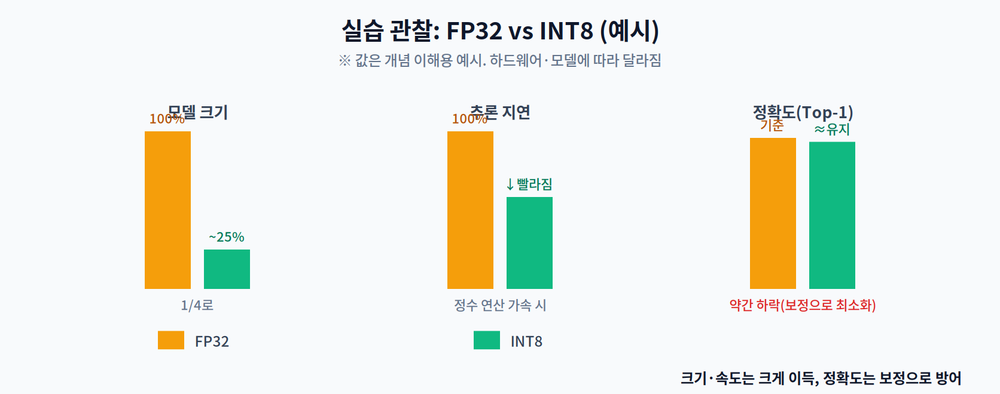

# 05주차 3교시. 양자화 적용과 크기·속도·정확도 비교

**실습 목표** — PyTorch로 모델을 INT8로 양자화해 **모델 크기가 실제로 1/4로 주는 것**과 속도 변화를 측정하고, 정확도 트레이드오프는 개념적으로 함께 짚는다.

> 준비물: 1주차 환경(`odai`) + `torch`. 3.3에서는 `tensorflow-cpu`를 추가로 설치한다(약 500MB, 미리 받아 둘 것). 이번에도 CPU만으로 충분하다.

---

## 3.1 양자화 적용 (15분)

가장 간단한 **동적 양자화(Dynamic Quantization)** 를 Linear 레이어로 구성된 작은 모델에 적용한다. 동적 양자화는 가중치를 미리 INT8로 바꾸고 활성값은 추론 시점에 처리하므로, 보정 데이터 없이 한 줄로 적용된다.

```python
import torch, torch.nn as nn, os

class Net(nn.Module):
    def __init__(self):
        super().__init__()
        self.net = nn.Sequential(
            nn.Linear(512, 512), nn.ReLU(),
            nn.Linear(512, 256), nn.ReLU(),
            nn.Linear(256, 10))
    def forward(self, x): return self.net(x)

fp32 = Net().eval()

# 동적 양자화: Linear 레이어의 가중치를 INT8로 (torch.ao.quantization 도 동일)
int8 = torch.quantization.quantize_dynamic(fp32, {nn.Linear}, dtype=torch.qint8)
print(int8)     # Linear → DynamicQuantizedLinear 로 바뀐 것을 확인
```

---

## 3.2 크기·속도·정확도 비교 (15분)

**모델 크기** — 상태 사전(state_dict)을 저장해 파일 크기를 잰다.

```python
def size_kb(m, path):
    torch.save(m.state_dict(), path)
    return os.path.getsize(path) / 1024

print(f"FP32 : {size_kb(fp32,'fp32.pt'):.1f} KB")
print(f"INT8 : {size_kb(int8,'int8.pt'):.1f} KB   (약 1/4)")
```

**추론 속도** — 큰 배치로 두 모델의 지연을 비교한다.

```python
import time
x = torch.randn(256, 512)

def bench(m, runs=50):
    m.eval()
    with torch.no_grad():
        m(x)                                  # 워밍업
        t0 = time.perf_counter()
        for _ in range(runs): m(x)
        return (time.perf_counter()-t0)/runs*1000   # ms

print(f"FP32 : {bench(fp32):.2f} ms")
print(f"INT8 : {bench(int8):.2f} ms")
```



관찰의 핵심:

1. **크기**는 거의 확실히 약 1/4로 준다(가중치가 32→8비트). 이것이 양자화의 가장 확실한 이득이다.
2. **속도**는 하드웨어·연산 종류에 따라 다르다. 정수 연산 가속(SIMD/NPU)이 받쳐줄 때 빨라진다 — 노트북 CPU에서는 큰 행렬일수록 이득이 잘 보인다.
3. **정확도**는 약간 떨어질 수 있으나, 2교시의 Calibration·Per-channel·QAT로 최소화한다.

> 관찰 포인트: "크기는 항상 준다, 속도는 하드웨어에 달렸다, 정확도는 방어할 수 있다" — 이 셋을 분리해서 보는 것이 양자화를 이해하는 핵심이다.

---

## 3.3 진짜 배포 형식으로 — INT8 완전 양자화와 `.tflite` (15분)

3.1의 동적 양자화는 **개념을 확인하는 용도**다. 가중치만 INT8로 바꾸고 활성값은 추론 시점에 실수로 처리하므로, FPU가 없는 MCU에는 그대로 올릴 수 없다. MCU에 올리려면 **입력부터 출력까지 전부 정수**여야 한다. 이것이 **완전 양자화(Full Integer Quantization)** 이고, 여기서 2교시의 **보정(Calibration)** 이 실제로 등장한다. 활성값의 min/max를 모르면 정수 범위로 접을 수가 없기 때문에, 대표 데이터를 흘려보내 그 범위를 재는 것이다.

여기서 만든 모델은 **8주차에서 MCU에 올릴 바로 그 모델**이므로, 산출물 두 개를 잘 보관해 둔다.

```bash
pip install tensorflow-cpu        # 변환기는 TensorFlow에 들어 있다 (약 500MB)
```

```python
import numpy as np, tensorflow as tf

# MCU에 올릴 만한 작은 CNN (입력 96x96 컬러) — 8주차에서 이 모델을 그대로 쓴다
model = tf.keras.Sequential([
    tf.keras.layers.Input(shape=(96, 96, 3)),
    tf.keras.layers.Conv2D(16, 3, strides=2, padding="same", activation="relu"),
    tf.keras.layers.Conv2D(32, 3, strides=2, padding="same", activation="relu"),
    tf.keras.layers.Conv2D(64, 3, strides=2, padding="same", activation="relu"),
    tf.keras.layers.GlobalAveragePooling2D(),
    tf.keras.layers.Dense(10),
])

# ① 보정 데이터(Calibration) — 2교시의 그 보정이다.
#    실제 입력 분포를 100장쯤 흘려보내 활성값의 min/max를 잡는다.
def representative_data():
    for _ in range(100):
        yield [np.random.rand(1, 96, 96, 3).astype(np.float32)]

# ② FP32 그대로 변환 (비교군)
fp32 = tf.lite.TFLiteConverter.from_keras_model(model).convert()
open("tinycnn_fp32.tflite", "wb").write(fp32)

# ③ INT8 완전 양자화 — 가중치도 활성값도 전부 정수
conv = tf.lite.TFLiteConverter.from_keras_model(model)
conv.optimizations = [tf.lite.Optimize.DEFAULT]
conv.representative_dataset = representative_data
conv.target_spec.supported_ops = [tf.lite.OpsSet.TFLITE_BUILTINS_INT8]
conv.inference_input_type = tf.int8      # 입출력까지 정수로 (MCU에는 FPU가 없다)
conv.inference_output_type = tf.int8
int8 = conv.convert()
open("tinycnn_int8.tflite", "wb").write(int8)

print(f"FP32 .tflite : {len(fp32):,} bytes")
print(f"INT8 .tflite : {len(int8):,} bytes   ({len(fp32)/len(int8):.1f}배 작음)")
```

실행 결과는 이렇게 나온다.

```
FP32 .tflite : 99,516 bytes
INT8 .tflite : 30,360 bytes   (3.3배 작음)
```

> 변환 중 `Statistics for quantized inputs were expected, but not specified` 경고가 뜨는데, 보정 데이터로 범위를 잡았으니 무시해도 된다. 뒤이어 나오는 `fully_quantize: 0, inference_type: 6` 줄이 완전 양자화가 됐다는 표시다.

**"4배가 아니라 3.3배네요?"** — 첫 실습에서 학생이 가장 많이 하는 질문이고, 답을 따져 보면 배울 것이 있다. 이 모델의 파라미터는 24,234개다.

| | 가중치만 | 파일 전체 | 부대 정보 |
|---|--:|--:|--:|
| FP32 | 96,936 B | 99,516 B | 2,580 B |
| INT8 | 24,234 B | 30,360 B | **6,126 B** |
| 비율 | **정확히 4.0배** | 3.3배 | — |

가중치는 정확히 4배로 준다. 다만 INT8 모델은 채널마다 **스케일과 영점(zero-point)** 을 따로 들고 다녀야 해서 부대 정보가 오히려 늘어난다. 모델이 작을수록 이 고정 비용의 비중이 커지므로 4배에 못 미치고, 모델이 커질수록 4배에 수렴한다.

> **한 줄 정리:** 동적 양자화는 개념 확인용, **완전 양자화가 배포용**이다. 그리고 완전 양자화의 문턱이 바로 보정(Calibration)이다.

---

## 3.4 과제 (5분 안내)

1. **3지표 비교표** — 본인 모델(위 예제 또는 더 큰 Linear 모델)에서 FP32/INT8의 **크기·추론시간(평균·표준편차)** 을 측정해 표로 제출하고, 크기 절감률(%)을 계산한다.
2. **속도 해석** — INT8이 기대만큼 안 빨라졌다면(또는 빨라졌다면) 그 이유를 2교시의 SIMD·정수 유닛 관점으로 3~4문장 서술한다.
3. **PTQ vs QAT 조사** — 본인 도메인 모델에 PTQ와 QAT 중 무엇이 적합할지, 정확도·비용을 근거로 한 문단으로 정리한다.
4. **배포 파일 확인** — 3.3에서 만든 `tinycnn_int8.tflite`의 크기를 적고, 가상의 MCU Flash 예산(예: 1MB)의 몇 %를 쓰는지 계산한다. (8주차에서 이 파일을 이어서 쓴다.)
5. **다음 주 예습** — 6주차(지식 증류)에서는 값을 줄이는 대신 **큰 모델의 지식을 작은 모델에 전수**한다. "정답(hard label)만이 아니라 큰 모델의 확률분포(soft label)를 배우면 왜 더 잘 되는가?"를 미리 생각해 온다.

> 교수님을 위한 Tip: 크기 절감(1/4)은 거의 항상 재현되지만 속도는 환경마다 다릅니다. 학생들이 "왜 크기는 줄었는데 속도는 그대로죠?"라고 물으면, 그 CPU가 INT8 연산을 실제로 가속하는지(백엔드·연산 종류)를 함께 따져보게 하세요. 4주차와 같은 "압축 ≠ 속도" 통찰이 다시 확인됩니다.
>
> 운영 면에서는 `tensorflow-cpu` 설치가 3교시에서 가장 오래 걸리는 단계입니다. **직전 주에 미리 받아 오게 하시고**, 그래도 막히는 학생을 위해 `tinycnn_int8.tflite`를 조교 배포본으로 준비해 두세요(30KB). **8주차 실습 전체가 이 파일에 걸려 있습니다.**

---

### 3교시 정리
- 동적 양자화로 모델을 INT8로 바꾸고 크기가 약 1/4로 줆을 확인했다.
- 크기·속도·정확도를 분리해 트레이드오프를 관찰했다.
- **완전 양자화로 `tinycnn_int8.tflite`를 만들었다. 이 파일은 8주차에서 MCU에 올린다 — 지우지 말 것.**
- 다음 주부터는 '값을 줄이는' 경량화를 넘어 '지식을 전수하는' 지식 증류로 넘어간다.
