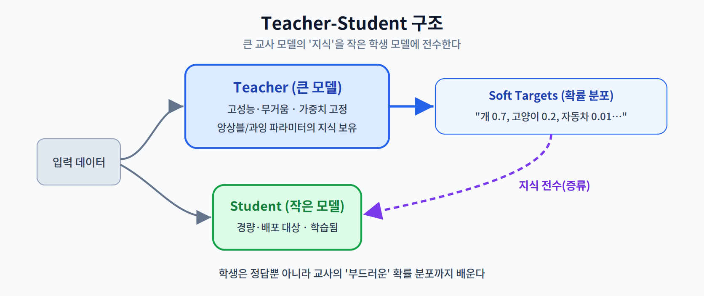
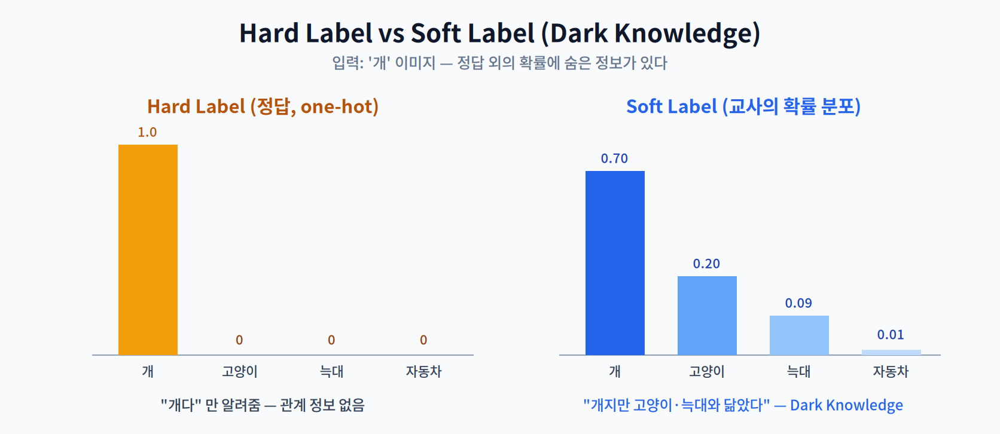
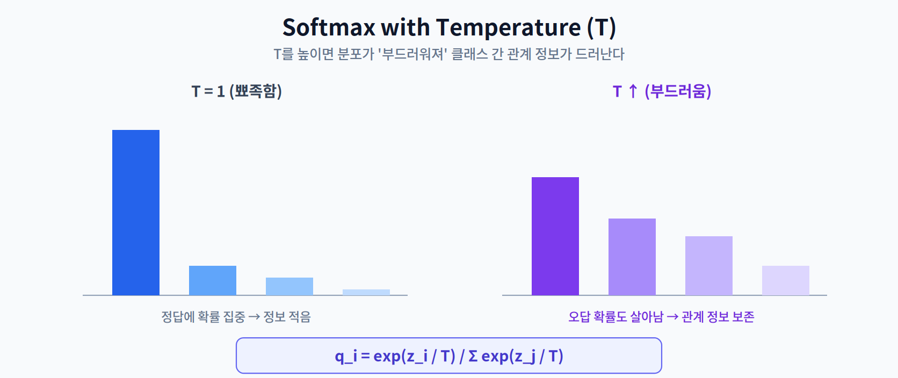
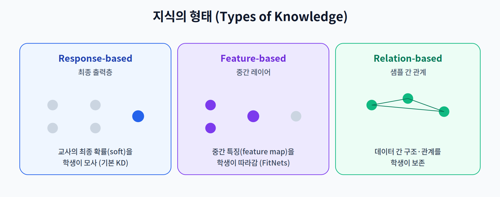

# 06주차 1교시. 지식 증류의 기본 원리

**강의 목표** — 거대 모델(Teacher)의 풍부한 지식을 작은 모델(Student)이 흡수하는 메커니즘의 큰 그림을 이해한다.

4주차(프루닝)와 5주차(양자화)는 **이미 있는 모델을 물리적으로 줄이는** 방법이었다. 6주차의 **지식 증류(Knowledge Distillation, KD)** 는 접근이 다르다. 작은 모델을 처음부터 잘 학습시키되, **큰 모델을 '선생'으로 삼아** 그 지식을 전수받게 하는 알고리즘적 경량화다.

---

## 1.1 왜 지식 증류인가 (10분)

거대 모델은 앙상블 효과나 과잉 파라미터 덕분에 높은 성능을 낸다. 하지만 무거워서 엣지에 올릴 수 없다. KD의 아이디어는 이 거대 모델의 **지식을 작은 모델에 응축(distill)** 하는 것이다.

핵심은 **무엇을 배우게 하느냐**에 있다. 보통의 학습은 정답 레이블(예: "이 이미지는 개")만 보고 배운다. 그런데 잘 학습된 큰 모델은 "개일 확률 0.7, 고양이 0.2, 늑대 0.09, 자동차 0.01"처럼 **오답들 사이의 관계까지 담은 확률 분포**를 만든다. KD는 이 분포를 학생에게 가르친다.

- **Hard Target(정답)** — one-hot 레이블. "개다"만 알려준다.
- **Soft Target(확률 분포)** — 교사의 softmax 출력. "개지만 고양이·늑대와 닮았다"는 정보까지 담는다.

> 한 줄 정리: KD는 정답만이 아니라 '교사가 세상을 보는 방식(확률 분포)'까지 작은 모델에 전수한다.

---

## 1.2 Soft Target과 Temperature (25분)

왜 Soft Target이 더 좋은 스승일까? 정답 외의 확률에 **암흑 지식(Dark Knowledge)** 이 숨어 있기 때문이다.

"개 이미지가 자동차보다 고양이에 훨씬 가깝다"는 것은 매우 유용한 정보다. Hard label은 이를 버리지만, 교사의 Soft label은 이 관계를 보존한다. 학생은 이 풍부한 신호를 배워 더 잘 일반화한다.

그런데 잘 학습된 교사의 출력은 대개 정답에 확률이 **지나치게 몰려**(예: 개 0.99) 관계 정보가 잘 안 보인다. 이를 드러내기 위해 **Temperature(온도, $T$)** 를 도입한다.

$$q_i = \frac{\exp(z_i / T)}{\sum_j \exp(z_j / T)}$$

로짓 $z_i$ 를 $T$ 로 나눈 뒤 softmax를 취한다. $T=1$ 이면 보통의 softmax이고, $T$ 를 키우면 분포가 **부드러워져(smoothing)** 오답 클래스의 확률이 살아난다. 즉 Temperature는 Dark Knowledge를 학생이 볼 수 있게 '증폭'하는 손잡이다.

> 한 줄 정리: Temperature는 교사 분포를 부드럽게 만들어, 정답에 가려진 클래스 간 관계 정보를 드러낸다.

---

## 1.3 지식의 형태 (15분)

교사가 학생에게 물려줄 수 있는 '지식'은 최종 출력만이 아니다. 크게 세 가지로 나뉜다(2교시에서 심화).

- **Response-based** — 교사의 **최종 출력**(soft target)을 학생이 모사. 가장 기본적인 KD.
- **Feature-based** — 교사의 **중간 레이어 특징(feature map)** 을 학생이 따라감.
- **Relation-based** — 교사가 파악한 **샘플 간 관계·구조**를 학생이 보존.

> 교수님을 위한 Tip: 1교시 마지막에 "왜 정답만 보고 배울 때보다, 교사의 '틀린 답 분포'까지 보고 배울 때 성능이 더 좋아질까?"를 던져라. 개 이미지에서 '고양이와 유사한 특성'이 확률 분포에 어떻게 남는지 시각 자료로 보여주면 매우 효과적이다.

---

### 1교시 복습 질문
1. Hard target과 Soft target의 차이, 그리고 Soft target이 담는 추가 정보는?
2. Temperature $T$ 를 키우면 분포가 어떻게 변하며, 왜 그것이 유용한가?
3. 지식의 세 가지 형태를 '무엇을 모사하는가' 기준으로 구분하라.
