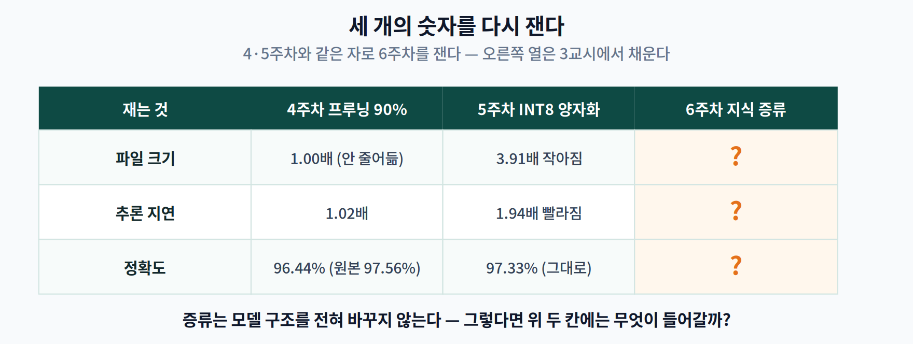
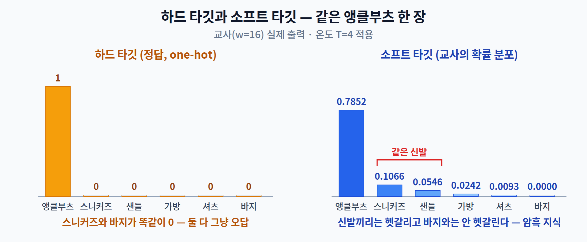
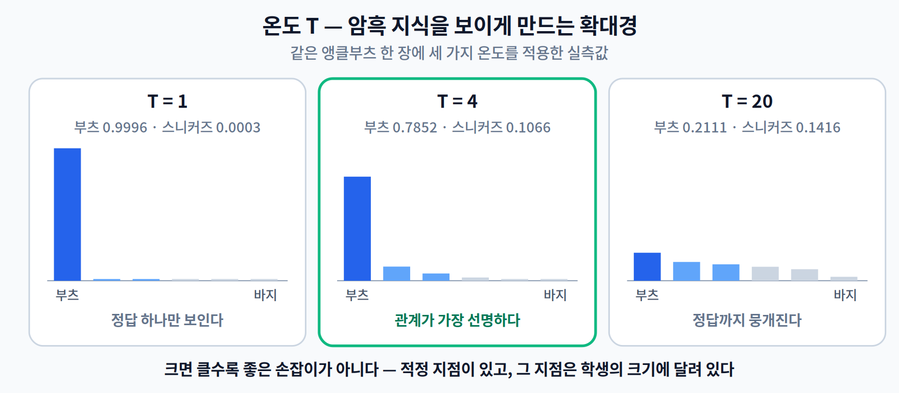

# 06주차 1교시. 모델을 줄이지 않고 작게 만들 수 있을까?

> **오늘의 질문** — 지난 두 주 동안 우리는 다 만들어진 모델을 **지우고**(프루닝) **덜 정밀하게 적었다**(양자화). 둘 다 "있는 것을 줄이는" 일이었다. 그런데 처음부터 작은 모델을 만들고, 그 작은 모델을 **더 잘 가르치면** 어떨까?

---

## 1.1 경량화의 세 번째 길

4주차와 5주차의 출발점은 같았다. **큰 모델이 이미 있다.** 프루닝은 거기서 파라미터를 지웠고, 양자화는 같은 파라미터를 더 적은 비트로 적었다. 둘 다 **완성된 모델을 손질하는** 일이다.

이번 주의 **지식 증류(Knowledge Distillation, KD)** 는 손대는 곳이 다르다.

| | 무엇을 바꾸나 | 언제 하나 | 출발점 |
|---|---|---|---|
| **프루닝** (4주차) | 파라미터를 **지운다** | 학습 후 (+미세조정) | 큰 모델 |
| **양자화** (5주차) | 파라미터를 **덜 정밀하게 적는다** | 학습 후 (또는 학습 중) | 큰 모델 |
| **지식 증류** (6주차) | **학습 방법을 바꾼다** | 학습 **중** | 작은 모델 |

세 번째 줄을 다시 보자. 증류의 출발점은 **작은 모델**이다. 크기는 이미 정해져 있다. 우리가 고르는 것은 크기가 아니라 **그 크기에서 얼마나 잘하게 만들 것인가**다.

여기서 곧바로 따라오는 질문이 있다.

> **크기를 안 건드린다면, 파일 크기와 속도는 어떻게 되는가?**

4주차와 5주차 내내 우리는 세 개의 숫자를 따로따로 재는 습관을 들였다. 이번 주에도 같은 세 개를 잰다. 다만 이번엔 답의 성격이 다르다.

| 재는 것 | 4주차 비구조적 프루닝 90% | 5주차 INT8 양자화 | 6주차 지식 증류 |
|---|---|---|---|
| 파일 크기 | 1.00배 (안 줄어듦) | 3.91배 작아짐 | **?** |
| 추론 지연 | 1.02배 | 1.94배 빨라짐 | **?** |
| 정확도 | 96.44% (원본 97.56%) | 97.33% (그대로) | **?** |

세 칸을 3교시에서 직접 재서 채울 것이다. **지금 예측해 두자.** 답을 미리 적어 두고 3교시에 맞춰 보면 이번 주의 요점이 훨씬 선명해진다.

> 한 줄 정리: 프루닝과 양자화가 **모델을 손질하는** 기법이라면, 지식 증류는 **학습 방법을 바꾸는** 기법이다. 크기는 우리가 먼저 정하고, 증류는 그 크기에서 성적을 정한다.

---

## 1.2 정답만 채점하는 선생, 오답까지 설명하는 선생

작은 모델을 "더 잘 가르친다"는 것이 구체적으로 무슨 뜻인가. 채점 이야기로 시작하자.

시험지를 돌려받았다고 하자. 두 종류의 선생이 있다.

- **선생 A** — 빨간 펜으로 **동그라미와 작대기만** 그어 준다. 3번 문제는 틀렸다. 끝.
- **선생 B** — 작대기 옆에 한마디를 덧붙인다. *"3번은 ②와 ③ 사이에서 갈렸겠지. ①·④는 애초에 아니야."*

두 선생 모두 정답을 알려 준다. 그런데 선생 B는 **오답들 사이의 거리**까지 알려 준다. 헷갈릴 만한 것과 전혀 아닌 것을 구분해 준다.

신경망 학습에서 선생 A가 주는 것이 **하드 타깃(hard target)**, 선생 B가 주는 것이 **소프트 타깃(soft target)** 이다.

Fashion-MNIST의 앵클부츠 사진 한 장을 예로 들자. 아래는 3교시에서 쓸 교사 모델의 **실제 출력**이다.

| | 바지 | 풀오버 | 코트 | 샌들 | 셔츠 | 스니커즈 | 가방 | **앵클부츠** |
|---|---|---|---|---|---|---|---|---|
| **하드 타깃** | 0 | 0 | 0 | 0 | 0 | 0 | 0 | **1** |
| **교사의 소프트 타깃** ($T=4$) | 0.0000 | 0.0058 | 0.0017 | **0.0546** | 0.0093 | **0.1066** | 0.0242 | **0.7852** |

하드 타깃에서 스니커즈와 바지는 **똑같이 0**이다. 둘 다 그냥 오답이다. 하지만 교사는 스니커즈에 0.1066, 샌들에 0.0546을 주고 바지에는 0.0000을 준다.

**앵클부츠는 다른 신발과 헷갈릴 만하고 바지와는 안 헷갈린다.** 아무도 가르쳐 준 적 없는 "신발"이라는 범주가 교사의 확률 분포 안에 저절로 들어앉아 있다. 이것이 소프트 타깃이 나르는 정보다.

이렇게 정답 아닌 칸에 숨어 있는 정보를 Hinton 등은 **암흑 지식(dark knowledge)** 이라 불렀다. 정답 레이블만 보면 영영 알 수 없고, 잘 학습된 교사의 출력에서만 읽어 낼 수 있는 정보다.

> **[더 깊이 — 선택] 증류의 족보**
>
> 이 아이디어의 원형은 Hinton보다 9년 앞선다. Buciluǎ, Caruana, Niculescu-Mizil의 「Model Compression」(KDD 2006)은 **거대한 앙상블로 라벨 없는 데이터에 답을 달아** 그 위에서 작은 신경망을 학습시키는 방법을 제안했다. 다만 그때는 앙상블의 **하드 라벨**만 썼다 — 온도도 없고 암흑 지식도 없었다.
>
> Hinton, Vinyals, Dean의 「Distilling the Knowledge in a Neural Network」(arXiv:1503.02531, NIPS 2014 Deep Learning Workshop 발표)가 여기에 **온도와 소프트 타깃**을 더했다. 이 논문은 정식 학회 논문집에 실린 적이 없다 — 인용할 때 "NIPS 2014 논문"이라고 쓰면 틀린다.
>
> **이 족보를 기억해 두자.** 2006년판은 "교사가 더 많은 데이터에 답을 달아 준다"였고, 2015년판은 "교사가 답을 **부드럽게** 달아 준다"였다. 두 가지는 서로 다른 일이고, **각각이 얼마나 기여하는지**는 3교시에서 따로 잰다.

> 한 줄 정리: 하드 타깃은 정답만 알려주고, 교사의 소프트 타깃은 **오답들 사이의 거리**까지 알려준다. 그 거리가 암흑 지식이다.

---

## 1.3 온도 — 분포를 부드럽게 만드는 손잡이

문제가 하나 있다. **잘 학습된 교사일수록 소프트 타깃이 하드 타깃을 닮아 간다.**

방금 그 표는 $T = 4$ 를 적용한 뒤의 값이었다. **온도를 걷어 내고** 교사의 날것 그대로의 출력($T = 1$)을 보면 이렇다.

> 앵클부츠 **0.9996** · 스니커즈 0.0003 · 나머지 여덟 칸 전부 0.0000

관계가 사라졌다. 신발끼리 닮았다는 정보도, 바지와 다르다는 정보도 소수점 넷째 자리 아래에 깔려 버렸다. 잘 학습된 교사일수록 이렇게 된다 — **소프트 타깃이 하드 타깃을 닮아 간다.**

정보는 여전히 **비율** 안에 있다. 다만 **절대값**이 너무 작아서 손실 함수가 그것을 거의 못 느낀다. 그래서 확대경이 필요하다. 그 확대경이 **온도(Temperature, $T$)** 다.

$$q_i = \frac{\exp(z_i / T)}{\sum_j \exp(z_j / T)}$$

로짓 $z_i$ 를 $T$ 로 나눈 뒤 softmax를 취한다. $T = 1$ 이면 평소의 softmax다. $T$ 를 키우면 로짓들의 차이가 줄어들어 분포가 **평평해지고**, 작던 확률들이 눈에 보이는 크기로 올라온다.

같은 앵클부츠 한 장에 세 가지 온도를 적용한 **실측값**이다.

| $T$ | 앵클부츠 | 스니커즈 | 샌들 | 가방 | 바지 |
|:---:|---:|---:|---:|---:|---:|
| **1** | 0.9996 | 0.0003 | 0.0000 | 0.0000 | 0.0000 |
| **4** | 0.7852 | **0.1066** | **0.0546** | 0.0242 | 0.0000 |
| **20** | 0.2111 | 0.1416 | 0.1238 | 0.1053 | 0.0295 |

세 줄을 나란히 읽어 보자.

- $T = 1$ — 정답 하나만 보인다. 나머지는 전부 0에 붙어 있다.
- $T = 4$ — **신발 삼형제**(앵클부츠·스니커즈·샌들)가 위로 올라오고 바지는 여전히 0이다. 관계가 선명하다.
- $T = 20$ — 앵클부츠 0.2111, 스니커즈 0.1416, 바지 0.0295. 열 칸이 다 비슷비슷해졌다. **정답과 오답의 구분마저 흐려졌다.**

$T = 20$ 을 보라. 거의 균등분포다. **너무 키우면 관계 정보도 같이 뭉개진다.** 온도는 크면 클수록 좋은 손잡이가 아니라 **적정 지점이 있는** 손잡이다.

그 적정 지점이 어디인지는 **학생의 크기에 달려 있다.** Hinton 등의 MNIST 실험에서, 층당 300개 이상의 유닛을 가진 학생은 $T > 8$ 에서 결과가 대체로 비슷했지만, 층당 **30개**짜리 아주 작은 학생은 $T = 2.5 \sim 4$ 가 뚜렷이 좋았다. 작은 학생일수록 낮은 온도를 좋아한다.

> **[더 깊이 — 선택] 이 주차의 원전 숫자**
>
> Hinton 등의 MNIST 실험은 증류를 소개하는 가장 유명한 세 숫자를 남겼다.
>
> | 모델 | 테스트 오류 |
> |---|---|
> | 큰 교사 (1200-1200, 드롭아웃·입력 지터) | **67개** |
> | 작은 학생 (800-800, 규제 없음) | **146개** |
> | 같은 학생 + 증류 ($T = 20$) | **74개** |
>
> 오류 146개에서 74개로 — **거의 절반**이 줄었고, 교사(67개)에 바짝 다가섰다. 구조는 전혀 바뀌지 않았다.
>
> 같은 논문의 더 놀라운 실험: **전이 집합에서 숫자 3을 통째로 빼고** 증류했더니, 3을 한 번도 못 본 학생이 테스트의 3을 대부분 맞혔다(오류 206개 중 3에 대한 것이 133개, 클래스 3의 편향값을 3.5만큼 올려 보정하면 오류 109개 중 3에 대한 것은 **14개**). 소프트 타깃 안에 "이건 3과 닮았다"는 정보가 실려 있었던 것이다.

> 한 줄 정리: 온도는 교사 분포를 부드럽게 만들어 암흑 지식을 드러내는 확대경이다. 단, 너무 키우면 정보까지 뭉개진다 — **적정 지점이 있고, 그 지점은 학생의 크기에 달려 있다.**

---

## 오늘의 토론 질문

1. 증류는 모델 구조를 전혀 바꾸지 않는다. 그렇다면 1.1의 표에서 **파일 크기와 지연 시간 칸에는 무엇이 들어갈 것 같은가?** 숫자를 하나 적어 두고 3교시에 맞춰 보라.
2. 교사가 100%의 정확도로 학습 데이터를 모두 맞힌다면, 그 교사의 소프트 타깃은 어떤 모양이 될까? 그때 학생은 무엇을 배울 수 있을까?
3. 선생 B의 조언("②와 ③ 사이에서 갈렸겠지")이 도움이 되려면, 선생 B가 그 문제를 **어떻게** 알고 있어야 할까? 학생이 이미 푼 문제에 대한 조언과, 학생이 아직 안 풀어 본 문제에 대한 조언 중 어느 쪽이 더 값어치가 있겠는가?

> **교수님을 위한 Tip** — 1.1의 물음표 표를 **칠판에 그대로 옮겨 적고 학생들에게 세 칸을 채우게** 하십시오. 파일 크기와 지연 시간에 대해서는 "1.00배"라는 답이 곧 나옵니다(증류는 구조를 안 바꾸니까요). 그 답이 맞습니다 — 그리고 **그게 이번 주의 출발점**입니다. 정확도 칸은 대부분 "오른다"고 답할 텐데, 3교시에서 진짜 질문은 "오르느냐"가 아니라 **"그 상승분이 어디서 왔느냐"** 임이 드러납니다. 3번 토론 질문이 그 복선입니다.

---

### 1교시 정리
- 프루닝·양자화는 **완성된 모델을 손질**하고, 증류는 **학습 방법을 바꾼다**. 크기는 증류를 시작하기 전에 이미 정해져 있다.
- 하드 타깃은 정답만, 교사의 소프트 타깃은 **오답들 사이의 거리**까지 담는다 — 암흑 지식.
- 온도 $T$ 는 그 거리를 보이게 만드는 확대경이다. 크면 클수록 좋은 게 아니라 **적정 지점**이 있다.

### 오늘의 용어
- **Teacher / Student** — 지식을 주는 큰 모델과 받는 작은 모델.
- **Hard target / Soft target** — one-hot 정답과 교사의 확률 분포.
- **Dark Knowledge (암흑 지식)** — 정답이 아닌 칸들의 확률 **비율**에 담긴 클래스 간 관계 정보.
- **Temperature ($T$)** — 로짓을 나누어 분포를 평평하게 만드는 하이퍼파라미터.

### 더 읽어보기
- [1] G. Hinton, O. Vinyals, and J. Dean, "Distilling the knowledge in a neural network," *arXiv:1503.02531*, 2015. (NIPS 2014 Deep Learning Workshop 발표) — **§2와 §3의 MNIST 실험까지는 반드시 읽을 것.**
- [2] C. Buciluǎ, R. Caruana, and A. Niculescu-Mizil, "Model compression," in *Proc. 12th ACM SIGKDD Int. Conf. Knowledge Discovery and Data Mining (KDD)*, 2006, pp. 535–541.
- [3] J. Gou, B. Yu, S. J. Maybank, and D. Tao, "Knowledge distillation: A survey," *Int. J. Comput. Vis.*, vol. 129, no. 6, pp. 1789–1819, 2021.
