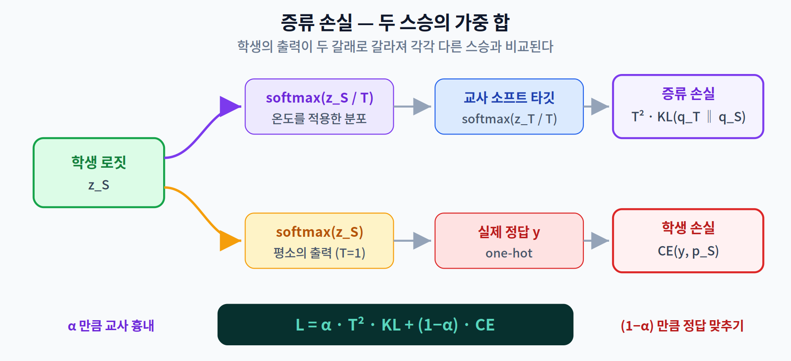
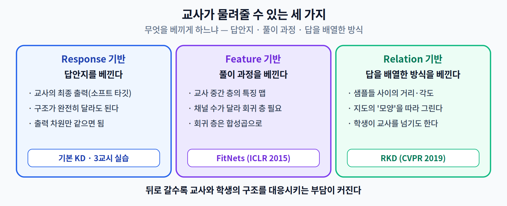
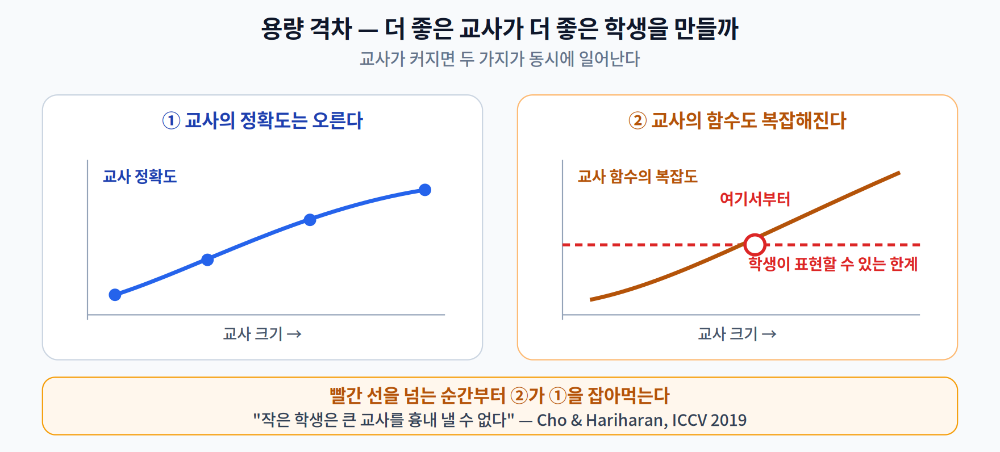
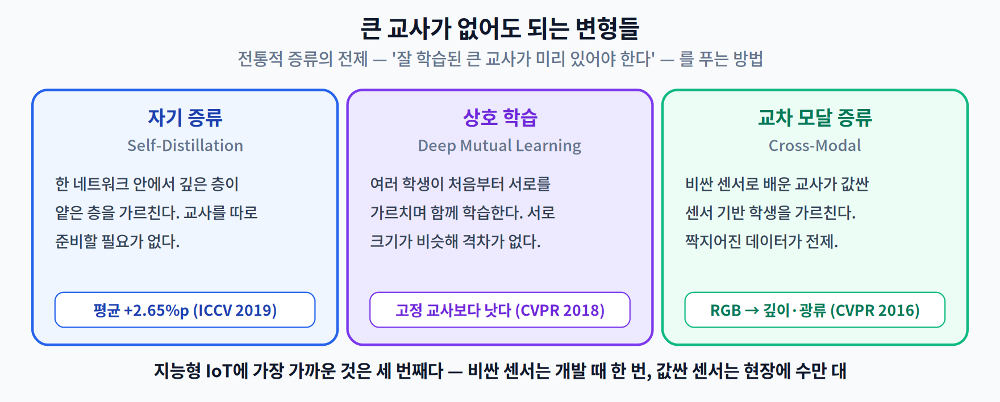

# 06주차 2교시. 교사는 무엇을 물려줄 수 있고, 학생은 무엇을 받을 수 있나

> **오늘의 질문** — 1교시에서 우리는 "교사의 확률 분포를 배우게 한다"고 했다. 그런데 교사가 물려줄 수 있는 것이 정말 최종 출력뿐일까? 그리고 교사가 아무리 훌륭해도 학생이 **받을 수 없는** 지식이 있지는 않을까?

---

## 2.1 두 스승 사이에서 — 손실 함수 설계

증류하는 학생은 **두 스승**에게 동시에 배운다. 교사의 부드러운 분포, 그리고 실제 정답. 그래서 손실도 두 항이다.

$$L = \alpha \cdot T^{2} \cdot \mathrm{KL}\!\left(q_T \,\|\, q_S\right) + (1 - \alpha) \cdot \mathrm{CE}(y, p_S)$$

- $q_T, q_S$ — 온도 $T$ 를 적용한 교사·학생의 소프트 분포
- $p_S$ — 온도를 적용하지 않은($T=1$) 학생의 평소 출력
- $y$ — 실제 정답, $\alpha$ — 두 신호의 균형

여기서 **$T^2$** 가 왜 붙는지가 매 학기 나오는 질문이다.

> **[더 깊이 — 선택] $T^2$ 은 어디서 왔나**
>
> 소프트 타깃이 만드는 그래디언트의 크기는 $1/T^2$ 에 비례해 줄어든다. 로짓을 $T$ 로 나눈 것이 두 번(교사 쪽 한 번, 학생 쪽 한 번) 미분에 실리기 때문이다. 그대로 두면 $T$ 를 4에서 8로 바꾸는 순간 증류 항의 실질 가중치가 **4분의 1**로 줄어, $\alpha$ 를 건드리지 않았는데도 두 스승의 균형이 무너진다.
>
> Hinton 등이 §2.1 마지막 문단에서 말한 이유가 정확히 이것이다.
>
> > *"소프트 타깃이 만드는 그래디언트의 크기가 $1/T^2$ 로 스케일되므로, 하드 타깃과 소프트 타깃을 함께 쓸 때는 $T^2$ 을 곱해 주는 것이 중요하다."*
>
> **오해하기 쉬운 지점** — $T^2$ 은 KL 발산이라는 목적함수에 이론적으로 내재된 항이 **아니다.** $T$ 를 바꿔도 $\alpha$ 를 다시 안 맞춰도 되게 해 주는 **실용적인 크기 보정**이다. 순서를 거꾸로 기억하면 곤란하다.

$\alpha$ 를 1에 가깝게 두면 학생은 교사 흉내에 집중하고, 0에 가깝게 두면 정답 맞추기에 집중한다. **적정값은 문제마다 다르다** — 3교시에서 직접 스윕해 본다.

> 한 줄 정리: 증류 손실 = $\alpha \cdot T^2 \cdot$ (교사 흉내) $+ (1-\alpha) \cdot$ (정답 맞추기). $T^2$ 은 이론이 아니라 **크기 보정**이다.

---

## 2.2 교사가 물려줄 수 있는 세 가지

교사가 학생에게 넘길 수 있는 것은 최종 출력만이 아니다. 무엇을 베끼게 하느냐에 따라 크게 셋으로 나뉜다.

### Response-based — 답안지를 베낀다
교사의 **최종 출력**(소프트 타깃)을 학생이 모사한다. 1교시에서 배운 그것이고, 구현이 가장 간단하다. 교사와 학생의 **구조가 완전히 달라도 된다** — 출력 차원만 같으면 되기 때문이다. 3교시 실습이 이 방식이다.

### Feature-based — 풀이 과정을 베낀다
교사의 **중간 층 표현**까지 따라가게 한다. 대표 기법이 **FitNets**(Romero 외, ICLR 2015)다.

교사의 어떤 중간 층을 **힌트(hint)** 로 삼고, 학생의 대응 층을 **가이드 층(guided layer)** 이라 부른다. 문제는 둘의 채널 수가 다르다는 것인데, 사이에 **회귀 층(regressor)** 을 끼워 차원을 맞춘다. 논문은 이 회귀 층을 **합성곱**으로 만들었다 — 완전연결로 만들면 파라미터가 폭발하기 때문이다. 시험에 잘 나오는 세부다.

### Relation-based — 답을 배열하는 방식을 베낀다
개별 샘플의 출력이 아니라 **샘플들 사이의 관계**를 보존시킨다. Park 외의 **RKD**(CVPR 2019)는 두 가지 손실을 쓴다 — 샘플 쌍의 **거리**(distance-wise)와 샘플 삼중항이 이루는 **각도**(angle-wise). 교사가 그린 지도의 **모양**을 학생이 따라 그리게 하는 셈이다.

> **[더 깊이 — 선택]** RKD 논문에서 거리 학습(metric learning) 과제의 학생이 **교사를 넘어서는** 결과가 나온다. "학생은 교사를 못 넘는다"는 직관이 항상 맞지는 않다.

> 한 줄 정리: 답안지(Response) · 풀이 과정(Feature) · 답들을 배열한 방식(Relation) — 물려줄 수 있는 지식은 셋이고, 뒤로 갈수록 교사·학생 구조의 대응 관계를 신경 써야 한다.

---

## 2.3 학생이 받을 수 없는 지식 — 용량 격차

여기서부터가 이번 주의 핵심이다.

지금까지의 이야기는 은근히 이렇게 전제하고 있었다. **좋은 교사일수록 좋은 학생이 나온다.** 자연스러운 생각이다. 더 정확한 교사는 더 정확한 소프트 타깃을 주니까.

정말 그럴까? 반대 방향의 직관을 하나 놓아 보자.

> **분야 최고의 석학에게 초등학생 과외를 맡기면 성적이 오를까?**

석학이 아는 것은 훨씬 많다. 하지만 그가 설명하는 방식, 그가 문제를 쪼개는 단위, 그가 당연하게 건너뛰는 단계 — 그 전부가 초등학생이 **따라갈 수 없는 것**이라면, 아는 게 많다는 사실 자체는 도움이 되지 않는다. 오히려 중학생 형이 가르치는 편이 나을 수 있다.

이것이 **용량 격차(capacity gap)** 문제다. 교사가 커지면 두 가지가 동시에 일어난다.

1. 교사 자신의 정확도가 **오른다** — 좋은 일이다.
2. 교사가 표현하는 **함수가 복잡해진다** — 학생이 흉내 내기 어려워진다.

학생의 용량이 고정되어 있다면, 어느 지점부터는 2번이 1번을 잡아먹는다.

Cho와 Hariharan은 이 현상을 정면으로 다뤘다(ICCV 2019). 논문 초록의 문장이 그대로 결론이다.

> *"더 정확한 교사가 종종 좋은 교사가 되지 못한다는 관찰에서 출발한다. … **큰 모델이 더 나은 교사가 되는 경우는 흔치 않다.** 이것이 용량 불일치의 결과이며, 작은 학생은 큰 교사를 흉내 낼 수 없음을 보인다."*

그들이 제안한 해법은 뜻밖이다. **교사의 학습을 일찍 멈추는 것**(early-stopped KD). 덜 학습된 교사가 더 나은 교사라는 이야기다.

> **[더 깊이 — 선택] 문헌이 서로 다투는 지점**
>
> 같은 문제에 대한 다른 처방도 있다. Mirzadeh 등의 **TAKD**(AAAI 2020)는 교사와 학생 사이에 **중간 크기의 조교(teacher assistant)** 를 두고 두 번에 나눠 증류하자고 제안한다. 큰 교사 → 조교 → 학생.
>
> 그런데 Cho·Hariharan은 바로 그 다단계 방식을 **명시적으로 시험해 보고 기각**했다. *"순차적 지식 증류는 큰 모델을 더 나은 교사로 만들지 못한다."*
>
> 1년 사이에 나온 두 논문이 같은 문제를 놓고 **반대 결론**을 냈다. 어느 쪽이 옳은지는 실험 설정(데이터셋·구조·격차의 크기)에 달려 있고, 아직 정리되지 않았다. **교재가 한쪽만 소개하면 그것이 곧 오해가 된다.** 여러분이 논문을 읽을 때 이런 지점을 찾아내는 훈련을 해 두기 바란다.

> 한 줄 정리: 교사가 커지면 정확도는 오르지만 함수도 복잡해진다. 학생이 고정된 크기라면 어느 지점부터 **더 좋은 교사가 더 나쁜 결과**를 낸다.

---

## 2.4 교사를 구하기 어려울 때 — 자기 증류 · 상호 학습 · 교차 모달

전통적 증류에는 전제가 하나 있다. **잘 학습된 큰 교사가 미리 있어야 한다.** 그 전제를 푸는 변형들이 있다.

### 자기 증류 (Self-Distillation)
별도의 교사 없이 **자기 자신**을 교사로 삼는다. Zhang 등의 「Be Your Own Teacher」(ICCV 2019)는 한 네트워크의 **깊은 부분의 지식을 얕은 부분으로** 짜 넣는다. 중간 층마다 분류기를 붙이고, 가장 깊은 분류기가 얕은 분류기들을 가르치는 구조다. 논문이 보고한 평균 향상은 **2.65%p**(VGG19에서 최대 4.07%p, ResNeXt에서 최소 0.61%p)다.

### 상호 학습 (Deep Mutual Learning, 온라인 증류)
고정된 교사 없이 **여러 학생이 처음부터 서로를 가르치며** 함께 학습한다. Zhang 등(CVPR 2018)의 결론이 인상적이다.

> *"놀랍게도, 사전에 강력한 교사 네트워크가 필요하지 않다는 것이 드러났다. 단순한 학생 네트워크들의 상호 학습이 작동하며, 나아가 더 강력하지만 고정된 교사로부터의 증류보다 성능이 좋다."*

2.3의 용량 격차와 함께 읽으면 이유가 짐작된다. 서로 비슷한 크기의 모델끼리는 **격차가 없다.**

### 교차 모달 증류 (Cross-Modal Distillation) — 이 수업의 주제와 가장 가까운 것
**비싼 센서로 배운 지식을 값싼 센서 기반 모델로** 옮긴다. Gupta, Hoffman, Malik(CVPR 2016)은 라벨이 풍부한 **RGB 영상**에서 라벨이 없는 **깊이(depth) 영상**과 **광류(optical flow) 영상**으로 지도(supervision)를 옮겼다.

지능형 IoT에서 이 구도가 왜 강력한지는 분명하다. 학습 단계에서는 LiDAR·고해상도 카메라처럼 비싼 센서를 마음껏 쓰고, 배포 단계에서는 IMU·적외선처럼 값싸고 전력을 적게 먹는 센서만 남긴다. **비싼 것은 개발 때 한 번, 값싼 것은 현장에 수만 대.**

> **꼭 지켜야 할 전제** — 교차 모달 증류는 두 모달리티가 **짝지어진(paired)** 데이터를 요구한다. 같은 장면을 같은 순간에 두 센서로 찍은 데이터가 있어야 한다. 이 조건을 못 맞추면 성립하지 않는다. 14주차 캡스톤에서 이 주제를 잡는다면 **데이터 수집 계획부터** 세워야 한다.

> 한 줄 정리: 큰 교사가 없어도(자기 증류·상호 학습), 심지어 센서가 달라도(교차 모달) 증류의 구조는 쓸 수 있다.

---

## 오늘의 토론 질문

1. $T^2$ 을 곱하지 않고 $T$ 만 4에서 16으로 올리면 학습에 무슨 일이 벌어지는가? $\alpha$ 를 어떻게 조정해야 원래 균형이 회복되는가?
2. 2.3의 용량 격차가 사실이라면, **1교시에서 본 Hinton의 MNIST 결과**(오류 146 → 74)는 어떻게 설명되는가? 그 실험의 교사와 학생은 얼마나 차이가 났는가?
3. 여러분의 캡스톤 주제에 교차 모달 증류를 쓴다면, 교사 쪽 센서와 학생 쪽 센서를 무엇으로 두겠는가? **짝지어진 데이터**를 어떻게 모을 것인가?

> **교수님을 위한 Tip** — 2.3을 마친 뒤 **손을 들게 하십시오.** *"3교시에서 크기가 다른 교사 네 개로 같은 학생을 가르쳐 볼 겁니다. 학생 정확도가 가장 높게 나올 교사는 몇 번일까요?"* 대부분 가장 큰 교사를 고릅니다. 방금 용량 격차를 배웠는데도 그렇습니다 — **그 사실 자체가 이 개념이 얼마나 직관에 반하는지를 보여 줍니다.** 답은 3교시에서 공개하십시오.

---

### 2교시 정리
- 증류 손실은 **교사 흉내 + 정답 맞추기**의 가중 합이고, $T^2$ 은 이론이 아니라 크기 보정이다.
- 물려줄 지식은 셋 — 최종 출력(Response) · 중간 표현(Feature) · 샘플 간 관계(Relation).
- **용량 격차** — 교사가 커지면 정확도는 오르지만 학생이 따라갈 수 없게 된다. 문헌은 처방을 두고 아직 다투는 중이다.
- 큰 교사가 없어도 되는 변형이 있다 — 자기 증류 · 상호 학습 · 교차 모달.

### 오늘의 용어
- **KL 발산 (Kullback–Leibler divergence)** — 두 확률 분포가 얼마나 다른지를 재는 양. 증류 손실의 본체.
- **Hint layer / Guided layer / Regressor** — FitNets에서 교사가 보여 주는 층, 학생이 맞춰 가는 층, 그 사이의 차원 변환기.
- **용량 격차 (Capacity gap)** — 교사가 표현하는 함수의 복잡도가 학생의 표현력을 넘어서는 상태.
- **전이 집합 (Transfer set)** — 교사가 소프트 타깃을 만들어 주는 데이터 집합. 정답 라벨이 없어도 된다.

### 더 읽어보기
- [1] A. Romero, N. Ballas, S. Ebrahimi Kahou, A. Chassang, C. Gatta, and Y. Bengio, "FitNets: Hints for thin deep nets," in *Proc. Int. Conf. Learning Representations (ICLR)*, 2015.
- [2] J. H. Cho and B. Hariharan, "On the efficacy of knowledge distillation," in *Proc. IEEE/CVF Int. Conf. Computer Vision (ICCV)*, 2019, pp. 4794–4802. — **2.3의 원전. 반드시 읽을 것.**
- [3] S.-I. Mirzadeh, M. Farajtabar, A. Li, N. Levine, A. Matsukawa, and H. Ghasemzadeh, "Improved knowledge distillation via teacher assistant," in *Proc. AAAI Conf. Artificial Intelligence*, vol. 34, no. 4, 2020, pp. 5191–5198.
- [4] W. Park, D. Kim, Y. Lu, and M. Cho, "Relational knowledge distillation," in *Proc. IEEE/CVF Conf. Computer Vision and Pattern Recognition (CVPR)*, 2019, pp. 3967–3976.
- [5] Y. Zhang, T. Xiang, T. M. Hospedales, and H. Lu, "Deep mutual learning," in *Proc. IEEE/CVF Conf. Computer Vision and Pattern Recognition (CVPR)*, 2018, pp. 4320–4328.
- [6] L. Zhang, J. Song, A. Gao, J. Chen, C. Bao, and K. Ma, "Be your own teacher: Improve the performance of convolutional neural networks via self distillation," in *Proc. IEEE/CVF Int. Conf. Computer Vision (ICCV)*, 2019, pp. 3713–3722.
- [7] S. Gupta, J. Hoffman, and J. Malik, "Cross modal distillation for supervision transfer," in *Proc. IEEE Conf. Computer Vision and Pattern Recognition (CVPR)*, 2016, pp. 2827–2836.
