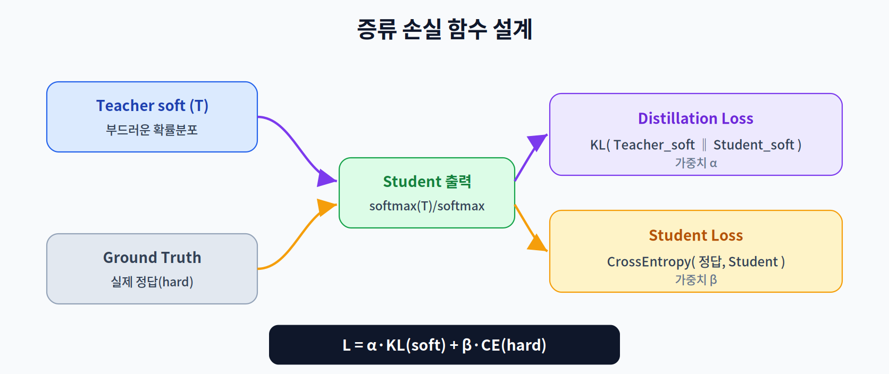

# 6주차 2교시. 최신 KD 기법 및 AIoT 응용

**강의 목표** — 증류 손실 함수를 수식으로 설계하고, 단순 분류를 넘어 다양한 환경에서의 증류 기법을 학습한다.

1교시가 "왜·무엇을 전수하나"였다면, 2교시는 "어떻게 학습식을 짜고, 어떤 변형들이 있나"이다.

---

## 2.1 증류 손실 함수 설계 (20분)

KD의 학생은 **두 스승**에게 동시에 배운다: 교사의 부드러운 분포(soft)와 실제 정답(hard). 그래서 손실도 두 항의 합이다.

- **Distillation Loss** — 교사의 soft target과 학생의 soft 출력 사이의 **KL-Divergence**. 두 확률 분포가 얼마나 다른지를 재며, 학생이 교사 분포를 닮도록 이끈다.
- **Student Loss** — 학생 출력과 실제 정답 사이의 **Cross-Entropy**. 정답을 놓치지 않게 잡아준다.

최종 손실은 두 항의 가중 합이다.

$$L = \alpha \cdot \text{KL}(q_T \,\|\, q_S) + \beta \cdot \text{CE}(y, p_S)$$

여기서 $q_T, q_S$ 는 Temperature $T$ 를 적용한 교사·학생의 soft 분포, $y$ 는 정답, $p_S$ 는 학생의 일반 출력이다. $\alpha, \beta$ 로 두 신호의 균형을 맞춘다. (구현상 KL 항에는 $T^2$ 스케일을 곱해 그래디언트 크기를 보정하는 것이 일반적이다.)

> 한 줄 정리: KD 손실 = α·KL(교사 soft ‖ 학생 soft) + β·CE(정답, 학생) — '스승 흉내'와 '정답 맞추기'의 균형.

---

## 2.2 Feature 기반 증류 — FitNets (15분)

Response-based가 최종 출력만 본다면, **Feature-based** 는 교사의 **중간 표현**까지 배우게 한다. 대표 기법이 **FitNets** 다.

교사의 특정 중간 레이어를 **힌트 레이어(Hint Layer)** 로 삼아, 학생의 대응 레이어가 그 특징을 모사하도록 학습시킨다. 문제는 교사와 학생의 레이어 크기(채널 수 등)가 다르다는 것인데, 이를 **회귀 레이어(Regressor/Projection layer)** 로 차원을 맞춰 해결한다.

중간 표현까지 전수하면 학생이 "정답의 이유"에 더 가깝게 학습되어, 얕은 학생도 깊은 교사의 표현력을 일부 획득한다.

> 한 줄 정리: FitNets는 최종 출력을 넘어 교사의 '중간 사고 과정'까지 학생에게 전수한다.

---

## 2.3 Self·Online 증류 (15분)

- **Self-Distillation(자기 증류)** — 별도의 거대 교사 없이, 모델이 **자기 자신**을 교사로 삼는다(예: 깊은 층이 얕은 층을 가르침, 또는 이전 세대 모델이 다음 세대를 지도). 교사 준비 비용을 없앤다.
- **Online Distillation(온라인 증류)** — 사전 학습된 고정 교사 없이, 여러 모델이 **동시에 서로를 가르치며** 함께 학습한다. 교사-학생을 미리 나누지 않아도 된다.

이 두 기법은 "좋은 교사를 먼저 학습시켜야 한다"는 전통 KD의 전제를 완화해, 학습 파이프라인을 단순화한다.

> 한 줄 정리: Self·Online 증류는 '고정된 큰 교사'가 없어도 증류의 이점을 얻는 변형이다.

---

## 2.4 Cross-Modal 증류 (AIoT 응용) (10분)

AIoT(AI+IoT) 환경에서 특히 강력한 것이 **Cross-Modal Distillation(교차 모달 증류)** 이다. **고성능 센서 기반 모델의 지식을 저성능·저전력 센서 기반 모델로 전수**한다.

예를 들어 학습 단계에서는 LiDAR·RGB 카메라처럼 풍부한 센서로 학습한 교사를 두고, 실제 배포될 저전력 기기의 IMU·적외선(IR) 센서 기반 학생에게 그 지식을 증류한다. 배포 시엔 값싼 센서만으로도 교사에 가까운 성능을 낸다. 온디바이스 환경의 제약(센서·전력)을 지식 전수로 메우는 전략이다.

### 6주차 핵심 키워드
- **Teacher-Student Model** — 지식을 주는 큰 모델과 받는 작은 모델.
- **Dark Knowledge** — 정답 외 클래스들 사이에 숨은 관계 정보.
- **Temperature ($T$)** — softmax 분포의 부드러움을 조절하는 하이퍼파라미터.
- **KL-Divergence** — 두 확률 분포의 차이를 재는 지표(증류 손실).

> 교수님을 위한 Tip: Cross-Modal 증류는 지능형 IoT 전공과 가장 잘 맞닿는 주제다. "비싼 센서로 배운 지식을 싼 센서 기기에 이식한다"는 관점은 8주차 중간 프로젝트의 좋은 아이디어가 된다.

---

### 2교시 복습 질문
1. 증류 손실의 두 항(KL·CE)이 각각 학생에게 무엇을 시키는가?
2. FitNets에서 교사·학생 레이어 크기가 다를 때의 해결책은?
3. Cross-Modal 증류가 AIoT에서 특히 유용한 이유를 예를 들어 설명하라.
