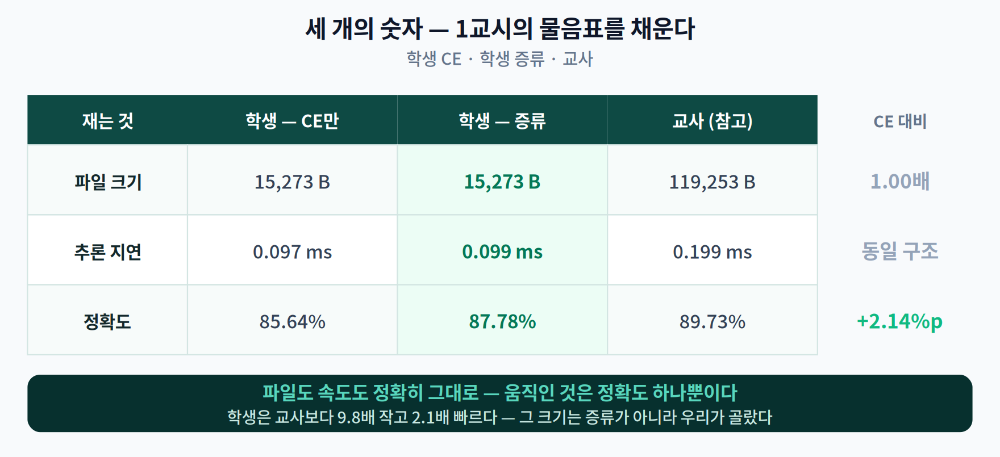
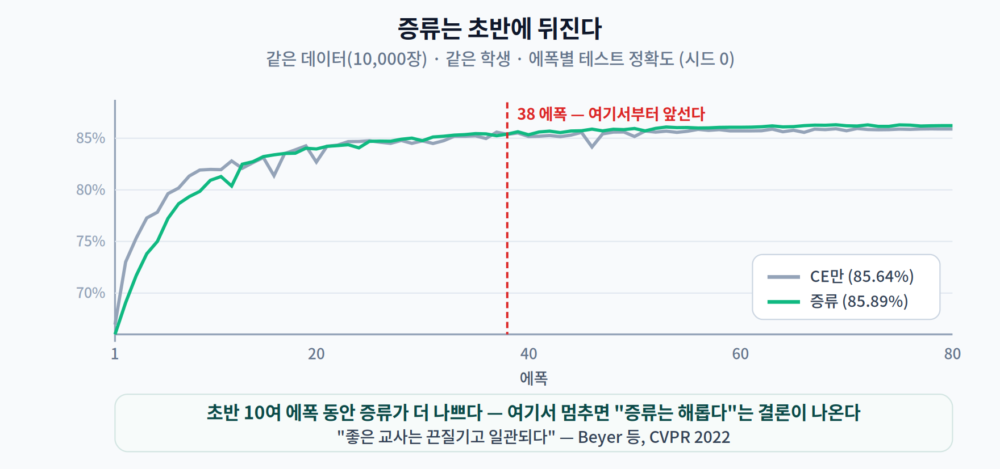
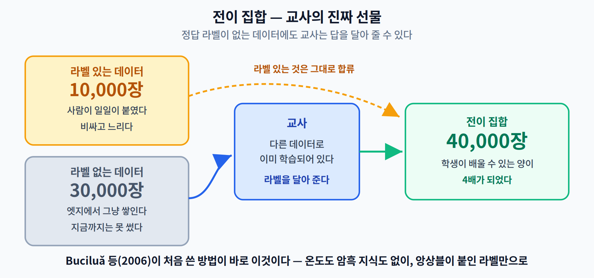
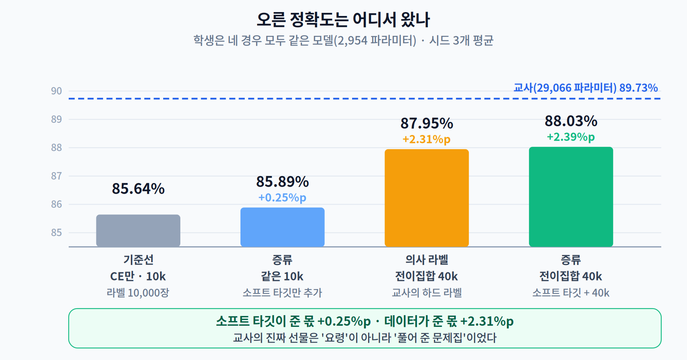
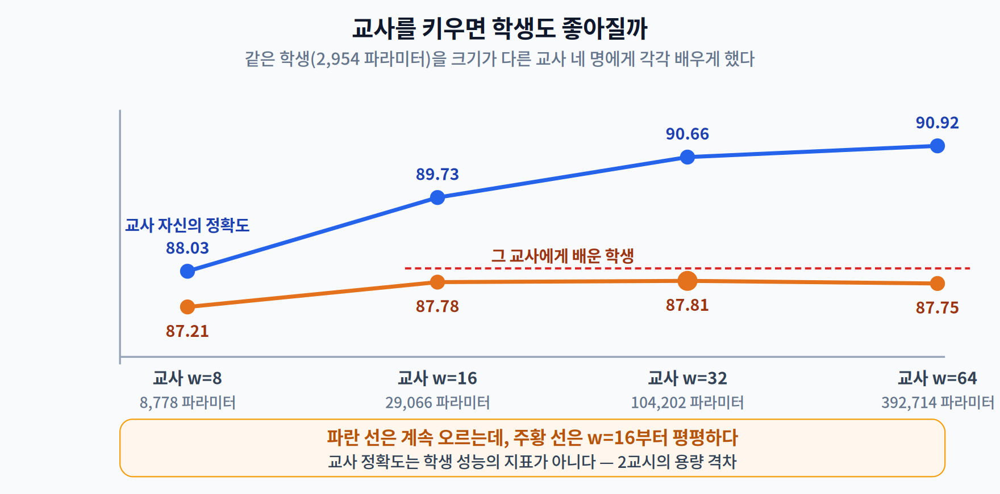
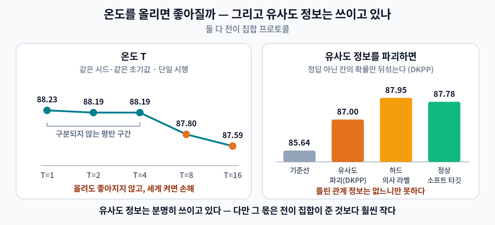
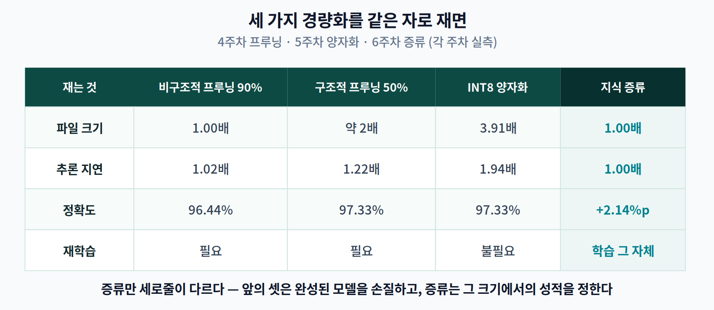

# 06주차 3교시. 오른 정확도는 어디서 왔나

> **오늘의 질문** — 1교시에서 세 칸짜리 표에 물음표를 남겨 두었다. 파일 크기 · 추론 지연 · 정확도. 오늘 그 세 칸을 직접 재서 채운다. 그리고 정확도가 올랐다면, **그 상승분이 정확히 어디서 왔는지**까지 분해해 본다.

> **준비물** — 1주차 환경(`odai`) + `torch`. GPU는 필요 없다. 이 실습은 전부 CPU 2코어에서 돌린 결과다.

---

## 3.1 먼저 4·5주차 모델로 그대로 해 보자

지난 두 주 동안 우리는 같은 모델을 썼다. sklearn `digits`(8×8 손글씨, 학습 1,347장 / 테스트 450장) 위의 작은 CNN이다. 증류도 거기서 그대로 해 보는 것이 순서다.

교사는 폭을 네 배로 키운 같은 구조(9,930 파라미터), 학생은 4·5주차와 같은 작은 모델(1,626 파라미터). 각각 3개의 시드로 학습해 평균을 낸다.

```python
# 교사와 학생을 같은 데이터(1,347장)로 학습시킨 뒤, 교사의 로짓으로 학생을 증류한다
teacher = C(16); train(teacher)                    # 98.07%
student_ce = C(4);  train(student_ce)              # 정답만 보고 학습
student_kd = C(4);  train(student_kd, tl=teacher_logits)   # 교사 지도까지 받아 학습
```

결과다.

| | 파라미터 | 정확도 (시드 3개 평균) |
|---|---:|---:|
| 교사 (w=16) | 9,930 | 98.07% |
| 학생 — CE만 | 1,626 | **95.33%** |
| 학생 — KD | 1,626 | **94.81%** |

**증류가 0.52%p를 깎아 먹었다.**

1교시에서 배운 것이 전부 틀렸을까? 아니다. 숫자 하나만 더 보면 이유가 드러난다.

> **교사가 자기 학습 데이터에서 낸 정확도: 99.93%**

교사는 그 1,347장을 **거의 통째로 외웠다.** 외운 데이터에 대한 교사의 출력은 무엇일까? 정답 하나에 확률이 몰린 분포 — 사실상 **원-핫**이다. 1교시의 $T=1$ 표에서 봤던 그 모양이다.

즉 학생에게 건네진 소프트 타깃 안에는 **암흑 지식이 처음부터 없었다.** 정답 레이블을 조금 흐리게 복사한 것에 지나지 않았고, 거기에 $T=4$ 를 씌워 억지로 부풀렸으니 오히려 잡음이 되었다.

> **이번 주의 첫 번째 교훈** — 교사와 학생을 **같은 데이터로** 학습시키면 증류할 것이 남지 않는다. 교사가 그 데이터를 외워 버리기 때문이다. 증류가 의미를 가지려면 교사의 예측이 학생에게 **새로운 정보**여야 한다.

그래서 이번 주는 판을 다시 깐다.

### 새 실험 설정

**Fashion-MNIST**(28×28 의류 사진, 10클래스)로 옮기고, 데이터를 **네 덩어리로 완전히 갈라** 쓴다.

| 덩어리 | 크기 | 용도 |
|---|---:|---|
| 교사 학습용 | 20,000장 | 교사만 본다 |
| **학생 라벨 데이터** | **10,000장** | 학생이 정답과 함께 받는 것 |
| 라벨 없는 데이터 | 30,000장 | 정답은 안 쓰고 이미지만 쓴다 |
| 테스트 | 10,000장 | 아무도 학습에 쓰지 않는다 |

네 덩어리는 서로 한 장도 겹치지 않는다. 이렇게 하면 교사가 학생의 데이터를 **본 적이 없으므로**, 교사의 예측이 학생에게 진짜 새 정보가 된다.

모델은 4·5주차와 같은 방식으로 폭 하나(`w`)로 크기를 조절한다.

| | 폭 | 파라미터 | 테스트 정확도 |
|---|---:|---:|---:|
| 학생 | 4 | **2,954** | (지금부터 잰다) |
| 교사 | 16 | 29,066 | **89.73%** |

교사는 학생보다 **9.8배** 크다.

> 한 줄 정리: 교사가 학생의 데이터를 외우고 있으면 증류할 것이 없다. 교사와 학생은 **다른 데이터**를 봐야 한다.

---

## 3.2 증류 손실을 열 줄로 쓰기

2교시의 식 $L = \alpha T^2 \mathrm{KL}(q_T\|q_S) + (1-\alpha)\mathrm{CE}(y, p_S)$ 를 그대로 옮긴다.

```python
import torch.nn.functional as F

def kd_loss(s_logits, t_logits, labels, T=4.0, alpha=0.7):
    # (1) 증류 항 — 교사와 학생의 soft 분포 간 KL, T^2 로 크기 보정
    soft = F.kl_div(
        F.log_softmax(s_logits / T, dim=1),   # input 은 로그 확률
        F.log_softmax(t_logits / T, dim=1),   # target 도 로그 확률 (log_target=True)
        reduction="batchmean", log_target=True) * (T * T)
    # (2) 학생 항 — 실제 정답과의 교차 엔트로피
    hard = F.cross_entropy(s_logits, labels)
    return alpha * soft + (1 - alpha) * hard
```

> **자주 틀리는 곳** — `F.kl_div`의 첫 인자는 **로그 확률**, 둘째 인자는 기본적으로 **확률**이다. 둘 다 로그로 넘기려면 `log_target=True`를 반드시 켜야 한다. 이 플래그를 빠뜨리면 오류 없이 조용히 **엉뚱한 값**이 나온다. 그리고 `reduction`은 `"mean"`이 아니라 **`"batchmean"`** 이어야 수학적 정의와 맞는다.

교사는 미리 한 번만 통과시켜 로짓을 저장해 둔다. 학습 루프마다 교사를 다시 돌릴 이유가 없다.

```python
teacher.eval()
with torch.no_grad():
    T_LOGITS = torch.cat([teacher(x[i:i+1000]) for i in range(0, len(x), 1000)])

for epoch in range(EPOCHS):
    for b in batches:
        loss = kd_loss(student(x[b]), T_LOGITS[b], y[b], T=4.0, alpha=0.7)
        opt.zero_grad(); loss.backward(); opt.step()
```

> **[더 깊이 — 선택] 로짓을 미리 저장하면 못 하는 것**
>
> 로짓을 미리 계산해 두면 빠르지만, **데이터 증강을 쓸 수 없다.** 증강된 이미지는 매 에폭 달라지는데 교사의 로짓은 원본에 대한 것이기 때문이다.
>
> Beyer 등(CVPR 2022)은 바로 이 지점을 지적했다. 교사와 학생에게 **똑같이 증강된 같은 뷰**를 넣어야 한다는 것("consistent teaching")이고, 그러려면 교사를 매 스텝 함께 돌려야 한다. 그들은 증류를 "교사가 구현한 **함수를 학생이 맞춰 가는 일**(function matching)"로 정의하고, 그 결과 ImageNet에서 ResNet-50 top-1 **82.8%** 를 얻었다. 대신 대가가 있다 — 작은 데이터셋에서 **1,000 에폭**, ImageNet에서 **약 9,600 에폭**이 필요했다. 논문 제목 그대로 *"좋은 교사는 끈질기고 일관되다."*
>
> 이 실습은 CPU 2코어에서 돌아야 하므로 로짓을 미리 저장하는 쪽을 택했다. **속도를 위해 무엇을 포기했는지**는 알고 넘어가자.

> 한 줄 정리: 증류의 구현은 손실 함수 열 줄이 전부다. 어려운 것은 코드가 아니라 **무엇을 재느냐**다.

---

## 3.3 세 개의 숫자를 채운다

이제 1교시의 물음표를 채울 차례다. 학생(2,954 파라미터)을 두 가지로 학습시킨다.

- **A. 기준선** — 라벨 있는 10,000장, 교차 엔트로피만. 80 에폭.
- **B. 증류** — 같은 10,000장, 교사(w=16)의 소프트 타깃까지. 80 에폭. $T=4$, $\alpha=0.7$.

시드 3개의 평균이다.

| | 파라미터 | 파일 크기 | 배치 1 지연 | 정확도 (시드 3개) |
|---|---:|---:|---:|---:|
| **A. 기준선 (CE만)** | 2,954 | 15,273 B | 0.097 ms | 85.64 % (±0.51) |
| **B. 증류 (같은 10k)** | **2,954** | **15,273 B** | **0.099 ms** | **85.89 %** (±0.45) |
| *교사 (참고)* | *29,066* | *119,253 B* | *0.199 ms* | *89.73 %* |



**1교시의 물음표가 채워졌다.**

| 재는 것 | 값 |
|---|---|
| 파일 크기 | **1.00배** — 같은 구조이므로 바이트까지 같다 |
| 추론 지연 | **1.00배** — 같은 구조이므로 0.002 ms 차이는 측정 오차다 |
| 정확도 | 85.64% → 85.89% (**+0.25%p**) |

파일과 속도가 같은 것은 놀랍지 않다. 두 학생은 **같은 코드로 만든 같은 모델**이고, 다른 것은 가중치의 값뿐이다. 증류는 애초에 구조를 건드리지 않겠다고 선언하고 시작한 기법이다.

> **관찰 포인트 — 4주차의 함정이 여기서도 나온다** — 처음 재었을 때 두 파일은 15,287 B와 15,357 B로 **70바이트** 달랐다. 모델이 달라서가 아니라 **체크포인트 파일 이름의 길이가 달랐기 때문**이다(`s_A_ce_10k.pt` vs `s_C_kd_transfer.pt`). `torch.save`는 zip 아카이브를 만들고 그 안에 파일명이 들어간다. 4주차에서 희소도별 파일 크기를 잴 때 겪은 것과 똑같은 함정이다. **파일 이름 길이를 맞춰 다시 저장**하면 두 파일은 정확히 같은 바이트가 된다.

그런데 정확도 상승분이 **+0.25%p**다. 시드 간 표준편차가 ±0.5%p인데, 그보다도 작다.

에폭별로 그려 보면 더 불편한 그림이 나온다.



**초반 10여 에폭 동안 증류 쪽이 오히려 나쁘다.** 여기서 실험을 멈추면 *"증류는 해롭다"* 는 결론이 나온다. 실제로 이 교재를 만들면서 처음 25 에폭만 돌렸을 때가 정확히 그랬다.

Beyer 등(CVPR 2022)이 논문 제목에 **"끈질기고(patient)"** 를 넣은 이유가 이것이다. 증류는 정답만 맞히면 되는 학습보다 **어려운 최적화 문제**라 더 오래 걸린다. 1교시에서 본 Hinton의 MNIST 결과(오류 146개 → 74개, 거의 절반)와는 거리가 멀다.

**증류가 원래 이 정도밖에 안 되는 걸까?** 아니면 우리가 뭔가를 빠뜨렸을까.

### 빠뜨린 것 — 교사는 아직 일을 다 안 했다

지금까지 교사가 한 일은 **학생이 이미 정답을 알고 있는 10,000장에 대해** 확률 분포를 하나 더 얹어 준 것뿐이다. 그런데 우리에게는 손도 안 댄 데이터가 있다.



**라벨 없는 30,000장.** 정답이 없으니 지금까지는 쓸 방법이 없었다. 그런데 **교사는 정답이 없어도 답을 달 수 있다.**

- **C. 전이 집합 증류** — 라벨 있는 10,000장 + 교사가 답을 단 30,000장 = **40,000장**으로 학습. 60 에폭.

| | 학습에 쓴 장수 | 정확도 |
|---|---:|---:|
| A. 기준선 (CE만) | 10,000 | 85.64 % |
| B. 증류 (같은 10k) | 10,000 | 85.89 % |
| **C. 전이 집합 증류** | **40,000** | **87.78 %** (±0.19) |
| *교사* | *20,000* | *89.73 %* |

**+2.14%p.** 크기는 1바이트도 안 늘었는데, 교사(89.73%)와의 격차를 **절반 넘게** 좁혔다.

> **엣지에서 이 구도가 왜 중요한가** — 현장 기기에는 라벨 없는 데이터가 **끝없이 쌓인다.** 사람이 라벨을 붙이는 것은 비싸고 느리지만, 교사가 붙이는 것은 GPU 시간만 있으면 된다. 증류는 그 쌓인 데이터를 **꺼내 쓸 수 있게 만드는 열쇠**다.

> 한 줄 정리: 파일도 속도도 **정확히 그대로**다. 움직인 것은 정확도 하나이고, 그 폭은 **교사에게 얼마나 많은 데이터를 물어보았느냐**에 크게 달렸다.

---

## 3.4 그 상승분은 어디서 왔나

+2.14%p를 얻었다. 이제 **그 상승분을 쪼개 보자.**

우리가 C에서 한 일은 두 가지였다. ① 교사의 **소프트 타깃**을 썼다. ② 교사가 답을 단 데이터 **30,000장을 더** 썼다. 어느 쪽이 얼마나 기여했을까?

**①만 떼어 본 것이 이미 있다.** B(같은 10,000장에 소프트 타깃만 추가)가 바로 그것이고, 결과는 **+0.25%p**였다.

**②만 떼어 보려면** 소프트 타깃을 빼고 실험해야 한다. 교사가 전이 집합에 붙인 라벨을 **가장 확률 높은 클래스 하나**로만 바꾸면 된다. 온도도, 암흑 지식도, KL 발산도 없다. 그냥 교사가 찍어 준 정답으로 평범한 교차 엔트로피 학습을 한다. 2006년 Buciluǎ 등이 한 그대로다.

- **D. 의사 라벨(pseudo-label) 학습** — 전이 집합 40,000장, 교사의 **하드 라벨**, 교차 엔트로피만. 60 에폭.

```python
# C: 소프트 타깃 (온도 4, 암흑 지식 포함)
loss = kd_loss(student(x), T_LOGITS[b], y[b], T=4.0, alpha=0.7)

# D: 하드 의사 라벨 (교사가 찍어 준 클래스 하나뿐)
loss = F.cross_entropy(student(x), PSEUDO[b])
```

결과다.



| | 학습 데이터 | 교사가 준 것 | 정확도 | 기준선 대비 |
|---|---:|---|---:|---:|
| A. 기준선 | 10,000 | — | 85.64 % | — |
| B. 증류 (같은 데이터) | 10,000 | 소프트 타깃 | 85.89 % | **+0.25 %p** |
| **D. 의사 라벨** | **40,000** | **하드 라벨만** | **87.95 %** (±0.10) | **+2.31 %p** |
| C. 전이 집합 증류 | 40,000 | 소프트 타깃 | 87.78 % (±0.19) | +2.14 %p |

세 줄을 다시 읽어 보자.

> **소프트 타깃이 준 몫: +0.25%p** — 전체 이득의 **약 12%**
> **교사가 답을 단 데이터가 준 몫: +2.31%p** — 나머지 **전부**

그리고 마지막 줄. **소프트 타깃을 쓴 C(87.78%)가 하드 라벨만 쓴 D(87.95%)보다 오히려 낮다.** 차이는 시드 간 편차 안이지만, 적어도 이 실험에서 **암흑 지식이 추가로 벌어 준 것은 없다.**

### 교사의 라벨은 사람의 라벨을 얼마나 대신하나

여기서 자연스러운 질문 하나. 교사가 붙인 30,000장의 라벨은 **사람이 직접 붙인 라벨**에 비해 얼마나 쓸 만한가? 답을 알려면 상한선을 재면 된다.

- **E. 상한선** — 40,000장 전부에 **진짜 정답 라벨**을 주고 평범하게 학습. 60 에폭.

| | 30,000장의 라벨 출처 | 정확도 | 기준선 대비 |
|---|---|---:|---:|
| A. 기준선 | (안 씀) | 85.64 % | — |
| D. 의사 라벨 | **교사** (89.73% 정확도) | 87.95 % | +2.31 %p |
| **E. 상한선** | **사람** (100% 정확) | **88.15 %** (±0.19) | +2.51 %p |

**교사가 붙인 라벨이 사람 라벨이 주는 이득의 92%를 가져왔다.** 교사가 10장에 1장꼴로 틀리는데도 그렇다.

이유는 두 가지다. 학생이 어차피 그만큼 정확하지 못하므로 교사의 오답이 학생의 발목을 잡는 구간이 좁고, 교사의 오답은 무작위가 아니라 **헷갈릴 만한 곳에 몰려** 있어서(셔츠↔티셔츠 같은) 치명적이지 않기 때문이다.

> **실무적 함의** — 라벨링 예산이 없다면, **교사 모델 하나를 잘 만들어 두는 것**이 사람을 더 고용하는 것의 92%만큼 효과가 있다. 그리고 교사는 밤새 30,000장이 아니라 300만 장도 라벨링한다.

### 남은 +0.25%p는 그냥 '부드럽게 만든 효과'였을까

소프트 타깃의 몫이 작다고 해서 **아무것도 아닌 것**은 아니다. 확인해 볼 만한 반론이 하나 있다. 소프트 타깃은 정답 확률을 1보다 낮춘다 — 그건 **레이블 스무딩(label smoothing)** 과 비슷한 일이다. 그렇다면 교사가 필요 없고, 그냥 정답을 조금 흐리기만 해도 되는 것 아닐까?

- **F. 레이블 스무딩** — 교사 없이 `F.cross_entropy(..., label_smoothing=0.1)` 만. 같은 10,000장, 80 에폭.

| | 정확도 | 기준선 대비 |
|---|---:|---:|
| A. 기준선 | 85.64 % | — |
| **F. 레이블 스무딩 0.1** | 85.67 % (±0.41) | **+0.03 %p** |
| B. 증류 (같은 데이터) | 85.89 % | **+0.25 %p** |

레이블 스무딩은 **사실상 아무것도 못 했다.** 즉 B의 +0.25%p는 "분포를 흐린 효과"가 아니라 **교사가 어느 방향으로 흐렸는지**에서 온 것이다. 작지만 진짜다.

> **[더 깊이 — 선택]** 방향이 반대인 결과도 있다. Müller, Kornblith, Hinton(NeurIPS 2019)은 **교사를 레이블 스무딩으로 학습시키면 증류가 훨씬 나빠진다**는 것을 보였다. 스무딩이 같은 클래스 표현을 촘촘한 덩어리로 모아 버려 *"클래스 사이의 유사도 정보가 지워진다"* 는 것이다. 흥미로운 것은 그 정보 손실이 **교사 자신의 일반화나 보정(calibration)은 전혀 해치지 않는다**는 점이다. 좋은 모델과 좋은 교사가 다른 조건을 요구한다는 또 하나의 증거다.

### 이번 주의 선언

> **교사의 진짜 선물은 '요령'이 아니라 '풀어 준 문제집'이었다.**

1교시의 선생 비유로 돌아가자. 우리는 선생 B의 조언(*"②와 ③ 사이에서 갈렸겠지"*)이 성적을 올린다고 배웠다. 그런데 실제로 재어 보니, 성적을 올린 것은 조언이 아니라 **선생이 문제를 3배 더 풀어 준 것**이었다.

이것이 3주차부터 반복해 온 습관의 여섯 번째 사례다. 3주차는 노드 수, 4주차는 희소성, 5주차는 비트 수였다. 이번 주는 **"정확도가 올랐다"는 사실 자체**다. 올랐다는 것만으로는 아무것도 알 수 없다. **무엇이 올렸는지를 따로 재야 한다.**

> **[더 깊이 — 선택] 그럼 Hinton은 틀렸나 — 반드시 짚고 넘어갈 것**
>
> 아니다. 그리고 이 절을 "암흑 지식은 허구"로 요약하면 심각한 오독이다. 세 가지를 구분해야 한다.
>
> **① 규모의 문제.** 1교시에서 본 Hinton의 MNIST 실험은 **같은 전이 집합**(60,000장) 위에서 하드 타깃과 소프트 타깃을 비교해 오류를 146개에서 74개로 줄였다. 데이터 양의 효과를 통제한 비교였고, 거기서 암흑 지식은 분명히 작동했다. 우리 실험은 학생이 **2,954 파라미터**뿐이다. 교사의 분포를 정교하게 흉내 낼 여력 자체가 없을 가능성이 크다 — 2교시의 **용량 격차**다.
>
> **② 이득이 겹친다는 문제.** B의 +0.25%p와 D의 +2.31%p를 더하면 2.56%p인데 C는 2.14%p다. 두 이득은 **더해지지 않는다.** 둘 다 같은 종류의 정규화 효과를 일부 공유하기 때문이다. "12% vs 88%"는 정확한 분해가 아니라 **자릿수의 감각**으로 읽어야 한다.
>
> **③ 문헌도 이 문제를 다투고 있다.** Furlanello 등(ICML 2018)은 **DKPP**라는 절제 실험을 했다 — 교사 분포에서 **정답이 아닌 칸들의 확률만 서로 뒤섞어** 클래스 간 유사도 정보를 파괴하고, 분포의 모양(엔트로피·정답 확률)은 그대로 두었다. 그런데도 **성능 향상이 남았다.** 그들의 결론은 *"순열에 불변인 출력 분포의 고차 모멘트가 여전히 일반화에 체계적으로 기여한다"* 였다.
>
> 즉 암흑 지식의 이득은 **"2가 7과 닮았다"는 유사도 정보만으로 설명되지 않는다.** 1교시에서 배운 직관적인 설명은 **틀린 게 아니라 불완전한** 것이다. 여러분이 논문을 읽을 때 이 구분을 유지하기 바란다.
>
> **④ 그렇다면 언제 암흑 지식이 크게 작동하나.** 학생에게 용량이 충분하고, 교사와 학생이 **같은 데이터**를 보며, 학습이 **아주 길 때**다. DistilBERT(Sanh 등, NeurIPS 2019 EMC² 워크숍)는 사전학습 단계에서 증류해 BERT 대비 **크기 40% 감소 · 속도 60% 향상 · GLUE 성능 97% 유지**를 얻었다. 우리 실험과 규모가 다르다.

> 한 줄 정리: 오른 +2.14%p 중 소프트 타깃의 몫은 약 12%였다. **정확도가 올랐다는 사실만으로는 무엇이 올렸는지 알 수 없다.**

---

## 3.5 교사를 키우면 학생도 좋아질까

2교시에서 **용량 격차**를 배웠다. 이제 직접 확인할 차례다.

폭이 다른 교사 **네 명**을 각각 학습시키고(전부 같은 20,000장), 그 네 명에게 **똑같은 학생**(2,954 파라미터)을 각각 배우게 한다. 전이 집합 프로토콜, $T=4$, $\alpha=0.7$, 시드 2개.

**표를 열기 전에 예측해 보자.** 학생 정확도가 가장 높게 나올 교사는 몇 번일까?



| 교사 | 파라미터 | **교사 자신의 정확도** | **그 교사에게 배운 학생** |
|---|---:|---:|---:|
| w=8 | 8,778 | 88.03 % | 87.21 % |
| w=16 | 29,066 | 89.73 % | 87.78 % |
| **w=32** | 104,202 | 90.66 % | **87.81 %** ← 최고 |
| w=64 | **392,714** | **90.92 %** ← 최고 | 87.75 % |
| | **44.7배 차이** | **+2.89 %p** | **+0.54 %p** |

**두 열이 같이 안 움직인다.**

교사를 8,778에서 392,714 파라미터로 **44.7배** 키우는 동안, 교사 자신은 **2.89%p** 좋아졌다. 그런데 그 교사에게 배운 학생은 **0.54%p** 오르는 데 그쳤고, **마지막 교사에서는 오히려 내려갔다.**

정직하게 덧붙이면, w=16 · w=32 · w=64 세 값(87.78 / 87.81 / 87.75)의 차이는 시드 간 표준편차(±0.2~0.4%p) 안이다. **"w=64가 더 나쁘다"고 단정할 수는 없다.** 하지만 **"평평해졌다"는 것만은 분명하다** — 교사가 3.8배 커지고 자신은 1.19%p 좋아지는 동안 학생은 한 발짝도 못 나갔다.

> ### 이번 주의 두 번째 선언
> **교사 정확도는 학생 성능의 지표가 아니다.**

3주차의 "노드 수는 성능 지표가 아니다", 4주차의 "희소성은 성능 지표가 아니다"와 정확히 같은 문장 구조다. 그럴듯한 대리 지표를 붙잡고 있으면 진짜 목표에서 멀어진다.

> **실무적 함의** — "우리 교사 모델 정확도를 1%p 더 올렸습니다"는 학생 모델에 대해 **아무것도 보장하지 않는다.** 교사를 키우는 데 쓸 자원이 있다면, 그 자원을 **전이 집합을 늘리는 데** 쓰는 편이 낫다(3.4에서 봤듯 그쪽이 이득이 훨씬 크다).

> **[더 깊이 — 선택] 문헌은 여기서 갈린다**
>
> 2교시에서 예고한 대로다. Cho·Hariharan(ICCV 2019)은 이 현상의 해법으로 **교사의 학습을 일찍 멈추라**(early-stopped KD)고 했고, 다단계 증류는 명시적으로 기각했다. Mirzadeh 등(AAAI 2020, TAKD)은 반대로 **중간 크기의 조교를 끼워 두 번에 나눠** 증류하라고 했다.
>
> 우리 실험은 어느 쪽 편도 들지 못한다. **격차가 아직 충분히 크지 않기 때문**이다. 우리 최대 비율은 133배(392,714 ÷ 2,954)지만 학생 정확도가 뚜렷이 **꺾이지는** 않았다. 명확한 하락을 보려면 더 큰 격차나 더 어려운 과제가 필요하다.
>
> **과제 3번**이 이 지점을 파고든다 — 교사를 5 에폭만 학습시켜 일부러 약하게 만든 뒤 증류해 보라.

> 한 줄 정리: 교사를 44배 키워도 학생은 0.54%p 올랐다. **교사 정확도로 증류 성능을 예측할 수 없다.**

---

## 3.6 손잡이 두 개 — 온도와 α

증류에는 손잡이가 둘 있다. **온도 $T$** 와 **$\alpha$**. 1교시에서 $T$ 는 암흑 지식을 드러내는 확대경이라고 배웠다. 그렇다면 적당히 키울수록 좋아야 한다.

전이 집합 프로토콜에서 $T$ 를 1부터 16까지 바꿔 보았다.



| $T$ | 1 | 2 | 4 | 8 | 16 |
|:---:|---:|---:|---:|---:|---:|
| 정확도 | **88.23 %** | 88.19 % | 88.19 % | 87.80 % | 87.59 % |

*(다섯 점 모두 같은 시드·같은 초기값으로 잰 단일 시행이다. 시드 간 편차가 ±0.2%p 수준이므로 앞의 세 점은 사실상 구분되지 않는다.)*

읽어야 할 것은 두 가지다.

- **$T$ 를 1에서 4로 올려도 나아지지 않는다.** 세 점이 0.04%p 안에 붙어 있다 — 편차 안이다.
- **$T = 8$ 부터는 뚜렷이 내려간다.** 16에서는 0.64%p 손해다.

즉 **확대경을 켠다고 좋아지지 않았고, 세게 켜면 손해였다.** 1교시에서 배운 "온도는 암흑 지식을 드러내는 확대경"이라는 설명이 **이 조건에서는 이득으로 이어지지 않은** 것이다.

그런데 이것은 1교시와 **모순되지 않는다.** Hinton 논문 자신이 이렇게 적어 두었다.

> 층당 **300개 이상**의 유닛을 가진 학생은 $T > 8$ 에서 결과가 대체로 비슷했지만, 층당 **30개**짜리 아주 작은 학생은 $T = 2.5\sim4$ 가 뚜렷이 좋았다.

**작은 학생일수록 낮은 온도를 좋아한다** — 논문이 이미 관찰한 경향이다. 우리 학생은 2,954 파라미터로, 그 30-유닛 학생보다도 훨씬 작다. 평탄 구간이 $T = 1\sim4$ 에 걸쳐 있는 것은 그 경향의 **연장선**이지 반례가 아니다.

그리고 3.4의 결론과도 맞물린다. $T$ 를 1에 두어도 손해가 없다는 것은 **"교사의 확신에 찬 답을 그대로 따라가는 것"만으로 충분했다**는 뜻이고, 그것은 의사 라벨 학습과 거의 같은 일이다. 온도 스윕이 **독립적인 방법으로 3.4의 분해를 재확인해 준 셈**이다.

3개 시드로 다시 잰 두 지점은 이렇다.

| | 정확도 (시드 3개) |
|---|---:|
| 증류 $T=4$ | 87.78 % (±0.19) |
| **증류 $T=1$** | **88.03 %** (±0.06) |
| *상한선 — 40,000장 전부 사람 라벨* | *88.15 % (±0.19)* |

$T=1$ 증류가 **사람이 40,000장 전부에 라벨을 붙인 상한선의 코앞**(−0.12%p)까지 왔다. 교사 한 명으로 라벨링 예산을 거의 대체한 것이다.

### 그렇다면 암흑 지식은 정말 아무것도 아닌가

여기서 멈추면 성급하다. 절제 실험을 하나 더 해 보자 — 2교시에서 예고한 **DKPP**다.

교사 분포에서 **정답이 아닌 칸의 확률만 서로 뒤섞는다.** 정답 확률도, 분포의 엔트로피도 그대로다. 오직 **어느 클래스가 어느 클래스와 닮았는지**만 파괴한다.

```python
# 최댓값 칸은 그대로 두고, 나머지 9칸의 로짓만 무작위로 뒤섞는다
others = [c for c in range(10) if c != logits[i].argmax()]
logits[i, others] = logits[i, others][torch.randperm(9)]
```

| | 교사가 준 것 | 정확도 |
|---|---|---:|
| A. 기준선 | — | 85.64 % |
| **J. DKPP** | 유사도가 **파괴된** 소프트 타깃 | **87.00 %** (±0.05) |
| D. 의사 라벨 | 하드 라벨 (유사도 정보 **없음**) | 87.95 % |
| C. 증류 ($T$=4) | 정상 소프트 타깃 | 87.78 % |

두 가지를 동시에 읽어야 한다.

1. **유사도 정보를 파괴하면 0.78%p 손해다**(87.78 → 87.00). 그러니 그 정보는 **분명히 쓰이고 있다.**
2. 그런데 유사도 정보가 **아예 없는** 하드 라벨(87.95)이 **뒤섞인 유사도 정보**(87.00)보다 낫다. 즉 **틀린 관계 정보는 없느니만 못하다.**

> **[더 깊이 — 선택] 원 논문과 결과가 다르다**
>
> Furlanello 등(ICML 2018)의 DKPP 실험에서는 **뒤섞은 뒤에도 성능 향상이 남았고**, 그로부터 *"순열에 불변인 출력 분포의 고차 모멘트가 여전히 일반화에 기여한다"* 고 결론지었다.
>
> 우리 결과도 향상은 남았다(85.64 → 87.00). 다만 우리는 **전이 집합을 함께 썼기 때문에** 그 향상의 대부분이 데이터에서 온 것이고, 유사도 파괴의 비용(−0.78%p)이 따로 보인다. 조건이 다른 실험이므로 **어느 쪽이 옳다고 말할 수 없다.** 논문의 결론을 우리 실험으로 반박할 수도, 확증할 수도 없다는 점을 분명히 해 두자.

> 한 줄 정리: 온도는 올릴수록 나빴고 최적은 $T=1$ 이었다. 유사도 정보는 쓰이고 있지만(−0.78%p), 그 몫은 전이 집합이 준 것(+2.31%p)에 비하면 작다.

---

## 3.7 4·5주차와 나란히 놓고 보기

세 주 동안 같은 자로 재 왔다. 이제 나란히 놓아 보자.



| 재는 것 | 비구조적 프루닝 90% | 구조적 프루닝 50% | INT8 양자화 | **지식 증류** |
|---|---:|---:|---:|---:|
| 파일 크기 | 1.00배 | 약 2배 | **3.91배** | 1.00배 |
| 추론 지연 | 1.02배 | 1.22배 | **1.94배** | 1.00배 |
| 정확도 | 96.44% | 97.33% | 97.33% | **+2.14 %p** |
| 재학습 | 필요 | 필요 | **불필요** | 학습 그 자체 |

마지막 열만 성격이 다르다. 앞의 셋은 **"원래 모델 대비 몇 배"** 를 적었는데, 증류는 **"같은 크기에서 몇 %p"** 를 적는다. 비교의 축 자체가 다르다.

그래서 표를 이렇게 읽어야 한다.

> **크기와 속도는 앞의 세 기법이 정한다. 증류는 그 크기에서의 성적을 정한다.**

교사를 학생으로 바꾼 것 자체가 이미 큰 압축이었다는 점도 함께 보자.

| | 파라미터 | 파일 | 지연 | 정확도 |
|---|---:|---:|---:|---:|
| 교사 | 29,066 | 119,253 B | 0.199 ms | 89.73 % |
| 학생 | **2,954** | **15,273 B** | **0.097 ms** | 87.78 % |
| | **9.8배 작음** | **7.8배 작음** | **2.1배 빠름** | **−1.95 %p** |

그런데 그 압축을 만든 것은 증류가 아니라 **우리가 `w=16` 대신 `w=4`를 쓰기로 한 결정**이다. 증류가 한 일은 그 결정 때문에 잃을 뻔한 정확도의 절반을 되찾아 준 것이다.

### 셋은 함께 쓸 수 있다

증류로 잘 가르친 학생을 5주차 방식으로 INT8 양자화하면 어떻게 될까? 5주차의 층별 affine 양자화를 그대로 적용해 보았다.

| 학생 | FP32 | INT8 | INT4 | INT3 |
|---|---:|---:|---:|---:|
| A. CE만 | 85.90 % | 85.97 % | 79.34 % | 51.99 % |
| **C. 증류** | 87.80 % | 87.80 % | **84.33 %** | **71.16 %** |
| 차이 | +1.90 %p | +1.83 %p | **+4.99 %p** | **+19.17 %p** |

**증류로 배운 학생이 양자화에 훨씬 강했다.** INT8에서는 둘 다 멀쩡하지만(5주차에서 배운 대로), 비트를 줄일수록 격차가 벌어져 **INT3에서는 19.17%p**까지 벌어진다.

이유를 추측해 볼 수 있다. 증류된 학생의 가중치 분포가 더 완만해서 5주차의 **이상치 문제**가 덜 생기거나, 소프트 타깃이 결정 경계를 더 여유 있게 만들어 반올림 오차를 견디는 것이다. **과제 4번**에서 5주차 방식으로 층별 값 범위를 재어 확인해 보라.

> **실무적 함의** — MCU처럼 4비트 이하를 써야 하는 환경이라면(8주차), **증류를 먼저 하고 양자화하는 순서**가 중요할 수 있다. 두 기법은 더해지는 게 아니라 **곱해진다.**

> 한 줄 정리: 크기·속도는 **구조를 고를 때** 정해지고, 증류는 그 크기에서의 성적을 올린다. 그래서 프루닝·양자화와 **곱해서** 쓸 수 있다.

---

## 3.8 과제

1. **세 숫자 재현** — 3.3의 표를 직접 재현하고, 학생의 폭을 `w=4`에서 `w=8`로 키워 같은 표를 한 번 더 만들어라. 증류의 이득(%p)이 학생 크기에 따라 어떻게 변하는가? 2교시의 용량 격차로 설명하라.
2. **전이 집합의 크기** — 라벨 없는 데이터를 0장 / 10,000장 / 30,000장으로 바꿔 가며 학생 정확도를 재고 그래프로 그려라. 수확 체감이 시작되는 지점이 있는가?
3. **교사를 일부러 망가뜨리기** — 교사를 5 에폭만 학습시킨(정확도가 낮은) 상태로 증류해 보라. 학생은 어떻게 되는가? Cho·Hariharan의 **early-stopped KD** 주장과 여러분의 결과가 일치하는가?
4. **증류 + 양자화** — 3.7에서 만든 증류 학생을 5주차 방식으로 INT8 양자화하고, 파일 크기·지연·정확도를 다시 재라. 두 기법의 이득이 곱해지는가, 상쇄되는가?
5. **하이퍼파라미터 해석** — 여러분의 $T$·$\alpha$ 스윕 결과를 2교시 개념으로 설명하라. 최적 $T$ 가 Hinton 논문의 $T=20$ 과 다르다면, 그 차이를 무엇으로 설명하겠는가?
6. **캡스톤 연결** — 지금까지 배운 세 기법(프루닝·양자화·증류) 중 **최소 두 개를 조합**한 최적화 전략을 한 페이지로 정리하라. 각 기법이 **세 숫자 중 무엇을 움직일 것으로 예상하는지** 반드시 표로 적을 것. (7주차 중간고사 범위: 1~6주차)
7. **다음 주 예습** — 7주차는 **NAS(Neural Architecture Search)** 다. 이번 주 내내 우리는 "학생의 크기는 이미 정해져 있다"고 전제했다. 그 전제를 풀면 어떻게 될까? "좋은 구조를 자동으로 찾는다"면 **무엇을 기준으로** 찾아야 할지 생각해 온다.

---

> **교수님을 위한 Tip** — 3.4의 표를 열기 **전에** 반드시 예측을 시키십시오. *"소프트 타깃이 준 몫과 데이터가 준 몫, 어느 쪽이 클까요? 비율로 말해 보세요."* 대부분 소프트 타깃 쪽을 크게 잡습니다. 1·2교시를 그렇게 배웠으니 당연합니다. **그 예측이 빗나가는 경험이 이번 주의 전부**입니다.
>
> 다만 마무리에서 반드시 균형을 잡아 주십시오. 「더 깊이」 박스의 네 항목 — **규모 · 이득의 중첩 · DKPP · DistilBERT** — 을 건너뛰면 학생들이 "암흑 지식은 마케팅이었다"로 오해합니다. 우리가 보인 것은 *"이 규모에서는 데이터의 몫이 압도적이었다"* 이지 *"암흑 지식은 없다"* 가 아닙니다.

---

### 3교시 정리
- 교사와 학생이 **같은 데이터**를 보면 증류할 것이 남지 않는다. digits에서는 오히려 **0.52%p 깎였다**(교사가 그 데이터를 99.93% 외웠다).
- 증류는 파일과 지연을 **정확히 1.00배**로 둔 채 정확도만 움직인다. 같은 구조이므로 당연한 결과이고, **그것이 이 기법의 정의**다.
- 전이 집합 증류로 **+2.14%p**를 얻었다. 그러나 그 중 소프트 타깃의 몫은 **약 12%**뿐이었다.
- 크기·속도는 **구조를 고를 때** 결정된다. 증류는 그 결정 때문에 잃은 정확도를 되찾아 주는 기법이다.

### 오늘의 용어
- **전이 집합 (Transfer set)** — 교사가 소프트 타깃을 만들어 주는 데이터. **정답 라벨이 없어도 된다.**
- **의사 라벨 (Pseudo-label)** — 교사가 찍어 준 하드 라벨. 온도도 암흑 지식도 없는 2006년식 증류.
- **DKPP** — 정답 아닌 칸의 확률만 뒤섞는 절제 실험. 암흑 지식의 정체를 캐묻는 도구.
- **충실도 (Fidelity)** — 학생이 교사와 **같은 답**을 하는 비율. 정확도와 별개의 지표다.

### 더 읽어보기
- [1] T. Furlanello, Z. C. Lipton, M. Tschannen, L. Itti, and A. Anandkumar, "Born again neural networks," in *Proc. 35th Int. Conf. Machine Learning (ICML)*, PMLR vol. 80, 2018, pp. 1607–1616. — **DKPP 절제 실험의 원전.**
- [2] R. Müller, S. Kornblith, and G. Hinton, "When does label smoothing help?," in *Advances in Neural Information Processing Systems (NeurIPS)*, vol. 32, 2019.
- [3] S. Stanton, P. Izmailov, P. Kirichenko, A. A. Alemi, and A. G. Wilson, "Does knowledge distillation really work?," in *Advances in Neural Information Processing Systems (NeurIPS)*, vol. 34, 2021.
- [4] L. Beyer, X. Zhai, A. Royer, L. Markeeva, R. Anil, and A. Kolesnikov, "Knowledge distillation: A good teacher is patient and consistent," in *Proc. IEEE/CVF Conf. Computer Vision and Pattern Recognition (CVPR)*, 2022, pp. 10925–10934.
- [5] V. Sanh, L. Debut, J. Chaumond, and T. Wolf, "DistilBERT, a distilled version of BERT: smaller, faster, cheaper and lighter," in *5th Workshop on Energy Efficient Machine Learning and Cognitive Computing (EMC²)*, co-located with NeurIPS, 2019.
