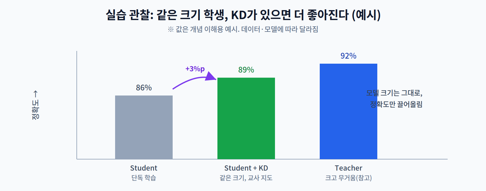

# 6주차 3교시. 지식 증류 구현과 효과 확인

**실습 목표** — PyTorch로 KD 손실을 직접 구현하고, "같은 크기의 학생 모델이 KD가 있을 때 더 좋아지는가"를 확인한다. 이번 실습의 핵심은 **손실 함수 한 줄**에 있다.

> 준비물: 1주차 환경(`odai`) + `torch`, `torchvision`. 작은 데이터셋(예: CIFAR-10)으로 학습한다.

---

## 3.1 KD 구현 (20분)

증류 손실은 2교시의 수식 $L = \alpha\cdot\text{KL}(q_T\|q_S) + \beta\cdot\text{CE}(y,p_S)$ 를 그대로 코드로 옮긴 것이다.

```python
import torch.nn.functional as F

def kd_loss(student_logits, teacher_logits, labels, T=4.0, alpha=0.7):
    # (1) Distillation: 교사와 학생의 soft 분포 간 KL (T^2 스케일 보정)
    soft = F.kl_div(
        F.log_softmax(student_logits / T, dim=1),   # 입력은 log-확률
        F.softmax(teacher_logits / T, dim=1),        # 타깃은 확률
        reduction="batchmean") * (T * T)
    # (2) Student: 실제 정답과의 Cross-Entropy
    hard = F.cross_entropy(student_logits, labels)
    return alpha * soft + (1 - alpha) * hard
```

학습 루프에서 교사는 **고정(eval, no_grad)** 하고, 학생만 업데이트한다.

```python
teacher.eval()
student.train()
for x, y in loader:
    with torch.no_grad():
        t_logits = teacher(x)          # 교사는 학습하지 않음
    s_logits = student(x)
    loss = kd_loss(s_logits, t_logits, y, T=4.0, alpha=0.7)
    optimizer.zero_grad(); loss.backward(); optimizer.step()
```

> 관찰 포인트: `F.kl_div`는 첫 인자를 **로그 확률**, 둘째 인자를 **확률**로 받는다(순서·형태 주의). Temperature `T`로 두 분포를 함께 부드럽게 만든 뒤 KL을 재고, `T*T`로 그래디언트 크기를 보정하는 것이 관례다.

---

## 3.2 KD 유무 성능 비교 (20분)

같은 구조의 학생 모델을 **두 가지 방식**으로 학습해 정확도를 비교한다.

1. **Baseline** — 정답만으로 학습(`F.cross_entropy`만).
2. **KD** — 위 `kd_loss`로 교사 지도까지 받아 학습.

```python
# 개념 비교 (동일 학생 구조, 동일 에폭)
#   baseline_acc : CE만으로 학습한 학생 정확도
#   kd_acc       : kd_loss로 학습한 학생 정확도
#   teacher_acc  : 교사 모델 정확도(참고)
print(f"Student(baseline): {baseline_acc:.1f}%")
print(f"Student(+KD)     : {kd_acc:.1f}%   ← 보통 더 높음")
print(f"Teacher(참고)     : {teacher_acc:.1f}%")
```



관찰의 핵심:

1. **모델 크기는 전혀 늘지 않는다.** KD는 학습 방법일 뿐, 학생의 구조·파라미터 수는 그대로다.
2. 그런데도 학생의 정확도가 대개 올라간다 — 교사의 Dark Knowledge를 배웠기 때문이다.
3. 4·5주차(프루닝·양자화)와 **조합**하면 효과가 커진다: KD로 잘 학습한 학생을 다시 양자화하는 식이다.

> 관찰 포인트: KD는 "모델을 줄이는" 기법이 아니라 "작은 모델을 더 잘 가르치는" 기법이다. 그래서 프루닝·양자화와 **결합**할 수 있다는 점이 중요하다.

---

## 3.3 과제 및 8주차 중간 프로젝트 점검 (10분 안내)

1. **KD 성능표** — 동일 학생 구조로 baseline과 KD를 각각 학습해 정확도를 비교한다. Temperature `T = 1, 4, 10`을 바꿔가며 정확도 변화도 함께 제출한다.
2. **하이퍼파라미터 해석** — `alpha`(soft 비중)와 `T`가 결과에 미친 영향을 2교시 개념으로 설명한다.
3. **중간 프로젝트 제안서 검토** — 지금까지 배운 경량화 기법(Pruning·Quantization·KD) 중 **최소 2개를 조합**한 최적화 전략을 구상해 한 페이지로 정리한다. (8주차 중간고사/프로젝트 범위: 1~7주차)
4. **다음 주 예습** — 7주차(NAS, Neural Architecture Search)에서는 사람이 아니라 **알고리즘이 모델 구조 자체를 탐색**한다. "좋은 모델 구조를 자동으로 찾는다면 무엇을 기준으로 삼아야 할까?"를 생각해 온다.

> 교수님을 위한 Tip: 학생들이 "교사보다 학생이 좋아질 수도 있나요?"라고 물으면, 대개는 아니지만 특정 조건에서 학생이 교사에 근접하거나 능가하는 사례(정규화 효과)가 있음을 소개하라. KD가 단순 모사가 아니라 일종의 정규화로도 작동한다는 통찰로 이어진다.

---

### 3교시 정리
- KD 손실(KL + CE)을 구현하고 학습 루프에 적용했다.
- 같은 크기의 학생이 KD로 더 좋아짐을 확인했다(크기 불변, 성능 향상).
- 프루닝·양자화와 조합 가능한 '학습 기법'으로서 KD를 이해했다 — 다음은 구조 자체를 탐색하는 NAS로.
