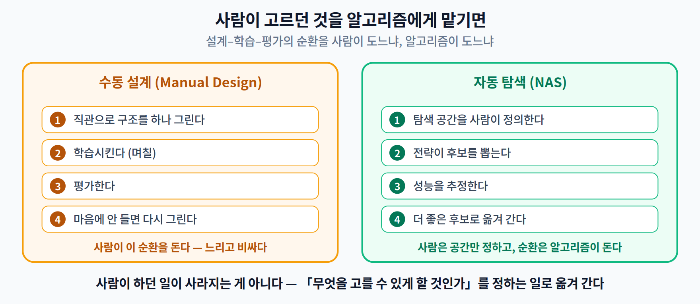
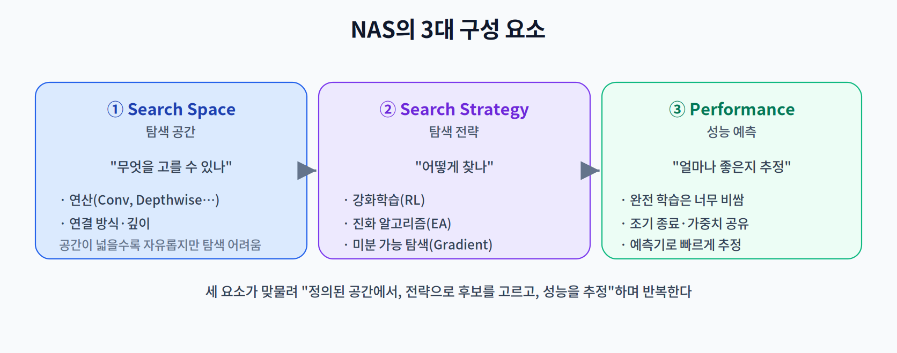
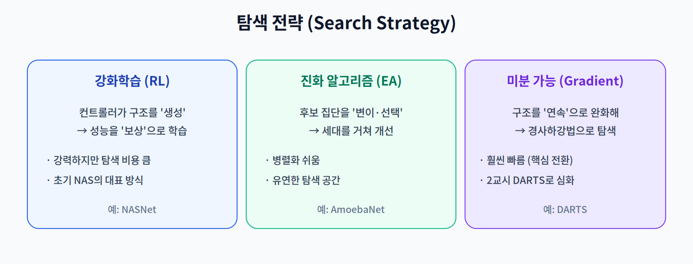

# 07주차 1교시. NAS의 기본 원리와 탐색 전략

**강의 목표** — 사람이 설계한 아키텍처의 한계를 이해하고, 알고리즘이 최적의 네트워크 구조를 스스로 설계하는 NAS의 구성 요소를 파악한다.

4~6주차의 경량화(프루닝·양자화·지식 증류)는 **주어진 모델을 다루는** 기법이었다. 7주차의 **Neural Architecture Search(NAS)** 는 한 단계 더 나아가, **모델 구조 그 자체를 자동으로 탐색**한다. 전반부 이론의 마지막 주차이자 8주차 중간고사 범위의 끝이다.

---

## 1.1 NAS의 등장 배경 (10분)

지금까지의 유명 아키텍처(ResNet, MobileNet 등)는 대부분 **전문가의 직관과 수많은 시행착오**로 설계됐다. 이 **Manual Design** 방식에는 두 가지 한계가 있다.

- **고비용의 Trial-and-Error** — 설계 → 학습 → 평가를 사람이 반복해야 하므로 느리고 비싸다.
- **기기별 최적 구조가 다름** — 갤럭시와 아이폰, 젯슨과 MCU(마이크로컨트롤러)는 메모리 계층·가속기가 달라, 한 모델이 모든 기기에서 최적일 수 없다(2주차의 하드웨어 다양성).

NAS의 아이디어는 이 설계 과정을 **알고리즘에 맡기는 것**이다. 사람이 "탐색할 범위"만 정하면, 알고리즘이 그 안에서 최적 구조를 찾아낸다.

> 한 줄 정리: NAS는 사람의 직관·시행착오에 의존하던 아키텍처 설계를 자동 탐색 문제로 바꾼다.

---

## 1.2 NAS의 3대 요소 (25분)

NAS는 세 가지 구성 요소의 상호작용으로 정의된다.

- **탐색 공간(Search Space)** — 모델이 가질 수 있는 모든 구조의 집합. 어떤 연산(Conv, Depthwise Conv, Pooling 등)과 연결·깊이를 허용할지 정의한다. 공간이 넓으면 자유롭지만 탐색이 어려워진다.
- **탐색 전략(Search Strategy)** — 그 넓은 공간에서 좋은 후보를 **어떻게 찾을지**의 방법. 강화학습(RL), 진화 알고리즘(EA), 미분 가능 탐색(Gradient-based)이 대표적이다(1.3에서 개관).
- **성능 예측(Performance Estimation)** — 후보 구조가 얼마나 좋은지 추정하는 방법. 모든 후보를 끝까지 학습시키면 비용이 폭발하므로, 조기 종료·가중치 공유·성능 예측기 등으로 **빠르게 추정**한다.

이 세 요소가 맞물려 "정의된 공간에서 → 전략으로 후보를 뽑고 → 성능을 추정"하는 순환을 돈다.

> 한 줄 정리: NAS = 탐색 공간(무엇을) × 탐색 전략(어떻게) × 성능 예측(얼마나 좋은지)의 조합.

---

## 1.3 탐색 전략 개관 (20분)

세 가지 대표 전략을 큰 틀에서 비교한다(DARTS는 2교시에서 심화).

- **강화학습(RL)** — 컨트롤러가 구조를 생성하고, 그 성능을 **보상**으로 받아 더 좋은 구조를 생성하도록 학습한다(예: NASNet). 강력하지만 탐색 비용이 매우 크다.
- **진화 알고리즘(EA)** — 후보 구조 집단을 **변이·선택**하며 세대를 거쳐 개선한다(예: AmoebaNet). 병렬화가 쉽고 탐색 공간이 유연하다.
- **미분 가능 탐색(Gradient-based)** — 이산적인 "어떤 연산?" 선택을 **연속적으로 완화**해 경사하강법으로 구조를 학습한다(예: DARTS). 앞의 둘보다 훨씬 빨라 NAS 대중화의 전환점이 됐다.

> 교수님을 위한 Tip: 1교시 마지막에 "왜 삼성 갤럭시와 애플 아이폰에서 최적 모델 구조가 다를까?"를 던져라. 하드웨어(메모리 계층·NPU 구조)에 따라 같은 모델도 실행 효율이 천차만별이라는 점이, 2교시 Hardware-aware NAS의 동기가 된다.

---

### 1교시 복습 질문
1. Manual Design의 두 가지 근본 한계는?
2. NAS 3대 요소를 각각 한 문장으로 정의하라.
3. RL·EA·Gradient 전략 중 NAS를 빠르게 만든 전환점은 무엇이며 왜인가?
