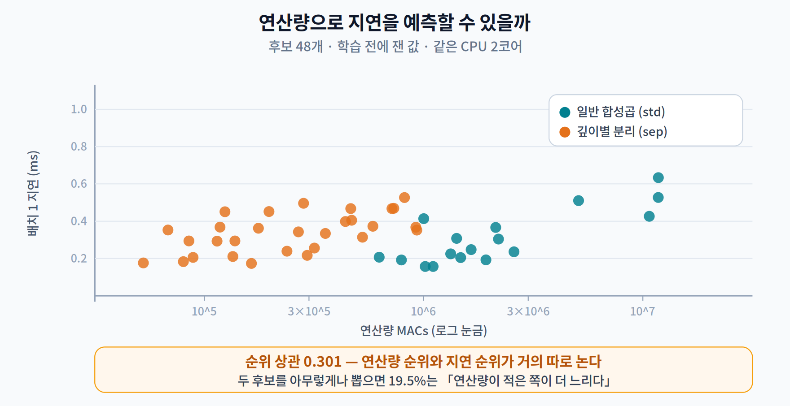
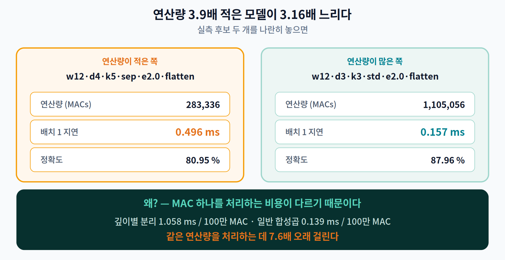
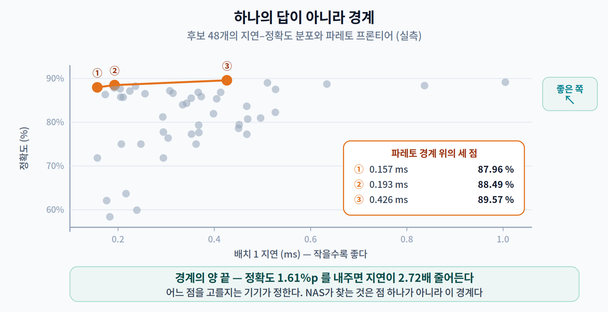
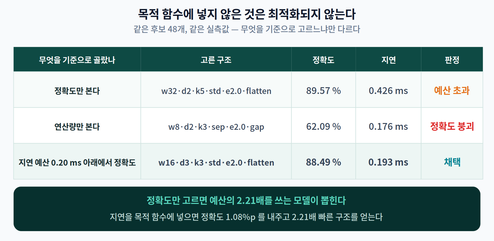

# 07주차 1교시. 구조를 자동으로 찾는다면, 무엇을 기준으로 찾아야 할까

> **오늘의 질문** — 지난 세 주 동안 우리는 **주어진 모델**을 지우고, 덜 정밀하게 적고, 다시 가르쳤다. 6주차 내내 "학생의 크기는 이미 정해져 있다"고 전제했다. 그 전제를 풀면 어떻게 될까? 그리고 알고리즘에게 구조를 고르라고 시킨다면, **무엇을 잘한다고 알려 줘야** 할까?

> **이번 주차 운영** — 1교시는 이 강의이고, **2·3교시에는 중간고사(범위 1~6주차)** 를 치른다. 오늘 배우는 NAS는 시험 범위가 **아니다.** 같은 회차에 배운 것을 그날 출제하지 않는 것이 평가 타당성의 원칙이다.

---

## 1.1 사람이 고르던 것을 알고리즘에게 맡기면 (8분)

ResNet도 MobileNet도 **사람이 손으로 그린** 구조다. 전문가가 직관으로 하나 그리고, 며칠 학습시키고, 평가하고, 마음에 안 들면 다시 그린다.

이 방식에는 두 가지 한계가 있다.

- **비싸고 느리다** — 순환 한 바퀴에 며칠이 든다. 사람이 시도할 수 있는 후보의 수에 한계가 있다.
- **기기마다 정답이 다르다** — 2주차에서 봤듯 갤럭시와 젯슨과 MCU는 메모리 계층도 가속기도 다르다. 한 모델이 모든 기기에서 최적일 수 없다.

Zoph와 Le는 순환 신경망 컨트롤러가 아키텍처를 **생성**하고 그 성능을 **보상**으로 받아 학습하는 방식으로, **아키텍처 설계 자체를 학습 문제로 바꿀 수 있음**을 보였다(ICLR 2017). 이것이 **NAS(Neural Architecture Search)** 다.

> **오해하지 말 것** — NAS는 사람의 일을 없애지 않는다. **"무엇을 고를 수 있게 할 것인가"(탐색 공간)를 정하는 일**로 옮겨 갈 뿐이다. 그리고 곧 보겠지만 **"무엇을 잘한다고 볼 것인가"(목적 함수)를 정하는 일**이 훨씬 더 중요하다.

> 한 줄 정리: NAS는 아키텍처 설계를 자동 탐색 문제로 바꾼다. 사람의 역할은 사라지는 게 아니라 **공간과 기준을 정하는 쪽**으로 옮겨 간다.

---

## 1.2 NAS의 3대 요소 (10분)

Elsken 등(JMLR 2019)의 정리에 따르면 NAS는 셋으로 분해된다.

| 요소 | 묻는 것 | 대표 선택지 |
|---|---|---|
| **탐색 공간** (Search Space) | 무엇을 고를 수 있나 | 연산 종류·깊이·너비·커널 크기·연결 |
| **탐색 전략** (Search Strategy) | 어떻게 찾나 | 강화학습 · 진화 알고리즘 · 미분 가능 탐색 · **랜덤** |
| **성능 추정** (Performance Estimation) | 얼마나 좋은지 | 조기 종료 · 가중치 공유 · 성능 예측기 |

세 번째가 비용을 지배한다. 후보 하나를 끝까지 학습시켜 봐야 점수를 알 수 있다면 탐색 비용이 폭발하기 때문이다. §1.5의 Once-for-All이 정확히 이 항을 공략한다.

**그런데 이 표에 없는 것이 하나 있다.** 세 요소 어디에도 **"무엇을 잘한다고 볼 것인가"** 가 적혀 있지 않다. 그것은 **목적 함수**가 정하고, 오늘 강의의 나머지 전부가 그 이야기다.

> 한 줄 정리: NAS = 공간(무엇을) × 전략(어떻게) × 추정(얼마나 좋은지). 여기에 **목적 함수(무엇을 좋다고 할 것인가)** 가 더해져야 비로소 탐색이 성립한다.

---

## 1.3 연산량으로 지연을 예측할 수 있을까 (14분)

목적 함수를 정할 차례다. **정확도**는 당연히 넣는다. 문제는 나머지다.

온디바이스에서는 **속도**가 정확도만큼 중요하다. 그런데 후보 수천 개를 실제 기기에서 하나씩 재는 것은 느리다. 그래서 많은 논문이 **연산량(FLOPs 또는 MACs)** 을 대신 쓴다. 연산량은 **학습도 실행도 없이 종이 위에서 계산**되니까.

**이게 통할까?** 직접 재 봤다.

### 실험 설정

작은 CNN 탐색 공간을 정의했다. 폭·깊이·커널 크기·합성곱 종류·채널 증가율·헤드 방식 — 여섯 축의 조합으로 **240개** 구조가 나온다. 여기서 **48개를 무작위로 뽑아** 세 가지를 각각 쟀다.

| 재는 것 | 방법 | 학습이 필요한가 |
|---|---|:---:|
| 파라미터 수 | 세면 된다 | ✗ |
| 연산량 (MACs) | 층별로 계산 | ✗ |
| **배치 1 지연** | 같은 CPU 2코어에서 120회 측정 후 중앙값 | ✗ |
| 정확도 | Fashion-MNIST 10,000장으로 14 에폭 학습 | ✓ |

앞의 셋은 **학습 없이** 잴 수 있다. 그래서 먼저 셋만 놓고 본다.

### 결과

> **연산량 순위와 지연 순위의 상관은 0.301이었다.**

거의 따로 논다. 구체적으로:

- 두 후보를 아무렇게나 뽑으면 **19.5%**, 즉 **다섯 쌍 중 한 쌍**은 "연산량이 적은 쪽이 오히려 더 느리다".
- **가장 빠른 모델**(0.157 ms)은 연산량 순위가 **48개 중 34위**였다. 연산량으로는 하위권이다.
- **연산량이 가장 적은 모델**(52,688 MACs, 1위)은 지연이 4위였고 정확도는 **62.09%** 로 거의 꼴찌였다.

가장 극적인 한 쌍을 보자.

| | 연산량 (MACs) | 배치 1 지연 | 정확도 |
|---|---:|---:|---:|
| `w12·d4·k5·**sep**·e2.0·flatten` | **283,336** | **0.496 ms** | 80.95 % |
| `w12·d3·k3·**std**·e2.0·flatten` | 1,105,056 | 0.157 ms | 87.96 % |
| | 3.9배 **적은데** | 3.16배 **느리다** | 7.01 %p 낮다 |

### 왜 이런 일이 벌어지나

후보를 **합성곱 종류로 나눠** 보면 원인이 바로 드러난다.

| | 개수 | 연산량 중앙값 | 지연 중앙값 | **100만 MAC당 지연** |
|---|---:|---:|---:|---:|
| 일반 합성곱 (std) | 19 | 1,924,992 | 0.304 ms | **0.139 ms** |
| 깊이별 분리 (sep) | 29 | 268,400 | 0.352 ms | **1.058 ms** |

**같은 연산량을 처리하는 데 깊이별 분리 합성곱이 7.6배 오래 걸린다.** 그래서 연산량이 7.2배 적은데도 지연은 오히려 1.16배 크다.

이유는 2주차에서 이미 배웠다. **연산량이 아니라 데이터 이동이 병목이기 때문**이다. 깊이별 분리 합성곱은 곱셈은 확 줄이지만, 채널마다 따로 도는 구조라 **한 번 읽어 온 데이터로 할 수 있는 계산이 적다**. 곱셈 대비 메모리 접근의 비율이 높다.

ShuffleNet V2(Ma 외, ECCV 2018)가 이 현상을 정리하며 남긴 문장이 정확하다.

> *"특별히 우리는 **깊이별 합성곱도 원소별 연산으로 취급한다.** 그것 역시 MAC/FLOPs 비율이 높기 때문이다."*
>
> (여기서 MAC은 memory access cost, 즉 메모리 접근 비용이다. FLOPs 대비 메모리 접근이 많다 = 산술 강도가 낮다.)

같은 논문의 결론은 더 직설적이다.

> *"신경망 아키텍처 설계는 대개 **연산 복잡도라는 간접 지표(FLOPs)** 에 이끌려 왔다. 그러나 **직접 지표인 속도**는 다른 요인들에도 좌우된다."*

> **[더 깊이 — 선택] 이 함정은 최전선에서도 되풀이된다**
>
> EfficientNetV2(Tan & Le, ICML 2021)는 이 문제를 정면으로 인정했다 — *"깊이별 합성곱은 일반 합성곱보다 파라미터와 FLOPs가 적지만, 현대 가속기를 충분히 활용하지 못하는 경우가 많다."*
>
> 그들의 해법이 인상적이다. 초기 스테이지에서 깊이별 3×3과 1×1을 **일반 3×3 하나로 되돌리는** Fused-MBConv를 도입했다. **FLOPs를 일부러 늘려서 실제 시간을 줄인 것이다.**
>
> 여러분이 4주차에서 배운 문장 — *"장부상 연산량은 성능 지표가 아니다"* — 가 여기서 아키텍처 설계 원리로 되돌아온다.

### 그래서 실측을 목적 함수에 넣는다

MnasNet(Tan 외, CVPR 2019)이 이 지점을 정확히 지적했다.

> *"FLOPs로 추론 지연을 근사한 기존 연구와 달리, 우리는 **실제 모바일 기기에서 모델을 실행해 현실의 지연을 직접 측정**한다. FLOPs가 종종 부정확한 대리 지표라는 관찰에서 출발했다 — 예컨대 MobileNet과 NASNet은 FLOPs가 비슷한데(575M vs 564M) 지연은 크게 다르다(113 ms vs 183 ms)."*

**연산량은 2% 차이인데 지연은 62% 차이다.** 우리 실험이 작은 규모에서 재현한 것이 바로 이것이다.

MnasNet의 목적 함수는 정확도와 실측 지연을 함께 담는다. 목표 지연 $T$ 에 대해

$$\text{maximize}\quad ACC(m) \times \left[\frac{LAT(m)}{T}\right]^{w}, \qquad w = \begin{cases} \alpha, & LAT(m) \le T \\ \beta, & \text{그 외}\end{cases}$$

논문은 $\alpha = \beta = -0.07$ 을 썼다. 지연이 목표를 넘으면 점수가 깎이고, 밑돌면 살짝 보상받는다. $\alpha=0,\ \beta=-1$ 로 두면 "$T$ 를 넘으면 탈락"이라는 딱딱한 제약이 된다.

$LAT(m)$ 은 **시뮬레이션이 아니라 Pixel 1 휴대폰의 big CPU 코어에서 배치 1로 잰 값**이다. 이 한 줄이 hardware-aware NAS의 전부라고 해도 좋다.

> 한 줄 정리: 연산량 순위와 지연 순위의 상관은 **0.301**이었다. **연산량은 지연의 대리 지표가 될 수 없다** — 그래서 실측 지연을 목적 함수에 직접 넣는다.

---

## 1.4 하나의 답이 아니라 경계 — 파레토 프론티어 (12분)

이제 정확도와 지연 **둘 다** 목적 함수에 들어왔다. 그런데 두 목표는 서로 당긴다. 그럼 **정답이 하나로 정해질까?**

아니다. 1주차 2교시에서 세운 제약 최적화 정식화가 여기서 되살아난다.

**파레토 최적**이란 *"어느 한 목표를 개선하려면 반드시 다른 목표를 희생해야 하는 상태"* 다. 그런 점들을 모으면 **경계(파레토 프론티어)** 가 된다. 우리 48개 후보에서 경계 위에 오른 것은 **셋뿐**이었다.

| | 지연 | 정확도 | 연산량 |
|---|---:|---:|---:|
| 가장 빠른 점 | **0.157 ms** | 87.96 % | 1,105,056 |
| 중간 점 | 0.193 ms | 88.49 % | 1,924,992 |
| 가장 정확한 점 | 0.426 ms | **89.57 %** | 10,693,760 |

경계의 양 끝을 비교하면 **정확도 1.61%p를 내주는 대신 지연이 2.72배 줄어든다.**

**어느 점이 정답인가?** 이 질문에는 답이 없다. **기기가 답을 정한다.** 실시간 30fps가 필요한 카메라 파이프라인이라면 왼쪽 끝을, 배치로 돌리는 서버라면 오른쪽 끝을 고른다. 모바일용 모델과 서버용 모델은 **서로 다른 모델이 아니라 같은 경계 위의 다른 점**이다.

> **NAS가 찾는 것은 점 하나가 아니라 이 경계다.** MnasNet이 딱딱한 제약 대신 부드러운 가중곱 보상을 쓴 이유가 여기 있다 — 한 번의 탐색으로 **경계를 여러 점 훑기** 위해서다.

### 목적 함수에 넣지 않은 것은 최적화되지 않는다

같은 후보 48개, 같은 실측값을 놓고 **고르는 기준만** 바꿔 보자.

| 무엇을 기준으로 골랐나 | 고른 구조 | 정확도 | 지연 | 판정 |
|---|---|---:|---:|---|
| **정확도만 본다** | `w32·d2·k5·std·e2.0·flatten` | 89.57 % | 0.426 ms | 예산 초과 |
| **연산량만 본다** | `w8·d2·k3·sep·e2.0·gap` | **62.09 %** | 0.176 ms | 정확도 붕괴 |
| **지연 0.20 ms 아래에서 정확도** | `w16·d3·k3·std·e2.0·flatten` | 88.49 % | 0.193 ms | **채택** |

세 줄이 전부 다른 모델을 가리킨다. 탐색 공간도 같고 후보도 같고 측정값도 같은데 **무엇을 기준으로 삼았는지만** 다르다.

- 정확도만 보면 **예산의 2.21배**를 쓰는 모델이 뽑힌다.
- 연산량만 보면 **정확도 62%짜리**가 뽑힌다.
- 지연을 목적 함수에 넣으면 정확도 **1.08%p**만 내주고 **2.21배 빠른** 구조를 얻는다.

> ### 이번 주의 선언
> **목적 함수에 넣지 않은 것은 최적화되지 않는다.**

3주차부터 되풀이해 온 문장들이 여기서 하나로 모인다.

| | 붙잡고 있던 대리 지표 | 실제로 재야 했던 것 |
|---|---|---|
| 3주차 | 노드 수 | 실측 지연 |
| 4주차 | 희소성(압축률) | 실측 지연 |
| 5주차 | 비트 수 | 정확도·크기·속도 각각 |
| 6주차 | "정확도가 올랐다" | 그 상승분의 출처 |
| **7주차** | **연산량(FLOPs)** | **실측 지연** |

다섯 주 내내 같은 이야기였다. **재지 않은 것은 좋아지지 않고, 목적 함수에 없는 것은 최적화되지 않는다.**

> 한 줄 정리: NAS가 찾는 것은 최적해 **하나**가 아니라 **파레토 경계**다. 그 경계 위 어느 점을 고를지는 기기가 정하고, 애초에 무엇이 경계에 오를지는 **목적 함수**가 정한다.

---

## 1.5 Once-for-All — 학습 1회, 배포 다수 (6분)

문제가 하나 남았다. **기기마다 탐색을 다시 돌리면** 비용이 기기 수에 비례해 폭발한다. 배포 시나리오가 40개면 탐색도 40번이다.

**Once-for-All**(Cai 외, ICLR 2020)이 이 문제를 정면으로 해결한다. 모든 후보를 품은 거대한 **supernet을 딱 한 번 학습**해 두고, 기기 제약에 맞는 **서브넷을 추가 학습 없이 뽑아 쓴다.**

핵심 기법은 **progressive shrinking** — supernet을 학습할 때 **깊이·너비·커널 크기·해상도** 네 축을 점진적으로 줄여 가며, 서브넷들이 서로 간섭하지 않게 만든다. 그렇게 뽑아낼 수 있는 서브넷이 **10¹⁹개를 넘는다.**

효과는 §1.2의 세 번째 요소인 **성능 추정 비용**을 supernet의 공유 가중치로 한 번에 상환한 것이라고 볼 수 있다. 배포 시나리오 40개 기준으로 총 GPU 시간이 MnasNet의 **1,600,000시간에서 1,200시간**으로 줄어든다(CO₂ 배출 기준 약 1,300배).

이것이 1주차 2교시에서 말한 **"학습 1회, 배포 다수(train once, deploy many)"** 의 구현이다.

> 한 줄 정리: OFA는 supernet을 한 번 학습해 기기별 서브넷을 재학습 없이 뽑는다. 성능 추정 비용을 공유 가중치로 상환하는 전략이다.

---

## 오늘의 토론 질문

1. 우리 실험에서 연산량–지연 순위 상관이 0.301이었다. **탐색 공간에서 깊이별 분리 합성곱을 빼면** 이 값은 어떻게 변할 것 같은가? 그렇게 얻은 높은 상관을 근거로 "연산량을 대리 지표로 써도 된다"고 결론지어도 되는가?
2. 파레토 경계 위의 점이 48개 중 **셋뿐**이었다. 나머지 45개는 왜 경계에 못 올랐는가? 그 45개를 만들어 본 것은 낭비였는가?
3. 여러분의 캡스톤에서 목적 함수를 하나 쓴다면 무엇을 넣겠는가? **정확도 · 지연 · 메모리 최대 사용량 · 전력** 중 무엇을 빼면 나중에 후회하게 될까?

> **교수님을 위한 Tip** — §1.3의 산점도를 **결론 없이 먼저 띄우고** *"이 그림에서 무엇이 보이십니까?"* 를 물어보십시오. 주황(깊이별 분리)이 왼쪽 위, 청록(일반)이 오른쪽 아래에 몰려 있다는 것을 학생들이 직접 찾아내면 이후 설명이 필요 없어집니다.
>
> 다만 **곧바로 시험이 이어지므로 길게 끌지 마십시오.** §1.5는 6분 안에 끝내고, 마지막 5분은 시험 운영 안내(고사장 규칙·시간 배분)에 쓰시는 편이 좋습니다.

---

### 1교시 정리
- NAS는 설계를 자동 탐색으로 바꾼다. 사람의 일은 **공간과 기준을 정하는 쪽**으로 옮겨 간다.
- **연산량은 지연의 대리 지표가 될 수 없다** — 순위 상관 0.301, 역전 쌍 19.5%, 최악의 경우 연산량 3.9배 적은 모델이 3.16배 느렸다.
- 원인은 2주차 그대로 — 깊이별 분리 합성곱은 **MAC 하나당 7.6배 비싸다.**
- NAS가 찾는 것은 점 하나가 아니라 **파레토 경계**다. 어느 점을 고를지는 기기가 정한다.
- **목적 함수에 넣지 않은 것은 최적화되지 않는다.**

### 오늘의 용어
- **탐색 공간 (Search Space)** — 후보 구조들의 집합. 사람이 정한다.
- **파레토 프론티어 (Pareto Front)** — 어느 한 목표를 손해 없이 개선할 수 없는 점들의 경계.
- **Hardware-aware NAS** — 시뮬레이션이 아니라 **타깃 기기의 실측 지연**을 목적 함수에 넣는 방식.
- **Supernet / Progressive Shrinking** — 모든 후보를 품은 거대 네트워크와, 서브넷 간섭을 줄이며 학습하는 기법.
- **산술 강도 (Arithmetic Intensity)** — 메모리에서 한 번 읽어 온 데이터로 얼마나 많은 연산을 하는가. 깊이별 분리 합성곱이 낮다.

### 더 읽어보기
- **필수** — T. Elsken, J. H. Metzen, and F. Hutter, "Neural architecture search: A survey," *J. Mach. Learn. Res.*, vol. 20, no. 55, pp. 1–21, 2019. (3대 요소 부분)
- **권장** — N. Ma, X. Zhang, H.-T. Zheng, and J. Sun, "ShuffleNet V2: Practical guidelines for efficient CNN architecture design," in *Proc. European Conf. Computer Vision (ECCV)*, 2018. — **§1.3의 원전. 네 가지 가이드라인만이라도 읽을 것.**
- M. Tan, B. Chen, R. Pang, V. Vasudevan, M. Sandler, A. Howard, and Q. V. Le, "MnasNet: Platform-aware neural architecture search for mobile," in *Proc. IEEE/CVF CVPR*, 2019, pp. 2820–2828.
- H. Cai, C. Gan, T. Wang, Z. Zhang, and S. Han, "Once-for-all: Train one network and specialize it for efficient deployment," in *Proc. ICLR*, 2020.
- B. Zoph and Q. V. Le, "Neural architecture search with reinforcement learning," in *Proc. ICLR*, 2017.
- M. Tan and Q. V. Le, "EfficientNetV2: Smaller models and faster training," in *Proc. Int. Conf. Machine Learning (ICML)*, 2021.
- *(DARTS의 수식 전개, 기기별 최적 구조 실증, 「NAS는 랜덤 서치보다 나은가」 논쟁은 **본 주차 심화 자료** 참조. 시험 범위가 아니다.)*
