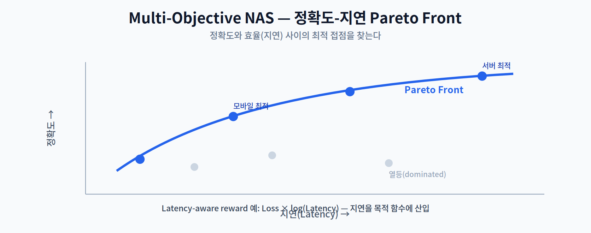

# 07주차 심화 자료 · Differentiable NAS와 최신 트렌드

> **이 자료는 강의 시간에 다루지 않는다.** 7주차는 1교시 강의 + 2·3교시 중간고사로 운영되므로, 아래는 1교시에서 압축해 소개한 주제를 스스로 깊이 보려는 학생을 위한 자율 학습용이다. **시험 범위(1~6주차)에 포함되지 않는다.**

**학습 목표** — 미분 가능 탐색(DARTS)의 수식을 따라가고, 정확도뿐 아니라 지연·전력을 목적 함수에 넣는 기법의 세부를 확인한다.

1교시가 "무엇을·왜"의 압축 조망이었다면, 이 자료는 "어떻게"의 수식과 세부다.

---

## 2.1 Differentiable NAS — DARTS

RL·EA는 강력하지만, 수천 개의 후보를 각각 학습·평가해야 해 비용이 막대하다. **DARTS(Differentiable Architecture Search)** 는 이 문제를 근본적으로 바꿨다.

핵심은 **연속 완화(Continuous Relaxation)** 다. "이 자리에 Conv3x3인가, Conv5x5인가, Pooling인가"라는 **이산적 선택**은 미분이 불가능하다(조합 폭발). DARTS는 이를 각 연산에 **확률 가중치 $\alpha$** 를 부여한 **가중합**으로 바꾼다.

$$\bar{o}(x) = \sum_{o \in \mathcal{O}} \frac{\exp(\alpha_o)}{\sum_{o'} \exp(\alpha_{o'})}\, o(x)$$

이제 구조를 결정하는 $\alpha$ 가 연속 변수가 되어 **경사하강법으로 학습**할 수 있다. 학습이 끝나면 가장 큰 $\alpha$ 를 가진 연산만 남겨 최종 구조를 확정한다. 이 아이디어로 NAS의 탐색 비용이 극적으로 줄어, NAS가 실용 단계로 넘어왔다.

> 한 줄 정리: DARTS는 이산적 구조 선택을 연속 가중치로 완화해, 구조를 '학습'의 대상으로 만든다.

---

## 2.2 Multi-Objective & Hardware-aware NAS

초기 NAS는 오직 **정확도**만 목표로 했다. 그러나 온디바이스에서는 **지연·전력**도 똑같이 중요하다. 그래서 여러 목표를 동시에 최적화하는 **Multi-Objective NAS** 가 필요하다.

- **Pareto 최적성(Pareto Optimality)** — "정확도를 더 높이려면 지연이 늘고, 지연을 줄이려면 정확도가 준다"는 트레이드오프에서, 어느 한쪽을 손해 없이 개선할 수 없는 최적해들의 경계가 **Pareto Front** 다. 모바일용·서버용은 이 경계 위의 서로 다른 점이다.
- **Latency-aware Reward** — 보상(목적) 함수에 지연을 직접 넣는다. 예를 들어 $Loss \times \log(Latency)$ 처럼 지연에 가중치를 부여해, 느린 구조에 벌점을 준다. **핵심은 시뮬레이션이 아니라 실제 기기에서 측정한 지연**을 반영하는 것이다.

이렇게 하드웨어의 실제 지연을 설계 지표로 삼는 것이 **Hardware-aware NAS** 다. 2주차에서 본 "같은 모델도 하드웨어마다 실행 효율이 다르다"가 여기서 설계 목적 함수로 들어온다.

> 한 줄 정리: Hardware-aware NAS는 정확도와 함께 '실제 기기의 지연'을 목적 함수에 넣어 기기 맞춤 구조를 찾는다.

---

## 2.3 ProxylessNAS와 Once-for-All

- **ProxylessNAS** — 작은 대리(proxy) 과제가 아니라, **타깃 모바일 기기에서 직접 측정한 지연**을 탐색에 반영한다. "프록시 없이(proxy-less)" 실제 배포 환경의 지연을 곧바로 최적화한다는 점이 이름의 유래다.
- **Once-for-All (OFA, MIT HAN Lab)** — 온디바이스 NAS의 핵심 혁신이다. 모든 후보를 포함한 거대 **Supernet을 딱 한 번만 학습**한 뒤, 다양한 하드웨어 제약에 맞는 **서브 네트워크를 재학습 없이 추출**한다.

OFA의 의의는 **"기기마다 NAS를 다시 돌리는 비용"을 없앤 것**이다. 한 번의 큰 학습으로 수많은 기기를 커버하므로, 실무의 배포 다양성 문제를 정면으로 해결한다.

> 한 줄 정리: ProxylessNAS는 실제 지연을 직접 최적화하고, OFA는 한 번 학습한 Supernet에서 기기별 서브넷을 뽑는다.

---

## 2.4 한계와 연구 동향

- **탐색 비용과 재현성** — DARTS 계열은 빨라졌지만 탐색이 불안정하거나 특정 연산에 편향될 수 있다는 지적이 있다.
- **시뮬레이션과 현실의 괴리** — 예측된 지연과 실제 보드의 지연이 다를 수 있어, 실측 기반 설계가 강조된다.

> 교수님을 위한 Tip: 이 자료는 과제·세미나 소재로 쓰기 좋다. "논문 수치만큼 내 젯슨/라즈베리파이에서도 전성비가 나올까?"를 리포트 주제로 내면, 13주차 논문 세미나의 예행연습이 된다.

---

### 자율 점검 질문
1. DARTS의 연속 완화가 해결한 문제와, 최종 구조를 확정하는 방법은?
2. Latency-aware reward에서 '실측 지연'이 중요한 이유는?
3. ProxylessNAS와 OFA의 핵심 기여를 각각 한 문장으로 비교하라.
