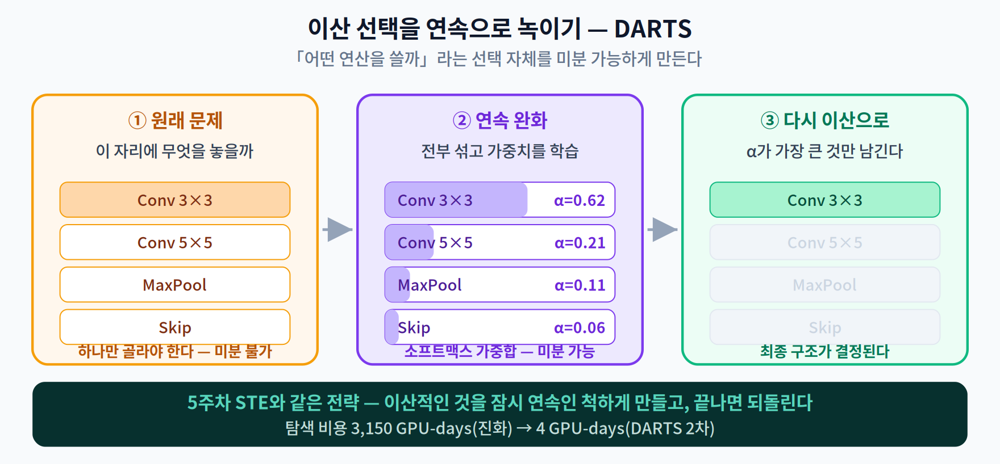
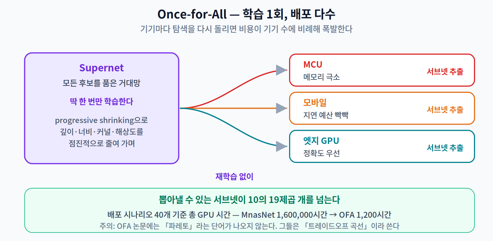

# 07주차 심화 자료 · 이산 선택을 미분 가능하게 만들기, 그리고 NAS가 정말 작동하는가

> **이 문서는 강의 시간에 다루지 않는다.** 7주차는 1교시 강의 뒤 곧바로 중간고사가 이어지므로, 1교시에서 압축한 주제를 더 보고 싶은 학생을 위한 **자율 학습 자료**다.
> **시험 범위(1~6주차)가 아니다.** 부담 없이 읽되, **§3은 논문을 읽는 태도**에 관한 것이므로 시간이 없다면 그것만 읽어도 좋다.

---

## 1. DARTS — 이산 선택을 연속으로 녹이기

1교시에서 NAS의 세 요소를 봤다. 이 중 **탐색 전략**이 비용을 지배하는데, 강화학습·진화 알고리즘은 후보를 하나씩 "만들어 보고 → 학습시키고 → 점수를 매기는" 순환을 돈다. 후보 하나가 곧 학습 한 번이니 비용이 폭발한다.

**DARTS**(Liu, Simonyan, Yang, ICLR 2019)는 이 순환 자체를 없앤다. **"어떤 연산을 쓸 것인가"라는 이산적 선택을 연속적인 가중치로 바꾸어**, 구조를 경사하강법으로 학습해 버린다.

### 1.1 연속 완화 (continuous relaxation)

노드 $i$ 에서 $j$ 로 가는 간선에 놓을 수 있는 연산의 후보 집합을 $\mathcal{O}$ 라 하자(3×3 conv, 5×5 depthwise conv, max pool, skip, zero 등). 원래는 이 중 **하나**를 골라야 한다. DARTS는 대신 **전부를 섞는다.**

$$\bar{o}^{(i,j)}(x) \;=\; \sum_{o \in \mathcal{O}} \frac{\exp\!\left(\alpha_o^{(i,j)}\right)}{\sum_{o' \in \mathcal{O}} \exp\!\left(\alpha_{o'}^{(i,j)}\right)}\; o(x)$$

각 연산에 실수 파라미터 $\alpha_o^{(i,j)}$ 를 붙이고 그 **소프트맥스 가중합**으로 간선의 출력을 정의한다. 이제 $\alpha$ 는 미분 가능한 숫자이므로 경사하강법으로 학습할 수 있다. 학습이 끝나면 **가장 큰 $\alpha$ 의 연산만 남긴다.**

5주차의 **STE**와 발상이 정확히 대칭이다.

| | 5주차 STE | 7주차 DARTS |
|---|---|---|
| 미분이 안 되는 것 | `round()` | "어떤 연산을 쓸까"라는 선택 |
| 해결 | **역전파에서만** 항등함수로 취급 | **순전파에서부터** 소프트맥스 혼합으로 대체 |
| 마지막에 | 진짜 정수로 굳힌다 | $\alpha$ 최대인 연산만 남긴다 |

두 기법 모두 **"이산적인 것을 잠시 연속인 척하게 만들고, 끝나면 다시 이산으로 되돌린다"** 는 같은 전략이다. 이 패턴은 딥러닝 전반에서 되풀이된다.

### 1.2 두 겹의 최적화 (bilevel)

가중치 $w$ 와 구조 $\alpha$ 를 **같은 데이터로 동시에** 학습하면 안 된다. $\alpha$ 가 학습 집합에 과적합되기 때문이다. 그래서 DARTS는 두 겹으로 나눈다.

$$\min_{\alpha}\; \mathcal{L}_{val}\!\left(w^{*}(\alpha),\, \alpha\right) \qquad \text{s.t.} \quad w^{*}(\alpha) = \arg\min_{w}\; \mathcal{L}_{train}(w, \alpha)$$

**가중치는 학습 집합에서, 구조는 검증 집합에서** 배운다. 안쪽 $\arg\min$ 을 매번 끝까지 풀 수는 없으므로 한 스텝만 근사하거나(1차) 미분을 한 번 더 전개한다(2차).

### 1.3 비용 — 자릿수를 보라

ICLR 2019 게재본 Table 1의 CIFAR-10 결과다.

| 방법 | 탐색 방식 | 테스트 오류 | 탐색 비용 (GPU-days) |
|---|---|---:|---:|
| NASNet-A | 강화학습 | 2.83 % | **2,000** |
| AmoebaNet-B | 진화 | 2.55 % | **3,150** |
| ENAS | 강화학습(가중치 공유) | 2.89 % | 0.5 |
| **랜덤 서치 기준선** | 랜덤 | **3.29 %** | 4 |
| DARTS (1차) | 경사 | 3.00 % | **1.5** |
| DARTS (2차) | 경사 | 2.76 % | **4** |

3,150 GPU-days에서 4 GPU-days로 — **세 자릿수의 비용 절감**이다. NAS가 연구실 밖으로 나온 전환점이 여기다.

> **인용 시 주의 ①** — DARTS는 arXiv 개정판마다 탐색 비용이 다르다(1차를 0.3 GPU-days로 적은 판도 있다). **ICLR 2019 게재본**의 값을 쓰고 판본을 섞지 말 것.
>
> **인용 시 주의 ②** — 흔히 인용되는 *"초기 NAS는 800 GPU로 28일, 22,400 GPU-시간"* 은 **단위가 틀렸다.** 800 × 28 = 22,400 **GPU-days**다(= 537,600 GPU-시간). 이 오기는 NASNet 논문(Zoph 외, CVPR 2018)의 한 문장에서 비롯됐고 지금도 그대로 퍼져 다닌다. 원논문(Zoph & Le, ICLR 2017)은 *"800개의 GPU에서 800개의 네트워크가 동시에 학습된다"* 와 *"컨트롤러가 12,800개의 아키텍처를 학습한 뒤"* 라고만 적었다. **논문에서 본 숫자도 곱해 보라.**

---

## 2. 기기가 바뀌면 답도 바뀐다

1교시에서 "실측 지연을 목적 함수에 넣는다"고 했다. 그럼 **기기를 바꾸면 최적 구조 자체가 바뀔까?** ProxylessNAS(Cai, Zhu, Han, ICLR 2019)가 정면으로 답했다.

GPU·CPU·모바일 각각을 타깃으로 **따로 탐색한 세 모델**을 만들고, 그 셋을 **세 기기 모두에서** 돌려 지연을 쟀다.

| 무엇을 위해 탐색했나 | Top-1 | GPU 지연 | CPU 지연 | 모바일 지연 |
|---|---:|---:|---:|---:|
| **GPU용** | 75.1 % | **5.1 ms** | 204.9 ms | 124 ms |
| **CPU용** | 75.3 % | 7.4 ms | **138.7 ms** | 116 ms |
| **모바일용** | 74.6 % | 7.2 ms | 164.1 ms | **78 ms** |

**대각선이 전부 이긴다.** 각 기기를 위해 탐색한 모델이 그 기기에서 가장 빠르다. 정확도는 셋이 거의 같은데(74.6~75.3 %) 지연은 최대 **1.5배**까지 갈린다.

논문의 문장이 결론이다.

> *"하드웨어는 특화된 모델을 선호한다. GPU에 최적화된 모델은 CPU와 휴대폰에서 빠르지 않고, 그 반대도 마찬가지다."*
>
> *"GPU는 얕고 넓은 모델에 이른 풀링을 선호하고, CPU는 깊고 좁은 모델에 늦은 풀링을 선호한다."*

2주차의 "같은 모델도 하드웨어마다 실행 효율이 다르다"가 여기서 **"애초에 다른 모델을 만들어야 한다"** 로 강해진다.

ProxylessNAS는 지연을 미분 가능하게 만들어 손실에 직접 넣었다.

$$\mathcal{L} = \mathcal{L}_{CE} + \lambda_1 \lVert w \rVert_2^2 + \lambda_2 \cdot \mathbb{E}[\text{latency}], \qquad \mathbb{E}[\text{latency}_i] = \sum_j p_j^i \times F\!\left(o_j^i\right)$$

$F$ 는 연산별 지연을 예측하는 **실측 기반 룩업 모델**이다. 시뮬레이션이 아니라 그 기기에서 실제로 재어 만든 표다.

---

## 3. NAS는 정말 랜덤 서치보다 나은가 — 이 절만은 꼭 읽을 것

§1.3의 표를 다시 보자. **랜덤 서치 기준선이 3.29 %**, DARTS 2차가 2.76 %다. 차이는 **0.53 %p**다. 자릿수가 다른 비용을 들여 얻은 격차치고는 크지 않다.

이 의심을 정면으로 파고든 논문이 둘 있다.

### Li & Talwalkar (UAI 2019) — 「Random Search and Reproducibility for NAS」

> *"랜덤 서치에 조기 종료를 결합한 방법이 경쟁력 있는 NAS 기준선이다. 예컨대 두 벤치마크 모두에서 선도적 NAS 기법인 ENAS와 최소한 대등한 성능을 낸다."*

여기에 재현성 문제도 함께 지적했다 — *"이 결과들을 정확히 재현하는 데 필요한 자료가 없다"*.

### Yu 외 (ICLR 2020) — 「Evaluating the Search Phase of NAS」

> *"(i) 평균적으로 최신 NAS 알고리즘들은 랜덤 정책과 비슷한 성능을 낸다. (ii) 널리 쓰이는 가중치 공유 전략은 후보들의 순위를 실제 성능과 어긋나게 만들어, 탐색 과정의 효과를 떨어뜨린다."*

두 번째가 특히 아프다. **가중치 공유**는 NAS 비용을 낮추는 핵심 장치인데(ENAS, 그리고 1교시의 OFA), 그것이 **후보의 순위를 뒤섞는다**면 탐색이 무엇을 최적화하고 있는지가 불분명해진다.

### 이 절에서 가져갈 태도

NAS를 배우지 말라는 이야기가 아니다. 세 가지를 기억하자.

1. **비교 기준선을 반드시 확인한다.** 새 NAS 논문을 읽을 때 **랜덤 서치와 비교했는지**, **같은 탐색 예산으로** 비교했는지를 본다.
2. **탐색 공간의 몫과 탐색 전략의 몫을 나눈다.** 탐색 공간을 잘 짜 두면 그 안에서는 무엇을 뽑아도 괜찮은 경우가 많다. 그러면 성과의 공은 전략이 아니라 **공간을 설계한 사람**의 것이다.
3. **1교시의 결론은 여전히 유효하다.** 랜덤 서치든 강화학습이든, **목적 함수에 실측 지연을 넣었는지 아닌지**는 결과를 완전히 가른다. 그 부분은 어느 논문도 반박하지 않았다.

이 잣대를 여러분의 캡스톤 보고서에도 대기 바란다. *"우리 방법이 좋았다"* 앞에 *"무작위로 골랐을 때보다 좋았는가"* 를 먼저 놓는 습관이다.

---

## 4. Once-for-All의 비용 회계

1교시에서 OFA의 아이디어를 봤다. 여기서는 **숫자로** 확인한다. 배포 시나리오 40개(기기·지연 제약 조합)를 만족시키는 데 드는 총비용이다.

| 방법 | GPU 시간 | CO₂e (lbs) | AWS 비용 |
|---|---:|---:|---:|
| NASNet-A | 1,920,000 | 544,500 | $5,875,200 |
| MnasNet | 1,600,000 | 453,800 | $4,896,000 |
| ProxylessNAS | 20,000 | 5,700 | $61,200 |
| MobileNetV3-Large | 7,200 | 1,800 | $22,200 |
| **OFA (progressive shrinking)** | **1,200** | **340** | **$3,700** |

> *"N = 40일 때 OFA의 총 CO₂ 배출량은 ProxylessNAS보다 16배, FBNet보다 19배, MnasNet보다 1,300배 적다."*

핵심 장치인 **progressive shrinking** 은 supernet을 학습할 때 **깊이·너비·커널 크기·해상도** 네 축을 점진적으로 줄여 가며 서브넷들이 서로 간섭하지 않게 만든다. 그렇게 뽑아낼 수 있는 서브넷이 **10¹⁹개를 넘는다.**

> **표기 주의 둘** — ① 논문은 "10¹⁹개"가 아니라 **"10¹⁹개 초과(> 10¹⁹)"** 라고 적었다. ② OFA 논문에는 **"파레토"라는 단어가 한 번도 나오지 않는다.** 그들은 "트레이드오프 곡선(trade-off curve)"이라고 쓴다. OFA를 파레토 프론티어로 설명하는 것은 **우리의 해석**이지 논문의 표현이 아니다.

---

## 5. 더 읽어보기

- [1] H. Liu, K. Simonyan, and Y. Yang, "DARTS: Differentiable architecture search," in *Proc. Int. Conf. Learning Representations (ICLR)*, 2019.
- [2] H. Cai, L. Zhu, and S. Han, "ProxylessNAS: Direct neural architecture search on target task and hardware," in *Proc. ICLR*, 2019.
- [3] H. Cai, C. Gan, T. Wang, Z. Zhang, and S. Han, "Once-for-all: Train one network and specialize it for efficient deployment," in *Proc. ICLR*, 2020.
- [4] L. Li and A. Talwalkar, "Random search and reproducibility for neural architecture search," in *Proc. Conf. Uncertainty in Artificial Intelligence (UAI)*, 2019. — **§3의 원전.**
- [5] K. Yu, C. Sciuto, M. Jaggi, C. Musat, and M. Salzmann, "Evaluating the search phase of neural architecture search," in *Proc. ICLR*, 2020. — **§3의 원전.** (arXiv 초판은 Sciuto가 제1저자이므로 인용 시 주의)
- [6] T. Elsken, J. H. Metzen, and F. Hutter, "Neural architecture search: A survey," *J. Mach. Learn. Res.*, vol. 20, no. 55, pp. 1–21, 2019.
- [7] B. Zoph and Q. V. Le, "Neural architecture search with reinforcement learning," in *Proc. ICLR*, 2017.
