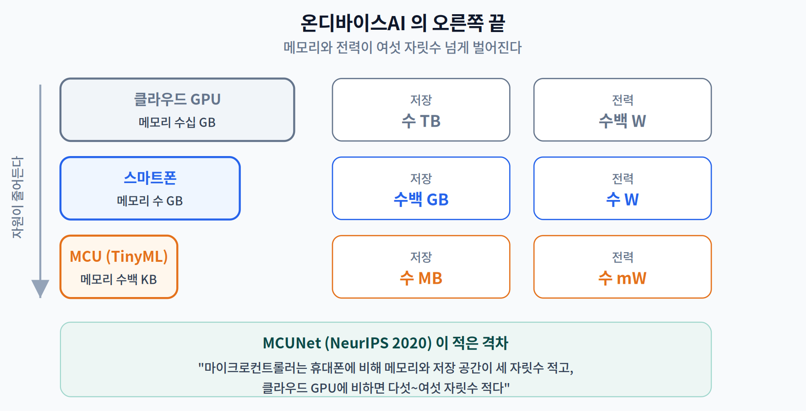
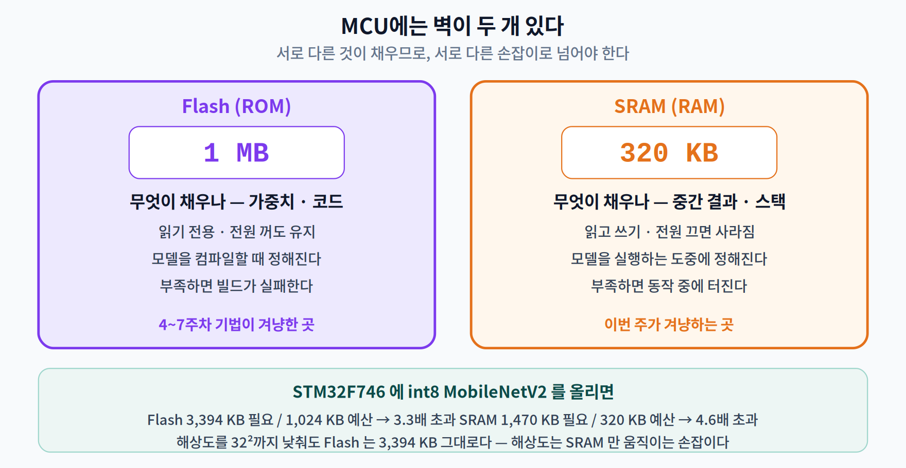
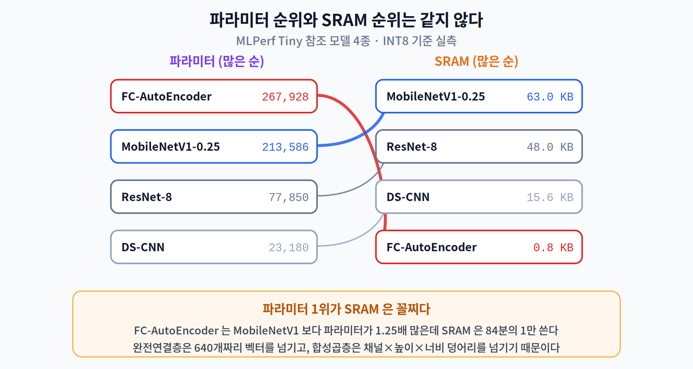
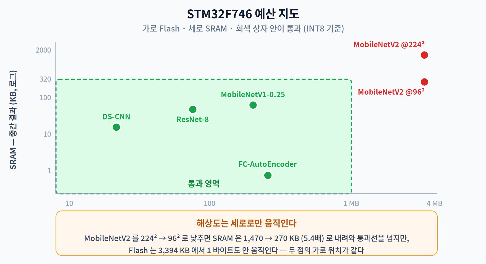

# 08주차 1교시. 3 MB 모델은 1 MB 플래시에서 막힐까, 320 KB SRAM에서 막힐까?

> **오늘의 질문** — 지난 넉 주 동안 우리는 모델을 줄이는 법만 배웠다. 지우고(4주차), 덜 정밀하게 적고(5주차), 다시 가르치고(6주차), 아예 구조를 찾아내기까지 했다(7주차). 그런데 **모델 파일이 아무리 작아져도 끝내 안 들어가는 기기**가 있다. 왜 그럴까? 그리고 그 기기에서는 무엇이 먼저 바닥날까?

---

## 1.1 TinyML은 무엇으로 정의되는가 (12분)

지금까지 우리가 다룬 "온디바이스"는 대체로 **스마트폰**이었다. 램 8 GB, 저장 공간 128 GB, 배터리 4,000 mAh. 1주차에서 노트북으로 잰 3.5 ms 라는 숫자도 이 세계의 것이다.

이번 주의 무대는 다르다. **마이크로컨트롤러(MCU)** — 세탁기 안에, 도어락 안에, 온도 센서 안에 들어 있는 1달러짜리 칩이다.

| | 메모리 | 저장 공간 | 전력 |
|---|---|---|---|
| 클라우드 GPU | 수십 GB | 수 TB | 수백 W |
| 스마트폰 | 수 GB | 수백 GB | 수 W |
| **MCU** | **수백 KB** | **수 MB** | **수 mW** |

MCUNet 논문(Lin 외, NeurIPS 2020)은 이 격차를 이렇게 정리한다 — *"마이크로컨트롤러는 휴대폰에 비해 메모리와 저장 공간이 세 자릿수 적고, 클라우드 GPU에 비하면 다섯~여섯 자릿수 적다."* [1]

### "1 mW"라는 숫자의 정체

TinyML을 정의할 때 거의 언제나 **1 mW**가 등장한다. 이 숫자의 출처를 정확히 알아 두자. Warden과 Situnayake의 『TinyML』(O'Reilly, 2019) 1장이다. [5]

> *"업계와 학계 동료들과 오랜 대화 끝에 도달한 대략적인 합의는, 신경망 모델을 **1 mW 이하의 에너지 비용**으로 돌릴 수 있다면 완전히 새로운 응용들이 가능해진다는 것이다. **다소 임의적인 숫자처럼 보일 수 있지만**, 구체적으로 옮기면 코인 배터리로 도는 기기가 **1년의 수명**을 갖는다는 뜻이다."*

주목할 곳이 두 군데다. 첫째, 저자 스스로 **"다소 임의적"**이라고 적었다. 표준화 기구가 정한 문턱값이 아니라 **어림 규칙**이다. 둘째, 그 근거는 물리량이 아니라 **제품 요구사항**이다 — "코인 배터리로 1년".

실제로 tinyML 재단의 정의는 더 느슨하다. *"극저전력, 통상 **mW 대역과 그 이하**에서 기기 위의 센서 데이터 분석을 수행하는…"* — 문턱이 아니라 **자릿수**를 말한다. 그리고 이 분야의 실제 산업 벤치마크인 MLPerf Tiny는 **전력 상한을 아예 정하지 않는다.** 에너지를 *측정할 뿐* 그것으로 자격을 가르지 않는다. [3]

> **[더 깊이 — 선택]** "1 mW"를 시험에 나올 정의처럼 외우면 곤란하다. 이 수업에서 TinyML을 판별하는 기준은 숫자가 아니라 **제약의 종류**다. 즉 *램이 메가바이트가 아니라 킬로바이트 단위이고, 전원이 벽이 아니라 배터리이며, 운영체제가 없거나 매우 얇은* 환경. 2교시 끝에서 "1년"이라는 숫자를 직접 계산해 볼 것이고, 그때 이 정의가 얼마나 조건에 민감한지 보게 된다.

> 한 줄 정리: TinyML의 "1 mW"는 표준이 아니라 **코인 배터리 1년**이라는 제품 요구에서 역산된 어림 규칙이다. 정의를 외우는 대신 **제약의 종류**를 기억하라.

---

## 1.2 두 개의 벽 — Flash와 SRAM은 서로 다른 것이 채운다 (18분)

MCU에는 메모리가 **두 종류** 있고, 둘은 완전히 다른 역할을 한다. 이 구분을 못 하면 이번 주 내용은 하나도 안 잡힌다.

| | Flash (ROM) | SRAM (RAM) |
|---|---|---|
| 크기 (STM32F746) | **1 MB** | **320 KB** |
| 성격 | 읽기 전용, 전원 꺼도 유지 | 읽고 쓰기, 전원 끄면 사라짐 |
| **무엇이 채우나** | **가중치**(파라미터) + 코드 | **중간 결과**(activation) + 스택 |
| 언제 정해지나 | 모델을 컴파일할 때 | **모델을 실행하는 도중** |
| 우리가 배운 것 중 이걸 줄이는 것 | 프루닝·양자화 | ??? |

마지막 줄의 물음표가 이번 주의 과제다. 4~7주차에서 배운 기법들은 **거의 전부 Flash 쪽 손잡이**였다. 파라미터를 지우고, 더 적은 비트로 적고, 작은 학생 모델을 쓰고, 작은 구조를 찾아냈다. 그런데 SRAM은 그것들로 잘 안 줄어든다.

MCUNet 논문의 한 문장이 이 사정을 정확히 요약한다. [1]

> *"딥러닝 시나리오에서 SRAM은 **활성값(activation) 크기**를 제약하고(읽고 쓰기), Flash는 **모델 크기**를 제약한다(읽기 전용)."*

### 숫자로 보자 — MobileNetV2는 어느 벽에서 막히나

우리가 1주차부터 계속 써 온 MobileNetV2를 STM32F746(320 KB SRAM / 1 MB Flash) 예산에 대 보자. **INT8로 양자화한 뒤**의 값이다.

| | 필요량 | 예산 | 초과 배수 |
|---|---:|---:|---:|
| Flash (가중치) | 3,394 KB | 1,024 KB | **3.3배** |
| SRAM (중간 결과) | 1,470 KB | 320 KB | **4.6배** |

둘 다 못 넘는다. 그런데 MCUNet 논문이 같은 모델에 대해 적은 숫자와 비교해 보자 — *"ResNet-50은 저장 한계를 100배 초과하고, MobileNetV2는 **최대 메모리 한계를 22배** 초과한다. int8로 양자화한 MobileNetV2조차 여전히 메모리 한계를 **5.3배** 초과한다."* [1]

우리가 잰 **4.6배**와 논문의 **5.3배**. 완전히 같지는 않지만 같은 자릿수다. 차이는 3교시에서 밝힐 것이다(우리는 순수한 텐서 메모리만 셌고, 실제 런타임은 여기에 추가 버퍼를 더 쓴다). 중요한 것은 **직접 계산한 값이 원논문과 맞아떨어진다**는 사실이다. 3교시에서 여러분이 같은 계산을 직접 하게 된다.

> 한 줄 정리: MCU에는 벽이 **두 개**다. Flash는 가중치가, SRAM은 중간 결과가 채운다. 4~7주차에 배운 경량화는 대부분 **Flash 쪽 손잡이**였다.

---

## 1.3 파라미터 순위와 SRAM 순위는 같지 않다 (20분)

여기서 이번 주의 첫 번째 반전이 나온다.

"모델이 크면 메모리도 많이 쓰겠지"는 자연스러운 직관이다. 그리고 **틀렸다**. 직접 재 보자.

MLPerf Tiny 벤치마크(Banbury 외, NeurIPS 2021 Datasets & Benchmarks)는 TinyML 분야의 표준 벤치마크로, 네 가지 과제에 대해 참조 모델을 정해 두었다. [3] 우리는 이 네 모델을 MLCommons 공개 구현(`mlcommons/tiny`)을 보고 그대로 재구성해 재었다.

| 과제 | 참조 모델 | 입력 | 참조 구현 파라미터 | 우리 재구성 |
|---|---|---|---:|---:|
| 이미지 분류 | ResNet-8 (CIFAR-10) | 32×32 | 78,186 | 77,850 |
| 키워드 인식 | DS-CNN (Speech Commands) | 49×10 MFCC | 23,756 | 23,180 |
| 사람 감지 (Visual Wake Words) | MobileNetV1 α=0.25 | 96×96 | 216,322 | 213,586 |
| 이상 감지 | FC-AutoEncoder (ToyADMOS) | 640차원 | 267,928 | 267,928 |

> **재구성이 맞는지 확인하는 법.** 네 모델의 차이는 전부 **합성곱의 편향(bias) 항** 하나로 설명된다. 참조 구현은 Keras 기본값대로 합성곱에 편향을 두었고, 우리 PyTorch 구현은 배치 정규화 앞의 합성곱에서 편향을 뺐다. ResNet-8은 336개, DS-CNN은 576개, MobileNetV1은 2,736개의 편향이 차이의 전부이며 빼면 **정확히 일치한다.** 편향이 없는 FC-AutoEncoder는 애초에 한 개도 안 틀린다. 이렇게 **차이의 출처를 끝까지 설명할 수 있을 때** 재구성이 맞았다고 말할 수 있다.
>
> 참고로 MLPerf Tiny 논문 본문은 키워드 인식 모델을 "38.6K 파라미터"라고 적었는데, 이는 인용된 선행 연구(Zhang 외, "Hello Edge")의 DS-CNN-S 값이며 **MLPerf 참조 모델의 값이 아니다.** 논문에 실린 숫자라고 그대로 옮기지 말 것 — 이번 학기에 이런 사례를 여러 번 만난다.

### 실측 결과

INT8 기준, **가중치가 차지하는 Flash**와 **중간 결과가 차지하는 SRAM**을 따로 쟀다.

| 모델 | 파라미터 | Flash | **SRAM** | 파라미터 순위 | **SRAM 순위** |
|---|---:|---:|---:|:---:|:---:|
| FC-AutoEncoder | **267,928** | 259.9 KB | **0.8 KB** | 1위 | **4위** |
| MobileNetV1-0.25 @96² | 213,586 | 203.7 KB | **63.0 KB** | 2위 | **1위** |
| ResNet-8 @32² | 77,850 | 75.7 KB | 48.0 KB | 3위 | 2위 |
| DS-CNN | 23,180 | 21.6 KB | 15.6 KB | 4위 | 3위 |

첫 두 줄만 보면 충분하다.

> **FC-AutoEncoder는 파라미터가 MobileNetV1보다 1.25배 많은데, SRAM은 84분의 1만 쓴다.**

84배다. 오타가 아니다. 그리고 이유는 단순하다 — 완전연결층은 **640개짜리 벡터** 하나를 다음 층으로 넘기고, 합성곱층은 **채널 × 높이 × 너비**짜리 3차원 덩어리를 넘긴다. 가중치는 완전연결층이 훨씬 많지만, **한 번에 들고 있어야 하는 중간 결과**는 비교가 안 된다.

### 그래서 무엇을 봐야 하는가

이 표를 보는 두 가지 방식이 있다.

- **모델 파일 크기만 본다** → FC-AutoEncoder가 가장 부담스러운 모델처럼 보인다.
- **SRAM을 본다** → FC-AutoEncoder는 거의 공짜고, MobileNetV1이 가장 부담스럽다.

MCU에 올릴 때 실제로 먼저 터지는 쪽은 **SRAM**이다. Flash는 부족하면 외장 플래시를 붙이는 우회로가 있지만, SRAM은 그런 우회로가 없다. 그리고 Flash 초과는 링커가 빌드 단계에서 잡아 주지만, SRAM 초과는 **동작 중에** 터진다.

네 모델을 STM32F746 예산에 대 보면 전부 여유 있게 통과한다.

| 모델 | Flash 사용률 | SRAM 사용률 |
|---|---:|---:|
| ResNet-8 | 7.4 % | 15.0 % |
| DS-CNN | 2.1 % | 4.9 % |
| MobileNetV1-0.25 | 19.9 % | 19.7 % |
| FC-AutoEncoder | 25.4 % | 0.2 % |

당연하다 — **이 모델들은 처음부터 MCU를 겨냥해 설계되었기 때문이다.** 반면 MobileNetV2는 어떤 조합으로도 안 들어간다. 그 이야기를 2교시에서 이어 간다.

> 한 줄 정리: **파라미터가 많다고 SRAM을 많이 쓰는 게 아니다.** 실측에서 파라미터 1위 모델이 SRAM은 84분의 1만 썼다. MCU 배포에서 먼저 터지는 쪽은 SRAM이다.

---

## 오늘의 토론 질문

1. FC-AutoEncoder는 파라미터가 가장 많은데 SRAM은 가장 적게 썼다. 그렇다면 **완전연결층만으로 이루어진 모델**이 MCU에 항상 유리한가? 어떤 경우에 이 논리가 깨질까?
2. 1.2의 표에서 "SRAM을 줄이는 기법" 칸이 비어 있다. 4~7주차에 배운 것 중 **SRAM을 줄이는 데 실제로 효과가 있을 것 같은** 기법을 하나 고르고, 왜 그렇게 생각하는지 말해 보라. (2교시에서 답을 맞춰 본다.)
3. 우리가 잰 MobileNetV2 초과 배수는 4.6배, 논문은 5.3배였다. **논문 쪽이 더 큰 것이 자연스러운가, 우리 쪽이 더 커야 자연스러운가?** 어떤 항목이 빠졌을지 추측해 보라.

> **교수님을 위한 Tip** — 1.3의 표를 보여 주기 **전에** 네 모델의 파라미터 수만 칠판에 적고 "SRAM 순위를 예측해 보라"고 시키십시오. 거의 전원이 파라미터 순서 그대로 답합니다. 그다음에 84배 역전을 보여 주면 이번 주 내내 쓸 긴장이 한 번에 만들어집니다. 여기서 절대 서두르지 마시고, **"왜 완전연결층은 중간 결과가 작은가"** 를 학생이 스스로 말하게 하십시오. 2교시의 텐서 수명 개념이 이 대답 위에 그대로 올라갑니다.

---

### 1교시 정리
- TinyML의 "1 mW"는 표준이 아니라 **코인 배터리 1년**에서 역산된 어림 규칙이다(Warden & Situnayake). 산업 벤치마크 MLPerf Tiny는 전력 상한을 정하지 않는다.
- MCU에는 벽이 두 개다 — **Flash는 가중치**, **SRAM은 중간 결과**. 4~7주차 기법은 대부분 Flash 쪽이었다.
- **파라미터 순위와 SRAM 순위는 다르다.** 실측에서 파라미터 1위가 SRAM 4위였고 차이는 84배였다.
- MCU용으로 설계된 모델(MLPerf Tiny 4종)은 두 예산을 모두 25 % 이하로 쓴다. MobileNetV2는 INT8로도 SRAM을 4.6배 초과한다.

### 오늘의 용어
- **MCU (Microcontroller Unit)** — 프로세서·메모리·주변장치를 한 칩에 담은 소형 제어용 칩. 램이 KB 단위다.
- **Flash / SRAM** — 각각 가중치와 중간 결과가 사는 곳. MCU에서 둘은 물리적으로 분리된 별개의 예산이다.
- **활성값 (activation)** — 층과 층 사이를 오가는 중간 계산 결과. 모델 파일에는 없고 **실행 중에만 존재**한다.
- **MLPerf Tiny** — TinyML 분야의 표준 벤치마크. 네 과제와 참조 모델·정확도 목표를 정해 둔다.
- **Visual Wake Words** — "사람이 화면에 있는가"만 판별하는 2클래스 과제. 상시 동작 카메라의 대표 문제다.

### 더 읽어보기
- [1] J. Lin, W.-M. Chen, Y. Lin, J. Cohn, C. Gan, and S. Han, "MCUNet: Tiny deep learning on IoT devices," in *Advances in Neural Information Processing Systems (NeurIPS)*, vol. 33, 2020. — **§2 Background 와 Table 1 은 반드시 읽을 것.**
- [2] J. Lin, W.-M. Chen, H. Cai, C. Gan, and S. Han, "Memory-efficient patch-based inference for tiny deep learning," in *Advances in Neural Information Processing Systems (NeurIPS)*, vol. 34, 2021. (arXiv 판 제목은 "MCUNetV2: Memory-Efficient Patch-based Inference for Tiny Deep Learning")
- [3] C. Banbury *et al.*, "MLPerf Tiny benchmark," in *Proc. NeurIPS Track on Datasets and Benchmarks*, vol. 1, 2021.
- [4] R. David *et al.*, "TensorFlow Lite Micro: Embedded machine learning for TinyML systems," in *Proc. Machine Learning and Systems (MLSys)*, vol. 3, 2021, pp. 800–811.
- [5] P. Warden and D. Situnayake, *TinyML: Machine Learning with TensorFlow Lite on Arduino and Ultra-Low-Power Microcontrollers*. Sebastopol, CA: O'Reilly Media, 2019.
