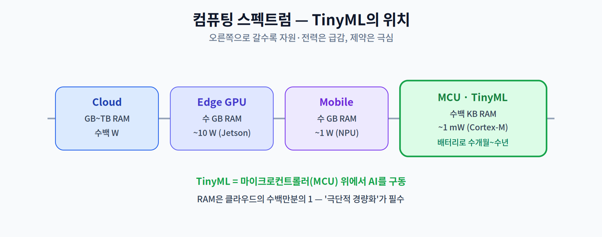
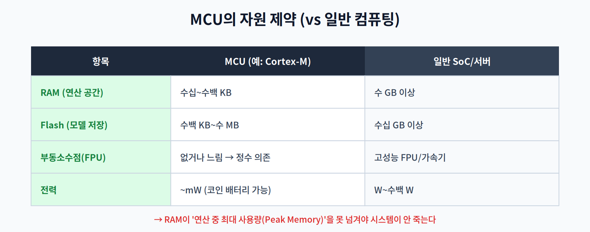
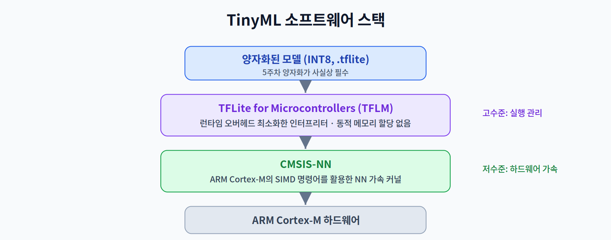

# 08주차 1교시. TinyML의 정의와 기술적 제약

**강의 목표** — RAM이 수백 KB에 불과한 환경에서 AI를 구동하기 위한 '극단적 경량화'의 필요성과 하드웨어 제약을 이해한다.

7주차 중간고사로 전반부 이론(하드웨어·프레임워크·경량화·NAS)을 마쳤다. 8주차부터는 그 기법들이 실제로 쓰이는 **응용 영역**으로 들어간다. 첫 주제는 자원 제약의 극단, **TinyML**이다.

---

## 1.1 TinyML의 정의와 생태계 (15분)

**TinyML**은 스마트폰이나 엣지 GPU가 아니라, **마이크로컨트롤러(MCU)** 처럼 극도로 제한된 기기 위에서 AI를 구동하는 분야다.

- **Always-on 가용성** — TinyML 기기는 배터리 하나로 **수개월~수년** 동안 작동해야 하는 센서 노드가 많다. 늘 켜져서 소리·진동·움직임을 감지하다가, 필요할 때만 추론한다.
- **MCU vs MPU** — 우리가 쓰는 스마트폰의 MPU(마이크로프로세서; 응용 프로세서급)와 달리, **Cortex-M 시리즈** 같은 MCU는 OS 없이(혹은 초경량 RTOS(실시간 OS)로) 동작하고 RAM·연산이 극히 제한된다.

TinyML의 매력은 "가장 값싸고 작은 기기에도 지능을 넣는다"는 데 있다. 대신 그 대가로 극한의 제약을 감내해야 한다.

> 한 줄 정리: TinyML은 MCU 위에서 AI를 돌리는 분야로, 초저전력·상시 동작이 핵심 요구다.

---

## 1.2 극한 자원 제약 (20분)

TinyML이 어려운 이유는 자원이 **일반 컴퓨팅과 차원이 다르게** 적기 때문이다.

- **Memory Wall (극단)** — 2주차의 Memory Wall이 여기서 극에 달한다. 모델을 저장할 **Flash**(수백 KB~수 MB)와 연산 공간인 **RAM**(수십~수백 KB)이 모두 빠듯하다. 예컨대 256KB RAM 환경에서는 중간 결과(Feature Map)조차 다 담기 어렵다.
- **Compute Gap** — 많은 MCU에는 부동소수점 연산 장치(FPU)가 없거나 성능이 낮다. 그래서 **정수 연산에 의존**해야 하며, 이것이 5주차 양자화(INT8)가 TinyML에서 사실상 **필수 전제**가 되는 이유다.

특히 중요한 개념이 **Peak Memory(최대 메모리 사용량)** 다. 모델 실행 중 어느 순간 가장 많은 RAM이 필요한데, 이 값이 기기의 RAM을 넘으면 시스템이 그냥 죽는다(crash). TinyML 설계의 상당 부분이 이 Peak Memory를 RAM 아래로 낮추는 일이다.

> 한 줄 정리: TinyML의 1차 제약은 Flash·RAM이며, FPU 부재로 정수(양자화) 연산이 필수, Peak Memory 관리가 생존 조건이다.

---

## 1.3 TinyML 소프트웨어 스택 (20분)

이 극한 환경에서 AI를 돌리려면 전용 소프트웨어 스택이 필요하다.

- **TensorFlow Lite for Microcontrollers (TFLM)** — 런타임 오버헤드를 최소화한 인터프리터다. **동적 메모리 할당 없이** 정해진 버퍼 안에서 동작해, OS도 힙(heap)도 넉넉하지 않은 MCU에 적합하다.
- **CMSIS-NN** — ARM이 제공하는, Cortex-M 코어에 최적화된 신경망 커널 라이브러리다. 코어의 **SIMD(단일 명령 다중 데이터) 명령어**를 활용해 정수 연산을 가속한다(2주차의 SIMD, 5주차의 정수 양자화가 여기서 결합된다).

즉 "양자화된 모델(INT8) → TFLM(실행 관리) → CMSIS-NN(하드웨어 가속) → Cortex-M"의 계층으로 동작한다.

> 교수님을 위한 Tip: 실제 **코인 배터리(CR2032) 하나로 작동하는 센서 보드**를 보여주며 "이 작은 배터리로 어떻게 딥러닝을 돌릴까?"를 던져라. 이어서 Peak Memory 초과로 보드가 뻗는 상황을 시연하면, 메모리 최적화의 중요성을 뼈저리게 체감시킬 수 있다.

---

### 1교시 복습 질문
1. TinyML이 MPU가 아닌 MCU를 대상으로 한다는 것의 의미(자원·전력)는?
2. 왜 TinyML에서 양자화(INT8)가 '선택'이 아니라 '필수'에 가까운가?
3. Peak Memory가 기기 RAM을 넘으면 어떤 일이 생기는가?
