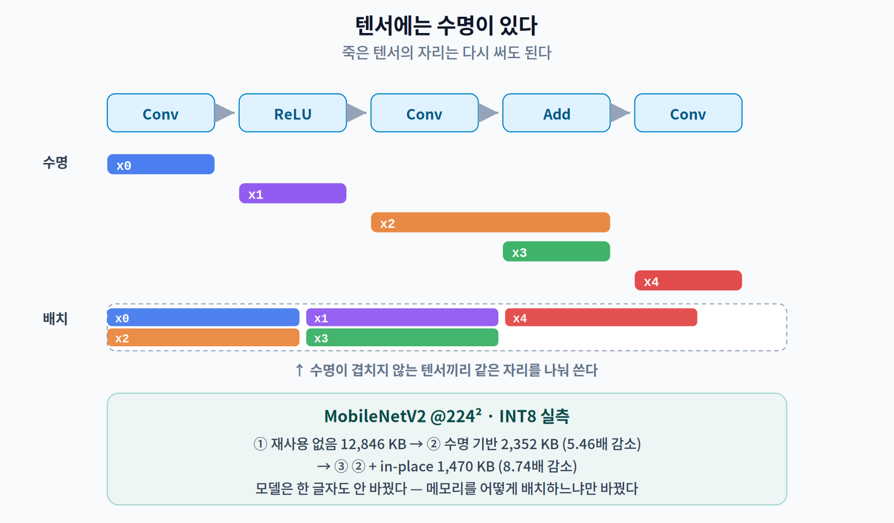
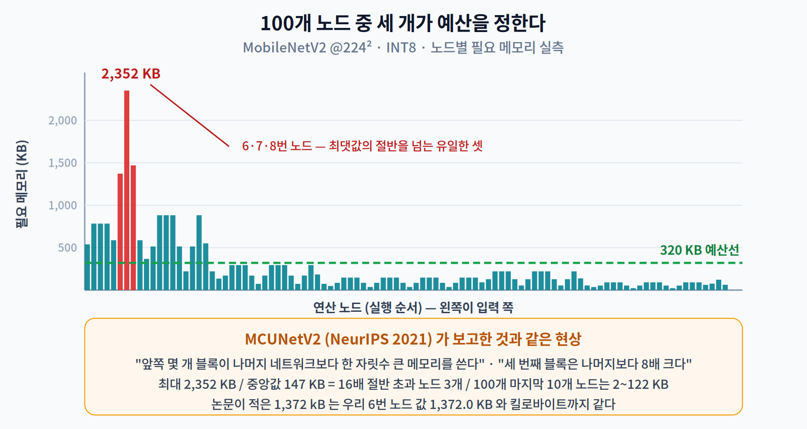
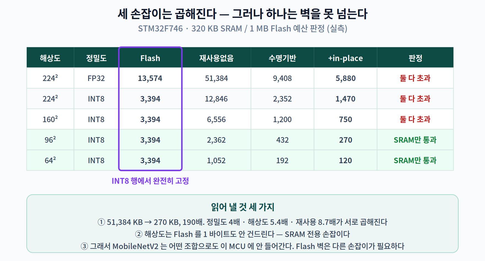
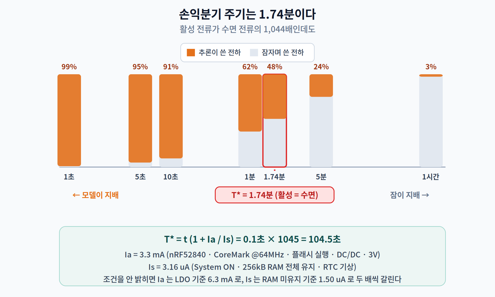
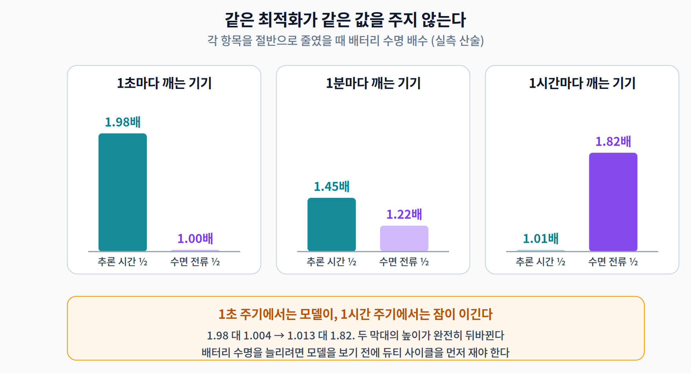
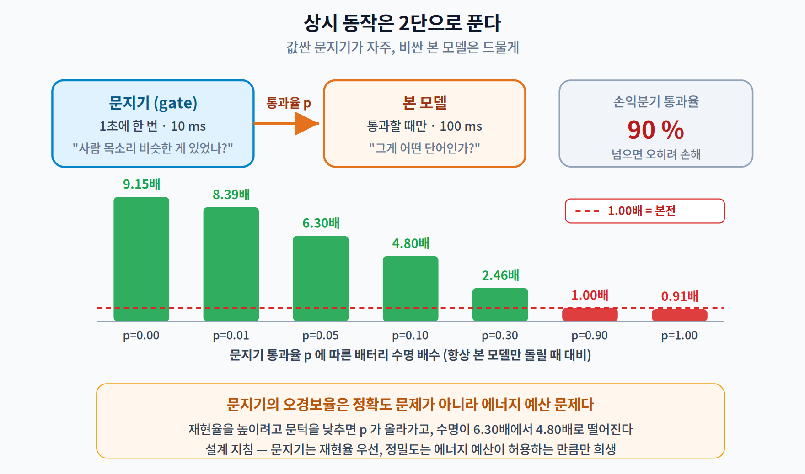

# 08주차 2교시. 무엇을 줄여야 실제로 이득이 오는가

> **오늘의 질문** — 1교시에서 SRAM이 먼저 터진다는 것을 봤다. 그러면 SRAM을 줄이려면 무엇을 손대야 할까? 그리고 **배터리 수명**을 늘리고 싶을 때, 모델을 두 배 빠르게 만드는 것과 잠자기 전류를 반으로 줄이는 것 중 어느 쪽이 이득일까? 놀랍게도 이 질문의 답은 **하나로 정해지지 않는다.**

---

## 2.1 텐서에는 수명이 있다 (15분)

MobileNetV2를 실행할 때 만들어지는 중간 결과를 **전부 합치면** 얼마나 될까? 직접 세어 보면 **12,846 KB**다. 12 MB가 넘는다.

그런데 우리가 1교시에서 인용한 값은 1,470 KB였다. 8.7배 차이다. 이 차이가 어디서 오는지가 2교시의 출발점이다.

### 텐서는 태어나고 죽는다

3층짜리 신경망을 생각해 보자. 첫 층의 출력 $x_1$ 은 둘째 층의 입력으로 쓰이고, **그 순간 이후로는 아무도 안 본다.** $x_2$ 가 만들어지고 나면 $x_1$ 이 있던 자리는 **다시 써도 된다.**

이것이 **텐서 수명(tensor lifetime)** 이다. 각 텐서에는

- **태어나는 시점** — 그 텐서를 출력하는 노드
- **죽는 시점** — 그 텐서를 마지막으로 입력받는 노드

가 있고, 두 시점 사이에만 메모리를 차지한다.

그래서 필요한 메모리는 "모든 텐서의 합"이 아니라 **어느 한 순간에 동시에 살아 있는 텐서들의 합의 최댓값**이다. 이 값을 **최대 메모리(peak memory)** 라 부른다.

### 세 단계로 재 보기

같은 MobileNetV2(224², INT8)를 세 가지 방식으로 계산했다.

| 방식 | 무엇을 하나 | 결과 | 배수 |
|---|---|---:|---:|
| ① 재사용 없음 | 모든 중간 결과를 끝까지 들고 있는다 | 12,846 KB | 1.00 |
| ② 수명 기반 재사용 | 죽은 텐서의 자리를 다시 쓴다 | **2,352 KB** | **5.46배 감소** |
| ③ ② + in-place | 원소별 연산의 출력을 입력 자리에 덮어쓴다 | **1,470 KB** | **8.74배 감소** |

**코드 한 줄도 안 바꾸고, 모델도 안 바꿨다.** 메모리를 **어떻게 배치하느냐**만 바꿨는데 8.7배가 줄었다.

②가 하는 일은 이름이 있다. **메모리 계획(memory planning)** 이다. TensorFlow Lite Micro 논문은 이 과정을 이렇게 설명한다. [4]

> *"운영체제가 동적으로 메모리를 할당해 준다고 가정할 수 없다. 그래서 프레임워크는 주어진 **메모리 아레나(arena)** 에서 메모리를 할당하고 관리한다. 모델 준비 단계에서 인터프리터는 모델을 실행하는 데 필요한 **모든 버퍼의 수명과 크기를 결정**한다. … 프레임워크는 버퍼가 필요한 수명 동안 유효하도록 보장하면서, 가능한 경우 비영구 버퍼를 **재사용하는 메모리 계획**을 만든다."*

그리고 실행 중에는 절대 할당하지 않는다 — *"할당은 인터프리터의 초기화 단계에서만 일어나도록 보장한다. **모델 실행 중에는 (우리 메커니즘을 통한) 어떤 할당도 불가능하다.**"* MCU에는 힙 단편화로 오래 도는 프로그램이 죽는 것을 막아 줄 안전망이 없기 때문이다.

### ③ in-place는 공짜가 아니다 — 그리고 모든 모델에 듣지도 않는다

③은 ReLU 같은 **원소별(element-wise) 연산**의 특성을 쓴다. `y[i] = max(0, x[i])` 는 `x[i]` 를 읽자마자 같은 자리에 써도 된다. 그러면 출력 버퍼가 아예 필요 없다.

네 모델에 같은 최적화를 적용해 봤다.

| 모델 | ② 수명 기반 | ③ + in-place | 이득 |
|---|---:|---:|---:|
| MobileNetV2 @224² | 2,352 KB | **1,470 KB** | **1.60배** |
| MobileNetV1-0.25 @96² | 72.0 KB | 63.0 KB | 1.14배 |
| ResNet-8 | 48.0 KB | 48.0 KB | **1.00배 (전혀 없음)** |
| DS-CNN | 15.6 KB | 15.6 KB | **1.00배 (전혀 없음)** |

**절반이 아무 이득도 못 봤다.** 이유는 명확하다. in-place는 **최대 지점에 원소별 연산이 걸려 있을 때만** 듣는다. MobileNetV2의 최대 지점은 확장된 채널을 지나는 ReLU6였고, ResNet-8과 DS-CNN의 최대 지점은 합성곱이다. 합성곱은 입력을 다 읽기 전에 출력을 쓸 수 없으므로 별칭이 불가능하다.

> **평균적인 기법이란 없다.** 4주차 프루닝이 그랬고, 6주차 증류가 그랬듯, 여기서도 "일반적으로 몇 배"라는 말은 의미가 없다. **내 모델의 최대 지점에 무엇이 있는지** 봐야 한다. 3교시에서 그것을 직접 본다.

> 한 줄 정리: 필요한 SRAM은 모든 텐서의 합이 아니라 **동시에 살아 있는 텐서들의 최댓값**이다. 모델을 전혀 안 바꾸고 배치만 바꿔 8.7배를 줄였다 — 단, in-place 이득은 모델마다 1.00~1.60배로 갈린다.

---

## 2.2 100개 레이어 중 세 개가 예산을 정한다 (12분)

이제 최대 지점이 **어디에** 있는지 보자. MobileNetV2의 연산 노드 100개 각각에서 필요한 메모리를 순서대로 그리면 이렇게 된다.

| | 값 |
|---|---:|
| 최댓값 | 2,352 KB (**7번째 노드**) |
| 중앙값 | 147 KB |
| 최대 ÷ 중앙값 | **16배** |
| 최댓값의 절반을 넘는 노드 | **3개 / 100개** |
| 마지막 10개 노드의 범위 | 2 ~ 122 KB |

**100개 중 세 개가 전체 예산을 결정한다.** 나머지 97개를 아무리 최적화해도 필요한 SRAM은 1 KB도 안 줄어든다. 그리고 그 세 개는 전부 **앞에서 여덟 번째 안**에 있다.

이것은 우리만의 관찰이 아니다. MCUNetV2(Lin 외, NeurIPS 2021)의 출발점이 정확히 이 현상이다. [2]

> *"메모리 병목이 CNN 설계의 **불균형한 메모리 분포**에서 온다는 것을 발견했다 — 앞쪽 몇 개 블록이 나머지 네트워크보다 **한 자릿수 큰** 메모리를 쓴다."*
>
> *"앞의 5개 블록만 최대 메모리가 크고(450 kB 초과) 나머지 13개 블록은 256 kB 제약에 쉽게 들어간다. **세 번째 블록은 나머지 네트워크보다 8배 큰 메모리를 쓴다.**"*

논문은 MobileNetV2(224², int8)의 최대 메모리를 **1,372 kB**로 적었다. 우리 프로파일에서 6번 노드의 값이 **정확히 1,372.0 KB** 다. 우리 전체 최댓값 1,470 KB와 다른 이유는 재는 경계가 다르기 때문이다 — 논문은 블록 단위로, 우리는 노드 단위로 쟀다. **자릿수가 맞는 정도가 아니라 킬로바이트까지 맞는다.** 3교시에서 여러분도 같은 숫자를 얻게 된다.

### 그래서 무엇을 하는가 — 패치 기반 추론

앞쪽 몇 블록만 문제라면, **그 블록만 다르게 실행**하면 된다. MCUNetV2의 해법이 그것이다. 앞쪽 블록에서 이미지 전체를 한 번에 처리하는 대신 **작은 조각(patch)** 으로 나눠 하나씩 처리한다. 조각 하나만 메모리에 올리면 되므로 최대 메모리가 조각 수만큼 줄어든다.

공짜는 아니다. 조각 경계에서 겹치는 부분을 중복 계산해야 한다.

| | 논문이 보고한 값 |
|---|---|
| 최대 메모리 감소 (해석적, 5개 백본) | 3.7 ~ 8.0배 |
| 최대 메모리 감소 (**실기기 측정**) | **4 ~ 6배** |
| MobileNetV2 단독 | 1,372 kB → 172 kB (**8배**), 연산량 **+10 %** |
| 수용 영역 재분배(MbV2-RD) 적용 시 | 연산량 오버헤드 **+3 %** 로 감소 |

> **논문의 숫자를 인용할 때 조심할 것.** 위 표에 서로 다른 수치가 네 개 있다. 초록의 "4–8배"만 옮기면 실기기 값(4–6배)과 다르고, 연산량 오버헤드를 빼고 말하면 절반만 전한 것이 된다. **어떤 조건에서 잰 값인지를 함께 적는 습관**을 들이자.

> 한 줄 정리: 최대 메모리는 **소수의 앞쪽 레이어**가 정한다. 실측에서 100개 중 3개였고 최대/중앙값이 16배였다. 나머지를 최적화하는 것은 예산에 아무 영향이 없다.

---

## 2.3 세 개의 손잡이는 곱해지고, 하나는 벽을 못 넘는다 (10분)

SRAM을 줄이는 손잡이는 크게 셋이다.

1. **정밀도** — FP32 → INT8. 모든 텐서가 4분의 1이 된다.
2. **입력 해상도** — 224² → 96². 앞쪽 특징 맵이 그만큼 작아진다.
3. **버퍼 재사용** — 2.1에서 본 것.

세 개를 격자로 놓고 전부 재 봤다. 예산은 STM32F746(320 KB SRAM / 1 MB Flash).

| 해상도 | 정밀도 | Flash | 재사용 없음 | 수명 기반 | + in-place | 판정 |
|---:|:---:|---:|---:|---:|---:|---|
| 224² | FP32 | 13,574 KB | 51,384 | 9,408 | 5,880 KB | 둘 다 초과 |
| 224² | INT8 | 3,394 KB | 12,846 | 2,352 | 1,470 KB | 둘 다 초과 |
| 160² | INT8 | 3,394 KB | 6,556 | 1,200 | 750 KB | 둘 다 초과 |
| **96²** | **INT8** | **3,394 KB** | 2,362 | 432 | **270 KB** | **SRAM만 통과** |
| 64² | INT8 | 3,394 KB | 1,052 | 192 | 120 KB | SRAM만 통과 |

읽어 낼 것이 세 가지다.

**첫째, 손잡이는 곱해진다.** 224²/FP32/재사용없음의 51,384 KB에서 96²/INT8/in-place의 270 KB까지, **190배**가 줄었다. 각각은 4배·5.4배·8.7배인데 합쳐지면 이렇게 된다.

**둘째, 해상도는 파라미터를 1바이트도 안 건드린다.** Flash 열을 보라. 224²에서 32²까지 내려가도 INT8 기준 **3,394 KB로 완전히 고정**이다. 해상도는 **SRAM 전용 손잡이**다. 반대로 양자화는 두 열을 모두 움직인다.

**셋째, 그래서 MobileNetV2는 이 MCU에 안 들어간다.** 해상도를 32²까지 낮추고 INT8로 만들어도 Flash 3,394 KB는 1 MB 예산을 **3.3배 초과**한 그대로다. SRAM 문제는 풀렸는데 Flash 문제가 안 풀린다.

> **이것이 MCUNet이 말하는 co-design 의 동기다.** "큰 모델을 열심히 줄여서 MCU에 넣는다"는 접근은 **어느 지점에서 벽에 부딪힌다.** 1교시에서 본 MLPerf Tiny 네 모델이 두 예산을 모두 25 % 이하로 쓴 것은 우연이 아니다 — 처음부터 이 제약 안에서 설계되었기 때문이다. 7주차의 NAS를 **메모리 제약을 목적 함수에 넣고** 돌리는 것, 그것이 MCUNet의 TinyNAS다.

> 한 줄 정리: 정밀도·해상도·재사용은 **곱해져서** 190배까지 간다. 그러나 해상도는 SRAM만 움직이므로, **Flash 벽은 다른 손잡이로 넘어야 한다.**

---

## 2.4 배터리 — 손익분기점은 1.74분이다 (13분)

이제 전력으로 옮겨 가자. 질문은 이것이다.

> **추론을 두 배 빠르게 만들면 배터리는 몇 배 오래 가는가?**

직관은 "두 배"라고 말한다. 그리고 그 직관은 **조건에 따라 맞기도 하고 완전히 틀리기도 한다.**

### 계산에 쓸 값 (전부 1차 자료에서, 조건까지 밝혀 인용한다)

| 항목 | 값 | 조건 |
|---|---:|---|
| 활성 전류 $I_a$ | **3.3 mA** | nRF52840, CoreMark @64 MHz, 플래시 실행, HFXO, **DC/DC 레귤레이터**, 3 V, 25 °C |
| 수면 전류 $I_s$ | **3.16 µA** | System ON, **256 kB RAM 전체 유지**, RTC(LFRC)로 기상 |
| 배터리 | **225 mAh @ 3 V** | Panasonic CR2032 공칭 용량 |
| 자기방전 | **연 1.0 %** (= 0.257 µA 등가) | Panasonic 리튬 핸드북, 코인형 표준 조건 |
| 추론 1회 | **100 ms** | 가정값 |

> **조건을 밝히지 않으면 두 배가 갈린다.** 같은 nRF52840 데이터시트에서 LDO 레귤레이터를 쓰면 활성 전류가 **6.3 mA**로 거의 두 배다. 수면 전류도 RAM을 안 지키면 **1.50 µA**로 절반 이하다. 인터넷에 떠도는 "nRF52840은 1.5 µA"라는 문장은 **RAM 유지를 안 하는 조건**의 값인데, 모델 가중치를 램에 두고 자야 하는 우리에게는 쓸 수 없는 값이다. 데이터시트 숫자는 **조건과 함께** 옮기자.

### 모형

주기 $T$ 마다 한 번 깨어나 $t$ 동안 추론하고 나머지는 잔다면, 평균 전류는

$$I_{\text{avg}}(T) = \frac{I_a t + I_s (T - t)}{T} + I_{\text{self}}$$

이고 수명은 $\text{Capacity} / I_{\text{avg}}$ 다.

**활성 전하와 수면 전하가 같아지는 주기**를 손익분기 주기 $T^\*$ 라 하자.

$$I_a t = I_s (T^\* - t) \quad\Longrightarrow\quad T^\* = t\left(1 + \frac{I_a}{I_s}\right)$$

여기에 값을 넣으면 $I_a / I_s = 1{,}044$ 배이고,

$$T^\* = 0.1\,\text{s} \times 1045 = 104.5\,\text{s} = \mathbf{1.74\ 분}$$

**활성 전류가 수면 전류의 1,044배인데도, 1.74분에 한 번보다 드물게 깨우면 에너지의 절반 이상을 자면서 쓴다.** 1,044배라는 큰 비율이 듀티 사이클 앞에서 무력해지는 것이다.

### 실제 수치

| 주기 | 평균 전류 | 배터리 수명 | 활성 비중 | **추론을 절반으로 줄이면** |
|---:|---:|---:|---:|---:|
| 1초 | 333.1 µA | 28.1일 | 99.1 % | **1.98배** |
| 10초 | 36.4 µA | 0.71년 | 90.7 % | 1.83배 |
| 1분 | 8.91 µA | 2.88년 | 61.7 % | 1.45배 |
| **1.74분** ($T^\*$) | 6.57 µA | 3.91년 | 50.0 % | 1.32배 |
| 5분 | 4.52 µA | 5.69년 | 24.4 % | 1.14배 |
| 1시간 | 3.51 µA | 7.32년 | 2.6 % | **1.013배** |

마지막 줄을 다시 보자. **추론을 두 배 빠르게 만들었는데 배터리 수명은 1.3 % 늘었다.**

### 손잡이의 역전

같은 노력을 세 곳에 쓸 수 있다고 하자 — 추론 시간을 절반으로, 활성 전류를 절반으로, 수면 전류를 절반으로.

| 주기 | 추론 시간 ½ | 활성 전류 ½ | **수면 전류 ½** |
|---:|---:|---:|---:|
| 1초 | **1.98배** | 1.98배 | 1.004배 |
| 1분 | 1.45배 | 1.45배 | 1.22배 |
| 1시간 | 1.013배 | 1.013배 | **1.82배** |
| 하루 | 1.001배 | 1.001배 | **1.86배** |

**완전한 역전이다.** 1초 주기에서는 모델 최적화가 198배 더 효과적이고(1.98 대 1.004), 1시간 주기에서는 수면 전류 쪽이 반대로 효과적이다(1.82 대 1.013).

> **이번 학기 내내 반복된 이야기가 여기서 한 번 더 나온다.** 3주차에서는 노드 수 대신 지연을 재라고 했고, 4주차에서는 희소성 대신 지연을, 5주차에서는 비트 수 대신 세 가지를 따로, 6주차에서는 상승분의 출처를, 7주차에서는 연산량 대신 실측 지연을 재라고 했다. **8주차의 문장은 이것이다 — 배터리 수명을 늘리고 싶다면 모델을 보기 전에 듀티 사이클을 먼저 재라.**

### 자기방전 — 부하가 작아지면 배터리 자신이 소비자가 된다

위 표의 마지막 줄에서 주기를 무한히 늘려도 수명이 7.5년에서 멈춘다. 자기방전 때문이다.

| 주기 | 부하 전류 | 자기방전 몫 | 자기방전 무시하면 | 반영하면 |
|---:|---:|---:|---:|---:|
| 1초 | 332.8 µA | 0.1 % | 0.08년 | 0.08년 |
| 1분 | 8.66 µA | 2.9 % | 2.97년 | 2.88년 |
| 1시간 | 3.25 µA | **7.3 %** | 7.90년 | **7.32년** |

> **[더 깊이 — 선택] 이 계산의 진짜 한계.** 자기방전보다 훨씬 큰 문제가 있다. CR2032의 225 mAh 라는 용량은 **15 kΩ 부하(약 0.19 mA)로 2.0 V까지, 약 1,245시간에 걸쳐** 측정한 값이다. 우리는 그 값을 **µA 단위 부하로 10만 시간에 걸친** 상황에 갖다 쓰고 있다 — 측정 조건에서 **세 자릿수 벗어난** 외삽이다. 게다가 코인셀은 수명 말기에 내부 저항이 크게 올라 순간 전류를 못 내준다. 그래서 위 표의 "7.32년"은 **예측이 아니라 상한**으로 읽어야 한다. *숫자를 계산할 수 있다는 것과 그 숫자를 믿어도 된다는 것은 다른 문제다.*

> 한 줄 정리: 손익분기 주기는 $T^\* = t(1 + I_a/I_s)$ 이고 우리 값으로 **1.74분**이다. 이보다 자주 깨우면 모델 최적화가, 드물게 깨우면 **수면 전류**가 배터리 수명을 지배한다.

---

## 2.5 상시 동작의 표준 해법 — 2단 캐스케이드 (10분)

2.4의 결론은 "덜 자주 깨우라"인데, 상시 동작 기기는 그럴 수가 없다. "헤이 시리"는 1시간에 한 번 듣는 게 아니라 **항상** 듣는다.

해법은 깨어 있는 횟수가 아니라 **깨어 있을 때 하는 일**을 나누는 것이다.

- **문지기(gate)** — 아주 작은 모델. 1초에 한 번, 10 ms. "사람 목소리 비슷한 게 있었나?"
- **본 모델** — 큰 모델. 문지기가 통과시킬 때만, 100 ms. "그게 어떤 단어인가?"

문지기가 통과시키는 비율을 $p$ 라 하자($p$ = 진짜 사건 + 오경보). 1초 주기에서:

| | 평균 전류 | 배터리 수명 | 항상 본 모델 대비 |
|---|---:|---:|---:|
| 항상 본 모델만 (100 ms/초) | 333.1 µA | 28.1일 | 1.00배 |
| 캐스케이드, $p = 0$ | 36.4 µA | 257.7일 | **9.15배** |
| 캐스케이드, $p = 0.05$ | 52.9 µA | 177.3일 | 6.30배 |
| 캐스케이드, $p = 0.10$ | 69.4 µA | 135.2일 | 4.80배 |
| 캐스케이드, $p = 0.30$ | 135.3 µA | 69.3일 | 2.46배 |
| 캐스케이드, $p = 1.00$ | 366.1 µA | 25.6일 | **0.91배 (손해)** |

손익분기 통과율은

$$p^\* = \frac{t_{\text{big}} - t_{\text{gate}}}{t_{\text{big}}} = \frac{100 - 10}{100} = 90\,\%$$

**통과율이 90 %를 넘으면 문지기를 붙이는 게 오히려 손해다.**

여기서 익숙한 지표 하나가 다시 등장한다. 문지기의 **오경보율(false positive rate)** 이 $p$ 를 직접 밀어 올린다. 즉 이 설계에서 문지기의 정확도는 "얼마나 잘 맞히나"의 문제가 아니라 **에너지 예산의 문제**다. 문지기가 재현율(recall)을 높이려고 문턱을 낮추면 놓치는 사건은 줄지만 배터리는 그만큼 빨리 닳는다.

> **설계 지침** — 문지기는 **놓치지 않는 것**(높은 재현율)이 우선이고, 정밀도(precision)는 **에너지 예산이 허용하는 만큼**만 희생한다. 위 표가 그 교환 비율을 정량적으로 준다. 재현율 1 %p를 얻으려고 오경보를 5 %p 늘렸다면, 수명이 6.30배에서 4.80배로 떨어지는지 확인하고 결정하라.

> 한 줄 정리: 상시 동작은 **작은 문지기 + 큰 본 모델**로 푼다. 실측 산술에서 최대 9.15배까지 이득이지만, **통과율 90 %를 넘으면 손해로 뒤집힌다.**

---

## 2.6 [더 깊이 — 선택] MCU에서는 연산량이 다시 좋은 대리 지표가 된다

7주차에서 우리는 **연산량(MACs)이 지연의 나쁜 대리 지표**임을 실측했다. Spearman 상관 0.301, 역전 쌍 19.5 %. "연산량이 적은 쪽이 더 느린" 경우가 다섯 쌍 중 한 쌍이었다.

그런데 MCU로 무대를 옮기면 이 결론이 **뒤집힌다.** MicroNets(Banbury 외, MLSys 2021)의 핵심 관찰이다. [6]

> *"MCU 모델 설계를 위한 NAS 탐색 공간의 흥미로운 성질을 관찰했다 — 탐색 공간의 모델들에 균등 사전 분포를 두면, 평균적으로 **모델 지연이 모델 연산(op) 수에 선형으로 변한다**. 이 통찰을 이용해 … **연산 수를 지연의 유효한 대리 지표로 취급한다**."*

측정값은 $0.95 < r^2 < 0.99$ 다. 7주차의 노트북 CPU와는 딴판이다.

**왜 다른가.** MCU는 마이크로아키텍처가 단순하다. 데스크톱 CPU처럼 여러 단계의 캐시가 하드웨어 정책으로 알아서 움직이고 다른 프로세스와 경쟁하는 구조가 아니다. TinyML 프레임워크는 텐서 아레나를 **TCM(Tightly Coupled Memory)** 같은 결정론적 영역에 고정해 둘 수 있다. 예측 불가능성의 원천 자체가 적은 것이다.

**그러나 이 결론에는 조건이 네 개나 붙는다. 조건을 빼고 옮기면 틀린 말이 된다.**

| 조건 | 논문이 실제로 말하는 것 |
|---|---|
| **레이어 단위에서는 성립하지 않는다** | *"연산 수는 단일 레이어의 지연을 예측하는 좋은 지표가 **아니지만**, 주어진 백본에서 뽑은 **모델 전체**의 지연에 대해서는 유효한 대리 지표다."* 논문은 채널을 138→140으로 **늘렸는데** 지연이 37.5 ms → 21.5 ms로 **줄어드는**(57 % 빨라지는) 사례를 든다. |
| **백본마다 기울기가 다르다** | 같은 연산 수라도 KWS 백본과 CIFAR-10 백본의 처리량이 약 40 % 차이 난다. 서로 다른 계열을 섞으면 다시 무너진다. |
| **소프트웨어·하드웨어 스택에 묶여 있다** | *"대상 하드웨어와 소프트웨어에서 측정한 한에서"* 유효하다. 측정은 TFLM + CMSIS-NN 커널, STM32F4/F7 계열이다. |
| **"op"은 MAC이 아니다** | 논문 각주: *"곱셈-누산 1회를 2 연산으로 정의한다."* 논문의 Mops 값은 **MAC 수의 2배**다. 슬라이드에 그대로 옮기면 2배가 어긋난다. |

> **이 대비가 이번 학기의 요약이다.** 7주차: 데스크톱 CPU에서 연산량은 나쁜 대리 지표. 8주차: MCU에서 연산량은 좋은 대리 지표 — 단 같은 백본·같은 스택·모델 전체 기준. **대리 지표의 유효성은 지표의 성질이 아니라 기기와 조건의 성질이다.** 그러니 새 기기를 만나면 대리 지표를 다시 검증해야 한다. "FLOPs는 나쁘다"도 "FLOPs는 좋다"도 그 자체로는 틀린 문장이다.

> 한 줄 정리: MCU에서는 연산량이 지연의 좋은 대리 지표가 된다($r^2 > 0.95$). **단 같은 백본 안에서, 모델 전체 기준으로, 고정된 스택에서만** — 레이어 단위에서는 여전히 깨진다.

---

## 오늘의 토론 질문

1. 2.1의 in-place 표에서 ResNet-8과 DS-CNN은 이득이 정확히 0이었다. 이 두 모델을 **조금 바꿔서** in-place가 듣게 만들 수 있을까? 무엇을 바꿔야 하고, 그 대가는 무엇인가?
2. 2.4의 손잡이 표에서 주기가 1분일 때는 세 손잡이의 효과가 1.45 / 1.45 / 1.22배로 비슷하다. **이 구간에 있는 제품**이라면 개발 인력을 어디에 배정하겠는가? 판단 근거를 수명 배수 말고 하나 더 대 보라.
3. 2.5의 캐스케이드에서 문지기를 **3단**으로 늘리면 어떻게 될까? 손익분기 조건은 어떤 모양이 되며, 단을 무한정 늘리지 못하게 막는 것은 무엇인가?
4. 2.6에서 MicroNets는 연산량이 좋은 대리 지표라고 했고, 7주차 MnasNet은 나쁘다고 했다. **두 논문이 서로 모순인가?** 모순이 아니라면 어떤 조건이 둘을 갈라놓는가?

> **교수님을 위한 Tip** — 2.4의 손잡이 표는 **가리고 예측시키는** 것이 좋습니다. "1시간에 한 번 깨는 센서에서 추론을 두 배 빠르게 하면 배터리가 몇 배 갈까요?"라고 물으면 대부분 1.5~2배라고 답합니다. **1.013배**를 공개할 때의 반응이 이번 주에서 가장 큽니다. 그리고 바로 이어서 "그럼 무엇을 고쳐야 하나요?"라고 되물으시면 학생들이 스스로 수면 전류를 찾아냅니다. 2.6은 시간이 모자라면 통째로 자율 학습으로 넘기셔도 되지만, **7주차와의 대비 한 문장**만은 반드시 말씀해 주십시오 — 이 수업의 전체 논지가 그 한 문장에 걸려 있습니다.

---

### 2교시 정리
- 필요한 SRAM은 텐서 합이 아니라 **동시에 살아 있는 텐서의 최댓값**이다. 배치만 바꿔 12,846 → 1,470 KB(8.7배)를 줄였고, in-place 이득은 모델마다 1.00~1.60배로 갈렸다.
- 최대 지점은 **앞쪽 소수 레이어**에 몰린다 — 100개 중 3개, 최대/중앙값 16배. 우리 값 1,372.0 KB가 MCUNetV2가 보고한 1,372 kB와 일치했다.
- 정밀도·해상도·재사용은 **곱해져** 190배까지 가지만, 해상도는 **Flash를 전혀 안 건드린다**. 그래서 MobileNetV2는 어떤 조합으로도 이 MCU에 안 들어간다.
- 손익분기 주기 $T^\* = t(1 + I_a/I_s) = $ **1.74분**. 이보다 드물게 깨우면 추론을 절반으로 줄여도 수명은 **1.3 %** 밖에 안 는다. 그 구간의 손잡이는 **수면 전류**다.
- 상시 동작은 **2단 캐스케이드**로 푼다. 최대 9.15배, 통과율 **90 %** 를 넘으면 손해.
- MCU에서는 연산량이 좋은 대리 지표가 된다 — **같은 백본·모델 전체·고정 스택**이라는 네 조건 아래에서만.

### 오늘의 용어
- **텐서 수명 (tensor lifetime)** — 텐서가 만들어진 시점부터 마지막으로 소비되는 시점까지의 구간.
- **최대 메모리 (peak memory)** — 실행 중 어느 한 순간에 동시에 살아 있는 텐서 크기 합의 최댓값. MCU SRAM 예산의 판정 기준.
- **메모리 아레나 (memory arena)** — TFLM이 모든 중간 결과를 담기 위해 미리 확보하는 연속된 메모리 덩어리. 실행 중에는 추가 할당이 없다.
- **in-place 연산** — 출력을 입력 버퍼에 덮어써 출력 버퍼를 아끼는 것. 원소별 연산에서만 가능하다.
- **패치 기반 추론 (patch-based inference)** — 앞쪽 레이어를 이미지 조각 단위로 처리해 최대 메모리를 낮추는 기법. 연산량 증가가 대가다.
- **듀티 사이클 (duty cycle)** — 전체 주기 중 깨어 있는 시간의 비율.
- **손익분기 주기 $T^\*$** — 활성 전하와 수면 전하가 같아지는 주기. $t(1 + I_a/I_s)$.
- **캐스케이드 (cascade)** — 값싼 모델로 거르고 비싼 모델을 드물게 부르는 다단 구조.

### 더 읽어보기
- [1] J. Lin, W.-M. Chen, Y. Lin, J. Cohn, C. Gan, and S. Han, "MCUNet: Tiny deep learning on IoT devices," in *Advances in Neural Information Processing Systems (NeurIPS)*, vol. 33, 2020.
- [2] J. Lin, W.-M. Chen, H. Cai, C. Gan, and S. Han, "Memory-efficient patch-based inference for tiny deep learning," in *Advances in Neural Information Processing Systems (NeurIPS)*, vol. 34, 2021. — **§2 의 불균형 메모리 분포 그림은 이번 주의 핵심이다.**
- [4] R. David *et al.*, "TensorFlow Lite Micro: Embedded machine learning for TinyML systems," in *Proc. Machine Learning and Systems (MLSys)*, vol. 3, 2021, pp. 800–811. — **§4.4 Memory Management 를 읽을 것.**
- [6] C. Banbury *et al.*, "MicroNets: Neural network architectures for deploying TinyML applications on commodity microcontrollers," in *Proc. Machine Learning and Systems (MLSys)*, vol. 3, 2021, pp. 517–532.
- [7] Nordic Semiconductor, *nRF52840 Product Specification v1.11*, 2024. — 전류 표(§5.2)는 **조건 열까지 함께** 읽는 연습을 하기에 좋다.
