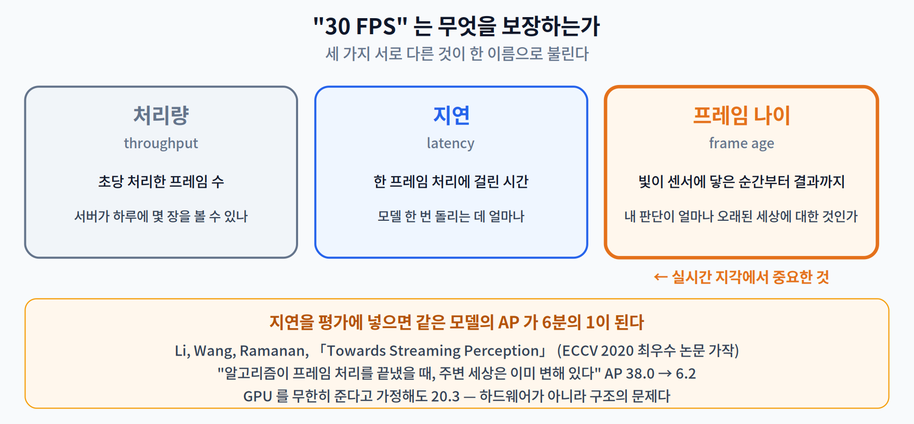
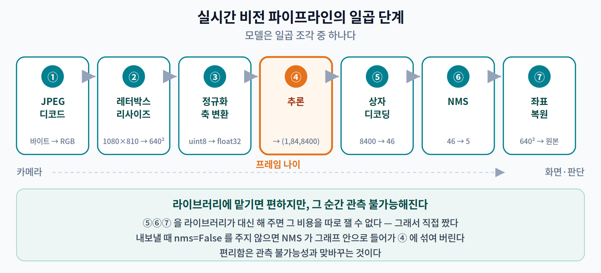
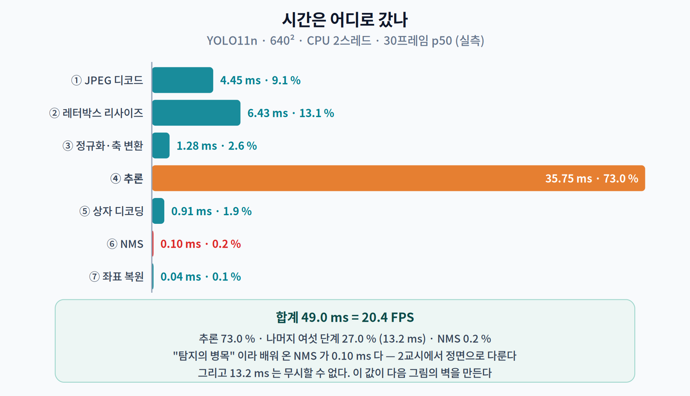
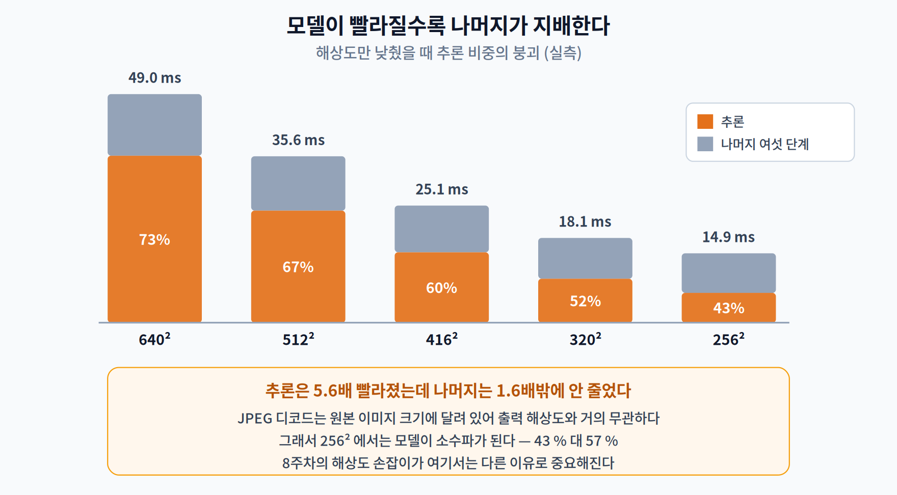
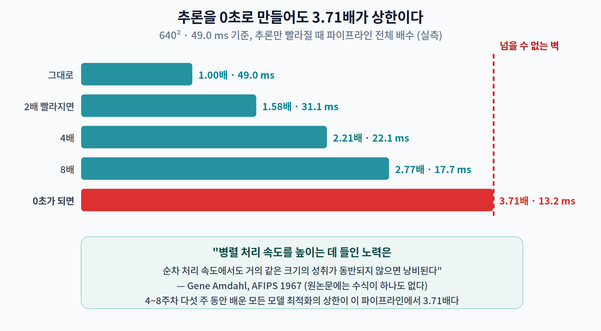

# 09주차 1교시. 모델이 36 ms면 파이프라인도 36 ms일까?

> **오늘의 질문** — 여덟 주 동안 우리는 **모델**을 재고 줄였다. 지연 3.5 ms, 2.72배, 8.74배. 그런데 카메라에서 화면까지 가는 길에 모델은 **한 조각**일 뿐이다. 나머지 조각들은 얼마나 걸릴까? 그리고 모델을 아무리 빠르게 만들어도 **넘을 수 없는 벽**이 있다면 그것은 어디에 있을까?

---

## 1.1 "실시간"이라고 말할 때 우리는 무엇을 재는가 (12분)

"우리 모델은 30 FPS입니다." 이 문장은 무엇을 보장하는가?

사실은 거의 아무것도 보장하지 않는다. 세 가지 서로 다른 것이 뒤섞여 있기 때문이다.

| 재는 것 | 정의 | 무엇을 말해 주나 |
|---|---|---|
| **처리량 (throughput)** | 초당 처리한 프레임 수 | 서버가 하루에 몇 장을 볼 수 있나 |
| **지연 (latency)** | 한 프레임을 처리하는 데 걸린 시간 | 모델 한 번 돌리는 데 얼마나 걸리나 |
| **프레임 나이 (frame age)** | **빛이 센서에 닿은 순간부터 결과가 나올 때까지** | 내가 지금 보는 판단이 **얼마나 오래된 세상**에 대한 것인가 |

자율주행 자동차를 생각해 보자. 세 번째가 유일하게 중요한 값이다. 200 ms 전 장면을 보고 브레이크를 밟는다면, 시속 60 km에서 차는 그 사이 **3.3 m**를 더 갔다.

이 문제를 학술적으로 정면으로 다룬 논문이 있다. Li, Wang, Ramanan 의 「Towards Streaming Perception」(ECCV 2020, 최우수 논문 가작)이다. [1]

> *"우리는 표준적인 오프라인 평가와 실시간 응용 사이의 불일치를 지적한다 — **알고리즘이 특정 이미지 프레임의 처리를 끝냈을 때, 주변 세상은 이미 변해 있다.**"*

그리고 이들이 잰 숫자가 충격적이다.

> *"객체 탐지 평균 정밀도(AP) 같은 표준 지표가 **38.0에서 6.2로 급락한다.**"*

**같은 모델, 같은 데이터인데 AP가 6분의 1이 되었다.** 바뀐 것은 단 하나 — 지연을 평가에 넣었을 뿐이다. 심지어 이들이 **GPU를 무한히 준다고 가정해도 20.3**까지밖에 못 올라간다. 하드웨어 문제가 아니라 **구조의 문제**라는 뜻이다.

> **[더 깊이 — 선택]** 이들이 제안한 지표의 이름은 **스트리밍 정확도(streaming accuracy)** 다. 원리는 간단하다 — 매 시점 $t$ 에 대해 "그 순간 알고리즘이 내놓은 **가장 최근 결과**"를 그 순간의 정답과 비교한다. 아직 계산 중이면 이전 결과가 그대로 쓰인다(영차 유지, zero-order hold). 논문의 정식화로는 $\varphi(t) = \arg\max_j\, s_j < t$ 로 가장 최근 출력의 색인을 고르고, $L_{\text{streaming}} = L(\{(y_i, \hat{y}_{\varphi(t_i)})\})$ 를 잰다. 코드 저장소 이름 때문에 **sAP** 로 부르는 사람이 많은데, 논문 본문의 용어는 "스트리밍 정확도"이고 sAP 는 그것을 탐지 과제에 적용한 경우다.

> 한 줄 정리: "30 FPS"는 처리량이지 **프레임 나이**가 아니다. 실시간 지각에서 유일하게 중요한 값은 세 번째이고, 지연을 평가에 넣으면 같은 모델의 AP 가 **38.0 → 6.2** 로 떨어진다.

---

## 1.2 파이프라인은 일곱 단계다 (20분)

그렇다면 프레임 나이는 무엇으로 이루어져 있는가? 직접 만들어서 재 보자.

우리가 쓴 것은 **YOLO11n**(2,616,248 파라미터 · 640² 에서 6.5 GFLOPs)을 ONNX 로 내보낸 것이고, **디코딩과 NMS 는 라이브러리를 안 쓰고 직접 짰다.** 라이브러리가 다 해 주면 시간이 어디로 갔는지 볼 수 없기 때문이다.

| 단계 | 하는 일 | 입력 → 출력 |
|:--:|---|---|
| ① | JPEG 디코드 | 압축 바이트 → RGB 배열 |
| ② | 레터박스 리사이즈 | 1080×810 → 640×640 (비 유지, 여백은 회색) |
| ③ | 정규화·축 변환 | HWC uint8 → NCHW float32 [0,1] |
| ④ | **추론** | (1,3,640,640) → (1,84,8400) |
| ⑤ | 상자 디코딩 | 8,400개 후보 → 문턱 넘은 것만 |
| ⑥ | NMS | 겹치는 상자 억제 |
| ⑦ | 좌표 복원 | 640² 좌표 → 원본 이미지 좌표 |

### 실측 — 30프레임, CPU 2스레드

| 단계 | p50 | p95 | 비중 |
|---|---:|---:|---:|
| ① JPEG 디코드 | 4.45 ms | 4.94 | 9.1 % |
| ② 레터박스 리사이즈 | 6.43 ms | 8.29 | 13.1 % |
| ③ 정규화·축 변환 | 1.28 ms | 1.51 | 2.6 % |
| **④ 추론** | **35.75 ms** | 40.75 | **73.0 %** |
| ⑤ 상자 디코딩 | 0.91 ms | 1.10 | 1.9 % |
| ⑥ NMS | **0.10 ms** | 0.14 | **0.2 %** |
| ⑦ 좌표 복원 | 0.04 ms | 0.04 | 0.1 % |
| **합계** | **49.0 ms** | | **= 20.4 FPS** |

두 가지가 눈에 띈다.

**첫째, 추론이 73%다.** 여기까지는 예상대로다. 그런데 나머지 27%, 즉 **13.2 ms**는 그냥 무시할 수 있는 값이 아니다. 이 값은 2교시와 3교시 내내 따라다닌다.

**둘째, NMS 가 0.10 ms 다.** 전체의 **0.2%**. 우리가 "탐지의 병목"이라고 배워 온 그 NMS다. 이 이야기는 2교시에서 정면으로 다룬다.

### 탐지기들이 보고한 속도를 읽는 법

교과서에 나오는 숫자들을 그냥 옮기면 안 된다. 조건이 전부 다르다.

| 논문 | 보고한 속도 | 하드웨어 | 배치 | 데이터셋 |
|---|---|---|:--:|---|
| Faster R-CNN (NIPS 2015) [4] | **5 fps** (VGG-16) / 17 fps (ZF) | Tesla K40 | 1 | VOC07 73.2 mAP |
| YOLO (CVPR 2016) [2] | **45 fps** / Fast YOLO 155 fps | Titan X | 1 (배치 없음) | **VOC07** 63.4 mAP |
| SSD300 (ECCV 2016) [3] | **59 fps** ← 유명한 숫자 | Titan X | **8** | VOC07 74.3 mAP |
| SSD300 (같은 표) | **46 fps** | Titan X | **1** | 같음 |

> **SSD 의 "59 FPS"는 배치 8 의 처리량이다.** 같은 논문 같은 표에 배치 1 값이 **46 FPS** 로 나란히 실려 있다. 온디바이스 실시간 지각에서 의미 있는 값은 뒤쪽이다. 논문 초록에 실린 숫자 하나만 옮기면 **28%를 잘못 말하게 된다.**
>
> 자주 틀리는 것 둘 더 — YOLO 의 63.4 mAP 는 **COCO 가 아니라 PASCAL VOC 2007** 값이다. Faster R-CNN 의 "17 fps"는 **ZF 넷**의 값이고 VGG-16 은 5 fps 다.

> 한 줄 정리: 파이프라인은 일곱 단계이고 640² 에서 추론은 **73%**, 나머지 여섯이 **27%(13.2 ms)** 다. 그리고 논문의 FPS 는 **배치 크기와 하드웨어를 확인하고** 옮겨야 한다.

---

## 1.3 모델이 빨라질수록 나머지가 지배한다 (18분)

이제 8주차까지 배운 것을 여기에 적용해 보자. 해상도를 낮추면 어떻게 될까? (8주차 2.3 의 손잡이다.)

| 해상도 | 전체 | 추론 | **추론 비중** | 나머지 |
|---:|---:|---:|---:|---:|
| 640² | 49.0 ms | 35.7 ms | **73.0 %** | 13.2 ms |
| 512² | 35.6 ms | 24.0 ms | 67.3 % | 11.6 ms |
| 416² | 25.1 ms | 15.1 ms | 60.1 % | 10.0 ms |
| 320² | 18.1 ms | 9.4 ms | 51.8 % | 8.7 ms |
| 256² | 14.9 ms | 6.4 ms | **43.0 %** | 8.5 ms |

**추론은 5.6배 빨라졌는데 나머지는 1.6배밖에 안 줄었다.** JPEG 디코드는 원본 이미지 크기에 달려 있어서 출력 해상도와 거의 무관하고, 상자 디코딩도 후보 격자가 줄어드는 만큼만 준다.

그래서 256² 에서는 **모델이 소수파가 된다** — 43% 대 57%.

### 암달의 법칙 — 넘을 수 없는 벽

Gene Amdahl 이 1967년에 쓴 문장이 여기에 그대로 적용된다. [8]

> *"이 지점에서 꽤 명백하게 도출되는 결론은, **병렬 처리 속도를 높이는 데 들인 노력은 순차 처리 속도에서도 거의 같은 크기의 성취가 동반되지 않으면 낭비된다**는 것이다."*

우리 파이프라인(640², 49.0 ms)에서 **추론만** 빨라진다면 전체는 얼마나 빨라지는가?

| 추론이 | 전체 | 전체 배수 |
|---|---:|---:|
| 그대로 | 49.0 ms | 1.00배 |
| **2배 빨라지면** | 31.1 ms | **1.58배** |
| 4배 빨라지면 | 22.1 ms | 2.21배 |
| 8배 빨라지면 | 17.7 ms | 2.77배 |
| **0초가 되면** | 13.2 ms | **3.71배 (상한)** |

**추론을 두 배 빠르게 만들어도 파이프라인은 1.58배다.** 그리고 모델을 완전히 없애도 **3.71배**를 못 넘는다.

4주차부터 8주차까지 다섯 주를 모델 최적화에 썼다. 그 다섯 주가 이 파이프라인에서 살 수 있는 최댓값이 3.71배다. **13.2 ms 를 손대지 않는 한.**

> **8주차와 같은 모양의 이야기다.** 그때는 "추론을 두 배 빠르게 해도 배터리는 1.3%밖에 안 는다"였다. 이번엔 "추론을 두 배 빠르게 해도 파이프라인은 1.58배"다. 둘 다 **내가 최적화한 부분이 전체의 몇 퍼센트인가**를 먼저 재지 않아서 생기는 일이다.

> **[더 깊이 — 선택]** Amdahl 의 1967년 논문에는 **수식이 하나도 없다.** 우리가 "암달의 법칙"이라 부르는 $S = 1/((1-p) + p/N)$ 은 나중에 다른 사람들이 이름 붙이고 정식화한 것이다. 원논문은 다중 프로세서 옹호론에 맞서 단일 프로세서 방식을 **경험적 관찰로 변호**하는 글이다 — "실제 운용에서 실행되는 명령어의 40%가 데이터 관리 사무 처리이고, 이 부분은 순차적으로 보인다. 그것만으로도 처리량의 상한이 순차 처리 속도의 **5~7배**로 묶인다." 우리 3.71배와 같은 종류의 계산이다.

> 한 줄 정리: 해상도를 낮추면 추론 비중이 **73% → 43%** 로 무너지고, 640² 에서조차 추론을 **0초로 만들어도 3.71배**가 상한이다. 모델 최적화에는 **파이프라인이 정해 주는 천장**이 있다.

---

## 오늘의 토론 질문

1. 1.1 의 표에서 "처리량 30 FPS"와 "프레임 나이 30 ms"는 같은 말인가? 둘이 크게 어긋나는 시스템을 하나 상상해 보라. (2교시 2.4 에서 실제로 만난다.)
2. 1.3 의 암달 표에서 상한이 3.71배였다. **이 상한을 올리려면** 무엇을 해야 하는가? 두 가지 방법이 있는데, 하나는 명백하고 하나는 덜 명백하다.
3. SSD 논문은 같은 표에 46 FPS(배치 1)와 59 FPS(배치 8)를 나란히 실었다. 저자들이 초록에 59를 쓴 것은 부정직한가? **어떤 독자에게는 59가 맞는 숫자**인데, 그 독자는 누구인가?
4. 「Towards Streaming Perception」은 GPU 를 무한히 줘도 AP 가 20.3 까지밖에 안 오른다고 했다. 하드웨어로 못 푸는 문제라면 **무엇으로 푸는가?**

> **교수님을 위한 Tip** — 1.2 의 단계별 표를 보여 주기 **전에** 칠판에 일곱 단계 이름만 적고 "49 ms 를 일곱 칸에 나눠 보라"고 시키십시오. 대부분 추론에 90% 이상을 줍니다. 실제 73%도 놀랍지만, 진짜 반응은 **NMS 0.10 ms** 에서 나옵니다. 그 반응을 2교시 첫 15분의 연료로 쓰십시오. 그리고 암달 표는 **"0초가 되면"** 줄을 가리고 물어보시면 좋습니다 — "모델을 통째로 없애면 몇 배 빨라질까요?"

---

### 1교시 정리
- **"30 FPS"는 처리량이지 프레임 나이가 아니다.** 실시간 지각에서 중요한 값은 빛이 센서에 닿은 순간부터 결과까지다.
- 지연을 평가에 넣으면 같은 모델의 AP 가 **38.0 → 6.2** 로 떨어진다(Li 외, ECCV 2020). 무한한 GPU 로도 20.3 이 한계다.
- 파이프라인은 일곱 단계다. 640² 실측에서 추론 **73%**, 나머지 여섯 **27%(13.2 ms)**, **NMS 는 0.2%**.
- 논문의 FPS 는 **배치 크기와 하드웨어**를 확인하고 옮겨야 한다 — SSD 의 유명한 59 FPS 는 배치 8, 배치 1 은 46 FPS.
- 해상도를 낮추면 추론 비중이 **73% → 43%**. 640² 에서 추론을 **0초로 만들어도 3.71배**가 상한이다.

### 오늘의 용어
- **프레임 나이 (frame age, glass-to-glass latency)** — 빛이 센서에 닿은 순간부터 결과가 나올 때까지. 실시간 지각의 진짜 지연.
- **스트리밍 정확도 (streaming accuracy)** — 매 시점 "그 순간 사용 가능한 가장 최근 결과"를 그 순간의 정답과 비교하는 평가 방식.
- **레터박스 (letterbox)** — 가로세로 비를 유지한 채 정사각형에 맞추고 남는 곳을 채우는 리사이즈.
- **NMS (Non-Maximum Suppression)** — 같은 물체에 겹쳐 나온 상자들 중 점수가 가장 높은 것만 남기는 후처리.
- **암달의 법칙 (Amdahl's law)** — 일부만 빠르게 만들었을 때 전체 속도 향상에 걸리는 상한.

### 더 읽어보기
- [1] M. Li, Y.-X. Wang, and D. Ramanan, "Towards streaming perception," in *Proc. European Conf. Computer Vision (ECCV)*, LNCS vol. 12347, 2020, pp. 473–488. **(ECCV 2020 Best Paper Honorable Mention)** — **§1 과 Fig. 1 은 반드시 읽을 것.**
- [2] J. Redmon, S. Divvala, R. Girshick, and A. Farhadi, "You only look once: Unified, real-time object detection," in *Proc. IEEE Conf. Computer Vision and Pattern Recognition (CVPR)*, 2016, pp. 779–788.
- [3] W. Liu *et al.*, "SSD: Single shot multibox detector," in *Proc. European Conf. Computer Vision (ECCV)*, LNCS vol. 9905, 2016, pp. 21–37. — **§3.7 Inference time 을 볼 것.**
- [4] S. Ren, K. He, R. Girshick, and J. Sun, "Faster R-CNN: Towards real-time object detection with region proposal networks," in *Advances in Neural Information Processing Systems (NIPS)*, vol. 28, 2015, pp. 91–99.
- [8] G. M. Amdahl, "Validity of the single processor approach to achieving large scale computing capabilities," in *Proc. AFIPS Spring Joint Computer Conf.*, vol. 30, 1967, pp. 483–485.
- [9] G. Jocher and J. Qiu, *Ultralytics YOLO11* (version 11.0.0), 2024. [Online]. Available: https://github.com/ultralytics/ultralytics — **YOLO11 에는 심사를 거친 논문이 없다.** 소프트웨어로 인용하는 것이 맞다.
