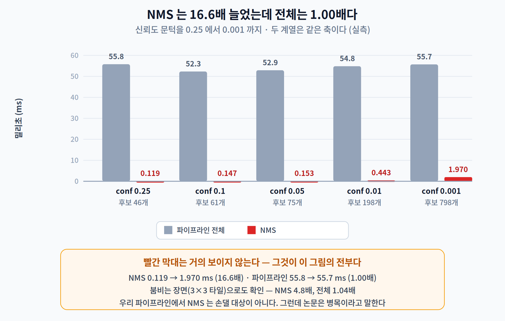
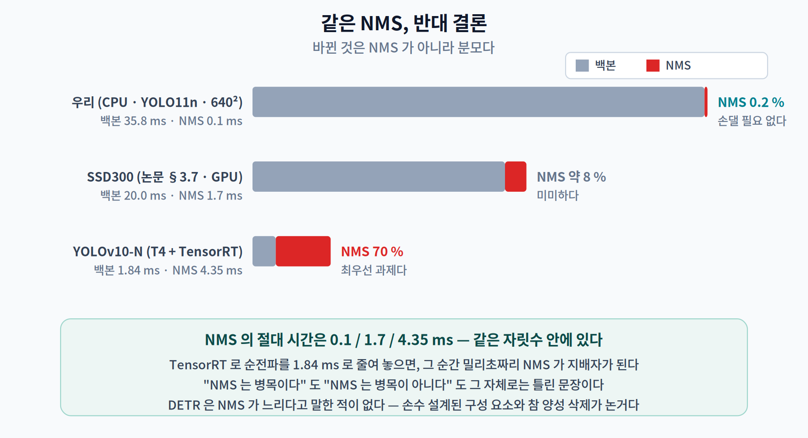
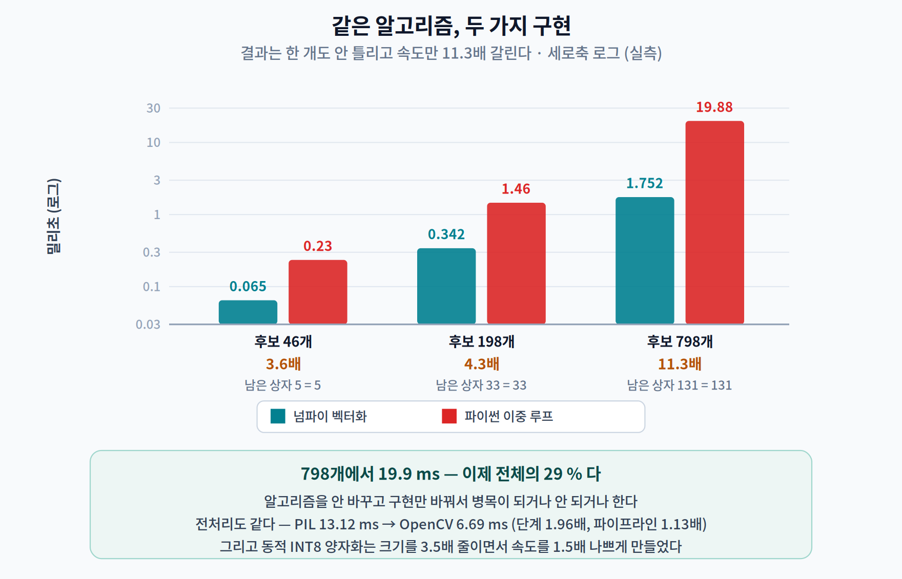
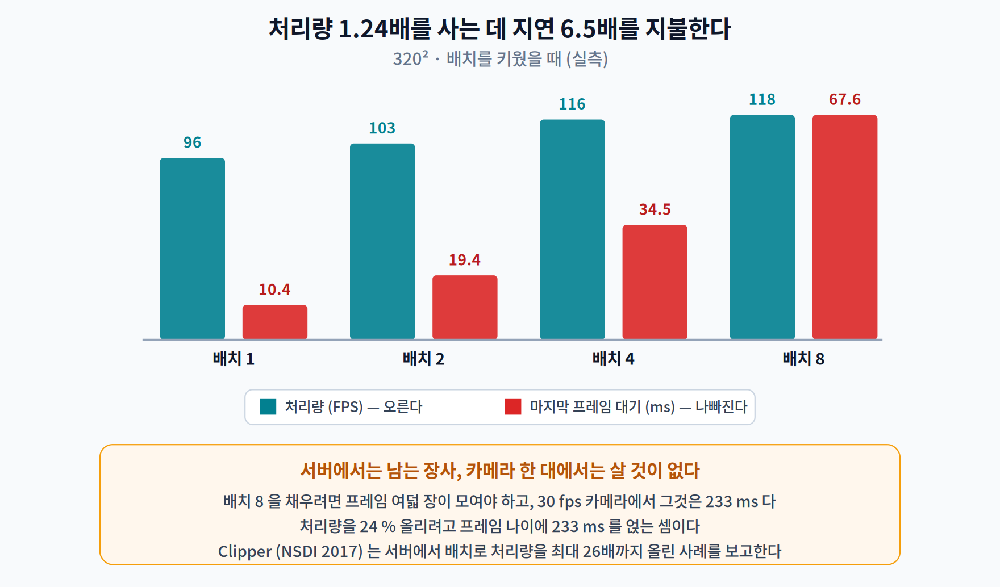
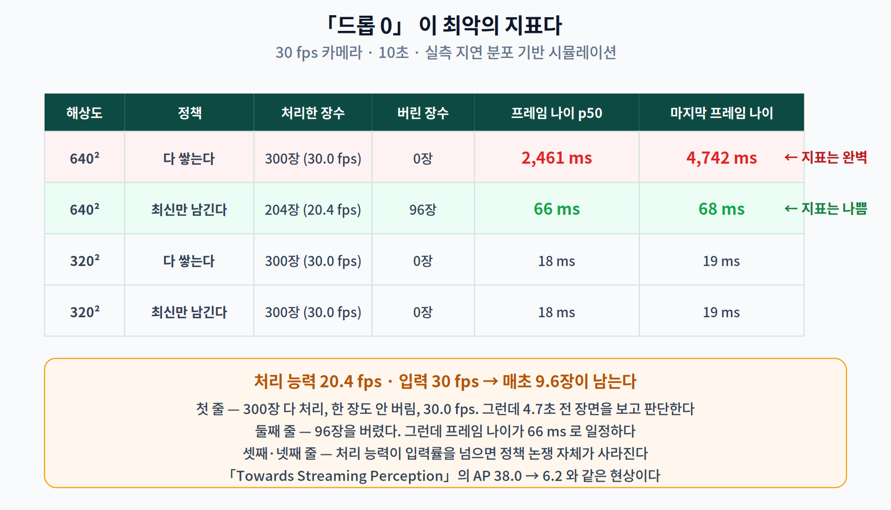
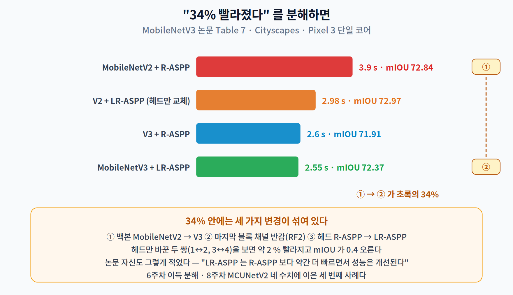

# 09주차 2교시. 같은 개선이 왜 어떤 곳에서는 통하고 어떤 곳에서는 안 통하는가

> **오늘의 질문** — 1교시에서 NMS 가 전체의 0.2%였다. 그런데 교과서와 논문들은 NMS 를 탐지의 병목이라고 말한다. **누가 틀렸을까?** 그리고 이 질문의 답은 이번 학기에 우리가 반복해 온 물음 — "그 숫자는 어떤 조건에서 잰 것인가" — 의 가장 깨끗한 사례다.

---

## 2.1 NMS 는 병목인가 — 같은 밀리초, 반대 결론 (16분)

### 먼저 우리 값을 흔들어 보자

NMS 비용은 **살아남은 후보 상자 수**에 달려 있다. 신뢰도 문턱을 낮추면 후보가 폭증한다. 문턱을 0.25에서 0.001까지 내리며 재 봤다.

| 신뢰도 문턱 | 후보 상자 | 최종 상자 | NMS | **파이프라인 전체** |
|---:|---:|---:|---:|---:|
| 0.25 | 46 | 5 | 0.119 ms | 55.8 ms |
| 0.10 | 61 | 8 | 0.147 ms | 52.3 ms |
| 0.05 | 75 | 9 | 0.153 ms | 52.9 ms |
| 0.01 | 198 | 33 | 0.443 ms | 54.8 ms |
| **0.001** | **798** | 131 | **1.970 ms** | **55.7 ms** |

**후보가 17.3배 늘자 NMS 는 16.6배 늘었다.** 예상대로다. 그런데 마지막 열을 보라.

> **파이프라인 전체는 55.8 → 55.7 ms. 1.00배. 아무 일도 안 일어났다.**

붐비는 장면으로도 확인했다. 같은 사진을 3×3 으로 타일해 물체를 아홉 배로 늘렸다.

| | 후보 | 최종 | NMS | 전체 |
|---|---:|---:|---:|---:|
| 원본 (물체 5개) | 46 | 5 | 0.103 ms | 49.7 ms |
| 3×3 타일 (물체 45개분) | 318 | 36 | 0.493 ms | 51.5 ms (**1.04배**) |

**NMS 가 4.8배 늘어도 전체는 4% 늘었다.**

### 그런데 논문은 병목이라고 말한다

YOLOv10(Wang 외, NeurIPS 2024)의 출발점이 정확히 NMS 다. [5]

> *"YOLO 계열의 탐지 파이프라인은 두 부분으로 이루어진다 — 모델 순전파와 NMS 후처리. … 이 방식은 추론 시 최선의 양성 예측을 고르기 위해 NMS 를 필요로 한다. **이것이 추론 속도를 늦추고**, 성능을 NMS 하이퍼파라미터에 민감하게 만들어, YOLO 가 최적의 종단간 배포에 이르지 못하게 한다."*

그리고 이들이 잰 값은 우리와 정반대다. **T4 GPU · TensorRT FP16 · 배치 1** 기준으로,

| | NMS 포함 | NMS 없이 | NMS 의 몫 |
|---|---:|---:|---:|
| YOLOv10-S | 7.07 ms | 2.44 ms | **4.63 ms = 65 %** |
| YOLOv10-N | 6.19 ms | 1.84 ms | **4.35 ms = 70 %** |

**우리는 0.2%, 저들은 70%.** 둘 다 맞다.

### 왜 둘 다 맞는가 — 분모가 다르다

| | 백본(순전파) | NMS | NMS 비중 | 결론 |
|---|---:|---:|---:|---|
| **우리 (CPU, YOLO11n, 640²)** | 35.8 ms | 0.10 ms | **0.2 %** | 손댈 필요 없다 |
| SSD300 (논문 §3.7, GPU) [3] | ~20 ms | **1.7 ms** | **약 8 %** | 미미하다 |
| **YOLOv10-N (T4 + TensorRT)** | 1.84 ms | **4.35 ms** | **70 %** | 최우선 과제다 |

세 줄의 **NMS 절대 시간은 0.1 / 1.7 / 4.35 ms** — 같은 자릿수 안에 있다. 바뀐 것은 **분모**다. GPU 에 TensorRT 를 얹어 순전파를 1.84 ms 로 줄여 놓으면, 그 순간 밀리초짜리 NMS 가 지배자가 된다.

**이것이 1교시 암달 법칙의 두 번째 적용이다.** 같은 절대 비용이 어떤 시스템에서는 무시할 만하고 어떤 시스템에서는 전부가 된다. "NMS 는 병목이다"도 "NMS 는 병목이 아니다"도 **그 자체로는 틀린 문장**이다.

### DETR 을 잘못 인용하지 말 것

NMS 를 없앤 대표 논문으로 DETR(Carion 외, ECCV 2020)이 자주 인용된다. 그런데 **DETR 은 NMS 가 느리다고 말한 적이 없다.** [6]

> *"우리 접근은 탐지 파이프라인을 간소화하여, 비최대 억제 절차나 앵커 생성처럼 **과제에 대한 사전 지식을 명시적으로 부호화하는 손수 설계된 구성 요소들**의 필요를 효과적으로 제거한다."*

> *"NMS 는 첫 디코더의 예측에 대해서는 성능을 높인다. … 깊이가 깊어질수록 NMS 가 주는 개선은 줄어든다. **마지막 층들에서는 참 양성 예측을 잘못 제거하기 때문에 AP 를 오히려 떨어뜨린다.**"*

DETR 의 논거는 **속도가 아니라 설계**다 — 손수 만든 발견법을 없애는 것, 그리고 붐비는 장면에서 NMS 가 **맞는 상자를 지워 버리는** 문제. 속도 근거가 필요하면 YOLOv10 을 인용해야 한다.

> 한 줄 정리: NMS 의 절대 비용은 어디서나 밀리초 규모다. **우리 CPU 에서 0.2%, TensorRT GPU 에서 70%** 인 것은 NMS 가 변해서가 아니라 **분모가 변해서**다. "X 는 병목이다"는 조건 없이는 참도 거짓도 아니다.

---

## 2.2 알고리즘이 아니라 구현과 조건이었다 (14분)

### 같은 알고리즘, 두 가지 구현

NMS 를 두 가지로 짜 보았다. 하나는 교과서를 그대로 옮긴 파이썬 이중 루프, 하나는 넘파이 벡터화. **결과는 완전히 같다** — 남은 상자 개수까지 한 개도 안 틀린다.

| 후보 상자 | 벡터화 | 파이썬 루프 | 배수 | 결과 |
|---:|---:|---:|---:|:--:|
| 46 | 0.065 ms | 0.235 ms | 3.6배 | 5 = 5 |
| 198 | 0.342 ms | 1.460 ms | 4.3배 | 33 = 33 |
| **798** | **1.752 ms** | **19.882 ms** | **11.3배** | 131 = 131 |

798개에서 **19.9 ms**. 이 값이면 이제 우리 파이프라인에서도 무시할 수 없다(전체의 29%). **알고리즘을 안 바꾸고 구현만 바꿔서 병목이 되거나 안 되거나 한다.**

### 전처리도 마찬가지다

1교시에서 나머지 여섯 단계가 13.2 ms 라고 했다. 그중 전처리(①②③)가 12.2 ms 다. 교재 구현은 PIL 을 썼다. OpenCV 로 바꾸면?

| 구현 | 전처리 p50 | p95 |
|---|---:|---:|
| PIL (교재 구현) | 13.12 ms | 16.13 |
| **OpenCV** (`imdecode` + `resize` + `blobFromImage`) | **6.69 ms** | 7.84 |

**단계는 1.96배 빨라졌다.** 그러면 파이프라인은?

> **55.8 → 49.4 ms. 1.13배.**

암달이 또 나온다. 전처리는 전체의 23%였으므로 그것을 절반으로 줄인 이득도 그만큼이다. 다만 이번엔 방향이 반대다 — **모델 쪽 천장이 3.71배였는데, 전처리 쪽에서 1.13배를 공짜로 가져왔다.** 코드 세 줄을 바꿔서.

### 8주차의 손잡이를 여기에 써 보면 — 실패 사례

5주차에서 배운 INT8 양자화를 이 모델에 적용해 봤다. ONNX Runtime 의 **동적 양자화**다.

| | 파일 크기 | 추론 | 최종 상자 |
|---|---:|---:|:--:|
| FP32 | 10.74 MB | 35.7 ms | 5 |
| **동적 INT8** | **3.05 MB (3.52배 작아짐)** | **54.4 ms (1.52배 느려짐)** | 5 |

**크기는 3.5배 줄었는데 속도는 1.5배 나빠졌다.** 5주차 3교시에서 만난 것과 같은 종류의 실패다. 동적 양자화는 MatMul·Gemm 계열만 정수로 바꾸고 **합성곱은 그대로 두면서** 양자화·역양자화 노드를 추가로 끼워 넣는다. 합성곱이 대부분인 탐지 백본에서는 오버헤드만 남는다.

> **여기서 멈추지 말 것.** "INT8 은 소용없다"가 결론이 아니다. 결론은 **"동적 양자화는 이 모델·이 백엔드에서 안 통한다"** 이고, 다음 수는 대표 데이터를 써서 합성곱까지 포함하는 **정적 양자화**를 하거나(5주차 2교시), 애초에 정수 연산을 지원하는 런타임을 쓰는 것이다(11주차). 3교시 선택 과제가 이것이다.

> 한 줄 정리: 알고리즘은 그대로 두고 **구현만 바꿔** NMS 가 11.3배, 전처리가 1.96배 갈렸다. 그리고 5주차의 양자화는 여기서 **크기는 3.5배 줄이고 속도는 1.5배 나쁘게** 만들었다 — 조건이 다르면 손잡이도 다르게 작동한다.

---

## 2.3 처리량은 지연이 아니다 (8분)

1교시 1.1 에서 셋을 구분했다. 이제 그 구분이 왜 중요한지 숫자로 본다.

배치를 키우면 GPU 든 CPU 든 처리량이 오른다. 320² 동적 축 모델로 재 봤다.

| 배치 | 한 번에 | 프레임당 | **처리량** | **마지막 프레임이 기다린 시간** |
|:--:|---:|---:|---:|---:|
| 1 | 10.4 ms | 10.44 ms | 95.8 FPS | **10.4 ms** |
| 2 | 19.4 ms | 9.68 ms | 103.4 FPS | 19.4 ms |
| 4 | 34.5 ms | 8.62 ms | 116.0 FPS | 34.5 ms |
| **8** | 67.6 ms | 8.45 ms | **118.4 FPS** | **67.6 ms** |

**처리량 1.24배를 얻는 데 지연 6.5배를 지불했다.**

배치 8 의 첫 번째 프레임은 나머지 일곱 장이 다 모일 때까지 기다린 뒤에야 계산이 시작된다. 서버에서는 이것이 좋은 거래일 수 있다 — Clipper(NSDI 2017)는 배치로 처리량을 **최대 26배**까지 올리면서 20 ms 지연 목표를 지킨 사례를 보고한다. [7]

> *"배치는 두 가지 방식으로 처리량을 높인다. 첫째, RPC 호출 비용과 GPU 메모리 복사 같은 프레임워크 내부 오버헤드를 **분할 상환**한다. 둘째, 프레임워크가 많은 입력에 대해 일괄 추론을 수행함으로써 기존의 **데이터 병렬 최적화**를 활용할 수 있게 한다."*

**그러나 카메라 한 대짜리 온디바이스 실시간 지각에서는 살 것이 없다.** 배치 8 을 채우려면 프레임 여덟 장이 모여야 하고, 30 fps 카메라에서 그것은 **233 ms** 다. 처리량을 24% 올리려고 프레임 나이에 233 ms 를 얹는 셈이다.

> 한 줄 정리: 배치는 **처리량을 지연으로 사는 거래**다. 서버에서는 남는 장사일 수 있지만, 카메라 한 대짜리 실시간 지각에서는 **살 것이 없다.**

---

## 2.4 큐 — 「드롭 0」이 최악의 지표다 (12분)

이제 이번 주에서 가장 중요한 실험이다.

30 fps 카메라가 33.3 ms 마다 프레임을 밀어 넣는다. 우리 파이프라인은 640² 에서 49.0 ms 가 걸린다. **처리 능력은 20.4 fps, 입력은 30 fps.** 매초 9.6 장이 남는다.

이때 두 가지 정책을 쓸 수 있다.

- **(가) 다 쌓는다** — 큐에 넣고 순서대로 처리한다. 한 장도 안 버린다.
- **(나) 최신만 남긴다** — 새 프레임이 오면 큐에 있던 오래된 것을 버린다.

실측 지연 분포(p50 49.0 ms, p95 56.6 ms)를 그대로 넣고 10초를 시뮬레이션했다.

| 해상도 | 정책 | 처리한 장수 | 버린 장수 | **프레임 나이 p50** | **마지막 프레임 나이** |
|---:|---|---:|---:|---:|---:|
| 640² | **다 쌓는다** | **300장 (30.0 fps)** | **0장** | **2,461 ms** | **4,742 ms** |
| 640² | 최신만 남긴다 | 204장 (20.4 fps) | 96장 | **66 ms** | 68 ms |
| 320² | 다 쌓는다 | 300장 (30.0 fps) | 0장 | 18 ms | 20 ms |
| 320² | 최신만 남긴다 | 300장 (30.0 fps) | 0장 | 18 ms | 20 ms |

첫 두 줄을 나란히 읽어 보자.

**「다 쌓는다」는 모든 지표가 완벽해 보인다** — 30.0 fps 로 처리했고, 한 장도 안 버렸다. 대시보드에 이 두 숫자만 띄우면 아무 문제가 없다.

**그런데 그 시스템은 4.7초 전 장면을 보고 판단하고 있다.**

「최신만 남긴다」는 반대다. 처리량이 20.4 fps 로 떨어지고 96장을 버렸다. 지표만 보면 나빠졌다. 그런데 **프레임 나이가 66 ms 로 일정하게 유지된다.**

> **「드롭 0」이라는 지표가 최악의 시스템을 가리키고 있었다.**

이것이 1.1 에서 인용한 「Towards Streaming Perception」이 AP 38.0 → 6.2 를 관찰한 것과 같은 현상이다. 늦게 도착한 정답은 정답이 아니다.

마지막 두 줄도 중요하다. **320² 에서는 두 정책이 완전히 같다.** 처리 능력(55 fps)이 입력(30 fps)을 넘으면 큐가 안 쌓이므로 정책 자체가 의미를 잃는다.

> **설계 지침 세 가지**
>
> 1. **처리 능력이 입력률을 넘도록 먼저 맞춘다.** 그러면 정책 논쟁이 사라진다(320² 행).
> 2. **못 맞추면 반드시 버린다.** 무한 큐는 "안 버리는 것"이 아니라 **나이를 무한히 키우는 것**이다.
> 3. **프레임 나이를 로그에 남긴다.** FPS 와 드롭 수만 보는 대시보드는 위 표의 첫 줄을 정상으로 보고한다.

> 한 줄 정리: 처리 능력이 입력률보다 낮을 때 **무한 큐는 지연을 무한히 키운다.** 실측에서 「드롭 0 · 30 fps」인 시스템의 프레임 나이가 **4.7초**였고, 96장을 버린 시스템은 **66 ms** 였다.

---

## 2.5 [더 깊이 — 선택] 세그멘테이션, 그리고 "34% 빨라졌다"를 읽는 법

탐지 다음으로 엣지에서 많이 쓰이는 것이 **시맨틱 세그멘테이션**이다(픽셀마다 클래스를 매긴다). 대표적인 경량 설계가 MobileNetV3 논문(Howard 외, ICCV 2019)의 **LR-ASPP** 다. [10]

> *"우리는 **Lite R-ASPP(LR-ASPP)** 라 부르는 또 하나의 가벼운 세그멘테이션 헤드를 제안한다. … R-ASPP 를 개선하여 전역 평균 풀링을 Squeeze-and-Excitation 모듈과 비슷한 방식으로 배치하는데, **큰 풀링 커널을 큰 보폭으로** 써서 계산을 아끼고 모듈 안에 1×1 합성곱을 하나만 둔다."*

논문 초록의 문장은 이렇다.

> *"MobileNetV3-Large LR-ASPP 는 Cityscapes 세그멘테이션에서 비슷한 정확도로 **MobileNetV2 R-ASPP 보다 34% 빠르다.**"*

**이 문장을 "LR-ASPP 헤드가 34% 빠르다"로 옮기면 틀린다.** 34%는 세 가지가 함께 바뀐 결과다 — 백본 V2→V3, 마지막 블록 채널 반감(RF2), 그리고 헤드 교체. 논문의 표에서 **헤드만** 바꾼 두 쌍을 뽑으면 이렇다.

| 비교 | 지연 | mIOU |
|---|---|---|
| V2 + R-ASPP → V2 + LR-ASPP | 3.03 s → 2.98 s (**1.6% 빠름**) | +0.41 |
| V3 + R-ASPP → V3 + LR-ASPP | 2.60 s → 2.55 s (**1.9% 빠름**) | +0.46 |

논문 자신도 그렇게 적었다 — *"제안한 세그멘테이션 헤드 LR-ASPP 는 R-ASPP 보다 **약간 더 빠르면서** 성능은 개선된다."*

> **이번 학기에 세 번째로 나오는 같은 주의다.** 6주차에서 정확도 상승분을 분해했고, 8주차에서 MCUNetV2 의 네 가지 수치를 구분했으며, 여기서는 34%를 셋으로 분해했다. **한 문장에 여러 변경이 섞여 있으면, 그 문장은 어떤 개별 기법에 대해서도 근거가 되지 못한다.**

> 한 줄 정리: LR-ASPP 는 R-ASPP 보다 **약 2% 빠르고 mIOU 를 0.4 올린다.** 초록의 "34%"는 백본 교체와 채널 반감까지 포함한 값이다.

---

## 오늘의 토론 질문

1. 2.1 에서 같은 NMS 가 0.2%이기도 70%이기도 했다. **여러분의 연구 주제에서 "병목"이라고 알려진 것**을 하나 고르고, 그 주장이 어떤 분모를 전제하고 있는지 말해 보라.
2. 2.2 의 파이썬 루프 NMS 는 798개에서 19.9 ms 였다. 만약 여러분이 이 구현을 쓰는 시스템을 물려받았다면, **NMS 를 최적화하겠는가 아니면 신뢰도 문턱을 올리겠는가?** 두 선택의 부작용은 각각 무엇인가?
3. 2.4 의 첫 줄 시스템(드롭 0 · 30 fps · 나이 4.7초)을 운영 중인 팀이 있다고 하자. **어떤 지표를 대시보드에 추가**해야 이 문제가 보이는가? 그 지표를 실제로 측정하려면 코드의 어디에 무엇을 심어야 하는가?
4. 2.3 에서 배치는 카메라 한 대에서는 살 것이 없다고 했다. **카메라가 여덟 대라면** 어떤가? 그때 프레임 나이는 어떻게 되는가?

> **교수님을 위한 Tip** — 2.4 의 표를 **첫 두 열만 보여 주고** ("처리 300장 / 버림 0장" vs "처리 204장 / 버림 96장") "어느 시스템이 더 좋습니까?"라고 물으십시오. 전원이 첫 번째를 고릅니다. 그 다음 프레임 나이 열을 여시면 이번 주 전체가 한 장면으로 정리됩니다. 2.5 는 시간이 모자라면 자율 학습으로 넘기셔도 되지만, **"한 문장에 세 가지 변경이 섞여 있다"** 는 지적만은 살려 주십시오 — 6·8주차와 이어지는 세 번째 사례입니다.

---

### 2교시 정리
- NMS 의 절대 비용은 어디서나 밀리초 규모인데, **우리 CPU 에서 0.2%, TensorRT GPU 에서 70%** 다. 바뀐 것은 NMS 가 아니라 **분모**다.
- **DETR 은 NMS 가 느리다고 말하지 않았다.** 손수 설계된 구성 요소를 없애는 것과, NMS 가 참 양성을 지운다는 것이 논거다. 속도 근거는 YOLOv10 을 인용해야 한다.
- 같은 알고리즘의 두 구현이 **11.3배** 갈렸고(결과는 동일), 전처리 구현 교체로 파이프라인이 **1.13배** 빨라졌다.
- 동적 INT8 양자화는 이 모델에서 **크기 3.5배 감소 · 속도 1.5배 악화**였다. 손잡이는 조건에 따라 반대로 작동한다.
- 배치는 **처리량을 지연으로 사는 거래**다. 처리량 1.24배에 지연 6.5배.
- **「드롭 0」이 최악의 지표일 수 있다.** 실측에서 드롭 0 인 시스템의 프레임 나이가 4,742 ms, 96장을 버린 시스템이 66 ms 였다.

### 오늘의 용어
- **분모 문제** — 어떤 구성 요소의 "비중"은 그 구성 요소가 아니라 나머지 전체가 정한다.
- **동적 양자화 (dynamic quantization)** — 가중치만 미리 정수화하고 활성값은 실행 중에 정하는 방식. 합성곱 위주 모델에서는 이득이 없을 수 있다.
- **무한 큐 (unbounded queue)** — 도착률이 처리율보다 크면 길이와 대기 시간이 발산한다.
- **프레임 드롭 정책** — 최신만 남기기(latest-only), 오래된 것 버리기(drop-oldest) 등. **버리는 것이 설계이지 실패가 아니다.**
- **LR-ASPP** — MobileNetV3 의 경량 세그멘테이션 헤드. 큰 커널·큰 보폭 풀링과 1×1 합성곱 하나로 구성된다.

### 더 읽어보기
- [1] M. Li, Y.-X. Wang, and D. Ramanan, "Towards streaming perception," in *Proc. ECCV*, LNCS vol. 12347, 2020, pp. 473–488.
- [3] W. Liu *et al.*, "SSD: Single shot multibox detector," in *Proc. ECCV*, LNCS vol. 9905, 2016, pp. 21–37.
- [5] A. Wang *et al.*, "YOLOv10: Real-time end-to-end object detection," in *Advances in Neural Information Processing Systems (NeurIPS)*, vol. 37, 2024. — **NMS 를 속도 근거로 인용하려면 이 논문이다.**
- [6] N. Carion *et al.*, "End-to-end object detection with transformers," in *Proc. ECCV*, LNCS vol. 12346, 2020, pp. 213–229. — **§4.3 과 Fig. 4 를 읽고, DETR 의 논거가 속도가 아님을 확인할 것.**
- [7] D. Crankshaw *et al.*, "Clipper: A low-latency online prediction serving system," in *Proc. 14th USENIX Symp. Networked Systems Design and Implementation (NSDI)*, 2017, pp. 613–627. — **§4.3 Batching.**
- [10] A. Howard *et al.*, "Searching for MobileNetV3," in *Proc. IEEE/CVF Int. Conf. Computer Vision (ICCV)*, 2019, pp. 1314–1324. — **§6.4 와 Table 7 을 표까지 읽을 것.**
- [11] N. Bodla, B. Singh, R. Chellappa, and L. S. Davis, "Soft-NMS — Improving object detection with one line of code," in *Proc. ICCV*, 2017, pp. 5561–5569. — 속도가 아니라 **겹친 물체의 재현율**을 위한 변형이다.
