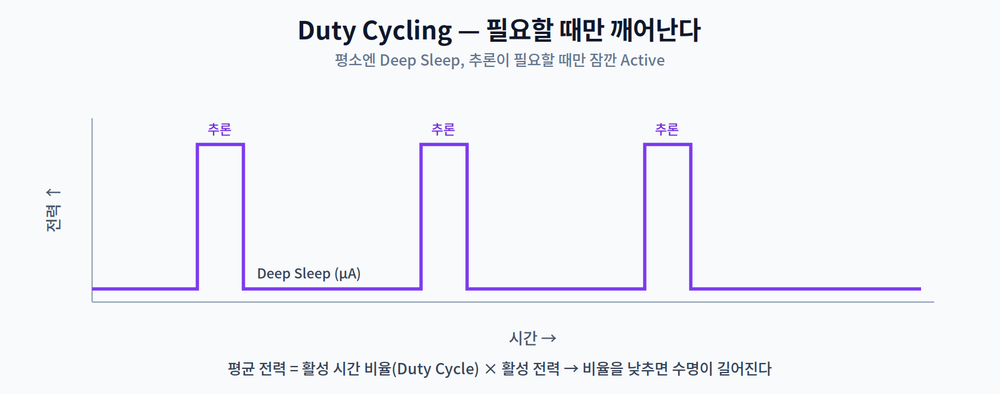
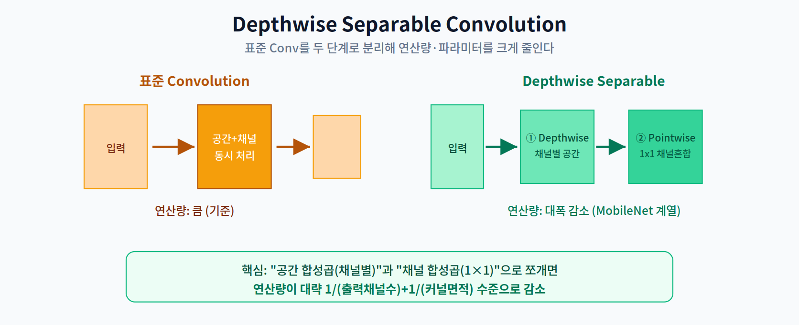

# 9주차 2교시. 에너지 효율적 추론과 최적화

**강의 목표** — 전력 소비를 최소화하기 위한 하드웨어 제어와 소프트웨어 알고리즘의 결합 방안을 학습한다.

1교시가 "TinyML이 왜 어려운가(제약)"였다면, 2교시는 "그 제약 속에서 어떻게 전력과 메모리를 아끼는가"이다.

---

## 2.1 에너지 소모 분석과 Duty Cycling (20분)

TinyML에서 배터리 수명은 곧 제품의 수명이다. 에너지를 어디서 쓰는지 정확히 알아야 한다.

- **연산 vs 데이터 이동** — 2주차의 통찰이 여기서도 유효하다. 값을 연산하는 비용보다 **메모리에서 값을 옮기는 비용**이 훨씬 크다. 그래서 최적화는 연산 횟수만큼이나 **데이터 이동(메모리 접근)** 을 줄이는 데 초점을 둔다.
- **Duty Cycling** — 가장 강력한 전력 절감 전략이다. 시스템이 늘 켜져 있으면 배터리가 금방 닳는다. 그래서 평소에는 **Deep Sleep**(µA 수준)으로 두고, 추론이 필요한 순간에만 잠깐 깨어나(Active) 처리한 뒤 다시 잠든다.

핵심 관계는 **평균 전력 ≈ (활성 시간 비율) × (활성 전력) + (슬립 전력)** 이다. 활성 시간 비율(Duty Cycle)을 낮추면 평균 전력이 급감해, 같은 배터리로 훨씬 오래 작동한다. 예컨대 1초에 10ms만 추론하면 활성 비율은 1%다. 다만 활성 비율이 아주 낮아지면, 결국 **슬립 상태의 바닥 전력(µA 수준)** 이 수명을 좌우하게 된다.

> 한 줄 정리: TinyML의 전력 절감은 데이터 이동 최소화와 Duty Cycling(필요할 때만 깨우기)에서 나온다.

---

## 2.2 Depthwise Separable Convolution (20분)

TinyML용 모델은 연산량 자체가 적어야 한다. 그 대표 기법이 **Depthwise Separable Convolution**이다.

표준 합성곱은 공간(spatial)과 채널(channel) 방향을 **한 번에** 처리한다. Depthwise Separable은 이를 두 단계로 **분리**한다.

1. **Depthwise** — 각 채널을 **독립적으로** 공간 합성곱(예: 3×3)한다. 채널을 섞지 않는다.
2. **Pointwise** — 1×1 합성곱으로 채널들을 **혼합**한다.

이렇게 분리하면 연산량이 대략 "$\frac{1}{\text{출력 채널 수}} + \frac{1}{\text{커널 면적}}$" 수준으로 줄어든다. MobileNet 계열(10주차 비전에서 재등장)이 이 구조로 모바일·엣지에서 실시간성을 확보한 핵심이다.

> 한 줄 정리: 공간 합성곱과 채널 합성곱을 분리하면 정확도를 크게 잃지 않고 연산량을 대폭 줄일 수 있다.

---

## 2.3 Peak Memory와 In-place Update (15분)

1교시에서 본 **Peak Memory**는 TinyML 설계의 생존 조건이다. 모델이 Flash에 들어가도, 실행 중 필요한 RAM(중간 Feature Map 등)이 기기 RAM을 넘으면 시스템이 죽는다.

이를 줄이는 대표 기법이 **In-place Update**다. 중간 연산 결과가 차지하는 메모리 공간을, 더 이상 필요 없어진 이전 결과의 공간에 **덮어써서 재활용**한다. 새 버퍼를 계속 할당하지 않으므로 Peak Memory가 낮아진다.

즉 TinyML의 메모리 최적화는 "얼마나 많이 계산하나"가 아니라 "**어느 순간 얼마나 많은 메모리를 동시에 쥐고 있나**"를 관리하는 일이다.

> 한 줄 정리: Peak Memory는 연산 중 최대 동시 메모리이며, In-place 재활용으로 이를 RAM 아래로 낮춘다.

---

## 2.4 최신 연구 — Battery-less AI (5분)

- **Battery-less / Intermittent Computing** — 배터리 없이 **태양광·진동·열 등에서 에너지를 수확(Energy Harvesting)** 해 작동하는 AI 시스템 연구다. 전력 공급이 **간헐적(intermittent)** 이라, 전원이 끊겨도 연산 상태를 보존했다가 이어서 계산하는 기법(비휘발성 메모리 활용 등)이 함께 연구된다(14주차에서 심화).

### 9주차 핵심 키워드
- **MCU (Microcontroller Unit)** — 초저전력·저성능 통합 칩셋.
- **CMSIS-NN** — ARM Cortex-M의 성능을 끌어내는 NN 가속 라이브러리.
- **Peak Memory** — 모델 실행 중 가장 많은 RAM이 필요한 시점의 사용량.
- **Duty Cycle** — 시스템이 활성 상태로 있는 시간의 비율.

> 교수님을 위한 Tip: Depthwise Separable의 연산량 감소를 실제 숫자로 계산해 보여주면 효과가 크다(예: 3×3, 채널 수 대입). "왜 MobileNet이 모바일에서 빠른가"가 수식으로 납득된다.

---

### 2교시 복습 질문
1. Duty Cycle이 1%일 때 평균 전력이 어떻게 결정되는가?
2. Depthwise와 Pointwise가 각각 담당하는 역할은?
3. In-place Update가 Peak Memory를 낮추는 원리는?
