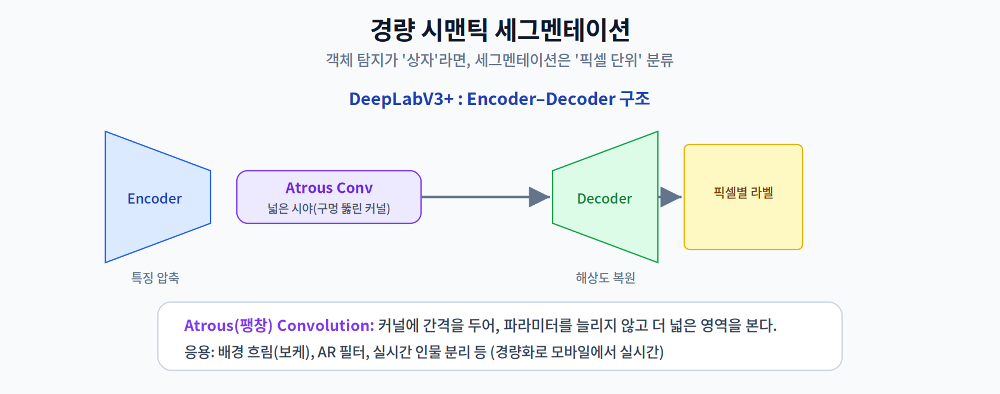
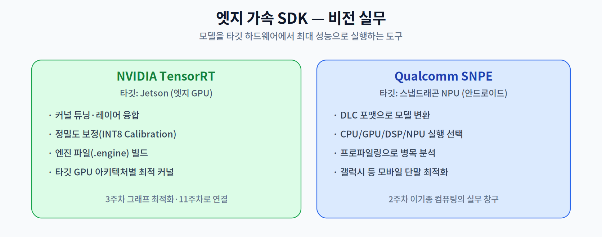

# 09주차 2교시. 세그멘테이션 및 비전 가속화 실무

**강의 목표** — 픽셀 단위 분석이 필요한 세그멘테이션의 경량화와, 하드웨어 전용 SDK로 성능을 극대화하는 방법을 학습한다.

1교시가 "무엇이 어디에(상자)"였다면, 2교시는 "픽셀마다 무엇인가(마스크)"와 그것을 실제 하드웨어에서 빠르게 돌리는 실무다.

---

## 2.1 경량 시맨틱 세그멘테이션 (20분)

**시맨틱 세그멘테이션(Semantic Segmentation)** 은 이미지의 **모든 픽셀**에 클래스를 부여한다. 객체 탐지보다 정밀하지만 연산량이 훨씬 크다.

- **DeepLabV3+의 경량화** — **Encoder–Decoder** 구조를 쓴다. Encoder가 특징을 압축하고 Decoder가 원래 해상도로 복원한다. 경량 백본(MobileNet 등)을 Encoder로 쓰면 모바일에서도 동작한다.
- **Atrous(팽창) Convolution** — 커널에 **간격(구멍)을 두어**, 파라미터·연산을 늘리지 않고 **더 넓은 영역(receptive field)** 을 본다. 세그멘테이션처럼 넓은 문맥이 필요한 작업에 효과적이다.

응용은 **배경 흐림(보케), AR 필터, 실시간 인물 분리** 등이며, 경량화 덕분에 스마트폰에서 실시간으로 동작한다.

> 한 줄 정리: 세그멘테이션은 픽셀 단위라 무겁지만, Encoder-Decoder + Atrous Conv + 경량 백본으로 모바일 실시간이 가능해진다.

---

## 2.2 엣지 가속 SDK — TensorRT & SNPE (20분)

경량 모델이라도, 타깃 하드웨어에 맞게 컴파일·최적화해야 최대 성능이 난다. 제조사별 전용 SDK가 이 역할을 한다.

- **NVIDIA TensorRT** — Jetson 등 엔비디아 엣지 GPU를 위한 최적화 엔진이다. 레이어 융합·**커널 튜닝**과 **INT8 보정(Calibration)** 을 거쳐 **엔진 파일(.engine)** 을 빌드한다. 타깃 GPU 아키텍처(Ampere 등)에 맞는 최적 커널을 자동 선택한다(3주차 그래프 최적화의 실무판, 11주차로 심화).
- **Qualcomm SNPE (Snapdragon Neural Processing Engine)** — 갤럭시 등 스냅드래곤 단말의 NPU를 위한 SDK다. 모델을 **DLC(Deep Learning Container)** 포맷으로 변환하고, CPU/GPU/DSP/NPU 중 **어느 유닛에서 실행할지 선택**하며 프로파일링으로 병목을 분석한다(2주차 이기종 컴퓨팅의 실무 창구).

> 한 줄 정리: TensorRT는 젯슨(GPU), SNPE는 스냅드래곤(NPU)에서 모델을 하드웨어 맞춤으로 컴파일·최적화하는 실무 도구다.

---

## 2.3 Vision Transformer on Edge (15분)

최근 비전에서는 CNN 외에 **Vision Transformer(ViT)** 가 강력한 성능을 보인다. 그러나 ViT의 **Attention** 은 연산량이 크고 메모리를 많이 써 엣지 이식이 어렵다(10주차에서 Transformer의 온디바이스 병목을 심화).

- **MobileViT** 등은 CNN의 지역성(locality)과 Transformer의 전역 문맥(global context)을 결합해, 엣지에서도 감당 가능한 경량 하이브리드를 지향한다.
- 핵심 쟁점은 Attention의 경량화와, 엣지 하드웨어(NPU)에서의 가속 가능성이다.

> 한 줄 정리: ViT는 강력하지만 엣지엔 무겁다 — MobileViT 등 CNN-Transformer 하이브리드로 경량화를 시도한다.

---

## 2.4 정리 (5분)

### 9주차 핵심 키워드
- **Backbone** — 특징 추출을 담당하는 핵심 네트워크.
- **Inference Latency** — 한 프레임을 처리하는 데 걸리는 실제 시간.
- **NMS** — 중복 상자를 억제하는 후처리(엣지 병목 주의).
- **Zero-copy** — 메모리 복사를 최소화해 처리 속도를 높이는 기법(3교시).

> 교수님을 위한 Tip: "FLOPs가 적다고 반드시 엣지에서 빠른 건 아니다"를 다시 강조하라. 특히 메모리 대역폭이 좁은 엣지에서는 복잡한 분기 구조보다 단순·깊은 구조가 가속에 유리할 수 있다는 점을 비교 데이터로 보여주면 좋다.

---

### 2교시 복습 질문
1. Atrous Convolution이 파라미터를 늘리지 않고 넓은 시야를 얻는 원리는?
2. TensorRT와 SNPE의 타깃 하드웨어와 대표 산출물(엔진/DLC)을 비교하라.
3. ViT가 엣지에 무거운 근본 이유와, MobileViT의 접근은?
