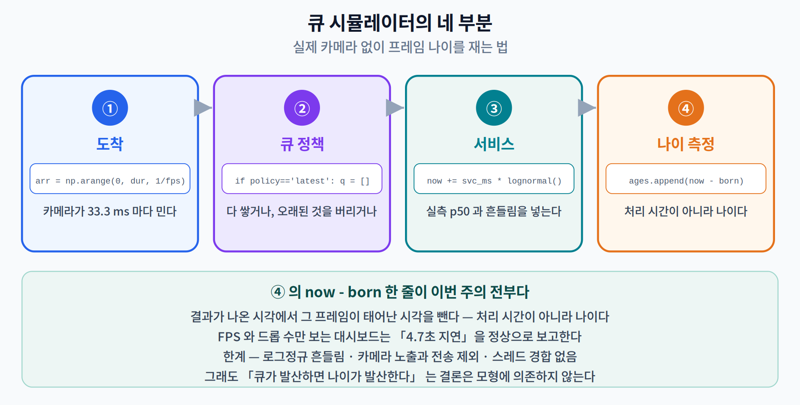

# 09주차 3교시. 내 파이프라인의 시간이 어디로 가는지 직접 재 보기

> **오늘의 질문** — 1·2교시의 숫자는 전부 계산이 아니라 **측정**이었다. 그 측정을 직접 해 보자. 카메라도 GPU 도 필요 없다. 사진 한 장, ONNX 파일 하나, 그리고 `time.perf_counter()` 면 된다. 오늘 짜는 것은 **모델을 쓰는 코드가 아니라 모델을 감싸는 코드**다.

---

## 실험 설계

| | 내용 |
|---|---|
| **가설** | 실시간 비전 파이프라인의 지연은 모델이 지배하지만, **모델을 아무리 줄여도 넘을 수 없는 천장**이 나머지 단계에 의해 정해진다. 그리고 처리 능력이 입력률보다 낮으면 **큐 정책이 프레임 나이를 두 자릿수로 갈라놓는다.** |
| **측정 대상** | 일곱 단계 각각의 p50/p95 · 암달 상한 · 큐 정책별 프레임 나이 |
| **필요한 것** | `onnxruntime`, `numpy`, `pillow`. **카메라·GPU 불필요.** |
| **타당성 위협** | ① 절대값은 기기·코어 수·다른 프로세스에 따라 달라진다 ② 파일에서 읽으므로 실제 카메라의 센서 노출·전송 시간이 빠져 있다 ③ 큐 실험은 실측 지연 분포를 쓴 **시뮬레이션**이지 실제 카메라가 아니다 |

> **절대값이 아니라 구조를 보라.** 아래 출력은 2코어 CPU 에서 얻은 것이고, 같은 코드를 다시 돌려도 ±10% 는 흔들린다. 실제로 이 문서를 만들며 두 번 돌린 결과가 49.0 ms 와 53.6 ms 였다. **재현해야 하는 것은 "추론이 70% 남짓, 나머지가 30% 남짓, 상한이 3.5배 근처"라는 구조**이지 소수점이 아니다.

---

## 3.1 모델을 감싸는 코드를 직접 짠다 (16분)

### 준비

```bash
pip install onnxruntime numpy pillow ultralytics
python3 -c "from ultralytics import YOLO; YOLO('yolo11n.pt').export(format='onnx', imgsz=640, opset=13, nms=False)"
```

마지막 인자 **`nms=False` 가 중요하다.** 기본값으로 내보내면 NMS 가 그래프 안에 들어가 버려서 **그 비용을 따로 잴 수 없다.** 라이브러리가 다 해 주는 편리함이 곧 관측 불가능성이다.

```python
import time, io, pathlib
import numpy as np, onnxruntime as ort
from PIL import Image

sess  = ort.InferenceSession("yolo11n.onnx", providers=["CPUExecutionProvider"])
IN    = sess.get_inputs()[0].name
jpeg  = pathlib.Path("bus.jpg").read_bytes()
print(f"입력 {sess.get_inputs()[0].shape} → 출력 {sess.get_outputs()[0].shape}")
```

```
입력 [1, 3, 640, 640] → 출력 [1, 84, 8400]
```

출력 모양부터 읽자. **84 = 4(상자) + 80(COCO 클래스 점수)**, **8400 = 80² + 40² + 20²** — 세 개의 특징 맵 격자에서 나온 후보의 총합이다. 모델은 8,400개를 전부 내놓고, **어느 것을 남길지는 우리가 정한다.**

### 일곱 단계

```python
def s1_decode(b):
    return np.asarray(Image.open(io.BytesIO(b)).convert("RGB"))

def s2_letterbox(im, size=640):
    h, w = im.shape[:2]
    r = min(size / h, size / w)                       # 비를 유지하는 배율
    nh, nw = int(round(h * r)), int(round(w * r))
    small = np.asarray(Image.fromarray(im).resize((nw, nh), Image.BILINEAR))
    out = np.full((size, size, 3), 114, np.uint8)     # 남는 곳은 회색
    t, l = (size - nh) // 2, (size - nw) // 2
    out[t:t + nh, l:l + nw] = small
    return out, r, l, t                               # 되돌리려면 r, l, t 가 필요하다

def s3_normalize(im):
    return np.ascontiguousarray((im.astype(np.float32) / 255.0).transpose(2, 0, 1)[None])

def s4_infer(x):
    return sess.run(None, {IN: x})[0]
```

`s2` 가 `r, l, t` 를 함께 돌려주는 것에 주목하자. **모델은 640×640 좌표계에서 답한다.** 원본 좌표로 되돌리려면 우리가 무슨 변환을 했는지 기억하고 있어야 한다. 이 값을 잃어버리면 상자가 엉뚱한 곳에 그려지고, 그것이 이 실습에서 가장 흔한 버그다.

```python
def s5_decode_boxes(pred, conf=0.25):
    p = pred[0]                                       # (84, 8400)
    sc_all = p[4:]                                    # (80, 8400)
    cls, sc = sc_all.argmax(0), sc_all.max(0)         # 클래스와 점수
    k = sc > conf
    if not k.any():
        return np.zeros((0, 4), np.float32), np.zeros(0), np.zeros(0, np.int64)
    xywh = p[:4, k].T
    xy, wh = xywh[:, :2], xywh[:, 2:]
    return np.concatenate([xy - wh / 2, xy + wh / 2], 1).astype(np.float32), sc[k], cls[k]
```

`xy - wh/2, xy + wh/2` — YOLO 는 **중심-너비-높이**로 내놓고 우리는 **좌상-우하**가 필요하다. 이 변환을 빠뜨리면 상자가 절반 크기로 왼쪽 위에 몰린다.

```python
def s6_nms(boxes, scores, cls, iou=0.45):
    if len(boxes) == 0:
        return np.zeros(0, np.int64)
    b = boxes + cls.astype(np.float32)[:, None] * 8192.0   # ← 이 한 줄이 요령이다
    x1, y1, x2, y2 = b.T
    area = (x2 - x1) * (y2 - y1)
    order, keep = scores.argsort()[::-1], []
    while order.size:
        i = order[0]; keep.append(i)
        if order.size == 1: break
        xx1 = np.maximum(x1[i], x1[order[1:]]); yy1 = np.maximum(y1[i], y1[order[1:]])
        xx2 = np.minimum(x2[i], x2[order[1:]]); yy2 = np.minimum(y2[i], y2[order[1:]])
        inter = np.maximum(0, xx2 - xx1) * np.maximum(0, yy2 - yy1)
        iou_v = inter / (area[i] + area[order[1:]] - inter + 1e-9)
        order = order[1:][iou_v <= iou]                    # 많이 겹친 것만 버린다
    return np.array(keep, np.int64)
```

> **`+ cls * 8192.0` 이 무슨 짓인가.** NMS 는 **클래스별로 따로** 해야 한다 — 사람 상자와 버스 상자가 겹쳤다고 하나를 지우면 안 된다. 클래스마다 따로 반복문을 돌 수도 있지만, **좌표에 클래스 번호 × 큰 수를 더해** 서로 다른 클래스를 좌표 공간에서 멀리 떨어뜨리면 한 번에 처리된다. 다른 클래스끼리는 IoU 가 자동으로 0 이 된다. 2교시 2.2 에서 본 **벡터화의 전형**이다.

```python
def s7_unletterbox(boxes, r, l, t, W, H):
    b = boxes.copy()
    b[:, [0, 2]] = ((b[:, [0, 2]] - l) / r).clip(0, W)     # 여백을 빼고 배율로 나눈다
    b[:, [1, 3]] = ((b[:, [1, 3]] - t) / r).clip(0, H)
    return b
```

> 한 줄 정리: 모델은 8,400개 후보를 내놓을 뿐이고, **쓸 만한 결과로 바꾸는 일은 전부 우리 코드가 한다.** 그 코드를 라이브러리에 맡기면 편하지만, 그 순간 시간이 어디로 갔는지 볼 수 없게 된다.

---

## 3.2 재고, 암달의 벽을 계산한다 (16분)

### 단계별 측정

```python
def one_frame(rec=None):
    def tick(name, fn, *a):
        t0 = time.perf_counter(); out = fn(*a)
        if rec is not None:
            rec.setdefault(name, []).append((time.perf_counter() - t0) * 1000)
        return out
    im = tick("① JPEG 디코드", s1_decode, jpeg)
    H, W = im.shape[:2]
    lb, r, l, t = tick("② 레터박스", s2_letterbox, im)
    x    = tick("③ 정규화",     s3_normalize, lb)
    pred = tick("④ 추론",       s4_infer, x)
    boxes, sc, cl = tick("⑤ 상자 디코딩", s5_decode_boxes, pred)
    k    = tick("⑥ NMS",       s6_nms, boxes, sc, cl)
    fin  = tick("⑦ 좌표 복원",   s7_unletterbox, boxes[k], r, l, t, W, H)
    return len(boxes), len(k)

for _ in range(6): one_frame()            # 워밍업 — 1주차에서 배운 것
rec = {}
for _ in range(30): n_cand, n_final = one_frame(rec)

p50   = {k: float(np.percentile(v, 50)) for k, v in rec.items()}
total = sum(p50.values())
for k, v in p50.items():
    print(f"  {k:14s} {v:7.2f} ms   ({v/total*100:5.1f} %)")
print(f"  {'합계':14s} {total:7.2f} ms   = {1000/total:.1f} FPS")
```

```
후보 46개 → 최종 5개

  ① JPEG 디코드        5.39 ms   ( 10.1 %)
  ② 레터박스            7.08 ms   ( 13.2 %)
  ③ 정규화             2.02 ms   (  3.8 %)
  ④ 추론             37.96 ms   ( 70.8 %)
  ⑤ 상자 디코딩          1.01 ms   (  1.9 %)
  ⑥ NMS             0.12 ms   (  0.2 %)
  ⑦ 좌표 복원           0.03 ms   (  0.1 %)
  합계               53.61 ms   = 18.7 FPS
```

**후보 8,400개 중 46개가 문턱을 넘었고, NMS 가 그중 5개를 남겼다.** 그 5개를 고르는 데 걸린 시간이 0.12 ms — 전체의 0.2%다. 2교시 2.1 의 출발점이 이 줄이다.

워밍업 6회를 빼먹으면 어떻게 되는지 직접 확인해 보라. 1주차에서 잰 4.7배가 여기서도 나온다.

### 암달의 벽

```python
inf = p50["④ 추론"]
for k in [2, 4, 8, None]:
    t   = (total - inf) + (0 if k is None else inf / k)
    lab = "0초가 되면" if k is None else f"{k}배 빨라지면"
    print(f"  추론이 {lab:12s} → 전체 {t:5.1f} ms · {total/t:.2f}배")
```

```
  추론이 2배 빨라지면      → 전체  34.6 ms · 1.55배
  추론이 4배 빨라지면      → 전체  25.1 ms · 2.13배
  추론이 8배 빨라지면      → 전체  20.4 ms · 2.63배
  추론이 0초가 되면       → 전체  15.6 ms · 3.43배
```

네 줄짜리 계산이지만, **4주차부터 8주차까지 다섯 주 동안 배운 모든 기법의 상한이 여기 적혀 있다.** 이 파이프라인에서 모델 최적화로 살 수 있는 것은 최대 3.43배다.

> 한 줄 정리: 단계별 측정에 필요한 것은 `perf_counter` 와 딕셔너리 하나뿐이고, 암달 상한 계산은 네 줄이다. **그 네 줄을 먼저 돌리지 않고 모델을 최적화하기 시작하면, 천장이 어디인지 모른 채 일하는 것이다.**

---

## 3.3 큐를 시뮬레이션한다 (14분)

이제 카메라를 붙인다. 실제 카메라 대신 **실측 지연을 쓰는 시뮬레이터**를 만든다.

```python
def simulate(svc_ms, policy, fps=30.0, dur=10.0, jitter=0.15, seed=0):
    """policy: 'queue'(다 쌓는다) 또는 'latest'(최신만 남기고 버린다)"""
    rng = np.random.default_rng(seed)
    arr = np.arange(0, dur, 1 / fps)          # 카메라가 프레임을 밀어 넣는 시각
    q, now, ages, dropped, i = [], 0.0, [], 0, 0
    while i < len(arr) or q:
        while i < len(arr) and arr[i] <= now:          # 지금까지 도착한 프레임을 큐에
            if policy == "latest" and q:
                dropped += len(q); q = []              # 오래된 것을 통째로 버린다
            q.append(arr[i]); i += 1
        if not q:
            now = arr[i]; continue                     # 놀고 있으면 다음 도착까지 점프
        born = q.pop(0)
        now  = max(now, born) + max(svc_ms * rng.lognormal(0, jitter), 1.0) / 1000
        ages.append((now - born) * 1000)               # ← 프레임 나이
    a = np.array(ages)
    return len(a), dropped, float(np.percentile(a, 50)), float(a[-1])
```

핵심은 마지막에서 두 번째 줄이다. **`now - born`** — 결과가 나온 시각에서 그 프레임이 **태어난** 시각을 뺀다. 처리 시간이 아니라 **나이**다.

```python
for svc, tag in [(total, "640² (현재)"), (18.1, "320² (해상도를 낮추면)")]:
    for pol, nm in [("queue", "다 쌓는다  "), ("latest", "최신만 남긴다")]:
        n, d, a50, alast = simulate(svc, pol)
        print(f"  {tag:22s} {nm} → 처리 {n:3d}장 · 버림 {d:3d}장 | "
              f"나이 p50 {a50:7.1f} ms · 마지막 {alast:7.1f} ms")
```

```
  640² (현재)              다 쌓는다   → 처리 300장 · 버림   0장 | 나이 p50  3242.9 ms · 마지막  6216.8 ms
  640² (현재)              최신만 남긴다 → 처리 185장 · 버림 115장 | 나이 p50    71.4 ms · 마지막    87.7 ms
  320² (해상도를 낮추면)        다 쌓는다   → 처리 300장 · 버림   0장 | 나이 p50    17.9 ms · 마지막    20.5 ms
  320² (해상도를 낮추면)        최신만 남긴다 → 처리 300장 · 버림   0장 | 나이 p50    17.9 ms · 마지막    20.5 ms
```

첫 줄과 둘째 줄이 이번 주의 결론이다.

- **첫 줄** — 300장 다 처리, 한 장도 안 버림, 30 fps. 지표가 완벽하다. 그런데 마지막 프레임의 나이가 **6.2초**다.
- **둘째 줄** — 115장을 버렸다. 지표가 나쁘다. 그런데 나이가 **71 ms 로 일정**하다.

셋째·넷째 줄은 해법이다. **처리 능력이 입력률을 넘으면 정책 논쟁 자체가 사라진다.**



> **시뮬레이션의 한계를 분명히 하자.** 지연 흔들림을 로그정규로 모형화했고, 카메라 노출·USB 전송·화면 출력을 안 넣었으며, 스레드 경합도 없다. 그래서 이 숫자는 **실기기 값이 아니라 구조를 드러내는 장치**다. 다만 **큐가 발산하면 나이가 발산한다**는 결론은 모형에 의존하지 않는다 — 도착률이 처리율보다 크면 그렇게 된다.

> 한 줄 정리: 프레임 나이는 `now - born` 한 줄로 잰다. 실측에서 **드롭 0 인 시스템이 6.2초, 115장을 버린 시스템이 71 ms** 였다.

---

## 3.4 과제 (4분 안내)

### 필수 과제 — 「내 파이프라인의 천장」

**IMRaD 형식 2~3쪽.** 실행 로그와 코드를 부록에.

1. **파이프라인을 완성하고** 일곱 단계를 각각 p50/p95 로 재라. 사진은 여러분이 고른 것으로, 최소 3장.
2. **암달 상한을 계산하라.** 추론을 0초로 만들었을 때 전체 배수는 몇인가?
3. **가장 비싼 비-추론 단계를 하나 골라 실제로 최적화하라.** (예: PIL → OpenCV, 또는 정규화를 `blobFromImage` 로 대체) 단계 배수와 **파이프라인 배수**를 함께 보고하고, 왜 두 값이 다른지 설명하라.
4. **큐 시뮬레이터를 돌려** 두 정책의 프레임 나이를 비교하라. 그리고 여러분 모델이 **정책 논쟁이 사라지는 지점**(처리 능력 ≥ 30 fps)에 도달하려면 무엇을 어디까지 바꿔야 하는지 계산하라.
5. **타당성 위협을 최소 세 개** 적어라. 실기기와 다를 수밖에 없는 이유를 항목별로.

### 선택 과제 A — 「NMS 를 병목으로 만들어 보기」

2교시에서 같은 NMS 가 0.2%이기도 70%이기도 했다. **여러분 파이프라인에서 NMS 를 병목으로 만들어 보라.**

두 가지 길이 있다. (가) 신뢰도 문턱을 0.001 까지 내려 후보를 수백 개로 늘린다. (나) NMS 를 파이썬 이중 루프로 다시 짠다. 각각에서 NMS 비중이 몇 %까지 오르는지 재고, **두 방법이 만들어 내는 "병목"의 성격이 어떻게 다른지** 논하라. 둘 중 하나만 실제 시스템에서 고쳐야 할 문제다.

### 선택 과제 B — 「양자화를 성공시키기」

2교시 2.2 에서 동적 INT8 양자화가 **크기 3.5배 감소 · 속도 1.5배 악화**로 실패했다.

`onnxruntime.quantization` 의 **정적 양자화**(`quantize_static`)를 대표 이미지 수십 장으로 보정해 다시 시도하라. 추론 시간·파일 크기·최종 상자 수를 FP32 및 동적 양자화와 나란히 표로 제시하고, **성공했든 실패했든 그 원인을 연산자 수준에서 설명하라.** (힌트: `onnxruntime` 의 그래프를 열어 `QLinearConv` 가 몇 개인지 세어 보라.)

### 평가 기준

| 항목 | 배점 |
|---|---:|
| 일곱 단계를 정확히 쪼개고 쟀는가 | 25 |
| 암달 상한을 계산하고 **해석**했는가 | 20 |
| 실제 최적화의 단계 배수와 파이프라인 배수를 **구분**했는가 | 25 |
| 큐 실험과 정책 해석 | 20 |
| 타당성 위협의 구체성 | 10 |

---

## 3교시 정리
- 모델은 8,400개 후보를 내놓을 뿐이다. **쓸 만한 답으로 바꾸는 일은 전부 우리 코드가 한다.**
- `nms=False` 로 내보내야 NMS 비용을 잴 수 있다. **편리함은 관측 불가능성과 맞바꾸는 것이다.**
- 단계별 측정에 필요한 건 `perf_counter` 와 딕셔너리 하나, 암달 상한 계산은 네 줄이다.
- 실측 구조 — 추론 **70.8%**, 나머지 여섯 **29.2%**, NMS **0.2%**, 암달 상한 **3.43배**.
- 프레임 나이는 `now - born`. 드롭 0 인 시스템이 **6.2초**, 115장을 버린 시스템이 **71 ms** 였다.
- **절대값은 기기마다 다르다.** 재현해야 하는 것은 구조다.

> **교수님을 위한 Tip** — 3.2 의 측정을 **워밍업 6회를 빼고 한 번 돌려 보이십시오.** 1주차에서 배운 첫 회 폭증이 그대로 재현되고, 학생들은 여덟 주 전 내용이 여기서 되살아나는 것을 봅니다. 그리고 3.3 의 출력은 **첫 두 줄만 띄우고 "어느 쪽 시스템을 배포하시겠습니까"** 로 시작하십시오. 이 수업에서 학생이 **지표가 거짓말하는 것을 직접 보는** 거의 유일한 순간입니다.

### 더 읽어보기
- [1] M. Li, Y.-X. Wang, and D. Ramanan, "Towards streaming perception," in *Proc. ECCV*, LNCS vol. 12347, 2020, pp. 473–488.
- [8] G. M. Amdahl, "Validity of the single processor approach to achieving large scale computing capabilities," in *Proc. AFIPS Spring Joint Computer Conf.*, vol. 30, 1967, pp. 483–485.
- [9] G. Jocher and J. Qiu, *Ultralytics YOLO11* (version 11.0.0), 2024. — **AGPL-3.0.** 수업·연구용 사용은 문제없지만, 캡스톤을 제품이나 서비스로 배포할 계획이라면 §14 의 라이선스 주의를 먼저 읽을 것.
- [12] COCO Detection Evaluation. [Online]. Available: https://cocodataset.org/#detection-eval — 작은/중간/큰 물체 기준(32², 96²)의 **1차 출처는 논문이 아니라 평가 문서와 `cocoeval.py`** 이며, 넓이는 **분할 마스크의 픽셀 수**로 잰다.
