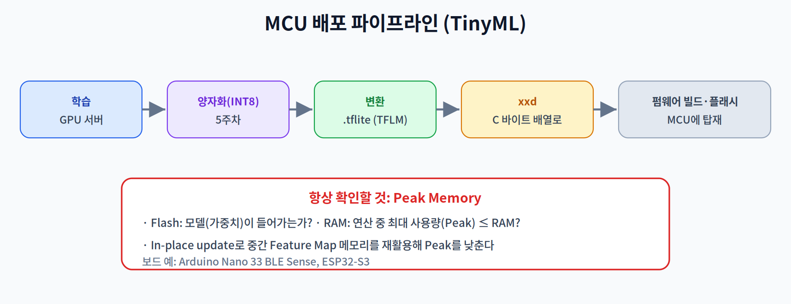

# 9주차 3교시. MCU 배포 파이프라인과 Peak Memory

**실습 목표** — 학습된 모델을 MCU에 올리는 **배포 파이프라인**을 이해하고, 모델을 펌웨어에 넣는 `xxd` 변환과 **Peak Memory 추정**을 직접 해 본다. 실제 보드가 없어도 노트북에서 원리를 확인한다.

> 준비물: 노트북(리눅스/맥은 `xxd` 기본 포함, Windows는 Git Bash 등). 모델 파일은 5주차에서 만든 양자화 `.tflite`(또는 조교 배포본)를 사용.

---

## 3.1 배포 파이프라인 (15분)

TinyML 배포는 정해진 단계를 거친다.



`학습(서버)` → `양자화(INT8, 5주차)` → `변환(.tflite, TFLM용)` → `xxd로 C 배열화` → `펌웨어 빌드·플래시`.

각 단계에서 **두 예산**을 계속 확인한다: 모델이 **Flash**에 들어가는가, 실행 중 **Peak Memory**가 **RAM**을 넘지 않는가. 하나라도 넘으면 보드에 아예 안 올라가거나 실행 중 죽는다.

> 관찰 포인트: 양자화가 파이프라인 앞단에 있는 이유 — INT8이라야 크기(Flash)와 정수 연산(FPU 부재)을 모두 감당할 수 있기 때문이다(1교시).

---

## 3.2 모델을 펌웨어로 — xxd (15분)

MCU에는 파일 시스템이 없는 경우가 많다. 그래서 모델을 **C 소스의 바이트 배열**로 바꿔 펌웨어에 **직접 포함**시킨다. 표준 도구가 `xxd`다.

```bash
# .tflite 모델 → C 헤더(바이트 배열)로 변환
xxd -i mobilenet_int8.tflite > model_data.h

# 생성된 헤더 확인(앞부분만)
head -n 5 model_data.h
```

생성되는 헤더는 대략 이런 형태다.

```c
unsigned char mobilenet_int8_tflite[] = {
  0x1c, 0x00, 0x00, 0x00, 0x54, 0x46, 0x4c, 0x33, /* ... */
};
unsigned int mobilenet_int8_tflite_len = 98765;   // ← 모델 크기(Flash 소요)
```

이 배열을 펌웨어에 넣고, TFLM 인터프리터가 이 바이트를 읽어 실행한다. `..._len` 값이 곧 모델이 차지하는 **Flash 용량**이다.

> 관찰 포인트: `xxd -i`로 나온 `_len`을 보드의 Flash 용량과 비교하라. 이 숫자가 배포 가능 여부의 1차 관문이다.

---

## 3.3 Peak Memory 추정과 과제 (20분)

RAM 예산은 **연산 중 동시에 살아있는 버퍼의 합**으로 정해진다. 간단한 층 구성에서 이를 추정해 본다(순수 파이썬, 라이브러리 불필요).

```python
# 각 레이어의 출력 Feature Map 크기(원소 수, INT8=1바이트 가정)
#  (예시: 채널 x 높이 x 너비)
fmaps = [
    ("input",  3*96*96),     # 27,648
    ("conv1", 16*48*48),     # 36,864
    ("conv2", 32*24*24),     # 18,432
    ("conv3", 64*12*12),     #  9,216
    ("pool",  64*1*1),       #     64
]

# 단순 추정: 한 레이어를 계산할 때 '입력 버퍼 + 출력 버퍼'가 동시에 필요
peak = 0
for i in range(1, len(fmaps)):
    live = fmaps[i-1][1] + fmaps[i][1]      # 이전(입력) + 현재(출력)
    peak = max(peak, live)
    print(f"{fmaps[i][0]:>6}: live={live:,} bytes")
print(f"\nPeak Memory ≈ {peak:,} bytes  (RAM 예산과 비교!)")
```

관찰의 핵심:

1. Peak는 대개 **초반 레이어**(Feature Map이 가장 클 때)에서 발생한다.
2. 이 값이 기기 RAM(예: 256KB)을 넘으면 배포 불가 → In-place 재활용, 타일링, 더 작은 입력 해상도로 낮춰야 한다.
3. "모델 크기(Flash)"와 "실행 메모리(RAM/Peak)"는 **다른 예산**이다 — 둘 다 통과해야 한다.

### 과제
1. **예산 점검표** — 위 코드의 `fmaps`를 본인 관심 모델 구조로 바꿔 Peak Memory를 추정하고, 가상의 RAM 예산(예: 256KB)과 비교해 배포 가능 여부를 판정한다.
2. **입력 해상도 실험** — 입력을 96×96 → 48×48로 줄이면 Peak가 어떻게 변하는지 계산하고, 정확도-메모리 트레이드오프를 3~4문장으로 논한다.
3. **개념 연결** — Duty Cycling과 Depthwise Separable이 각각 '전력'과 '연산량'의 어느 문제를 푸는지 구분해 설명한다.
4. **다음 주 예습** — 10주차(엣지 비전)에서는 MobileNet·YOLO 등 경량 비전 모델을 다룬다. Depthwise Separable이 어디에 쓰이는지 미리 찾아온다.

> 교수님을 위한 Tip: 실제 보드(Arduino Nano 33 BLE Sense, ESP32-S3)가 있으면 `xxd`로 만든 헤더를 넣어 빌드 크기를 보여주면 좋다. 없더라도 Peak Memory 계산만으로 "왜 큰 모델이 안 올라가는가"를 수치로 이해시킬 수 있다.

---

### 3교시 정리
- MCU 배포 파이프라인(양자화→변환→xxd→플래시)을 이해했다.
- `xxd`로 모델을 C 배열화하고, Peak Memory를 추정해 Flash·RAM 두 예산을 구분했다.
- 다음 주부터는 이 기반 위에서 비전·언어 등 실제 응용으로 넘어간다.
