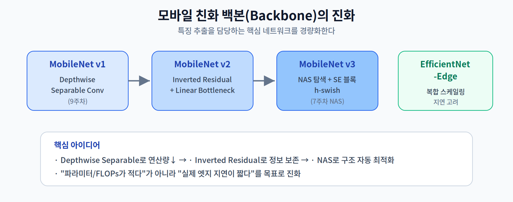
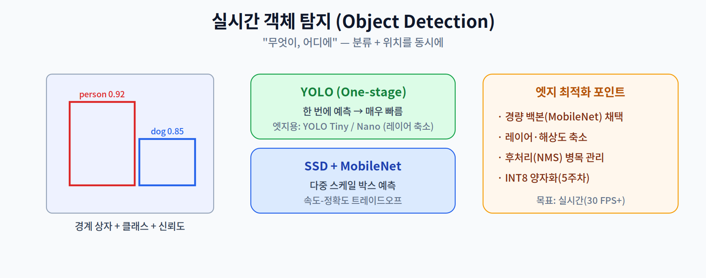
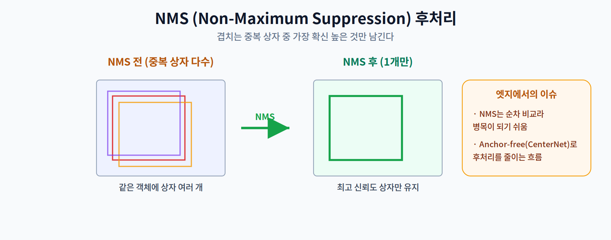

# 10주차 1교시. 경량 비전 아키텍처와 객체 탐지

**강의 목표** — 모바일·엣지 환경에 최적화된 CNN 구조를 분석하고, 실시간성 확보를 위한 객체 탐지 알고리즘의 최적화 방안을 이해한다.

9주차까지 배운 경량화·저전력 기법이 실제로 빛을 발하는 첫 응용 분야가 **컴퓨터 비전(Computer Vision)** 이다. 서버급 GPU에서 돌던 무거운 비전 모델을, 성능 저하를 최소화하며 엣지의 NPU/GPU에 올리는 기법을 다룬다.

---

## 1.1 경량 백본 네트워크 (20분)

비전 모델의 **백본(Backbone)** 은 이미지에서 특징을 추출하는 핵심 네트워크다. 엣지에서는 이 백본을 얼마나 가볍게 만드느냐가 관건이다.

- **MobileNet 시리즈** — 엣지 비전의 대표 백본이다.
  - **v1**: 9주차에서 배운 **Depthwise Separable Convolution**으로 연산량을 대폭 줄였다.
  - **v2**: **Inverted Residual + Linear Bottleneck**으로, 좁은 채널에서 정보 손실을 줄이며 효율을 높였다.
  - **v3**: **NAS(Neural Architecture Search, 7주차)로 구조를 탐색**하고 SE(Squeeze-and-Excitation) 블록·h-swish(경량 활성함수)를 도입했다.
- **EfficientNet-Edge** — 깊이·너비·해상도를 균형 있게 키우는 **복합 스케일링(Compound Scaling)** 을, 하드웨어 지연까지 고려해 엣지에 맞춘 계열이다.

핵심은 이 백본들이 "파라미터/FLOPs가 적다"를 넘어 **"실제 엣지 하드웨어에서 지연이 짧다"** 를 목표로 진화했다는 점이다(2주차·7주차의 교훈).

> 한 줄 정리: 엣지 비전은 경량 백본에서 시작하며, MobileNet 계열이 Depthwise Separable→Inverted Residual→NAS로 진화해 왔다.

---

## 1.2 실시간 객체 탐지 (25분)

이미지 분류가 "무엇인가"라면, **객체 탐지(Object Detection)** 는 "무엇이, 어디에" 있는지를 경계 상자(bounding box)로 찾는다. 실시간(예: 30 FPS 이상)이 목표다.

- **YOLO (You Only Look Once) Tiny/Nano** — 이미지를 **한 번에** 통과시켜 상자와 클래스를 동시에 예측하는 **one-stage** 방식이라 매우 빠르다. 엣지용으로는 레이어를 줄인 Tiny/Nano 버전을 쓴다.
- **SSD (Single Shot MultiBox Detector) + MobileNet** — 여러 스케일에서 박스를 예측한다. 경량 백본(MobileNet)과 결합해 속도-정확도 트레이드오프를 조절한다.

엣지 최적화 포인트는 (1) 경량 백본 채택, (2) 레이어·입력 해상도 축소, (3) 후처리(NMS) 병목 관리, (4) INT8 양자화(5주차)다.

> 한 줄 정리: 엣지 객체 탐지는 경량 백본 위에 one-stage(YOLO)/multi-box(SSD) 탐지기를 얹고, 해상도·후처리·양자화로 실시간을 확보한다.

---

## 1.3 Anchor-free와 NMS (10분)

객체 탐지는 대개 **여러 개의 후보 상자**를 쏟아낸다. 같은 객체에 상자가 여럿 겹치므로, 중복을 정리하는 후처리가 필요하다.

- **NMS (Non-Maximum Suppression)** — 겹치는 상자들 중 **신뢰도가 가장 높은 것만 남기고** 나머지를 억제한다. 그런데 이 과정은 상자들을 순차적으로 비교하므로, GPU/NPU 연산이 끝난 뒤 **CPU에서 병목**이 되기 쉽다.
- **Anchor-free (예: CenterNet)** — 미리 정의한 기준 상자(anchor) 없이 객체 중심점을 직접 예측해, 후보 상자와 후처리 부담을 줄이는 최신 흐름이다.

> 교수님을 위한 Tip: "모델 추론은 5ms인데 전체는 20ms가 걸린다"는 상황을 예로 들어라. 전처리와 NMS 같은 **비(非)모델 구간**이 실제 지연의 큰 부분을 차지할 수 있음을 강조하면, 3교시 파이프라인 관점으로 자연스럽게 이어진다.

---

### 1교시 복습 질문
1. MobileNet v1→v2→v3의 핵심 변화를 각각 한 가지씩 들어라.
2. YOLO가 'one-stage'로서 빠른 이유는?
3. NMS가 엣지에서 병목이 될 수 있는 이유와, 이를 줄이는 접근은?
