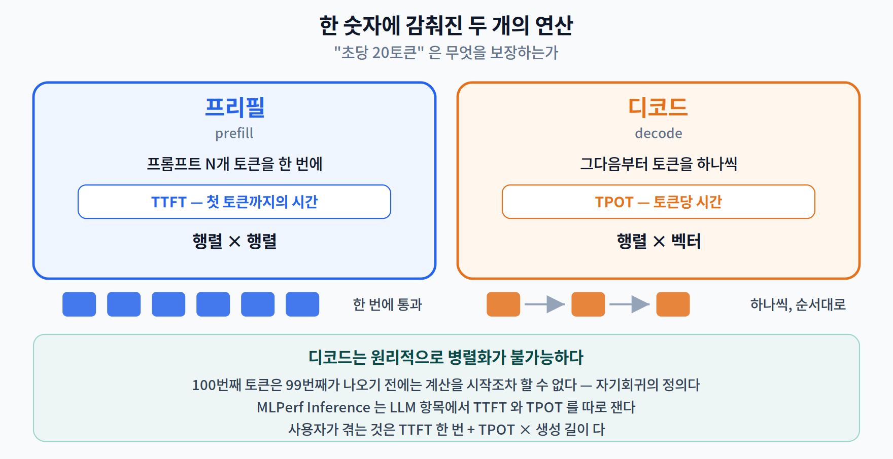
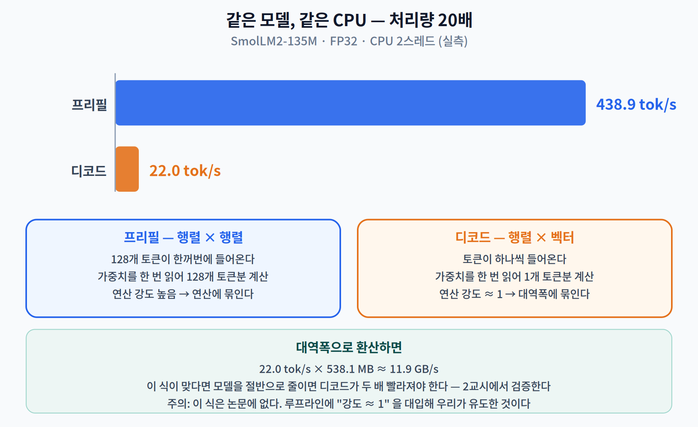
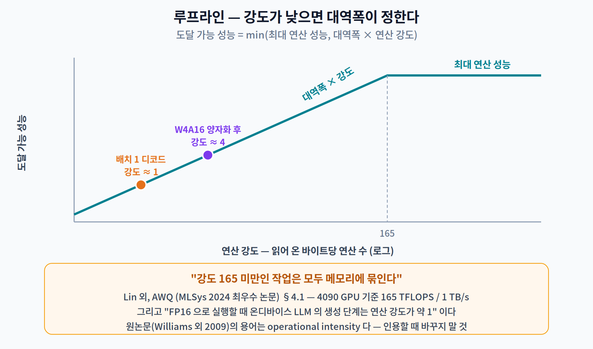
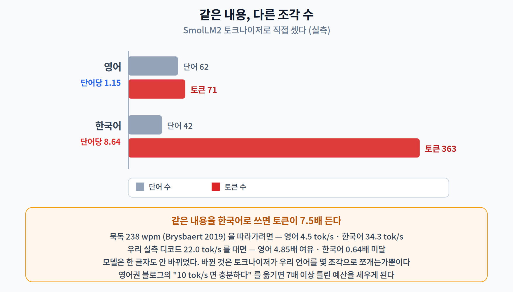
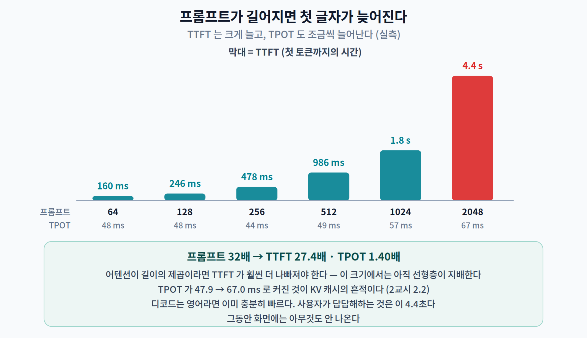

# 10주차 1교시. 왜 첫 글자는 늦게 나오고, 그다음은 술술 나올까?

> **오늘의 질문** — 챗봇에 질문을 넣으면 몇 초 멈췄다가 글자가 **한 자씩** 흘러나온다. 우리는 이것을 그냥 "느리다"고 부르지만, 그 안에는 **완전히 다른 두 개의 연산**이 들어 있다. 둘은 같은 모델·같은 CPU 위에서 도는데도 처리량이 **20배** 차이 난다. 그리고 그 차이가 온디바이스 LLM 설계의 거의 전부를 결정한다.

---

## 1.1 하나의 숫자가 두 개의 연산을 감춘다 (14분)

9주차에서 "30 FPS"라는 한 숫자가 세 가지 다른 것을 감추고 있다고 했다. LLM 에서도 똑같은 일이 벌어진다.

"우리 모델은 초당 20토큰입니다." 이 문장은 무엇을 보장하는가?

| 단계 | 무엇을 하나 | 무엇을 재나 |
|---|---|---|
| **프리필 (prefill)** | 프롬프트 N개 토큰을 **한 번에** 통과시켜 첫 토큰을 만든다 | **TTFT** — 첫 토큰까지의 시간 |
| **디코드 (decode)** | 그다음부터 토큰을 **하나씩** 만든다 | **TPOT** — 토큰당 시간 |

이 용어는 우리가 지어낸 것이 아니다. 산업 표준 벤치마크인 MLPerf Inference 가 LLM 항목에 대해 이 둘을 **따로** 잰다. [1]

> *"LLM 벤치마크에서는 두 가지 지연 지표를 수집한다 — 첫 토큰의 지연을 재는 **time to first token(TTFT)**, 그리고 생성된 모든 토큰 사이의 평균 간격을 재는 **time per output token(TPOT)**."*

Pope 외의 「Efficiently Scaling Transformer Inference」(MLSys 2023)는 이 두 단계를 왜 따로 봐야 하는지를 이렇게 적었다. [2]

> *"입력 토큰은 추론 시작 시점에 모두 존재하므로, 모든 토큰에 대해 **단 한 번의 순전파로 병렬 실행**할 수 있다. 우리는 이 단계를 **프리필**이라 부른다. … 프리필은 입력 길이에 대해 병렬로 돌 수 있지만 **디코드는 생성 길이에 대해 순차적으로** 돌아야 하므로, 두 단계는 성능 특성이 다르고 따라서 따로 분석한다."*

> **왜 디코드는 병렬이 안 되는가.** 다음 토큰을 만들려면 **직전 토큰이 무엇인지 알아야** 하기 때문이다. 100번째 토큰은 99번째가 나오기 전에는 계산을 시작조차 할 수 없다. 이것이 자기회귀(autoregressive) 생성의 정의이며, 이번 주 내내 따라다니는 제약이다.

> 한 줄 정리: "초당 몇 토큰"은 **두 개의 다른 연산**을 하나로 뭉갠 숫자다. 사용자가 겪는 것은 **TTFT 한 번 + TPOT × 생성 길이**이고, 둘은 따로 재야 한다.

---

## 1.2 프리필과 디코드는 사실상 다른 기계다 (18분)

직접 재 보자. 모델은 **SmolLM2-135M-Instruct**(Ben Allal 외, COLM 2025) [3], CPU 2스레드, FP32.

| | 값 |
|---|---|
| 파라미터 | **134,515,008**개 (공개 표기 "135M") |
| 가중치 | 538.1 MB (FP32) |
| 층 / hidden | 30 / 576 |
| 질의 헤드 / KV 헤드 | 9 / 3 → **GQA 3:1** |
| 어휘 / 최대 문맥 | 49,152 / 8,192 |

> **파라미터 수를 직접 검산해 보라.** 임베딩 49,152×576 = 28,311,552, 층 하나당 3,540,096(주의·MLP·정규화), ×30 = 106,202,880, 마지막 정규화 576. 합이 **정확히 134,515,008**이다. 이 계산이 맞는다는 것은 이 모델이 **임베딩과 출력층을 공유(tied)** 한다는 뜻이기도 하다 — 안 묶었다면 162.8M 이 된다.

### 실측

| | 처리량 | 한 번에 |
|---|---:|---|
| **프리필** (프롬프트 128토큰) | **438.9 tok/s** | 291.6 ms 에 128개 |
| **디코드** | **22.0 tok/s** | 45.4 ms 에 1개 |

> **같은 모델, 같은 CPU 인데 처리량이 20배 차이 난다.**

### 왜 20배인가 — 행렬×행렬 대 행렬×벡터

원인은 하나다. **연산의 모양이 다르다.**

- **프리필** — 128개 토큰이 한꺼번에 들어오므로, 가중치 행렬 $W$ 에 **128열짜리 행렬**을 곱한다. 가중치를 메모리에서 **한 번 읽어** 128개 토큰분의 계산에 쓴다.
- **디코드** — 토큰이 하나씩 들어오므로, 같은 $W$ 에 **1열짜리 벡터**를 곱한다. 가중치를 **한 번 읽어 1개 토큰분**만 계산한다.

읽어 오는 바이트당 하는 계산량을 **연산 강도(arithmetic intensity)** 라 한다. 배치 1 디코드에서 이 값은 **약 1**이다. 곱셈-누산 한 번 하려고 가중치 한 개를 읽어 오는 셈이다.

AWQ 논문(Lin 외, MLSys 2024 최우수 논문)이 이 값을 명시적으로 적었다. [4]

> *"4090 GPU 는 최대 연산 처리량 165 TFLOPS 와 메모리 대역폭 1 TB/s 를 갖는다. 따라서 **연산 강도(FLOPs 대 메모리 접근의 비)가 165 미만인 작업은 모두 메모리에 묶인다.** … FP16 으로 실행할 때 온디바이스 LLM 의 **생성 단계는 연산 강도가 약 1** 이다."*

**165 대 1.** 두 자릿수도 아니고 **두 자릿수의 제곱**만큼 모자란다. 그래서 디코드에서는 CPU/GPU 가 거의 놀고, **메모리에서 가중치를 실어 나르는 시간**이 전부가 된다.

> **[더 깊이 — 선택] 루프라인.** 이 사고 방식의 원형은 Williams·Waterman·Patterson 의 루프라인 모형(CACM 2009)이다. [5] *"도달 가능한 GFlops/초 = min(최대 부동소수점 성능, 최대 메모리 대역폭 × 연산 강도)"* — 강도가 낮으면 오른쪽 항이 이기고, 그때 성능은 **연산 능력과 무관하게** 대역폭에만 달린다. 다만 용어에 주의하자. 원논문은 **"operational intensity"** 라 쓰고, ML 문헌은 "arithmetic intensity" 라 쓴다. 같은 것을 가리키지만 인용할 때 원어를 바꾸지는 말자.

이 관점에서 우리 실측을 뒤집어 보면 **대역폭 추정치**가 나온다.

$$\text{tok/s} \times \text{모델 바이트} = 22.0 \times 538.1\,\text{MB} \approx \mathbf{11.9\ GB/s}$$

2코어 클라우드 CPU 에서 그럴듯한 값이다. 그리고 이 식이 맞다면 **모델을 절반으로 줄이면 디코드가 두 배 빨라져야 한다.** 2교시에서 그 예측을 검증한다.

> **주의 — 이 식은 어느 논문에도 그대로 실려 있지 않다.** 루프라인 모형에 "강도 ≈ 1"을 대입해 우리가 유도한 것이다. 인용할 때는 AWQ §4.1 과 Williams 외를 근거로 들고, **식 자체는 자기 유도로 밝히는 것이 정직하다.**

> 한 줄 정리: 프리필은 **행렬×행렬**이라 연산에 묶이고, 디코드는 **행렬×벡터**라 대역폭에 묶인다. 배치 1 디코드의 연산 강도는 **약 1** — 실측 20배 격차의 원인이 여기 있다.

---

## 1.3 그래서 얼마나 빠르면 되는가 (18분)

"22 tok/s 는 빠른가?" 이 질문에 답하려면 **비교 대상**이 필요하다. 사람이 읽는 속도다.

Brysbaert 의 메타분석(*Journal of Memory and Language*, 2019)은 190편의 연구·18,573명을 종합해 이렇게 보고한다. [6]

> *"성인 영어 화자의 평균 **묵독 속도는 비소설 238 단어/분(wpm), 소설 260 wpm** 으로 추정된다."*

같은 논문은 **소리 내어 읽기는 183 wpm** 으로, 묵독보다 확실히 느리다고 적었다. 음성 비서를 만든다면 이쪽이 기준이다.

> **자주 인용되는 "평균 300 wpm"은 근거가 없다.** Brysbaert 는 그 수치를 명시적으로 정정한다.

### 단어를 토큰으로 바꿔야 하는데 — 여기서 함정이 나온다

238 wpm 을 tok/s 로 바꾸려면 **단어당 토큰 수**가 필요하다. 널리 쓰이는 값은 OpenAI 도움말의 *"토큰 100개는 대략 단어 75개"* 다. [7]

**그 값을 그대로 쓰면 안 된다.** 그것은 **OpenAI 토크나이저·영어** 기준이다. 우리 모델은 어휘 49,152개짜리 자체 토크나이저를 쓴다. 그래서 **직접 셌다.**

같은 내용의 문단을 영어와 한국어로 각각 넣어 SmolLM2 토크나이저로 세어 보았다.

| | 단어 | 토큰 | 토큰당 단어 | **단어당 토큰** |
|---|---:|---:|---:|---:|
| 영어 | 62 | 71 | 0.873 | **1.15** |
| **한국어** | 42 | **363** | **0.116** | **8.64** |

> **같은 내용을 한국어로 쓰면 토큰이 7.5배 든다.**

### 그래서 필요한 속도가 언어마다 다르다

| 읽기 방식 | wpm | **영어에 필요** | **한국어에 필요** |
|---|---:|---:|---:|
| 묵독 · 비소설 | 238 | **4.5 tok/s** | **34.3 tok/s** |
| 묵독 · 소설 | 260 | 5.0 tok/s | 37.5 tok/s |
| 소리 내어 읽기 | 183 | 3.5 tok/s | 26.4 tok/s |

이제 우리 실측 **22.0 tok/s** 를 대 보자.

| | 필요 | 실측 | 판정 |
|---|---:|---:|---|
| 영어 | 4.5 tok/s | 22.0 | **4.85배 여유 있다** |
| **한국어** | 34.3 tok/s | 22.0 | **0.64배 — 못 따라간다** |

**같은 모델·같은 CPU 가 영어로는 읽는 속도보다 4.85배 빠르고, 한국어로는 못 따라간다.** 모델은 한 글자도 안 바뀌었다. 바뀐 것은 **토크나이저가 우리 언어를 몇 조각으로 쪼개는가**뿐이다.

> **이것이 한국어로 온디바이스 LLM 을 하는 사람에게 가장 먼저 필요한 계산이다.** 영어권 블로그의 "10 tok/s 면 충분하다"를 그대로 옮기면 **7배 이상 틀린 예산**을 세우게 된다. 여러분의 응용에 쓸 실제 문장으로, 여러분이 쓸 실제 토크나이저로, **직접 세라.** 3교시 실습이 그것이다.

### 그런데 진짜 문제는 다른 데 있다

디코드는 (영어라면) 이미 충분히 빠르다. 사용자가 실제로 답답해하는 것은 **첫 글자가 안 나오는 시간**, 즉 TTFT 다. 프롬프트를 길게 넣을수록 이 값이 커진다.

| 프롬프트 | TTFT | 프리필 처리량 | TPOT |
|---:|---:|---:|---:|
| 64 | 160 ms | 400 tok/s | 47.9 ms |
| 512 | 986 ms | 519 tok/s | 49.3 ms |
| **2,048** | **4,382 ms** | 467 tok/s | 67.0 ms |

**프롬프트 2,048 토큰이면 첫 글자까지 4.4초다.** 그동안 화면에는 아무것도 안 나온다.

> **여기서 흥미로운 관찰 하나.** 프롬프트가 32배(64→2,048) 길어졌는데 TTFT 는 27.4배 늘었다. 어텐션이 길이의 제곱에 비례한다면 훨씬 더 나빠져야 한다. **이 크기에서는 아직 제곱 항이 지배하지 않는다** — 선형층(행렬 곱)이 여전히 대부분이기 때문이다. 문맥이 훨씬 더 길어지면 이야기가 달라지고, 그때가 FlashAttention 같은 기법이 필요해지는 지점이다.
>
> 반대로 **TPOT 는 47.9 → 67.0 ms 로 1.40배 커졌다.** 토큰 하나를 만드는 비용이 문맥 길이에 따라 늘어난다는 뜻이고, 그 원인이 2교시의 주제인 **KV 캐시**다.

> 한 줄 정리: 디코드 속도는 영어라면 이미 읽는 속도의 4.85배지만 **한국어에서는 못 따라간다(0.64배)** — 토크나이저 때문이다. 그리고 사용자가 실제로 겪는 병목은 **TTFT** 이며, 프롬프트 2,048 토큰에서 4.4초였다.

---

## 오늘의 토론 질문

1. 1.2 에서 디코드의 연산 강도가 약 1이라고 했다. **강도를 올리는 방법**을 두 가지 이상 생각해 보라. (둘 다 2교시에서 나온다.)
2. 1.3 의 한국어 8.64 토큰/단어는 **모델의 성질인가, 토크나이저의 성질인가?** 한국어 데이터를 더 넣어 학습하면 이 값이 바뀌는가? 무엇을 바꿔야 바뀌는가?
3. TTFT 4.4초와 TPOT 45 ms 중 **어느 쪽에 개발 시간을 쓰겠는가?** 여러분의 응용을 하나 정하고 답해 보라. 답이 응용에 따라 달라지는가?
4. 프리필은 병렬이 되고 디코드는 안 된다고 했다. 그렇다면 **디코드를 병렬로 만들 방법은 정말 없는가?** (2.5 에서 한 가지 답을 본다.)

> **교수님을 위한 Tip** — 1.2 의 21배는 **먼저 예측시키십시오.** "프롬프트 128토큰을 처리하는 시간과 토큰 1개를 만드는 시간의 비를 맞혀 보라"고 하면 대부분 128배에 가깝게 답합니다(실제는 6.4배). 그 오답이 오히려 좋은 출발점입니다 — **왜 128배가 안 되는가**를 물으면 프리필의 병렬성이 자연스럽게 나옵니다. 그리고 1.3 의 한국어 표는 **영어 줄만 먼저 보여 주고** "우리 수업 자료는 한국어인데 어떨까요?"라고 물으신 뒤 여십시오. 이번 주에서 학생 반응이 가장 큰 지점입니다.

---

### 1교시 정리
- "초당 몇 토큰"은 **프리필과 디코드**라는 두 연산을 하나로 뭉갠 숫자다. MLPerf 는 **TTFT 와 TPOT** 를 따로 잰다.
- 디코드는 직전 토큰을 알아야 하므로 **병렬화가 원리적으로 불가능**하다.
- 실측 — 프리필 **438.9 tok/s**, 디코드 **22.0 tok/s**. 같은 모델·같은 CPU 에서 **20배**.
- 원인은 **연산 강도**다. 배치 1 디코드는 약 1이고, 그 값이면 성능은 **대역폭이 정한다**(AWQ §4.1, 루프라인).
- 사람의 묵독은 **238 wpm**(비소설). 우리 토크나이저로 재면 필요 속도가 **영어 4.5 · 한국어 34.3 tok/s** — 같은 모델이 영어에선 **4.85배 여유**, 한국어에선 **0.64배로 미달**이다.
- 사용자가 겪는 병목은 **TTFT**. 프롬프트 2,048 토큰에서 **4.4초**였다.

### 오늘의 용어
- **프리필 (prefill)** — 프롬프트 전체를 한 번에 통과시켜 첫 토큰을 만드는 단계. 병렬 가능.
- **디코드 (decode)** — 토큰을 하나씩 만드는 단계. 자기회귀이므로 순차적일 수밖에 없다.
- **TTFT (time to first token)** — 첫 토큰까지의 시간. 프리필이 정한다.
- **TPOT (time per output token)** — 토큰당 시간. 디코드가 정한다. MLPerf 정의로는 **평균값**이다.
- **연산 강도 (arithmetic / operational intensity)** — 메모리에서 읽어 온 바이트당 수행하는 연산량. 배치 1 디코드는 약 1.
- **루프라인 (roofline)** — 강도에 따라 연산 한계와 대역폭 한계 중 어느 쪽이 성능을 정하는지 보이는 모형.
- **자기회귀 (autoregressive)** — 직전 출력을 입력으로 다시 넣어 다음을 만드는 방식.

### 더 읽어보기
- [1] MLCommons, *MLPerf Inference: Datacenter Benchmark Suite Rules* (`inference_rules.adoc`). [Online] — **TTFT/TPOT 의 규범적 정의는 여기다.**
- [2] R. Pope *et al.*, "Efficiently scaling transformer inference," in *Proc. Machine Learning and Systems (MLSys)*, vol. 5, 2023. — 프리필/디코드 용어의 표준 출처. **다만 이 논문은 "연산 강도"나 "메모리에 묶인다"는 표현을 쓰지 않는다.**
- [3] L. Ben Allal *et al.*, "SmolLM2: When smol goes big — Data-centric training of a fully open small language model," in *Conf. Language Modeling (COLM)*, 2025. (arXiv:2502.02737) — **135M 판의 구조 수치는 논문이 아니라 모델 카드/`config.json` 에서 인용해야 한다.**
- [4] J. Lin *et al.*, "AWQ: Activation-aware weight quantization for on-device LLM compression and acceleration," in *Proc. Machine Learning and Systems (MLSys)*, vol. 6, 2024. **(MLSys 2024 Best Paper)** — **§4.1 은 이번 주 전체의 근거다. 반드시 읽을 것.**
- [5] S. Williams, A. Waterman, and D. Patterson, "Roofline: An insightful visual performance model for multicore architectures," *Commun. ACM*, vol. 52, no. 4, pp. 65–76, Apr. 2009.
- [6] M. Brysbaert, "How many words do we read per minute? A review and meta-analysis of reading rate," *J. Memory and Language*, vol. 109, art. 104047, Dec. 2019.
- [7] OpenAI, *Understanding and counting tokens*, OpenAI Help Center. [Online] — **영어·OpenAI 토크나이저 기준임을 반드시 밝히고 인용할 것.**
