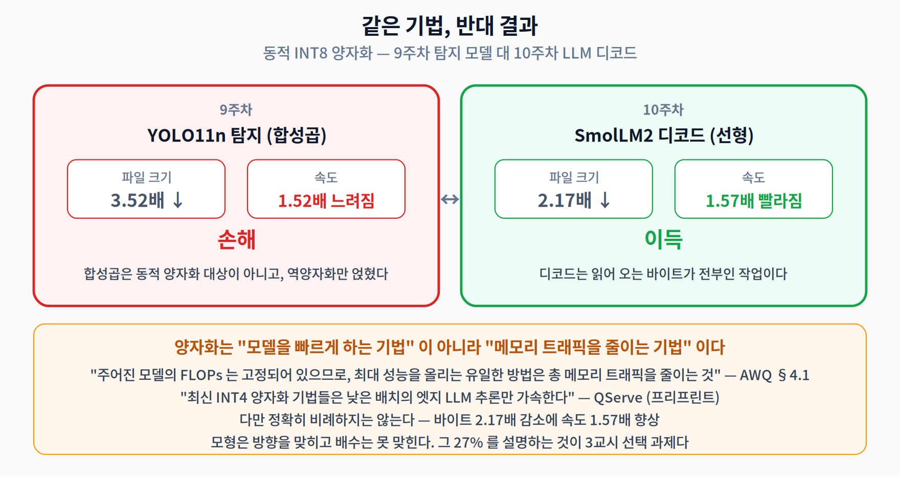
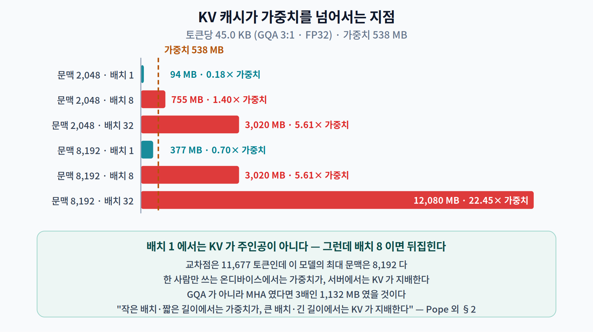
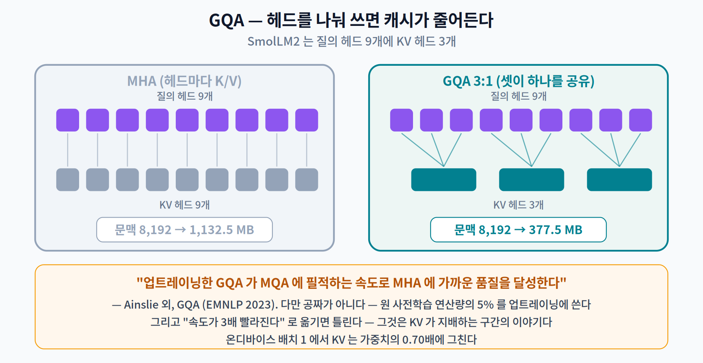
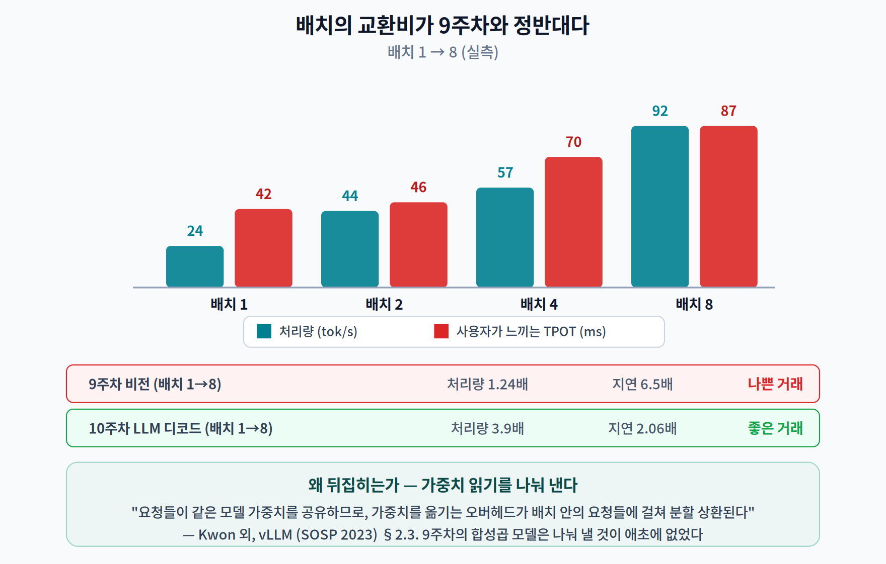
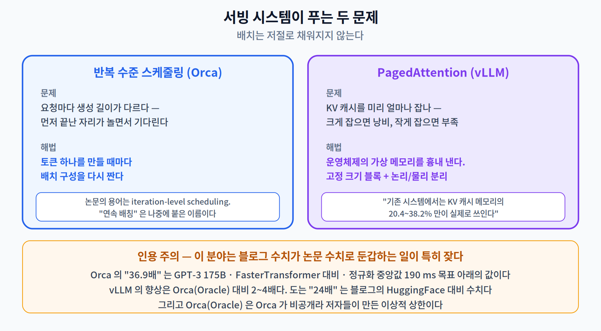
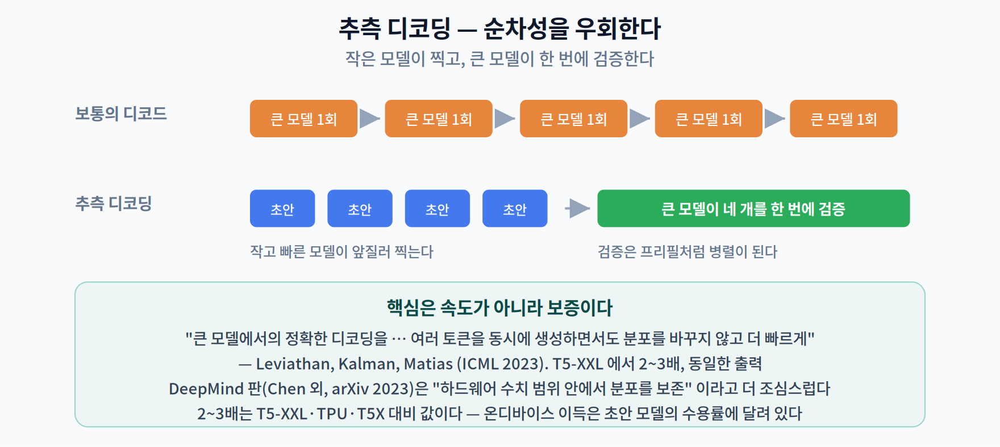

# 10주차 2교시. 무엇이 온디바이스 LLM을 가로막는가

> **오늘의 질문** — 1교시에서 디코드가 **대역폭에 묶여 있다**는 가설을 세웠다. 가설은 검증해야 가설이 아니게 된다. 그리고 그 가설이 맞다면, **9주차에서 실패했던 기법이 여기서는 성공해야 한다.** 같은 동적 INT8 양자화가 탐지 모델을 1.52배 느리게 만들었는데, 여기서는 어떻게 될까?

---

## 2.1 대역폭 가설을 검증한다 — 9주차와 반대 결과 (14분)

1교시에서 이렇게 예측했다.

> 디코드 속도가 대역폭에 묶여 있다면, **모델 바이트를 줄이면 그만큼 빨라져야 한다.**

9주차 2.2 에서 우리는 정확히 같은 기법(ONNX Runtime 동적 INT8 양자화)을 YOLO11n 에 적용해 **파일은 3.52배 줄었는데 추론은 1.52배 느려지는** 결과를 얻었다. 이번엔 PyTorch 동적 양자화를 SmolLM2 의 모든 선형층에 적용해 보자.

| | 파일 크기 | TPOT | 디코드 처리량 | 프리필 처리량 |
|---|---:|---:|---:|---:|
| FP32 | 538.1 MB | 45.4 ms | 22.0 tok/s | 438.9 tok/s |
| **동적 INT8** | **248.1 MB** | **28.8 ms** | **34.7 tok/s** | **903 tok/s** |
| | 2.17배 ↓ | | **1.57배 ↑** | 1.74배 ↑ |

> **9주차: 1.52배 느려짐. 10주차: 1.57배 빨라짐. 같은 아이디어다.**

### 왜 여기서는 통하는가

AWQ 논문이 그 기제를 정확히 적었다. [4]

> *"주어진 모델의 FLOPs 는 고정되어 있으므로, **최대 성능을 올리는 유일한 방법은 총 메모리 트래픽을 줄이는 것**이다. AWQ 는 가중치 메모리를 4배 줄인다. … W4A16 양자화는 연산 강도를 효과적으로 4 FLOPs/Byte 로 올려, 4 TFLOPS 의 최대 성능으로 이어진다."*

**가중치만 정수로 바꾸는(weight-only) 양자화**는 연산량을 줄이지 않는다. 줄이는 것은 **읽어 오는 바이트**다. 그런데 디코드는 그 바이트가 전부인 작업이므로, 바이트를 줄인 만큼 빨라진다.

### 왜 9주차에서는 안 통했는가

같은 연구실의 후속 논문 QServe 가 반대편을 적었다. [8]

> *"최신 INT4 양자화 기법들은 **낮은 배치의 엣지 LLM 추론만 가속**하며, 큰 배치의 클라우드 LLM 서빙에서는 성능 이득을 내지 못한다."*

이유는 **역양자화 오버헤드**다. 정수 가중치를 다시 실수로 되돌리는 비용이 붙는데, 작업이 대역폭에 묶여 있지 않으면 그 비용만 남는다. 9주차의 탐지 백본은 합성곱이 대부분이었고(동적 양자화가 아예 건드리지도 못했다), 그 위에 역양자화 노드가 얹혔으니 순수한 손해였다.

> **이번 학기에 배운 것을 한 문장으로 묶으면 이렇다.**
>
> **양자화는 "모델을 빠르게 하는 기법"이 아니라 "메모리 트래픽을 줄이는 기법"이다.** 그 트래픽이 병목일 때만 속도로 돌아온다. 5주차에서 "숫자 하나로 말할 수 없다"고 했고, 9주차에서 실패를 봤고, 10주차에서 성공을 본다 — **바뀐 것은 기법이 아니라 작업의 성질이다.**

### 다만 정확히 비례하지는 않는다

정직하게 보자. 우리 측정을 대역폭으로 환산하면 이렇다.

| | 모델 바이트 | 디코드 | 환산 대역폭 |
|---|---:|---:|---:|
| FP32 | 538.1 MB | 22.0 tok/s | **11.9 GB/s** |
| INT8 | 248.1 MB | 34.7 tok/s | **8.6 GB/s** |

**바이트가 2.17배 줄었는데 속도는 1.57배만 빨라졌다.** 순수한 대역폭 모형이라면 두 환산값이 같아야 하는데 27% 차이 난다.

설명할 수 있는 차이다 — 역양자화 비용이 붙고, 임베딩과 정규화층은 FP32 로 남아 있으며, 어텐션의 KV 읽기는 양자화 대상이 아니다. **모형은 방향을 맞히고 배수는 못 맞힌다.** 이 정도가 이 모형에 기대할 수 있는 정확도이고, 교재는 그렇게 쓰는 것이 맞다.

> 한 줄 정리: 가중치 전용 양자화는 **연산이 아니라 메모리 트래픽**을 줄인다. 디코드에서는 1.57배 이득이고 9주차 탐지 모델에서는 1.52배 손해였다 — **바뀐 것은 기법이 아니라 작업의 성질이다.**

---

## 2.2 KV 캐시 — 두 번째 메모리 (14분)

1교시 끝에서 TPOT 가 문맥 길이에 따라 1.40배 커지는 것을 봤다. 그 원인이 **KV 캐시**다.

### 왜 캐시가 필요한가

토큰을 하나 만들 때마다 앞의 모든 토큰에 대해 어텐션을 계산해야 한다. 매번 처음부터 다시 계산하면 $O(N^2)$ 이 매 스텝 반복된다. 그래서 각 토큰의 **키(K)와 값(V)** 을 한 번 계산해 두고 재사용한다.

$$\text{KV 바이트} = 2 \times \text{층} \times \text{KV 헤드} \times \text{헤드 차원} \times \text{길이} \times \text{배치} \times \text{바이트}$$

우리 모델에 넣으면 (30층 · KV헤드 3 · 헤드차원 64 · FP32):

$$2 \times 30 \times 3 \times 64 \times 1 \times 4 = 46{,}080\ \text{B} = \mathbf{45.0\ KB / 토큰}$$

| 문맥 | 배치 | KV 캐시 | 가중치(538 MB) 대비 |
|---:|:--:|---:|---:|
| 2,048 | 1 | 94.4 MB | 0.18배 |
| 2,048 | **8** | **755.0 MB** | **1.40배** |
| 2,048 | 32 | 3,019.9 MB | 5.61배 |
| 8,192 | 1 | 377.5 MB | 0.70배 |
| **8,192** | **32** | **12,079.6 MB** | **22.45배** |

**배치 1 에서는 KV 가 가중치를 못 넘는다.** 교차점은 11,677 토큰인데 이 모델의 최대 문맥이 8,192 이므로, **한 사람만 쓰는 온디바이스 환경에서는 KV 가 주인공이 아니다.**

**그런데 배치가 8만 되어도 뒤집힌다.** 문맥 2,048·배치 8 이면 KV 가 가중치의 1.40배다. 서버에서 KV 캐시가 그토록 큰 주제인 이유가 이것이다.

### GQA — 헤드를 나눠 쓰면 캐시가 줄어든다

우리 모델은 질의 헤드가 9개인데 **KV 헤드는 3개**다. 세 개의 질의 헤드가 하나의 K/V 를 공유한다. 이것이 **GQA(Grouped-Query Attention)** 다. [9]

> *"업트레이닝한 GQA 가 **MQA 에 필적하는 속도로 멀티헤드 어텐션에 가까운 품질**을 달성함을 보인다."*

효과는 단순하다 — **KV 캐시가 3분의 1이 된다.** MHA 였다면 문맥 8,192·배치 1 에서 377.5 MB 가 아니라 **1,132.5 MB** 였을 것이다.

이 아이디어의 극단이 Shazeer 의 **MQA**(KV 헤드 1개)이고, GQA 는 그 중간이다. Shazeer 의 원 논문(arXiv, 2019 — **학회 발표는 없었다**)이 문제를 이렇게 적었다. [10]

> *"점진적 추론(병렬화가 불가능한)은 **큰 '키'와 '값' 텐서를 반복적으로 읽어 오는 메모리 대역폭 비용** 때문에 종종 느리다."*

> **주의 — 두 개의 대역폭 문제를 구분하라.** Shazeer 가 말하는 것은 **KV 텐서**의 대역폭이고, 1교시에서 우리가 잰 것은 **가중치**의 대역폭이다. 짧은 문맥·배치 1 에서는 가중치가 지배하고, 문맥이 길어지고 배치가 커지면 KV 가 지배한다. Pope 외가 그 경계를 적었다 — *"작은 배치와 짧은 길이에서는 가중치를 읽는 시간이 지배한다. 큰 배치와 긴 길이(예: 배치 512 이상에서 2,048 토큰 이상)에서는 KV 캐시를 읽는 시간이 지배한다."* [2] **GQA 를 "속도가 3배 빨라진다"로 옮기면 틀린다** — 그것은 KV 가 지배하는 구간에서의 이야기다.
>
> 또 하나 자주 빠지는 것 — GQA 는 공짜가 아니다. 논문은 원 사전학습 연산량의 **5%** 를 업트레이닝에 쓴다고 밝혔다.

> 한 줄 정리: KV 캐시는 **토큰당 45.0 KB**(GQA 3:1 기준)이고, 배치 1 에서는 가중치를 못 넘지만 **배치 8·문맥 2,048 이면 1.40배**가 된다. GQA 는 그 캐시를 3분의 1로 줄인다.

---

## 2.3 배치 — 9주차의 결론이 뒤집힌다 (10분)

9주차 2.3 에서 우리는 이렇게 결론지었다.

> **"배치는 처리량을 지연으로 사는 거래다. 카메라 한 대짜리 실시간 지각에서는 살 것이 없다."** — 처리량 1.24배에 지연 6.5배.

같은 실험을 LLM 디코드에서 해 보자.

| 배치 | 한 스텝 | 토큰당 | **처리량** | 사용자가 느끼는 TPOT |
|:--:|---:|---:|---:|---:|
| 1 | 42.1 ms | 42.1 ms | 23.8 tok/s | 42.1 ms |
| 2 | 45.7 ms | 22.9 ms | 43.8 tok/s | 45.7 ms |
| 4 | 70.0 ms | 17.5 ms | 57.1 tok/s | 70.0 ms |
| **8** | 86.6 ms | **10.8 ms** | **92.4 tok/s** | 86.6 ms |

**처리량 3.9배를 사는 데 지연 2.06배를 지불했다.** 나란히 놓아 보자.

| | 처리량 이득 | 지연 대가 | 판정 |
|---|---:|---:|---|
| 9주차 비전 (배치 1→8) | 1.24배 | **6.5배** | 나쁜 거래 |
| **10주차 LLM 디코드 (배치 1→8)** | **3.9배** | 2.06배 | **좋은 거래** |

### 왜 뒤집히는가 — 가중치 읽기를 나눠 낸다

디코드가 대역폭에 묶여 있다는 사실이 여기서 **선물**이 된다. 배치 8 로 돌려도 **가중치는 여전히 한 번만 읽는다.** 여덟 개의 요청이 그 비용을 나눠 낸다.

vLLM 논문이 이 문장을 정확히 적었다. [11]

> *"요청들이 **같은 모델 가중치를 공유하므로, 가중치를 옮기는 오버헤드가 배치 안의 요청들에 걸쳐 분할 상환된다.**"*

9주차의 합성곱 모델은 애초에 대역폭에 안 묶여 있었으므로 나눠 낼 것이 없었다. 그래서 배치가 순수한 대기 시간만 늘렸다.

### 다만 무한정은 아니다

Pope 외가 경계를 적어 두었다 — 배치가 커지면 언젠가 **KV 캐시 읽기**가 가중치 읽기를 넘어서고, 그때부터는 배치를 늘려도 이득이 사라진다. [2] 우리 표에서도 배치 2→4 구간(1.30배)이 1→2 구간(1.84배)보다 이미 이득이 작다.

> 한 줄 정리: LLM 디코드에서 배치는 **가중치 읽기를 분할 상환**하므로 처리량이 거의 배수로 오른다. 실측에서 **처리량 3.9배·지연 2.06배** — 9주차의 1.24배·6.5배와 정반대의 교환비다.

---

## 2.4 그래서 서빙 시스템은 무엇을 하나 (8분)

2.3 의 결론은 "배치를 키우라"인데, 실제로는 그게 어렵다. **요청마다 생성 길이가 다르기 때문**이다. 여덟 개를 묶었는데 하나는 10토큰에서 끝나고 하나는 500토큰까지 간다면, 먼저 끝난 자리는 **놀면서 기다린다.**

### 반복 수준 스케줄링 (Orca)

Orca(Yu 외, OSDI 2022)의 해법은 배치를 **요청 단위가 아니라 반복 단위로** 짜는 것이다. [12]

> *"스케줄러는 다음 절차를 반복한다 — (1) 다음에 실행할 요청들을 고른다 (2) 선택된 요청들에 대해 **한 번의 반복(iteration)** 을 실행하도록 엔진을 호출한다 (3) 스케줄링된 반복의 실행 결과를 받는다."*

토큰 하나를 만들 때마다 배치 구성을 다시 짜므로, 끝난 요청은 즉시 빠지고 새 요청이 즉시 들어온다.

> **인용 주의 두 가지.**
> - **Orca 논문에는 "연속 배칭(continuous batching)"이라는 말이 없다.** 논문의 용어는 **반복 수준 스케줄링(iteration-level scheduling)** 과 **선택적 배칭(selective batching)** 이다. "연속 배칭"은 나중에 붙은 이름이다.
> - 자주 인용되는 **"36.9배"** 는 *GPT-3 175B 에서, FasterTransformer 대비, 정규화 중앙값 지연 190 ms 라는 특정 목표 아래* 나온 값이다. 조건 없이 옮기면 안 된다.

### KV 캐시의 파편화 (PagedAttention)

두 번째 문제는 **KV 캐시를 미리 얼마나 잡아 둘 것인가**다. 최대 문맥만큼 미리 잡으면 대부분 낭비되고, 적게 잡으면 도중에 모자란다. vLLM(Kwon 외, SOSP 2023)이 잰 값이 충격적이다. [11]

> *"기존 시스템에서는 **KV 캐시 메모리의 20.4%~38.2%만이 실제 토큰 상태를 저장하는 데 쓰인다.**"*

즉 **60~80%가 파편화와 과잉 예약으로 버려지고 있었다.** 해법은 운영체제의 가상 메모리를 흉내 내는 것 — KV 캐시를 고정 크기 블록으로 쪼개고, 논리 블록과 물리 블록을 따로 관리한다.

> **인용 주의.** vLLM 의 처리량 향상은 **Orca(Oracle) 대비 2~4배**다. 인터넷에 도는 "24배"는 **블로그의 HuggingFace Transformers 대비** 수치이지 논문의 값이 아니다. 그리고 "Orca(Oracle)"는 Orca 가 비공개 소프트웨어라 저자들이 만든 **이상적 상한**이다 — 그 사실까지 함께 밝히는 것이 맞다.

> 한 줄 정리: 요청마다 생성 길이가 다르므로 배치는 저절로 채워지지 않는다. **반복 수준 스케줄링**이 그 문제를, **PagedAttention** 이 KV 캐시 파편화(가용 메모리의 60~80% 낭비)를 푼다.

---

## 2.5 [더 깊이 — 선택] 디코드를 병렬로 만들 수 있을까 (4분)

1교시에서 디코드는 원리적으로 순차적이라고 했다. 그런데 우회로가 있다.

**추측 디코딩(speculative decoding)** — 작고 빠른 **초안 모델**이 토큰 여러 개를 먼저 찍어 보고, 큰 모델이 그 여러 개를 **한 번에** 검증한다. 검증은 프리필처럼 병렬이 된다.

Leviathan·Kalman·Matias(ICML 2023)의 핵심 주장은 속도가 아니라 **보증**에 있다. [13]

> *"큰 모델에서의 **정확한 디코딩**을, 근사 모델의 출력에 대해 병렬로 돌림으로써 더 빠르게 만들 수 있다 — 여러 토큰을 동시에 생성할 가능성이 있으면서도 **분포를 바꾸지 않고**."*

> *"T5-XXL 에서 시연하여 표준 T5X 구현 대비 **2~3배 가속**을, **동일한 출력**과 함께 보였다."*

같은 시기에 DeepMind 도 독립적으로 같은 아이디어에 도달했다(Chen 외, arXiv 2023 — **학회 발표는 없다**). 이쪽은 Chinchilla 70B 에서 **2~2.5배**를 보고하며, 보증을 *"하드웨어 수치 범위 안에서 목표 모델의 분포를 보존한다"* 고 조금 더 조심스럽게 표현했다. [14]

> **2~3배를 그대로 옮기지 말 것.** T5-XXL·TPU·T5X 구현 대비 값이다. 온디바이스에서의 이득은 **초안 모델의 수용률**과 하드웨어에 달려 있고, 초안 모델을 하나 더 메모리에 올려야 한다는 대가도 있다 — 1교시에서 본 대로 온디바이스에서는 그 메모리가 곧 속도다.

> 한 줄 정리: 추측 디코딩은 **작은 모델이 찍고 큰 모델이 병렬로 검증**해 순차성을 우회한다. 핵심은 속도가 아니라 **출력 분포가 바뀌지 않는다는 보증**이다.

---

## 오늘의 토론 질문

1. 2.1 에서 바이트가 2.17배 줄었는데 속도는 1.57배만 빨라졌다. **차이 27%의 출처**를 세 가지 이상 대 보라. 그중 측정으로 확인할 수 있는 것은 무엇인가?
2. 2.2 에서 배치 1 온디바이스라면 KV 캐시가 주인공이 아니라고 했다. 그렇다면 **온디바이스에서 GQA 의 이득은 무엇인가?** 없다면 왜 SmolLM2 는 GQA 를 썼을까?
3. 2.3 의 교환비가 9주차와 정반대였다. **여러분의 캡스톤 주제**에서 배치는 좋은 거래인가 나쁜 거래인가? 판단 근거를 연산 강도로 말해 보라.
4. 2.4 의 PagedAttention 은 운영체제의 가상 메모리를 흉내 냈다. **8주차의 텐서 수명 기반 메모리 계획**과 무엇이 같고 무엇이 다른가?

> **교수님을 위한 Tip** — 2.1 의 표는 **9주차 표를 옆에 띄워 놓고** 보여 주십시오. "1.52배 느려짐"과 "1.57배 빨라짐"이 나란히 있을 때 학생들이 스스로 "무엇이 달라졌나"를 묻습니다. 그 질문이 나오면 이번 주는 성공한 것입니다. 2.4 와 2.5 는 시간이 모자라면 자율 학습으로 넘기셔도 되지만, **인용 주의 상자만은 짚어 주십시오** — 이 분야는 블로그 수치가 논문 수치로 둔갑하는 일이 특히 잦습니다.

---

### 2교시 정리
- **가중치 전용 양자화는 연산이 아니라 메모리 트래픽을 줄인다.** 디코드에서 **1.57배 이득**, 9주차 탐지 모델에서는 1.52배 손해 — 기법이 아니라 작업의 성질이 다르다.
- 다만 **바이트 2.17배 감소 대 속도 1.57배 향상**으로 비례하지 않는다. 모형은 방향을 맞히고 배수는 못 맞힌다.
- KV 캐시는 **토큰당 45.0 KB**. 배치 1 에서는 가중치를 못 넘지만 **배치 8·문맥 2,048 이면 1.40배**, 배치 32·문맥 8,192 면 22.45배.
- **GQA 3:1** 이 그 캐시를 3분의 1로 줄인다(MHA 였다면 1,132.5 MB). 업트레이닝 비용 5%가 대가다.
- 배치는 LLM 디코드에서 **가중치 읽기를 분할 상환**한다 — 처리량 **3.9배**에 지연 2.06배. 9주차는 1.24배에 6.5배였다.
- 서빙 시스템은 **반복 수준 스케줄링**(Orca)과 **PagedAttention**(가용 KV 메모리의 60~80% 낭비를 회수)으로 그 배치를 실제로 채운다.
- **추측 디코딩**은 순차성을 우회하되 **출력 분포를 바꾸지 않는다**는 것이 핵심이다.

### 오늘의 용어
- **가중치 전용 양자화 (weight-only quantization)** — 가중치만 정수로 저장하고 계산은 실수로. 메모리 트래픽만 줄인다.
- **KV 캐시** — 앞 토큰들의 키·값을 저장해 재계산을 피하는 버퍼. 길이·배치에 비례해 자란다.
- **GQA / MQA** — 여러 질의 헤드가 KV 헤드를 공유하는 구조. KV 캐시를 공유 비율만큼 줄인다.
- **반복 수준 스케줄링 (iteration-level scheduling)** — 토큰 한 번 생성마다 배치를 다시 짜는 방식. 흔히 "연속 배칭"으로 불린다.
- **PagedAttention** — KV 캐시를 고정 크기 블록으로 관리해 파편화를 없애는 기법.
- **추측 디코딩 (speculative decoding)** — 초안 모델이 여러 토큰을 제안하고 본 모델이 병렬 검증하는 방식.

### 더 읽어보기
- [2] R. Pope *et al.*, "Efficiently scaling transformer inference," in *Proc. MLSys*, vol. 5, 2023. — **§2 의 "가중치가 지배하는 구간 vs KV 가 지배하는 구간"을 볼 것.**
- [4] J. Lin *et al.*, "AWQ: Activation-aware weight quantization for on-device LLM compression and acceleration," in *Proc. MLSys*, vol. 6, 2024. (MLSys 2024 Best Paper)
- [8] Y. Lin *et al.*, "QServe: W4A8KV4 quantization and system co-design for efficient LLM serving," *arXiv:2405.04532*, 2024. — **프리프린트다.** 양자화가 **안 통하는** 구간의 근거.
- [9] J. Ainslie *et al.*, "GQA: Training generalized multi-query transformer models from multi-head checkpoints," in *Proc. EMNLP*, 2023, pp. 4895–4901.
- [10] N. Shazeer, "Fast transformer decoding: One write-head is all you need," *arXiv:1911.02150*, 2019. — **학회 발표 없음.** KV 텐서 대역폭 문제의 원전.
- [11] W. Kwon *et al.*, "Efficient memory management for large language model serving with PagedAttention," in *Proc. 29th ACM Symp. Operating Systems Principles (SOSP)*, 2023, pp. 611–626.
- [12] G.-I. Yu *et al.*, "Orca: A distributed serving system for transformer-based generative models," in *Proc. 16th USENIX Symp. Operating Systems Design and Implementation (OSDI)*, 2022, pp. 521–538.
- [13] Y. Leviathan, M. Kalman, and Y. Matias, "Fast inference from transformers via speculative decoding," in *Proc. 40th Int. Conf. Machine Learning (ICML)*, PMLR vol. 202, 2023, pp. 19274–19286.
- [14] C. Chen *et al.*, "Accelerating large language model decoding with speculative sampling," *arXiv:2302.01318*, 2023. — **학회 발표 없음.**
