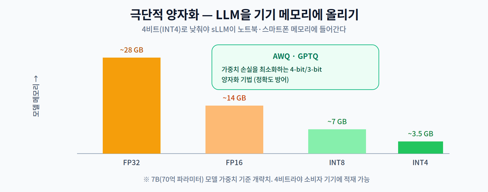
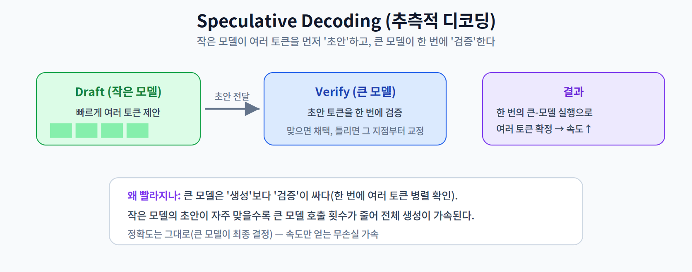

# 10주차 2교시. On-Device LLM 최적화와 런타임

**강의 목표** — 스마트폰·PC에 소형 거대 언어 모델(sLLM)을 올리기 위한 양자화 기법과 소프트웨어 런타임을 학습한다.

1교시가 "왜 Transformer가 엣지에 무거운가"였다면, 2교시는 "그럼에도 어떻게 기기에 올리고 빠르게 돌리는가"이다.

---

## 2.1 소형 거대 언어 모델(sLLM) 트렌드 (15분)

거대 언어 모델을 엣지에 올리기 위해, 파라미터를 **1B~8B(10억~80억)** 수준으로 줄인 **소형 거대 언어 모델(sLLM, Small Large Language Model)** 이 활발히 개발되고 있다.

- 대표적으로 **Llama 계열(예: 8B), Gemma, Phi** 등이 온디바이스 타깃으로 설계·배포된다.
- 관건은 이 모델들의 **요구 자원(메모리·대역폭)** 을 소비자 기기 안에 맞추는 것이다. 파라미터가 수십억 개라도, 양자화로 메모리를 줄이면 노트북·스마트폰에 올릴 수 있다.

> 한 줄 정리: sLLM은 파라미터를 1B~8B로 줄인 엣지 타깃 LLM으로, 양자화가 배포의 열쇠다.

---

## 2.2 극단적 양자화 — AWQ·GPTQ (25분)

5주차의 양자화가 여기서 **4비트(INT4)** 로 극단화된다. LLM은 가중치가 수십억 개라, INT4까지 낮춰야 기기 메모리에 들어간다.

- **왜 4비트인가** — 비트를 낮추면 모델 메모리가 그만큼 준다: 32비트→4비트면 **1/8**, 흔한 기준인 FP16→INT4면 **1/4**이다. 7B(70억) 모델이 FP16 약 14GB에서 INT4 약 3.5GB(FP16의 1/4)로 줄어야 소비자 노트북·폰에 올라간다.
- **AWQ (Activation-aware Weight Quantization) · GPTQ** — 단순 반올림이 아니라, **가중치 손실을 최소화**하도록 정교하게 4-bit/3-bit 양자화하는 기법이다. 어떤 가중치가 중요한지를 반영해(활성값 인지 등) 정확도 하락을 방어한다.

> 한 줄 정리: On-Device LLM은 AWQ·GPTQ 같은 4비트 양자화로 메모리를 1/8까지 줄여야 기기에 올라간다.

---

## 2.3 Speculative Decoding (10분)

생성 속도를 높이는 대표적 알고리즘이 **Speculative Decoding(추측적 디코딩)** 이다.

핵심은 "**생성보다 검증이 싸다**"는 것이다. 작은 **Draft 모델**이 여러 토큰을 빠르게 제안하면, 큰 모델이 그 토큰들을 **한 번에 병렬로 검증**한다. 초안이 자주 맞을수록 큰 모델의 호출 횟수가 줄어 전체 생성이 빨라진다. 최종 결정은 큰 모델이 하므로 **정확도는 그대로**인 무손실 가속이다(3주차의 무손실 최적화와 같은 성격).

> 한 줄 정리: Speculative Decoding은 작은 모델의 초안을 큰 모델이 일괄 검증해, 정확도를 유지하며 생성 속도를 높인다.

---

## 2.4 추론 엔진과 On-device LoRA (10분)

- **On-Device LLM 추론 엔진** — **llama.cpp**와 **MLC LLM**은 하드웨어 가속기(Vulkan, Metal, CUDA 등)를 활용해 여러 플랫폼에서 LLM을 구동하는 오픈소스 엔진이다. **MediaPipe LLM Inference API**는 구글 생태계의 웹/모바일 배포 경로를 제공한다.
- **On-device LoRA** — **LoRA(Low-Rank Adaptation)** 는 원본 가중치는 고정한 채 극히 일부의 저차원 행렬만 학습하는 파인튜닝 기법이다. 이를 엣지에 적용하면 기기 위에서 개인화 미세조정이 가능해진다(12주차 On-device 파인튜닝에서 심화).

### 10주차 핵심 키워드
- **sLLM** — 엣지 구동을 위해 파라미터를 1B~8B로 줄인 언어 모델.
- **KV Caching** — 이전 토큰 연산을 재사용해 생성 속도를 높이는 버퍼(메모리 병목).
- **4-bit Quantization** — GB 단위 모델을 기기 메모리에 올리는 필수 압축.
- **Speculative Decoding** — 이기종 모델 협업으로 생성을 가속하는 무손실 기법.

> 교수님을 위한 Tip: 실제 노트북/스마트폰에서 4비트 sLLM이 초당 몇 토큰(tokens/sec)을 내는지 시연하면 좋다. 토큰 속도가 하드웨어의 **메모리 대역폭**에 크게 종속됨을 짚으면(3교시로 연결), 학생들이 시스템 관점을 확립한다.

---

### 2교시 복습 질문
1. 7B 모델이 INT4로 갈 때 메모리가 어떻게 변하는가(대략)?
2. AWQ·GPTQ가 단순 반올림 양자화와 다른 점은?
3. Speculative Decoding이 정확도를 유지하면서도 빨라지는 원리는?
