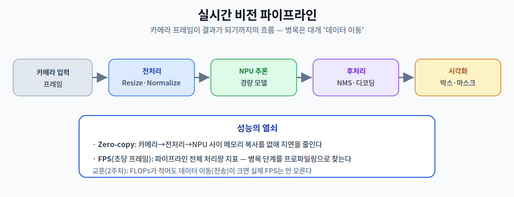

# 10주차 3교시. 실시간 비전 파이프라인

**실습 목표** — 카메라 프레임이 결과가 되기까지의 **전체 파이프라인**을 만들고, 단계별 시간을 측정해 **FPS**를 계산한다. "모델 추론만 빠르다고 실시간이 되는 게 아니다"를 직접 확인한다.

> 준비물: 1주차 환경(`odai`) + `onnxruntime`, `numpy`, `pillow` + `mobilenetv2.onnx`(1주차 3.1에서 내보낸 파일; 없으면 그 단계의 `torch.onnx.export`를 먼저 실행). 카메라가 없어도 더미 프레임으로 원리를 확인한다.

---

## 3.1 실시간 비전 파이프라인 (20분)

비전 파이프라인은 `입력 → 전처리 → 추론 → 후처리 → 시각화`로 이어진다. 여기서는 분류 모델로 **전처리·추론·후처리 3단계**를 만들고 각 시간을 잰다.



```python
import time, numpy as np, onnxruntime as ort
from PIL import Image

sess = ort.InferenceSession("mobilenetv2.onnx", providers=["CPUExecutionProvider"])
name = sess.get_inputs()[0].name

def preprocess(img):                      # 카메라 프레임 → 모델 입력
    img = img.resize((224, 224))
    x = np.asarray(img, dtype=np.float32) / 255.0
    x = (x - 0.485) / 0.229               # 간단 정규화(예시)
    #  ※ 실제로는 채널별 평균/표준편차(mean=[0.485,0.456,0.406], std=[0.229,0.224,0.225])를 쓴다.
    x = x.transpose(2, 0, 1)[None]        # HWC → NCHW
    return np.ascontiguousarray(x, dtype=np.float32)

def postprocess(logits):                  # 모델 출력 → 최종 결과
    return int(logits[0].argmax())        # top-1 클래스

frame = Image.new("RGB", (640, 480), (120, 160, 200))   # 더미 프레임(카메라 대용)
```

---

## 3.2 FPS·병목 측정 (20분)

각 단계 시간을 나눠 재고, 프레임당 총 시간과 FPS를 계산한다.

```python
N = 50; tp = ti = to = 0.0
sess.run(None, {name: preprocess(frame)})          # 워밍업

for _ in range(N):
    t0 = time.perf_counter(); x = preprocess(frame); t1 = time.perf_counter()
    y = sess.run(None, {name: x});                  t2 = time.perf_counter()
    _ = postprocess(y[0]);                          t3 = time.perf_counter()
    tp += t1 - t0; ti += t2 - t1; to += t3 - t2

total_ms = (tp + ti + to) / N * 1000
print(f"전처리 {tp/N*1000:5.2f} ms | 추론 {ti/N*1000:5.2f} ms | 후처리 {to/N*1000:5.2f} ms")
print(f"프레임당 {total_ms:.2f} ms  →  {1000/total_ms:.1f} FPS")
```

관찰의 핵심:

1. **FPS = 1000 / (프레임당 총 ms)**. 30 FPS 이상이면 대체로 실시간으로 느껴진다.
2. 추론만이 아니라 **전처리(Resize·Normalize)** 도 무시 못 할 시간을 차지한다. 실제 탐지 모델이라면 후처리(NMS)도 커진다.
3. 그래서 **Zero-copy**(단계 간 메모리 복사 제거)와 병목 단계 프로파일링이 중요하다 — 2주차의 "데이터 이동이 병목"이 파이프라인 전체에서 재현된다.

> 관찰 포인트: 추론 시간이 아무리 짧아도, 전처리·후처리·데이터 이동이 크면 실제 FPS는 오르지 않는다. **최적화 대상은 '모델'이 아니라 '파이프라인 전체'** 다.

---

## 3.3 과제 (10분 안내)

1. **단계별 프로파일 표** — 본인 기기에서 전처리/추론/후처리 시간과 FPS를 측정해 제출한다. 어느 단계가 병목인지 표시한다.
2. **해상도 실험** — `preprocess`의 resize 목표를 224×224 → 160×160으로 바꿔 **전처리 시간**의 변화를 측정한다. (주의: 이 모델은 입력이 224×224로 고정이라, *추론* 해상도까지 바꾸려면 모델을 **dynamic axes**로 다시 내보내야 한다.) 해상도-속도-정확도 트레이드오프를 논한다.
3. **개념 연결** — Zero-copy가 왜 파이프라인 속도에 중요한지 2주차 Memory Wall과 연결해 3~4문장으로 설명한다.
4. **다음 주 예습** — 11주차(엣지 언어·On-Device LLM)에서는 Transformer가 주인공이다. "긴 문장을 처리할 때 Attention의 메모리가 왜 급증하는가?"를 미리 생각해 온다.

> 교수님을 위한 Tip: 카메라(웹캠)를 쓸 수 있으면 `opencv`로 실시간 프레임을 넣어 FPS를 화면에 오버레이하면 몰입도가 크게 오른다. 없어도 더미 프레임의 단계별 시간만으로 "파이프라인 관점"을 충분히 전달할 수 있다.

---

### 3교시 정리
- 전처리·추론·후처리 파이프라인을 만들고 단계별 시간·FPS를 측정했다.
- 실시간성은 모델만이 아니라 파이프라인 전체(특히 데이터 이동)에서 결정됨을 확인했다.
- 다음 주부터는 시각 지능을 넘어 언어 지능(NLP·On-Device LLM)으로 넘어간다.
